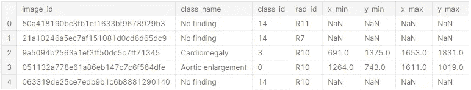
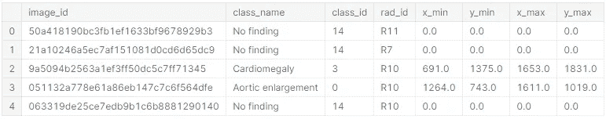
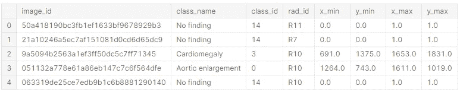
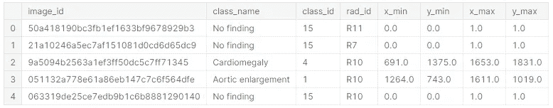
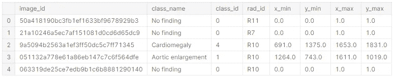
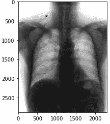
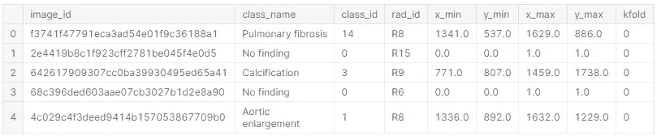
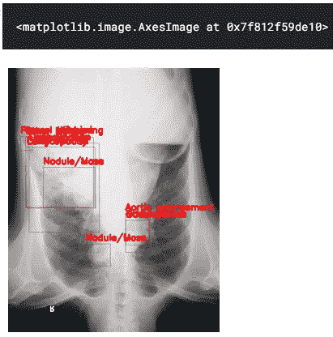

# Pytorch 中最简单的对象检测，具有更快的 RCNN

> 原文：<https://medium.com/mlearning-ai/easiest-object-detection-in-pytorch-with-faster-rcnn-d321dab1fe55?source=collection_archive---------1----------------------->

今天我们将学习如何以尽可能简单的方式在 pytorch 中进行物体检测。我们将使用 Kaggle 网站上给出的 [x 射线数据集](https://www.kaggle.com/c/vinbigdata-chest-xray-abnormalities-detection/data)。每一个代码都有注释。


## #1#首先，我们将为代码中使用的函数做一些导入工作。

## #2#我们将通过此代码检查 cuda 是否适用于我们的系统

## #3#然后，我们将根据要求调整数据集



## #4#我们将应用交叉验证将我们的数据集分成训练集和验证集。



## #5#然后，我们将为我们的对象检测数据集构建 Pytorch 自定义数据集类

## #6#应用图像变换

## #7#为我们创建的数据集类创建对象。

## #8#可视化用于训练目的的图像



## #9#声明数据集的数据加载器，以便在训练和验证过程中使用

## #10#在 pytorch 中加载预训练的 fast-RCNN 模型

## #11#声明纪元、优化器、调度器等的数量

## #12#为我们的数据集定义训练函数

## #13#定义验证函数

## #14#将所有函数放在一个函数中，并逐步初始化它们

## #15#最后我们开始训练我们的模型。

```
if __name__ == "__main__":
    _run()
```

这就是我们如何使用 Pytorch 框架在具有用于预测 的 ***边界框的数据集上使用对象检测模型更快的 RCNN。如果您对此有任何问题、意见或担忧，请告诉我。在那之前**享受学习**。***