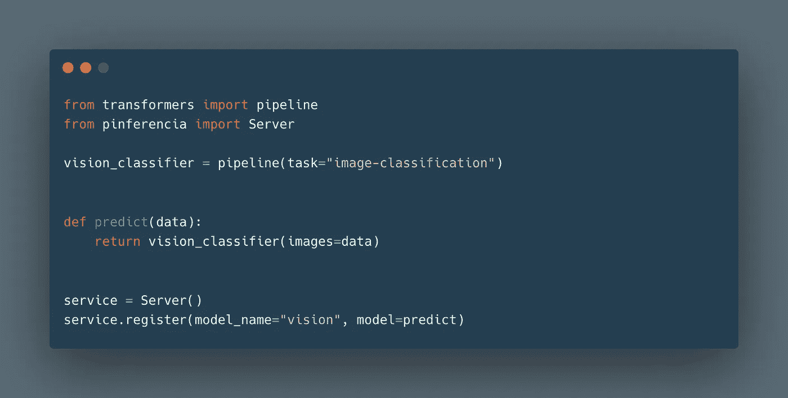
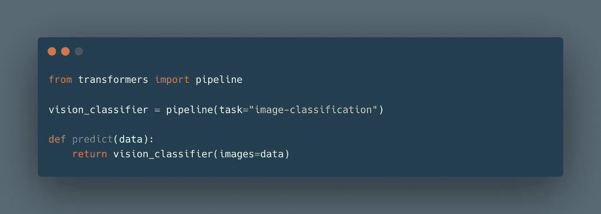
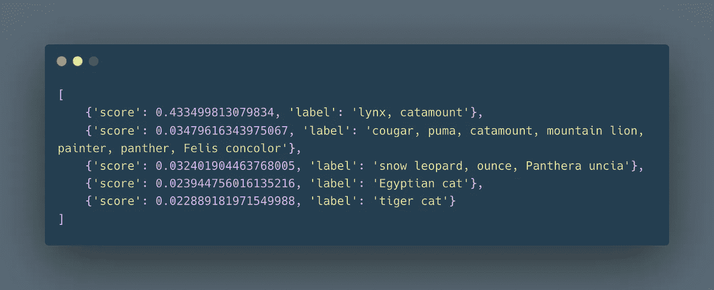
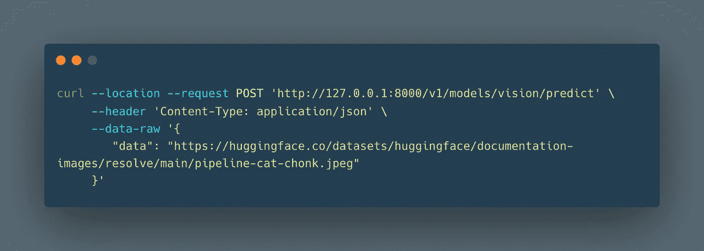
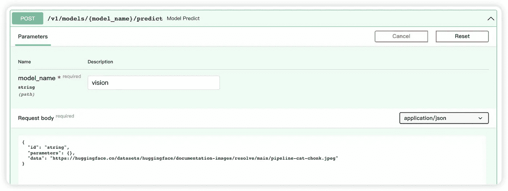
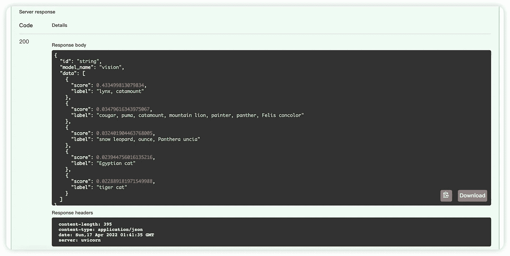

# 部署拥抱脸变形金刚的最简单方法

> 原文：<https://medium.com/mlearning-ai/easiest-way-to-deploy-huggingface-transformers-4fdd502d2c2?source=collection_archive---------9----------------------->

你一定知道变形金刚。嗯，我不是指汽车人，大黄蜂，而是著名的机器学习结构。

你可能用过变形金刚的拥抱脸模型。但是您部署过它们吗？

有了 [Pinferencia](https://github.com/underneathall/pinferencia) ，只需再添加三行，你的模型就上线了！

没听说过 [Pinferencia](https://github.com/underneathall/pinferencia) ？现在还不晚。去它的 [GitHub](https://github.com/underneathall/pinferencia) 看看吧。如果你喜欢它，别忘了给它一颗星。



# 拥抱面变压器管道

如何使用 HuggingFace transformer 管道？



你可以用它的 url 来预测一个图像:

```
predict("https://huggingface.co/datasets/huggingface/documentation-images/resolve/main/pipeline-cat-chonk.jpeg")
```

结果:



# 部署

现在用 Pinferencia 部署它，只需添加三行并另存为`app.py`


现在去终端运行

```
uvicorn app:service --reload
```

您的服务已上线！进入 [http://127.0.0.1:8000](http://127.0.0.1:8000) 查看 API。

现在，您可以发送请求:



结果是:


或者只使用 Pinferencia 提供的交互式用户界面:



够简单了吧。

如果你喜欢 [Pinferencia](https://github.com/underneathall/pinferencia) 去[https://github.com/underneathall/pinferencia](https://github.com/underneathall/pinferencia)给它一颗星。

[](/mlearning-ai/mlearning-ai-submission-suggestions-b51e2b130bfb) [## Mlearning.ai 提交建议

### 如何成为 Mlearning.ai 上的作家

medium.com](/mlearning-ai/mlearning-ai-submission-suggestions-b51e2b130bfb)