# 使用 DART 实现不同时间序列模型的最简单方法

> 原文：<https://medium.com/mlearning-ai/easiest-way-to-implement-different-time-series-models-using-dart-40bdb794fd1a?source=collection_archive---------1----------------------->

Darts 是一个扩展的 python 库，使得数据科学家的工作可以轻松实现不同的时间序列，而没有太多的麻烦。模型/包装器包括所有你能想到的著名模型，从 ARIMA 到深度学习神经网络。总体而言，时间序列的实现似乎有点复杂，但团队“ **UNIT8** ”使数据工程师的工作变得如此简单，他们可以遵循与他们过去为 scikit-learn 包所做的相同的过程。此外，根据您使用的模型，您也可以进行单变量/多变量测试。我想感谢和给予 100%的信用单位-8 团队开发这样一个可怕的软件包。以防万一，如果你有兴趣，并想跟进更多的相同。请查看他们的 github 库。

 [## Python - darts 文档简化了时间序列

### darts 是一个 Python 库，用于时间序列的简单操作和预测。它包含各种型号，从…

unit8co.github.io](https://unit8co.github.io/darts/) 

在这篇文章中，我将尝试在我从 kaggle 中随机选择的数据集上实现几个模型。我将向你展示飞镖图书馆是如何让我们的生活变得如此简单。即使事先没有任何关于模型的广泛知识，您也可以在您的数据集上实现各种模型，并查看哪一个给了您最好的结果。让我们开始吧:

让我们安装使我们的 darts 库工作所需的包。我们也将降级我们的 matplot 库，这样你就不会遇到我一直困扰的错误。

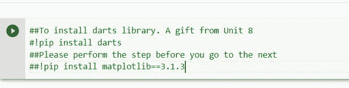

导入基本 python 库来读取和操作数据集。

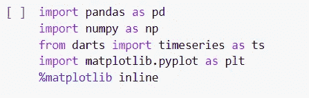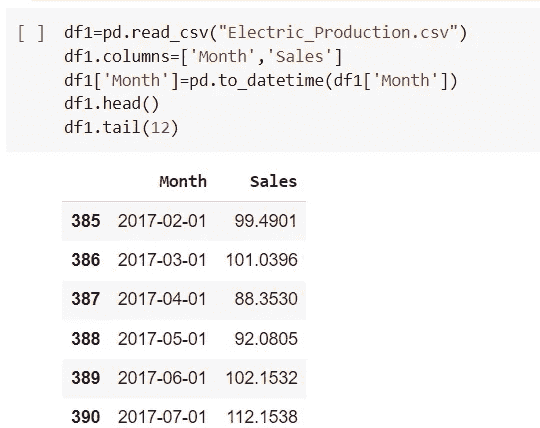

缩放将要分析的数据集非常重要。Darts 库内部使用 min_max_scaler，特征范围为(0，1)。

对于每个神经网络来说，非常有必要对数据集进行缩放，以便在每个时期为每个神经元初始化的权重能够正确/一致地完成。一旦我完成时间序列的帖子，我会提出深度学习的帖子。下面的代码也处理缺失值的插补。感觉这个图书馆太好了。

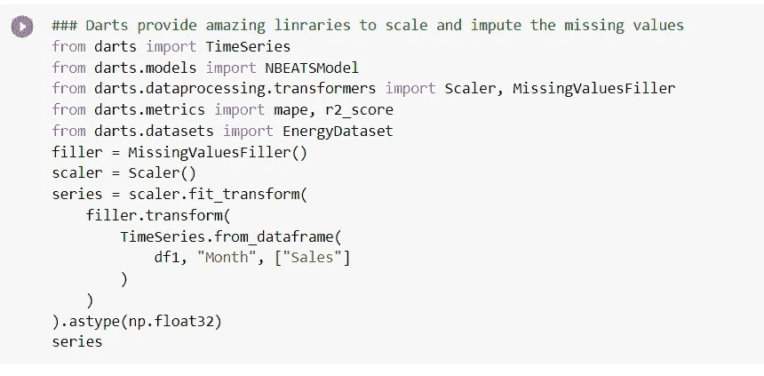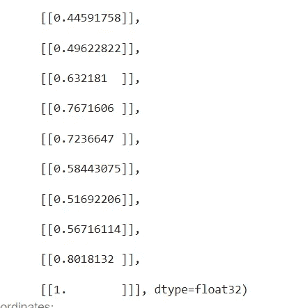

Look and feel of the series dataset

让我们将模型分成训练和测试数据集。有多种方法可以做到这一点，但我确实遵循了飞镖队第八分队给出的流程。看起来更专业一点呵呵呵呵。

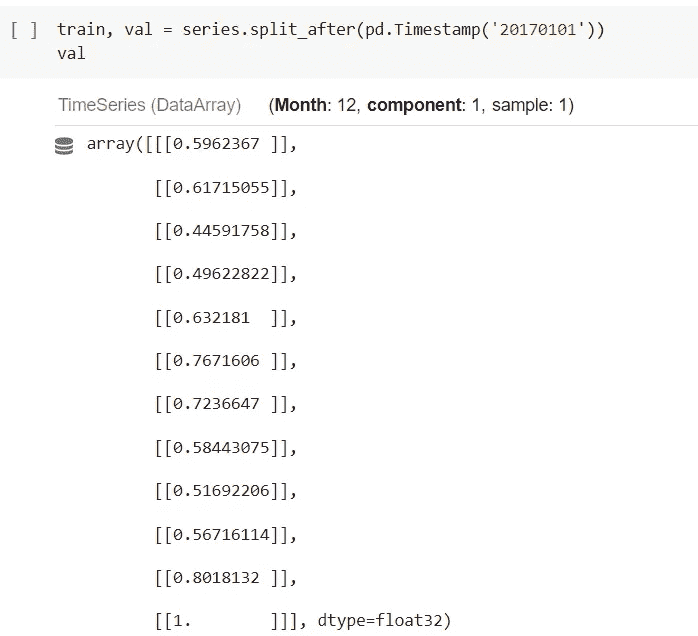

从现在开始，我将尝试使用飞镖库在我的数据集上玩和实现不同的模型。

**指数平滑:**

**使用:**当数据没有季节性模式或趋势时使用。简而言之，如果你在做 EDA 时没有可视化任何模式，只需用模型直接进入数据。

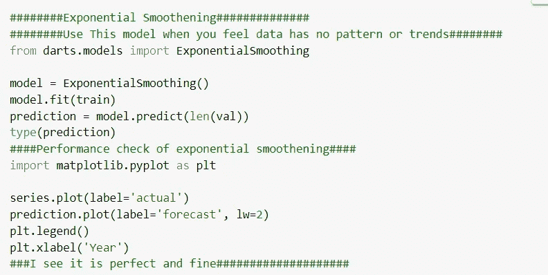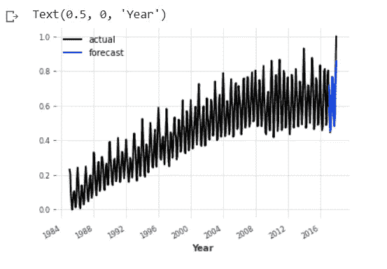

Actual vs Forecast

**FFT:快速傅立叶变换模型**

**使用:**当数据的外观和感觉给你一种季节性的感觉时，就使用这个模型。希望你们所有人都在努力寻找与 FFT 相关的工程书籍。甚至我也这样做了，但我看到飞镖让我们的生活变得如此容易实现的模式。

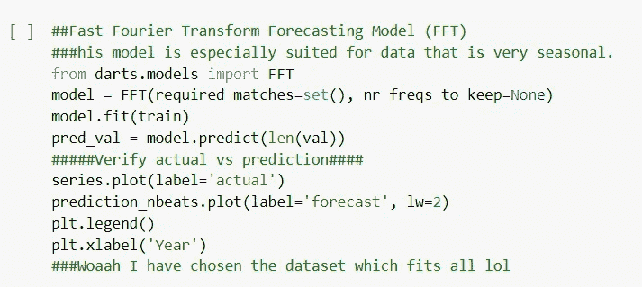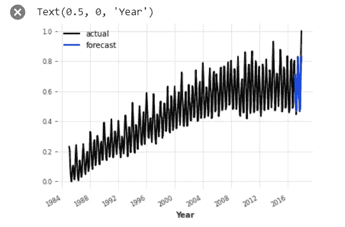

Actual vs Forecast

**RNN 模型:**我已经广泛地谈论过它，并对该模型及其处理单变量和多变量时间序列问题进行了全面的描述。请找到以下两个链接，以便进一步处理。Darts 极大地简化了实现。让我向您展示它的实现。

**多元:**[https://medium . com/mlearning-ai/多元-时间序列-预测-使用-rnn-lstm-8d840f3f9aa7](/mlearning-ai/multivariate-time-series-forecasting-using-rnn-lstm-8d840f3f9aa7)

**单变量:**[https://medium . com/mlearning-ai/单变量-时间序列-预测-使用-rnn-lstm-32702bd5cf4](/mlearning-ai/univariate-time-series-forecasting-using-rnn-lstm-32702bd5cf4)

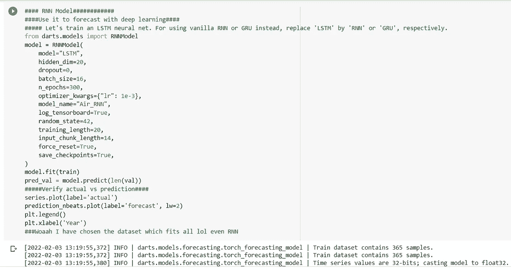

Gosh!!!! So easy right

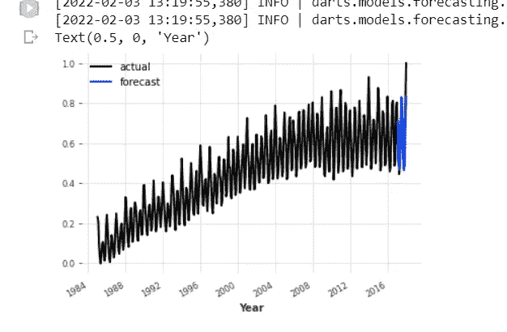

Actual Vs Forecast

**时态休闲网络:**

时间卷积网络(TCN)是一种采用偶然卷积和扩张的框架，因此它适用于具有时间性和大感受域的序列数据。

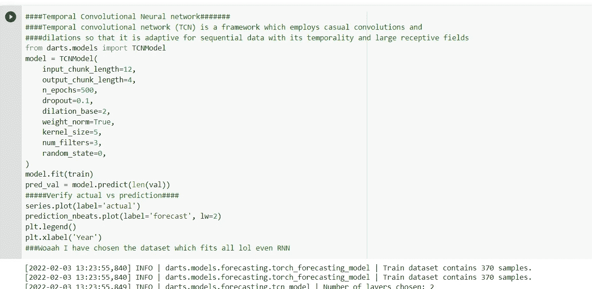

Again so easy. Darts you are really awesome.

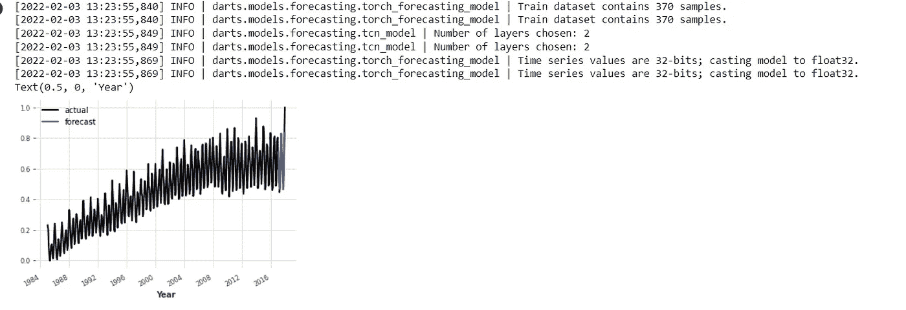

Actual vs Forecast

像这样的车型还有很多。但是我想向你们展示在我得到的数据集上 Nbeats 模型的实现。你一定听说过 M 系列竞赛，这种竞赛是有组织的，主要侧重于基于时间的数据预测，它在那里得到了很好的应用。它有复杂的 dl 架构，让我们深入了解一下它的实现。

**NBEATS:**

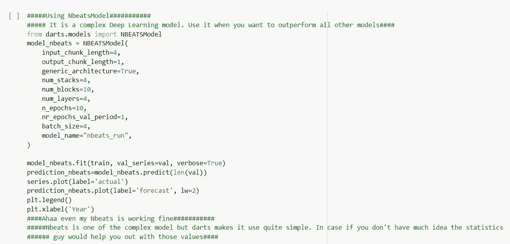

Again so easy. Splashing water on my eyes ;-)

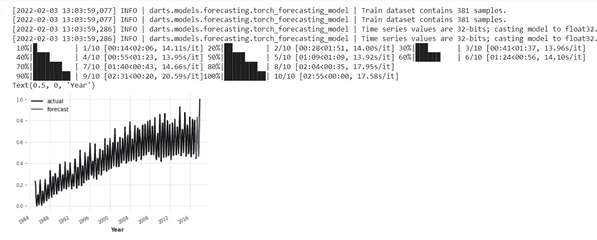

Actual Vs Forecast

Darts 有更多类似的库，但我想向大家展示的是模型的实现变得如此简单，所有的荣誉都归功于他们的开发人员和测试团队。请尝试探索更多相同的内容。我很乐意回复你的帖子和评论。

感谢大家！！！

 [## Mlearning.ai 提交建议

### 如何成为 Mlearning.ai 上的作家

medium.com](/mlearning-ai/mlearning-ai-submission-suggestions-b51e2b130bfb)