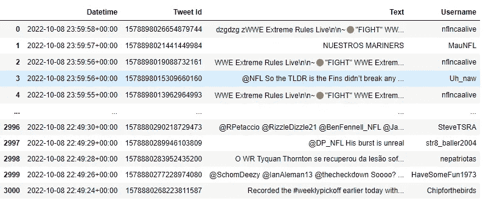
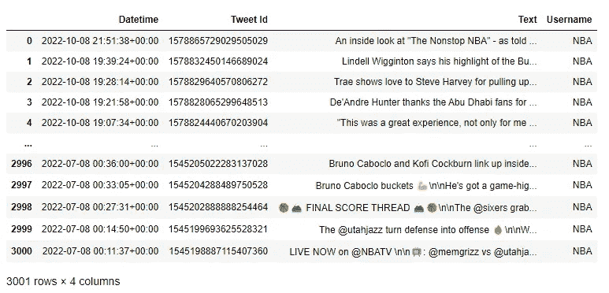

# 用 Python 轻松创建 Twitter 数据集

> 原文：<https://medium.com/mlearning-ai/easily-scrape-to-create-a-twitter-dataset-in-python-f1949e4fb1c9?source=collection_archive---------3----------------------->

人们喜欢为数据分析或数据建模做的一个常见分析是从 Twitter 等社交媒体来源获取用户数据。Python 中的 snscrape 包允许用户轻松地做到这一点。我们将通过一个例子来说明如何做到这一点。如果您想查看源代码，请使用下面的 GitLab 或 GitHub 库:

GitLab:[https://gitlab.com/rshowrav/python-snscrape-tutorial](https://gitlab.com/rshowrav/python-snscrape-tutorial)

GitHub:【https://github.com/rshowrav/python-snscrape-tutorial 


## snscrape 是什么？

snscrape 软件包允许我们浏览社交媒体服务。它允许抓取 hastags、用户配置文件和搜索。这个包允许的社交媒体服务是 Twitter、脸书、Instagram、Mastodon、Reddit、Telegram、VKontakte 和 Weibo。要更新这个包，可以在下面的 GitHub 库中找到它的源代码。

[](https://github.com/JustAnotherArchivist/snscrape) [## GitHub-just another archivist/snscrape:Python 中的社交网络服务 scraper

### snscrape 是社交网络服务(SNS)的刮刀。它抓取像用户资料、标签或搜索…

github.com](https://github.com/JustAnotherArchivist/snscrape) 

## 抓取 Twitter 数据

现在让我们看看这个包如何轻松地收集 Twitter 数据。这个例子将通过 Jupyter 笔记本来完成。

如果还没有下载，第一步将是下载这个包。下面的代码将很容易做到这一点:

```
!pip install snscrape
```

下一步是导入感兴趣的包。请注意，我们在这里引入熊猫是因为我们的理想目标是将我们的数据放在一个数据框架中。使用以下代码:

```
import snscrape.modules.twitter as sntwitter
import pandas as pd
```

最初的抓取以 JSON 格式返回，注意我们需要一些东西来附加数据。下面的步骤将创建一个空列表来存储我们的数据。使用以下代码:

```
twt_list = []
```

接下来，必须创建一个循环来提取我们感兴趣的数据，这是使用下面的代码完成的。让我们浏览一下这部分代码。for 循环定义了 I 和 tweet，其中 I 是我们希望返回的 tweet 的数量。使用 enumerate 函数是因为 JSON 数据有键和项，而在我们的实例中，我们只想得到这些项。枚举函数内部是我们的 snscrape，它收集 2022 年 9 月 1 日至 2022 年 10 月 9 日关于 NFL 的推文。if 循环告诉我们不要超过 3000 条 tweets，最后一步是将日期、id、内容和用户添加到我们的列表中。

```
# Using TwitterSearchScraper to scrape data and append tweets to list
for i,tweet in enumerate(sntwitter.TwitterSearchScraper('NFL since:2022-09-01 until:2022-10-09').get_items()):
    if i>3000:#number of tweets you want to scrape
        break
    twt_list.append([tweet.date, tweet.id, tweet.content, tweet.user.username])
```

既然已经创建了数据，那么数据框架将是存储这些数据的最佳位置。使用下面的代码来实现这一点:

```
user_tweets_df = pd.DataFrame(usr_twt_list, columns=['Datetime', 'Tweet Id', 'Text', 'Username'])
```

以下是我们的数据帧输出:



创建数据集就是这么简单。现在让我们再看一个例子，但是这次是关于用户的。对于这个例子，我们将使用 NBA。下面的代码将被使用:

```
# Creating an empty list to append tweet data to
usr_twt_list = []# Using TwitterSearchScraper to scrape data and append tweets to list
for i,tweet in enumerate(sntwitter.TwitterSearchScraper('from:NBA').get_items()): #declare a username 
    if i>3000: #number of tweets you want to scrape
        break
    usr_twt_list.append([tweet.date, tweet.id, tweet.content, tweet.user.username]) #declare the attributes to be returned

# Creating a dataframe from the tweets list above 
user_tweets_df = pd.DataFrame(usr_twt_list, columns=['Datetime', 'Tweet Id', 'Text', 'Username'])
```

上面代码中最大的变化是 enumerate 函数现在有一个“from:”供用户搜索。下面是输出，而不是用户名。



## 结论

Python 中的 snscrape 包简化了我们获取社交媒体数据的方式。社交媒体数据是一项有趣的分析，通常用于研究目的。我希望这个包和示例对您有所帮助。

请注意，我仍然是一个新的媒体作者。我感谢你能提供的任何建议和支持。反馈越多，我就越能改进要讨论的主题和各种方法，以确保我的文章真正提供有意义的见解。

[](/mlearning-ai/mlearning-ai-submission-suggestions-b51e2b130bfb) [## Mlearning.ai 提交建议

### 如何成为 Mlearning.ai 上的作家

medium.com](/mlearning-ai/mlearning-ai-submission-suggestions-b51e2b130bfb)