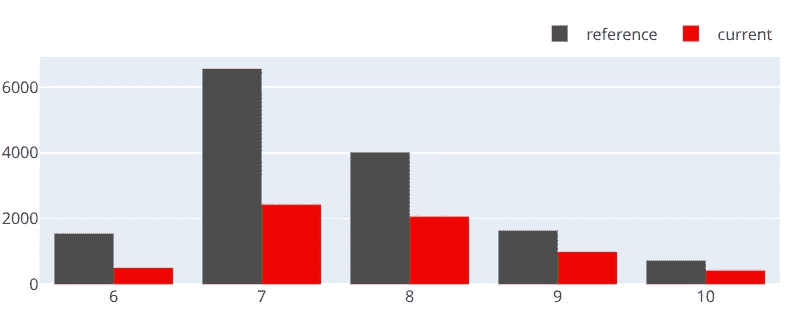
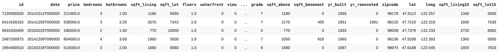
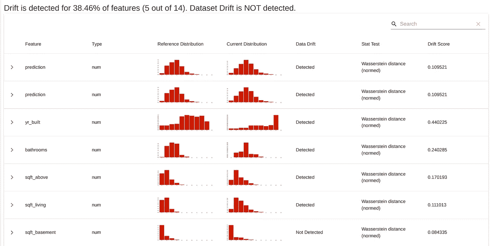
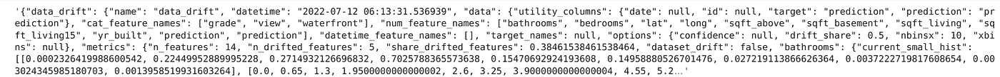
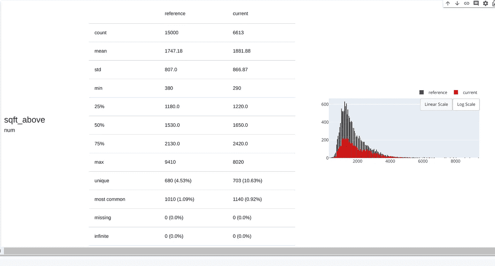
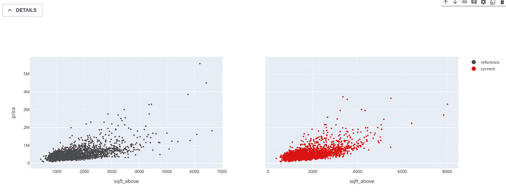
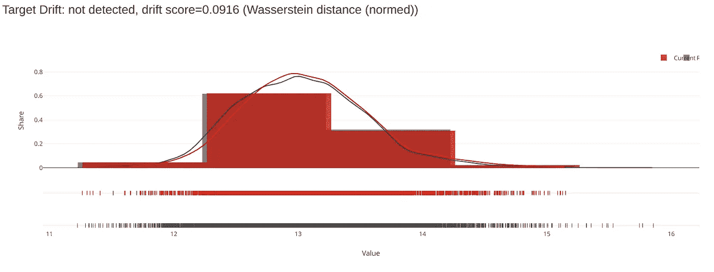
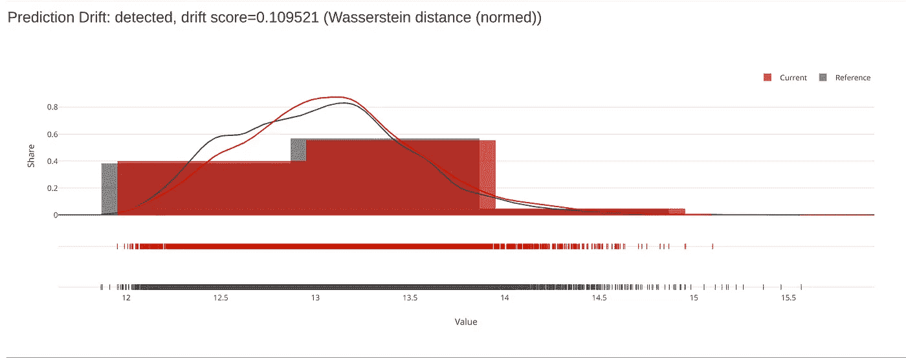
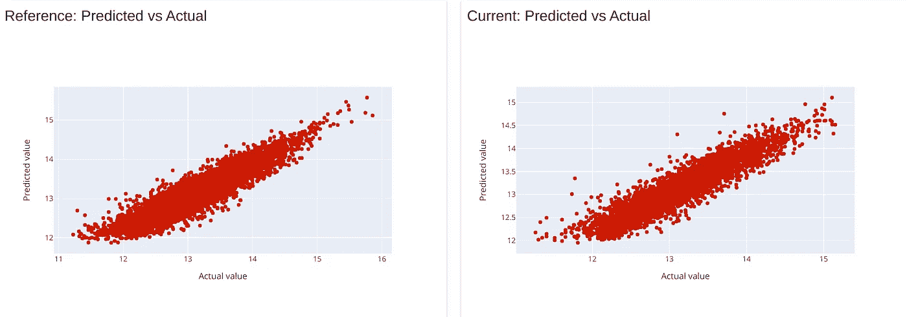

# 显然人工智能——很容易分析你的数据和机器学习模型

> 原文：<https://medium.com/mlearning-ai/easy-analysis-of-your-data-and-ml-model-using-evidently-ai-830ef0c1c4fd?source=collection_archive---------1----------------------->

## 通过一个具体的例子探索回归模型的明显人工智能的主要特征的指南



Image by the author

## 介绍

> 显然有助于在整个模型生命周期中分析和跟踪数据和 ML 模型质量。你可以把它想象成一个适合现有 ML 栈的评估层。

在这篇文章中，我们将探索人工智能的基本特征。显然 AI 的 [GitHub 提供了一个很好的介绍和几个比我们在这里考虑的更广泛的例子。考虑到数字和分类目标数据，给出了不同特征的详细例子。](http://github.com/evidentlyai/evidently)

显然，人工智能是一种帮助我们监控机器学习管道的工具。它提供关于模型和数据的不同统计的报告。在写这篇文章的时候(2022 年 7 月)，有 7 个预建的报告可用

**(1)** **数据漂移。**检测输入特征分布的变化。

**(2)** **数据质量。**提供详细的特征统计和行为概述。

**(3)目标漂移**。检测 **(3a)数值**和 **(3b)分类**目标数据的模型输出变化

**(4)模特表演。**评估 **(4a)分类**、**、【4b】概率分类、**和**、【4c】回归模型的模型质量和模型误差**

这些分析的结果既可以显示在交互式仪表板中，也可以保存为 json-profile 文件，该文件可以存储起来以供进一步分析。

## **注**

在写这篇文章的时候(2022 年 7 月)，显然 AI 只支持表格数据。这里显示的例子已经在 Google Colab 上执行。在我的个人笔记本电脑上使用 Jupyter Notebook 有很大的局限性，因为仪表盘无法处理数据。

## 金县的房屋销售回归示例

我们将查看一个回归示例，并展示明显人工智能的 4 个主要特征:**数据漂移、数据质量、目标漂移和模型性能**。完整的代码可以在我的 [GitHub](https://github.com/froukje/articles/blob/main/04_evidently.ipynb) 和 [Colab](https://colab.research.google.com/drive/1H12U7mwNY2qcl8Vz7R2LLmc1eIUI160I?usp=sharing) 上找到。所使用的数据集考虑了美国金县的房屋销售，可以从 [Kaggle](https://www.kaggle.com/datasets/harlfoxem/housesalesprediction) 下载。它包含房子的价格，这是我们的目标，取决于不同的(数字和分类)特征，如浴室数量、卧室数量等。将数据读取为熊猫数据帧，并将分类特征转换为类型`object`:

```
df = pd.read_csv('sample_data/kc_house_data.csv')
df[['grade','view','waterfront']] =
      df[['grade','view','waterfront']].astype('object')
df.head()
```

输出如下所示:



Head of the loaded data frame

我们将使用以下功能:

```
features = ['sqft_living','grade', 'sqft_above', 'sqft_living15', 'bathrooms','view','sqft_basement','lat','long','waterfront', 'yr_built','bedrooms']
```

数据帧的总长度为 21613 个样本。显然，为了使用人工智能，我们将通过将数据帧分成两部分来模拟生产:(1)包含参考数据`ref_data`和(2)包含生产数据`prod_data`。对于这两个数据集，我们应用相同的预处理步骤。

```
ref_data = df[:15000]
prod_data = df[15000:]
```

## 数据准备

关于这个数据的数据探索，请参考我的 [GitHub](https://github.com/froukje/articles/blob/main/01_regression_xgboost.ipynb) 。这里我们将只进行必要的预处理步骤。对于数据清洗，我们需要删除检测到的离群点(33 间卧室)，预处理主要考虑分类特征。值得一提的是，我们将对数应用于目标变量，以将其转换为更正态分布的数据。我们将把这个应用到`ref_data`和`prod_data`上。但是在拟合模型之前，我们需要创建一个训练和一个验证集。

```
# Delete entry with 33 bedrooms
df = df[df["bedrooms"] != 33]# Create training and validation set
X_train, X_val, y_train, y_val = train_test_split(ref_data[features], ref_data['price'],
                 test_size=0.2, shuffle=True, random_state=42)
```

在拟合模型之前，我们需要将分类变量转换为一次性编码变量。我们使用 scikit-learn 包中的`OneHotEncoder`,并使其适合训练数据。

```
# one-hot encode categorical variables
categorical = ['grade', 'view', 'waterfront']
ohe = OneHotEncoder(handle_unknown = 'ignore')
ohe = ohe.fit(X_train[categorical])
```

在一般的清洁和准备之后，我们定义以下预处理功能:

```
def preprocessing(X, y, ohe):

    # Convert grade, view, waterfront to type object
    X[['grade','view','waterfront']] = X[['grade','view','waterfront']].astype('object')

    # log transform the target varibale 
    y = np.log1p(y)

    # define categorical and numerical varibales 
    categorical = ['grade', 'view', 'waterfront']
    numerical = ['sqft_living', 'sqft_above', 'sqft_living15',
           'bathrooms','sqft_basement','lat','long',
           'yr_built','bedrooms']

    # one-hot encode categorical variables
    X_cat = ohe.transform(X[categorical]).toarray()

    # define numerical columns 
    X_num = np.array(X[numerical])

    # concatenate numerical and categorical variables
    X = np.concatenate([X_cat, X_num], axis=1)

    print('Shape after one-hot encoding')
    print(f'X shape: {X.shape}')

    return X, y
```

并将其应用于培训、验证和生产数据。

```
X_train, y_train = preprocessing(X_train, y_train, ohe)
X_val, y_val = preprocessing(X_val, y_val, ohe)
X_prod, y_prod = preprocessing(prod_data[features],  prod_data['price'], ohe)
```

## 建模

我们用 XGBoost 模型来拟合数据。

```
# Initialize XGB with objective function
parameters = {"objective": 'reg:squarederror',
              "n_estimators": 100,
              "verbosity": 0}

model = xgb.XGBRegressor(**parameters)
model.fit(X_train, y_train)

# generate predictions
y_pred_train = model.predict(X_train).reshape(-1,1)
y_pred = model.predict(X_val).reshape(-1,1)

# calculate errors
rmse_train = mean_squared_error(y_pred_train, y_train, squared=False)
rmse_val = mean_squared_error(y_pred, y_val, squared=False)
print(f"rmse training: {rmse_train:.3f}\t rmse validation: {rmse_val:.3f}")
```

输出应该类似于:rmse 训练:0.190，rmse 验证:0.205。我们假设我们对我们的模型很满意，使它适合整个`ref_data`，并做出预测。不要忘记将预测转换回最终结果，因为我们采用对数来训练模型。此时，我们仍将保留转换后的数据，并添加一个额外的价格对数列，以便稍后比较我们的预测和目标。我们将预测作为一列添加到数据框中。

```
X_train_full, y_train_full = preprocessing(ref_data[features], ref_data['price'], ohe)ref_data['prediction'] = model.predict(X_train_full)
prod_data['prediction'] = model.predict(X_prod)
ref_data['price_log'] = np.log1p(ref_data['price'])
prod_data['price_log'] = np.log1p(prod_data['price'])
```

## 显然是人工智能——仪表板和配置文件

现在是时候探索明显的人工智能工具了。为此，我们需要安装它:

```
pip install evidently
```

此处显示的示例显然是在版本 0.15.0dev 上执行的，如果您使用不同的版本，并非所有功能都可用。通过以下方式检查您安装的版本:

```
import evidently
evidently.__version__
```

如果你想在 Jupyter 笔记本上直接显示你的仪表盘，你需要安装 nbextension。在您的终端中运行:

```
jupyter nbextension install --sys-prefix --symlink --overwrite --py evidently
```

要启用它，请运行:

```
jupyter nbextension enable evidently --py --sys-prefix
```

导入所需的包，为带有数字目标变量的回归问题创建仪表板和配置文件:

```
from evidently.dashboard import Dashboard
from evidently.pipeline.column_mapping import ColumnMapping# packages for interactive dashboards
from evidently.dashboard.tabs import {
     DataDriftTab, 
     DataQualityTab, 
     NumTargetDriftTab, 
     RegressionPerformanceTab
}# packages for json-profiles
from evidently.model_profile import Profile
from evidently.model_profile.sections import {  
     DataDriftProfileSection, 
     DataQualityProfileSection, 
     NumTargetDriftProfileSection,
     RegressionPerformanceProfileSection}
```

准备数据:

```
target = 'price_log'
numerical_features = ['sqft_living', 'sqft_above',
     'sqft_living15','bathrooms','sqft_basement','lat','long', 
     'yr_built','bedrooms']
categorical_features = ['grade', 'view', 'waterfront']column_mapping = ColumnMapping()
column_mapping.target = target
column_mapping.prediction = 'prediction'
column_mapping.numerical_features = numerical_features
column_mapping.categorical_features = categorical_features
```

## 数据漂移

使用`DataDriftTab`定义数据漂移仪表板。

```
data_drift_dashboard =
          Dashboard(tabs[DataDriftTab(verbose_level=1)])data_drift_dashboard.calculate(ref_data, prod_data, 
          column_mapping=column_mapping)
          data_drift_dashboard.show()
```

这应该会给出类似下图的输出。在这个例子中，22 个特征中的 6 个已经检测到漂移。您可以看到参考数据集和生产数据集的分布。



Part of the Data Drift Dashboard

我们可以通过设置`verbose_level=0`来显示一个较短的报告。您可以将此仪表板保存为 html 文件:

```
data_drift_dashboard.save('data_drift.html')
```

要将这些信息保存为 json-profile，请使用`DataDriftProfileSection`

```
profile = Profile(sections=[DataDriftProfileSection()])profile.calculate(ref_data, prod_data,column_mapping=column_mapping)
profile = profile.json()
profile
```



Beginning of the json-profile file

## 数据质量

使用`DataQualityTab`定义数据质量仪表板。

```
data_quality_dashboard = Dashboard(tabs=[DataQualityTab()])data_quality_dashboard.calculate(ref_data, prod_data, column_mapping=column_mapping)
data_quality_dashboard.show()
```

这为我们提供了数据中所有特征的详细概述，以及一些统计信息，这取决于我们是有一个数字特征还是一个分类特征。



Example feature output of the data quality dashboard

按下细节键，我们甚至可以得到每个特征和目标变量的散点图。



Example scatter plot of the data quality dashboard

要将此信息保存为 html 文件，请使用:

```
data_quality_dashboard.save('data_quality.html')
```

要保存为 json-profile，请使用:

```
profile = Profile(sections=[DataQualityProfileSection()])profile.calculate(ref_data, prod_data,column_mapping=column_mapping)
profile = profile.json()
```

## 目标漂移

使用`NumTargetDriftTab`定义目标漂移仪表板。

```
target_drift_dashboard =
       Dashboard(tabs[NumTargetDriftTab(verbose_level=1)])
target_drift_dashboard.calculate(ref_data, prod_data,
       column_mapping=column_mapping)
target_drift_dashboard.show()
```



Part of the target drift dashboard



Part of the target drift dashboard

除了目标和预测分布，还显示了与每个特征的相关性。与之前一样，用

```
target_drift_dashboard.save('target_drift.html')
```

至于数据漂移，可以通过设置`verbose_level=0`来显示更短的报告。使用以下命令获取 json 概要文件

```
profile = Profile(sections=[NumTargetDriftProfileSection()])
profile.calculate(ref_data, prod_data,column_mapping=column_mapping)
profile = profile.json()
```

## 数据和目标漂移

我们还可以在一个仪表板中显示数据和目标漂移:

```
data_and_target_drift_dashboard =     
     Dashboard(tabs[DataDriftTab(verbose_level=1),  
                    NumTargetDriftTab(verbose_level=1)])data_and_target_drift_dashboard.calculate(ref_data_sample, prod_data_sample, column_mapping=column_mapping)data_and_target_drift_dashboard.show()
```

## 模型性能—回归性能

使用`RegressionPerformanceTab`定义回归模型的性能

```
model_performance_dashboard = 
      Dashboard(tabs=[RegressionPerformanceTab(verbose_level=1)])model_performance_dashboard.calculate(ref_data, prod_data,
      column_mapping=column_mapping)model_performance_dashboard.show()
```



Part of the model performance dashboard

这只是仪表板的一小部分。它提供了更多的信息，例如不同的误差、分布、低估和高估的预测等。在两个数据集上。要将其保存为 html 文件:

```
model_performance_dashboard.save('model_perfomance.html')
```

与前面的部分相当，json-profile 文件:

```
profile = Profile(sections=[RegressionPerformanceProfileSection()])
profile.calculate(ref_data, prod_data,column_mapping=column_mapping)
regression_profile = profile.json()
```

## 结论

我们在一个回归示例中学习了如何使用显然由 AI 提供的仪表板和分析工具。在这篇文章中，我们没有分析结果，而只是展示了人工智能给我们的可能工具。它为我们的数据和模型提供了一个非常全面的概述。如果您有其他类型的数据或模型，步骤是相似的。你可以在 [GitHub](http://github.com/evidentlyai/evidently) 上找到例子。我们显然没有涵盖 AI 提供**在线监控**的可能性。显然，AI 拥有从部署的 ML 服务中收集数据和模型度量的监视器，这些数据和模型度量可用于构建实时监视仪表板。有关这方面的更多信息，请参见 [GitHub](http://github.com/evidentlyai/evidently) 。

## 进一步阅读

*   github.com/evidentlyai/evidently
*   [https://evidentlyai.com/](https://evidentlyai.com/)

[](/@frauke.albrecht/subscribe) [## 每当弗劳克·阿尔布雷特出版时，就收到一封电子邮件。

### 每当弗劳克·阿尔布雷特出版时，就收到一封电子邮件。通过注册，您将创建一个中型帐户，如果您还没有…

medium.com](/@frauke.albrecht/subscribe) [](/@frauke.albrecht/membership) [## 通过我的推荐链接加入媒体

### 阅读 Frauke Albrecht 的每一个故事(以及媒体上成千上万的其他作家)。您的会员费直接支持…

medium.com](/@frauke.albrecht/membership) [](/mlearning-ai/mlearning-ai-submission-suggestions-b51e2b130bfb) [## Mlearning.ai 提交建议

### 如何成为 Mlearning.ai 上的作家

medium.com](/mlearning-ai/mlearning-ai-submission-suggestions-b51e2b130bfb)