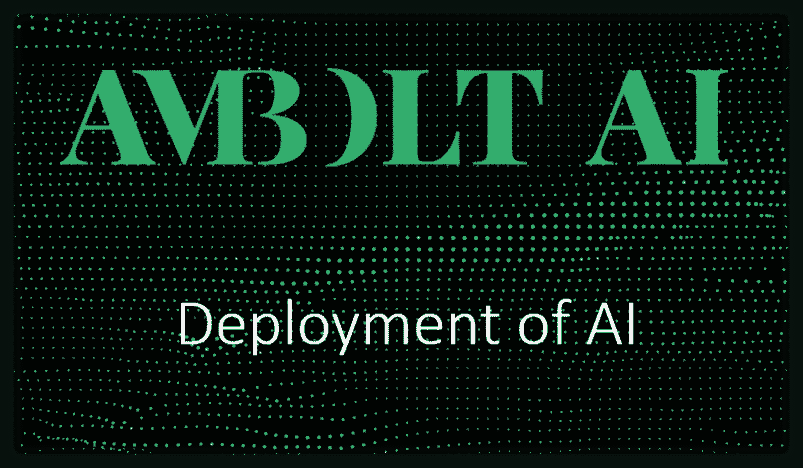
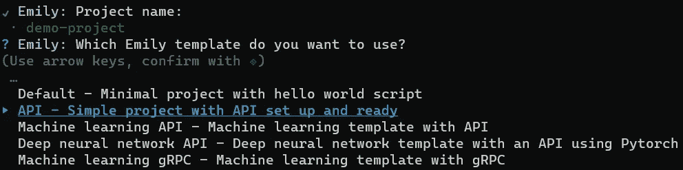
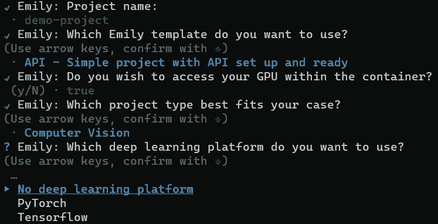
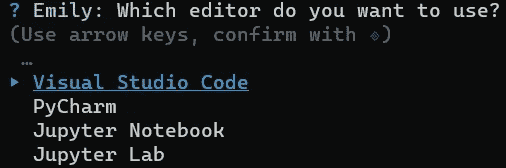
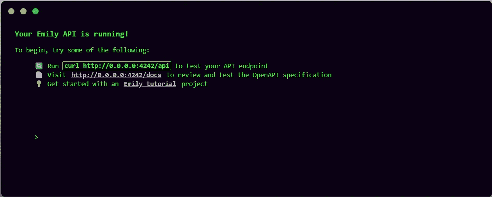
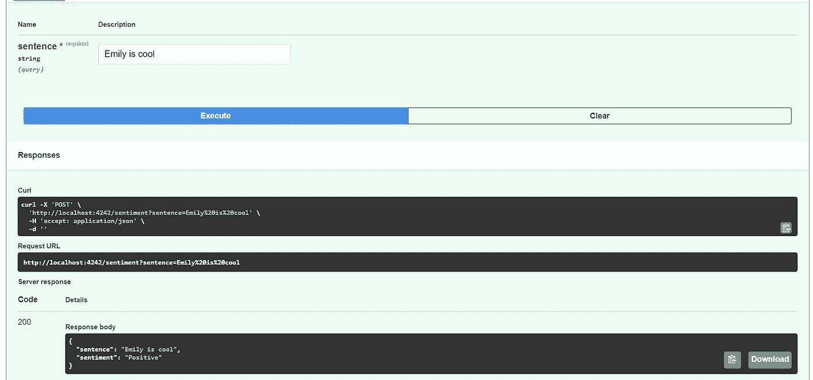

# AI 微服务轻松部署

> 原文：<https://medium.com/mlearning-ai/easy-deployment-of-ai-microservices-514f8f2830e8?source=collection_archive---------6----------------------->

在 AI 微服务的开发和部署中，有一些步骤不仅非常耗时，而且非常麻烦。Emily 就是为了帮助开发者而诞生的。今天，我将在几分钟内向您展示如何使用 Emily 构建生产就绪的人工智能解决方案。
让我们从头开始，接着是如何使用它们的例子。



# 艾米莉是什么？

**艾米丽**是开发者工具包，帮助
的工程师和数据科学家开发和部署人工智能微服务。Emily 允许您构建和部署生产就绪的人工智能微服务系统，同时您可以专注于重要的部分——人工智能。从项目创建到生产环境中的最终部署，一切都将由 Emily 协调。
基本的“Emily Core”包现在已经扩展到包括“Emily
Deploy”，其中主要关注的是帮助部署 AI
微服务。使用 Emily Core，您可以获得启动人工智能项目所需的一切。当项目完成并准备部署时，Emily Deploy 会助您一臂之力。Emily Deploy 提供了配置服务器和生产环境的直观流程，使无缝部署项目成为可能。Emily Deploy 确保如果项目在本地为开发人员工作，它也将在生产环境中工作！Emily 由丹麦的 Ambolt AI 开发。

> “由于我们在 Ambolt AI 的工作涉及为客户自动化数据和决策流程，我们已经采取了自己的措施，创建了可以自动化部分部署流程的 AI 平台。我们通过使用该平台节省的时间有利于我们的客户。我们可以将精力投入到开发的定制解决方案部分，在基本配置和部署上花费更少的时间。简而言之，我们已经自动化了开发过程中“无聊”的部分——可能花费不必要的长时间或导致挫折的部分。
> 
> 我们自己使用这个平台，现在也向所有其他开发者开放。"
> 
> *-安博尔特首席执行官安德烈亚斯·贝尔·埃里克森*

你可以在这里阅读更多关于 Emily 的内容:[https://ambolt.io/emily-ai/](https://ambolt.io/emily-ai/)
我们都同意，开发 AI 和 ML 项目是 AI 解决方案中最有趣的部分，生产和部署的设置相当繁琐和耗时。在接下来的部分中，我将向您展示如何快速入门！

# 我在哪里可以找到艾米丽，要花多少钱？

好消息！Emily Core 是免费的，甚至不需要帐户！你可以从这里下载艾米丽核心:[ambolt.io/emily-ai/](https://ambolt.io/emily-ai/)

下载并安装 Emily 将确保您的系统是最新的，并安装所有必要的依赖项。Emily 旨在使用 [Docker](https://www.docker.com/) 在容器化的环境中开发您的解决方案。您可以在不了解 Docker 的情况下使用 Emily，因为您不需要与 Docker 交互。这就是艾米丽施展魔法的地方！

继续，下载并安装 Emily，如果您在安装过程中遇到任何问题，请留下评论，我会联系您。
将 Emily 安装到您的终端后，键入:

```
emily
```

如果 Emily 安装正确，您应该会看到一条 Hello 消息，显示您可以使用的不同命令。Run `emily doctor`让 Emily 解决运行的需求，这包括设置 Docker、安装正确的 Nvidia 驱动程序、python 扩展等。

当`emily doctor`完成后，您就可以开始开发了！我们开始吧！

# 构建您的第一个项目

在这一节中，我将向您展示使用 Emily 开始构建一个项目是多么顺利和容易。在您最喜欢的终端中，编写以下命令:

```
emily build
```

它将指导您完成创建项目的过程。首先，你应该为你的项目选择一个名字，在这篇文章中我将使用这个名字`demo-project`。

接下来，您应该为您的项目选择一个模板，您可以选择一个包含 API 设置的模板，这样您的新项目在部署时就已经有了可以与之通信的端点。您也可以选择默认模板，它只包含运行所需的最少模板。我会为我的项目选择`API`。



接下来(如果在 ubuntu 上运行),会询问你是否希望访问你的容器中的 NVIDIA GPU。最酷的是，它会自动为您的项目建立一个具有 CUDA 功能的环境，因此您可以使用 GPU 进行训练和推断。在您的系统上手动安装 CUDA 可能是一项令人沮丧的任务，但是 Emily 可以轻松完成！我会选择`true`。

最后你应该选择的是你预期的项目类型，无论你是打算做 NLP，计算机视觉还是基本的机器学习。这不会限制您，它只是为您提供了用于该任务的预安装库。
我是计算机视觉的家伙，所以我选`Computer Vision`。



最后，你可以选择是否想要一个深度学习平台，如`Tensorflow`或`PyTorch`，你也可以只选择`No deep learning`。为了向你展示艾米莉的单纯，我选`Tensorflow`。

你会被问到你想用哪个编辑器来开发，目前可以用`VScode`、`PyCharm`、`Jupyter Notebook / Lab`。我个人喜欢`VScode`，所以我会选择它。



现在，环境将被构建，所需的库将被下载和安装，在您等待的时候去喝杯咖啡吧…

一旦 Visual Studio 代码出现，您就可以开始工作了。要查看一切是否正常，请创建一个 python 文件并插入以下代码:

```
import tensorflow as tfprint("# GPUs Available: ", len(tf.config.experimental.list_physical_devices('GPU')))
```

你会看到它输出:`# GPUs Available: 1`，就是这样，你现在有了一个带有 CUDA 和 GPU 访问的容器化开发环境。环境与您的个人文件是隔离的。

# 调查关联的 API

因此，我们确实用 API 构建了一个项目，这意味着我们可以使用浏览器与容器进行通信。尝试打开`api.py`并运行 python 文件。转到浏览器，输入`localhost:4242`。



您现在可以看到您的 API 正在运行，您可以按下`Run`来获得您的 API 的健康检查。

导航回`api.py`文件，您可以找到与此类似的部分:

```
@app.get('/api')
def hello():
return {
"service": Environment().COMPOSE_PROJECT_NAME,
"uptime": get_uptime()
}
```

本节创建运行状况检查端点，并定义它应该返回的内容。让我们为您的 ML 模型的自定义端点创建一个端点，在您的`/api`端点下插入以下部分:

```
@app.post('/sentiment')
def sentiment(sentence: str):
   sentiment = 'Positive'
   return {'sentence': sentence, 'sentiment': sentiment}
```

重新运行`api.py`文件并导航到`localhost:4242/docs`，找到您的`sentiment`端点。


单击向下箭头，找到关于您的端点的详细信息。试着按下`Try it out`按钮，你可以写一个句子到你的端点，然后按下执行。



您应该会看到响应正文:

```
{
  "sentence": "Emily is cool",
  "sentiment": "Positive"
}
```

您刚刚创建了一个新的端点，它将在几秒钟内开始工作。您可以创建一个情感分析模型来预测情感，而不是动态地将情感指定为积极的。我不会详细讲述你是如何构建你的 ML 模型的，因为我假设你已经知道了。

# Localhost 没那么好玩！

好了，现在我们有了一个包含所有代码的 Docker 容器，我们可以看到它正在我的机器上运行。Docker 的好处是，如果它能在我的机器上工作，那么它也能在你的机器上工作。更好的是，它还可以在您希望托管您的解决方案的服务器上工作！。

Emily 可以在几分钟内帮助您将解决方案部署到服务器上，只需运行`emily deploy server <project-name>`即可部署您的项目。
我的情况是`emily deploy server demo-project`。
*注意:Emily deploy 是一项付费功能，但你可以免费试用一个月。*

您将被要求创建一个环境，通常，我们会为要投入生产的软件创建一个生产环境，所以让我们使用生产。
你为你的生产环境指定一个端口，选择一个在你的服务器上免费转发的端口，我选择`4242`。而选择 GPU 与否，对于这个，你不需要 GPU。在以下视频中，您可以看到实际部署:

如您所见，只需几次点击，您就可以将项目部署到生产服务器上，并且可以从任何地方访问您的 API。更酷的是，输入配置后，您可以通过选择刚刚添加的环境和服务器来轻松地重新部署，它会重新部署您的解决方案。

> 你不能否认这并不容易！

Emily 为您提供了更多的实用程序，您可以在这里的文档[中看到它们。
*注意:Emily 也可以轻松地部署到 Kubernetes 集群！*](https://emily.ambolt.io/docs)

这就是现在的全部内容，我已经展示了您必须在几分钟内构建和部署一个容器化的解决方案。利用 Emily 来处理开发过程中所有繁琐和麻烦的部分。将来会有更多关于艾米丽的信息。

# 有用的链接:

*   安博尔特·艾:[https://ambolt.io/](https://ambolt.io/)
*   艾米丽:https://ambolt.io/emily-ai/
*   文件:[https://emily.ambolt.io/docs](https://emily.ambolt.io/docs)
*   邮箱: [emily@ambolt.io](mailto:emily@ambolt.io)

[](/mlearning-ai/mlearning-ai-submission-suggestions-b51e2b130bfb) [## Mlearning.ai 提交建议

### 如何成为 Mlearning.ai 上的作家

medium.com](/mlearning-ai/mlearning-ai-submission-suggestions-b51e2b130bfb)