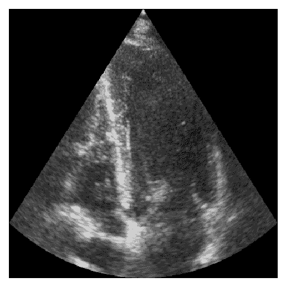

# 回声 2022

> 原文：<https://medium.com/mlearning-ai/echo2022-ml-challenge-b9a26537db0d?source=collection_archive---------10----------------------->

## 从超声心动图环路预测心脏射血分数


ECHO 2022 — Machine Learning Challenge

C 心脏射血分数(EF)是对左心室每次收缩时泵出的血液量的测量，以百分比表示[1]。低心脏 EF 可能是心力衰竭的标志，因此具有临床相关性。心脏 EF 通常在左心室测量，左心室是心脏的主泵室。左室将富含氧气的血液泵入身体的主动脉，输送到身体的其他部位。

今天，心血管磁共振成像(CMR)是计算左心室射血分数(LVEF)的金标准[3]。然而，每次心脏核磁共振扫描的费用在 1000-5000 美元之间，平均是超声心动图价格的 5.5 倍[4]。因此，如果能够用超声心动图代替 CMR 来确定左心室射血分数，将具有巨大的健康经济效益。



A 4 channel echo loop

# 挑战

人工智能在医学图像分类中显示出巨大的潜力，并且有理由相信它在解释超声心动图方面是有益的。在[这个数据集](https://www.kaggle.com/c/echo2022)，我们展示了超声心动图的回波环或序列。在训练集中，有来自 400 名患者的图像，而在测试集中，有 50 名患者。目标是预测测试集中 50 名患者的心脏 EF。

# 数据

数据集包含 2 通道(2CH)回波图像和 4 通道(4CH)回波图像。2CH 图像仅显示左心室和左心房，而 4CH 图像显示左右心房和心室。参赛者可以自由选择在他们的训练和预测中是只使用 4CH、只使用 2CH 还是两者都使用。

图像数据存储在。npy 文件。这些文件可以使用`numpy.load`加载到 Python 中

```
import numpy as npnp.load("./my_path/my_echofile.npy")
```

每个。npy 文件包含一个完整的回显循环。回波环内的所有图像具有相同的分辨率和图像大小，但图像大小因患者而异。

训练数据的射血分数(地面实况)在名为 train_data.csv 的文件中给出。该文件可以使用`pandas.read_csv`上传到 Python

```
import pandas as pdpd.read_csv("./my_path/train_data.csv")
```

最后，在您训练了您的模型并在测试集上完成了预测之后，您可以使用您自己的预测填充 sample_submission.csv 文件中的 lv EF 列，并将其提交给本次竞赛。

# 基线代码

需要一个起点吗？查看[这个基线代码](https://www.kaggle.com/bjoernjostein/echo2022-eda-baseline-model)，它给出了数据集的简要介绍、一些探索性的数据分析，以及作为进一步开发基准的基线模型。

# 参考

[1][https://www . heart . org/en/health-topics/heart-failure/diagning-heart-failure/射血分数-心力衰竭-测量](https://www.heart.org/en/health-topics/heart-failure/diagnosing-heart-failure/ejection-fraction-heart-failure-measurement)
【2】[https://www . mayo clinic . org/tests-procedures/EKG/expert-answers/ejection-fraction/FAQ-2005 8 286](https://www.mayoclinic.org/tests-procedures/ekg/expert-answers/ejection-fraction/faq-20058286)
【3】Simpson R，Bromage D，Dancy L，等 6 比较超声心动图和心脏磁共振测量射血分数:对高频血流动力学的影响 104:A3。
【4】[https://www . ACC . org/latest-in-cardiology/articles/2019/01/07/12/42/for-the-fits-the-future-of-the-fits-cardio-Imaging-considerations-for-fits](https://www.acc.org/latest-in-cardiology/articles/2019/01/07/12/42/for-the-fits-the-future-of-cardiovascular-imaging-considerations-for-fits)
【5】s .莱克勒克、E. Smistad、J. Pedrosa、A. Ostvik 等人
《IEEE Transactions》中的“在 2D 超声心动描记术中使用开放大规模数据集进行分割的深度学习”

[](/mlearning-ai/mlearning-ai-submission-suggestions-b51e2b130bfb) [## Mlearning.ai 提交建议

### 如何成为 Mlearning.ai 上的作家

medium.com](/mlearning-ai/mlearning-ai-submission-suggestions-b51e2b130bfb)