# EDA 和 RandomForestRegressor 在真实世界车辆数据集预测中的建模

> 原文：<https://medium.com/mlearning-ai/eda-and-modeling-with-randomforestregressor-on-real-world-vehicle-dataset-prediction-bbaf1e8e10c2?source=collection_archive---------0----------------------->

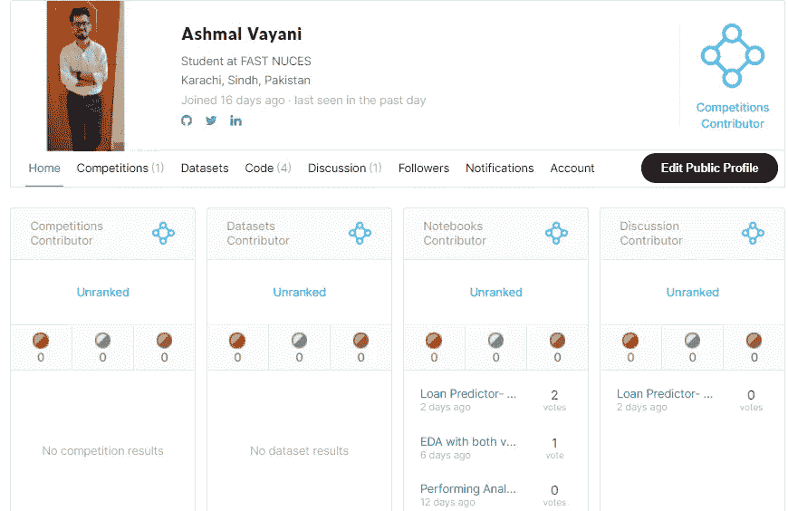

Follow me on Kaggle: [https://www.kaggle.com/ashmalvayani](https://www.kaggle.com/ashmalvayani).

> **探索性数据分析**

探索性数据分析(EDA)是一种将数据集的特征从表格形式总结成有意义的东西的技术，可能通过可视化、统计计算和图形、绘图以及其他可视化技术。统计模型可以在以后开发，但这不是 EDA 的目的。简而言之，可以认为一个数据单元告诉我们关于它自己的什么。数据科学家应该非常善于从数据中提取信息。

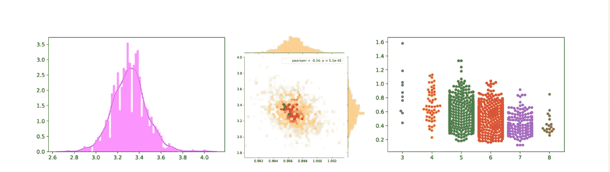

> **概述**

这个项目需要一个 Kaggle 数据集。此任务的主要目标是对数据集进行预测分析，根据其特征(如燃料类型等)预测汽车的销售价格。

> **先决条件**

为了在数据集上执行 EDA 和建模，我希望读者对以下内容有一个基本的了解。

1.  海生的
2.  Matplotlib
3.  Sklearn
4.  ML 车型(RFR)
5.  熊猫
6.  Numpy

> **数据集**

数据集取自 Kaggle，其中包含 301 条记录的信息，我们一会儿就来看看它们的特性。[数据集](https://www.kaggle.com/nehalbirla/vehicle-dataset-from-cardekho)的链接。

> **让我们从 EDA 开始**

最基本的步骤是读取数据，并使用。头()方法或其形状。

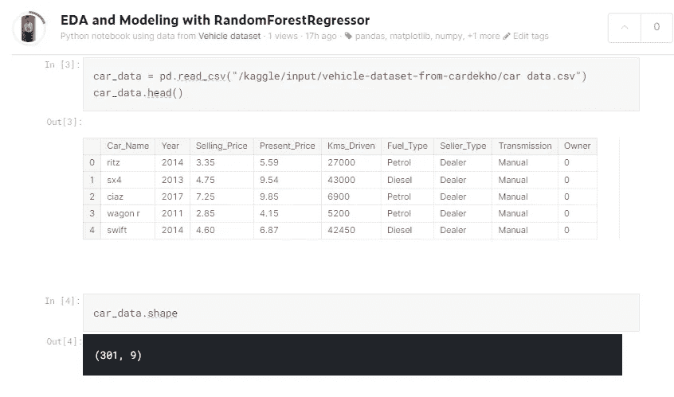

通过查看这两个数据，我们可以首先看到数据的行数和列数。此外，可以考虑哪些数据类型是分类的，这可能需要在建模之前进行一些计算。

我们还需要找到一个我们将在测试数据中预测的因变量，即 Selling_Price。

**检查分类数据**

在考虑应该对这些分类数据应用什么方法之前，我们不会找到它们的唯一值。

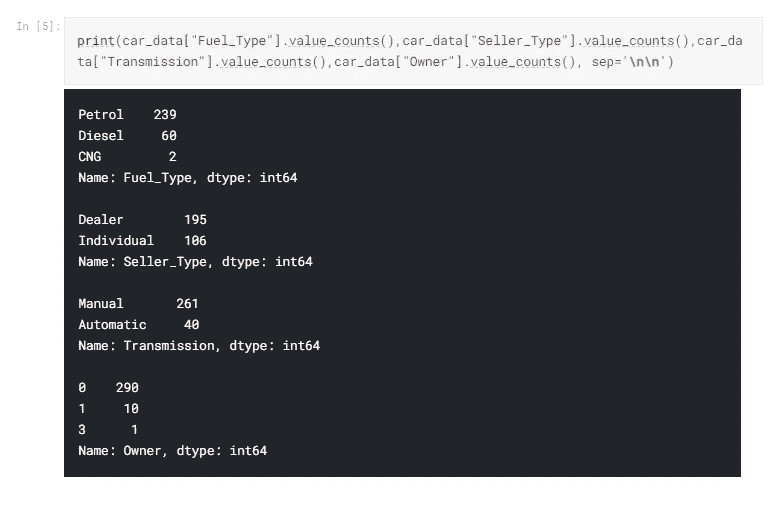

**检查缺失数据**

在应用任何算法或预测分析之前，检查我们的数据是否有任何缺失条目是至关重要的。这可能导致广义值上的数据不准确或过度拟合，以及从未见过的 test_set 上的不准确结果。

通常，我们有相当多的选项来处理丢失的值，比如删除那些列。它可能适用于字段在预测中不重要的情况，但大多数情况下，数据分析师不喜欢这种方法。

首先，检查丢失的值，要么是因为没有记录而丢失，要么是不存在。如果它不存在，不如留给南。如果它存在但没有被记录，那么寻找诸如“bfill”或“ffill”之类的方法，或者用数据集的平均值替换它们。

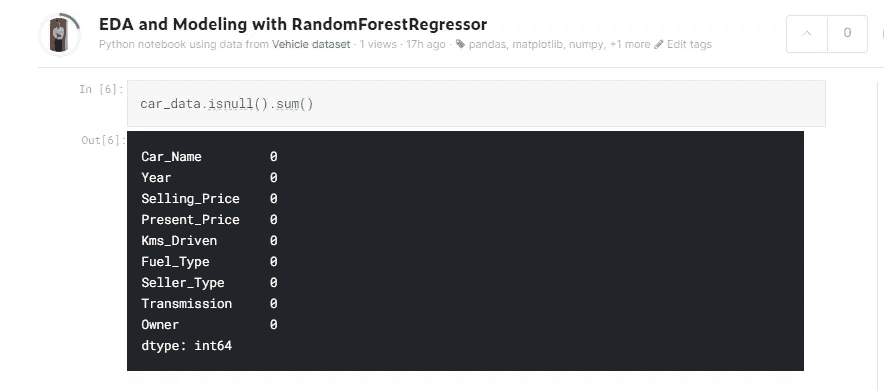

所以，幸运的是我们的数据没有丢失。

我们的数据集显示，汽车名称在预测中不起任何作用，因此，这些特征在这里更重要。此外，年份栏也不方便。更确切地说，它被制造出来的年数可能更有用。让我们快点改变他们。

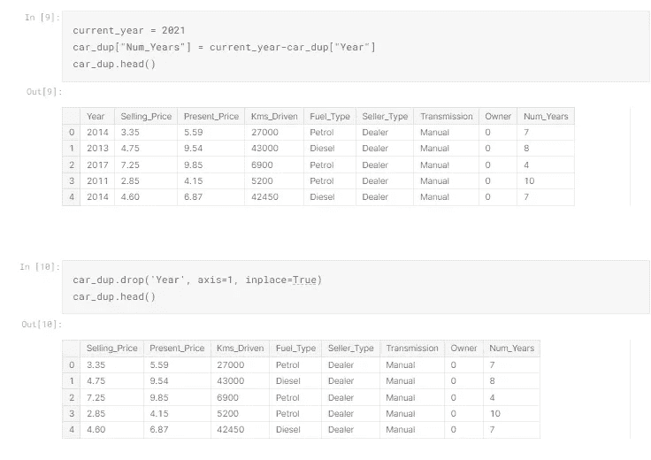

**处理分类数据**

由于我们讨论了分类数据，它们不便于分析和建模，因为大多数机器学习算法在数值数据集上工作得最好。编码有很多种，但是我们将使用一种热编码来转换我们的数据，因为我们前面看到唯一值很少，可以很容易地放入我们的列中。

请记住，算法适用于更多的行而不是更多的列。

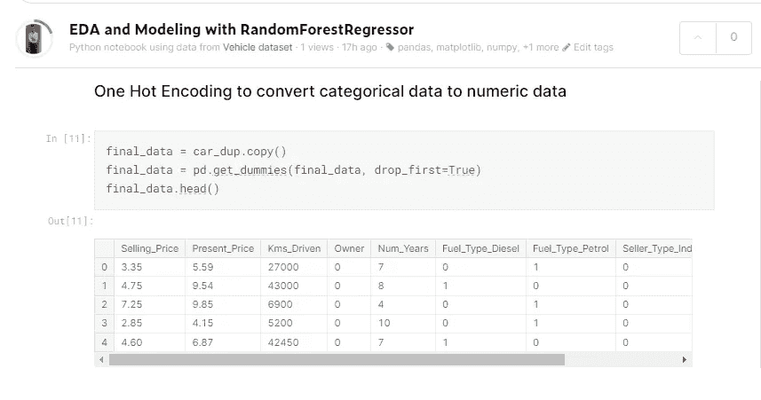

**皮尔逊关联并形象化它们**

现在，让我们寻找特征与特征之间的关系。

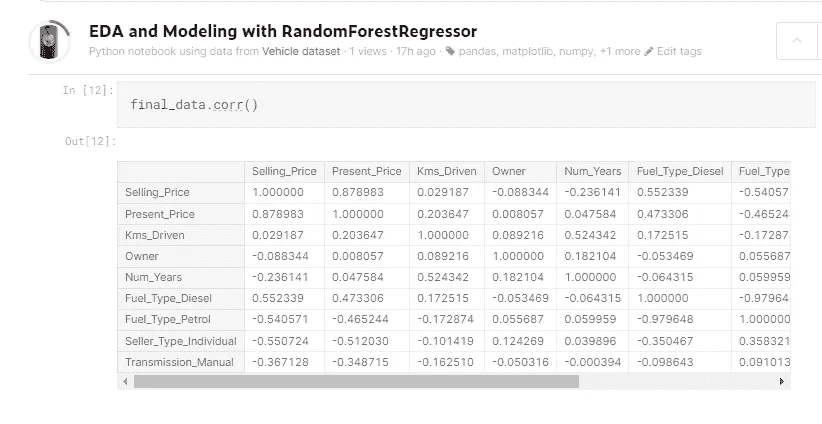

该表显示了每一列与其他每一列的相关性，这对于可视化来说不是很好，因为都是数字。让我们尝试使用 pairplot 和 heatmap 来可视化它，看看我们的表格要说些什么。

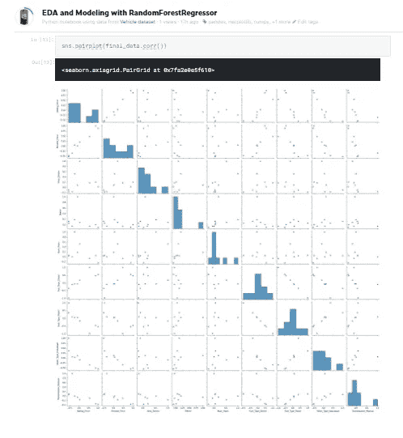

Pairplot

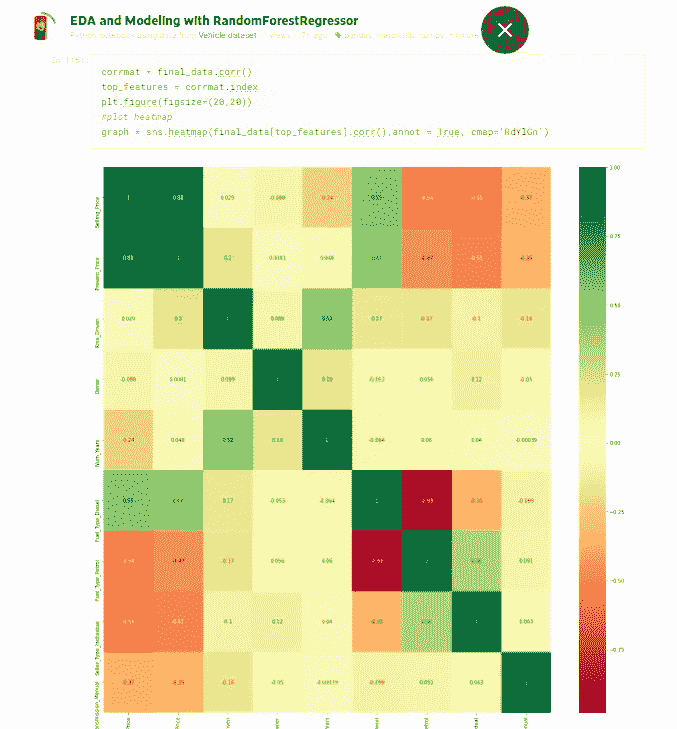

Heatmap

热图很好地解释了相关表。深绿色表示具有强关系的列，红色表示负的或最弱的关系，例如燃料类型柴油和燃料类型汽油之间的关系。

**分离我们的数据**

我们现在将分离可用于预测的因变量和自变量的数据。

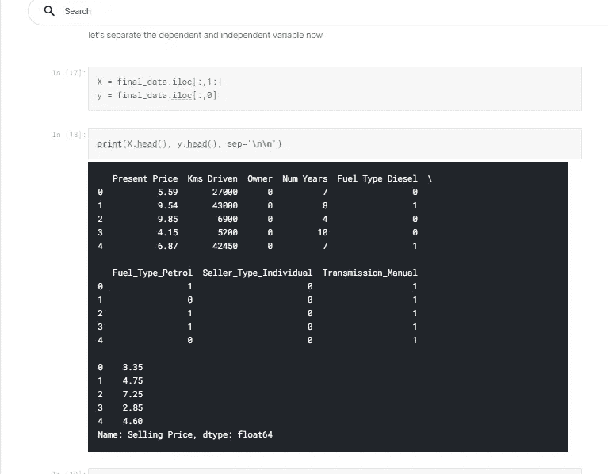

**寻找重要功能**

如果您不太确定可能要用于预测和建模的特征的重要性，请尝试使用 sklearn.ensemble 中的 ExtraTreeRegressor 来找出它们。

```
*## Feature importance*
from sklearn.ensemble import ExtraTreesRegressor
model = ExtraTreesRegressor()
model.fit(X,y)print(model.feature_importances_)
```

这将打印出数组，显示每一列的重要性，如下所示。

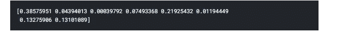

we can see that the first feature and fifth feature (present price and fuel_type_diesel) has the most importance

让我们想象一下

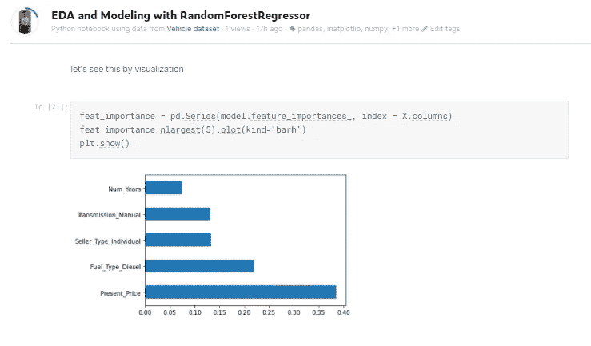

The graph shows the top 5 important features out of all.

> **建模和分割数据**

首先，将数据分成训练和测试组件。

```
from sklearn.model_selection import train_test_split
X_train, X_test, y_train, y_test = train_test_split(X,y, test_size=0.2)print(X_train.shape)
print(X_test.shape)
```

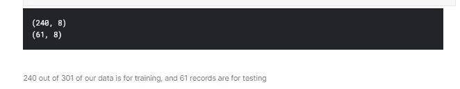

对于建模，我们将使用 RandomForestRegressor。

***RandomForestRegressor:***

RandomForestRegressor 基本上使用决策树，并且是一个元估计器**，它在数据集**的各种子样本上拟合几个分类决策树，并使用平均来提高预测精度和控制过度拟合。

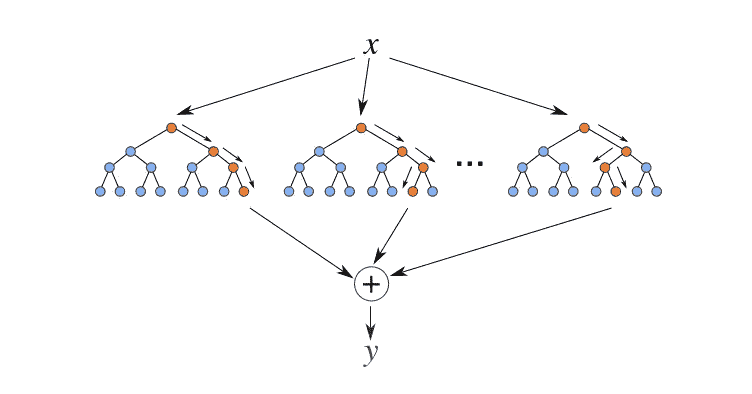

[https://levelup.gitconnected.com/random-forest-regression-209c0f354c84](https://levelup.gitconnected.com/random-forest-regression-209c0f354c84)

让我们首先创建它的一个实例，然后我们将使用超参数进行调优。

```
from sklearn.ensemble import RandomForestRegressor
rf_random = RandomForestRegressor()
```

现在 RandomForestRegressor 有很多参数。如果你观察它，你可以给每个参数传递一个选项列表来分析哪个最合适；当你不得不一次又一次地写代码时，这样做不是很方便。所以我们基本上使用 RandomSearchCV 之类的东西，它接受一个参数列表，在每个特性上拟合模型，并为我们选择最佳特性。当您不知道具体指定什么参数时，这确实是一个很好的工具。

现在让我们使用参数:

```
import numpy as np
n_estimators = [int(x) for x **in** np.linspace(start  = 100, stop = 1200, num = 12)]
max_features = ['auto','sqrt']
*#max number of levels in a tree*
max_depth = [int(x) for x **in** np.linspace(5,30,num=6)]
*#min number of samples required to split a node*
min_samples_split = [2,5,10,15,100]
*#Min number of samples required at each leaf node*
min_samples_leaf = [1,2,5,10]
```

RandomizedSearchCV 帮助我们找到数据的最佳参数。它也比 GridSearchCV 快。我们导入模块并设置参数。

```
from sklearn.model_selection import RandomizedSearchCV
```

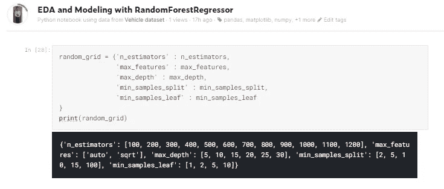

将所有参数传递给构造函数并训练模型。

```
rf = RandomForestRegressor()
rf_random = RandomizedSearchCV(estimator= rf, param_distributions= random_grid, scoring='neg_mean_squared_error',n_iter=10, cv = 5, verbose=2, random_state=42, n_jobs=1)
*#verbose displays the results*
```

这个 RandomizedSearchCV 将输入作为我们指定的参数，并自动选择最佳参数。

```
rf_random.fit(X_train, y_train)
```

现在让我们检查一下我们的预测。

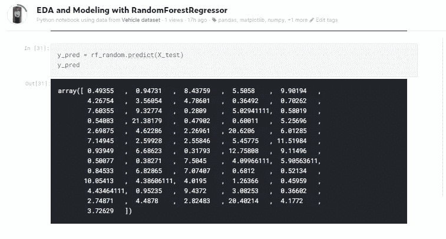

> **比较结果**

要比较结果，最好通过可视化来比较。我们将使用显示来查看结果是否正态分布。

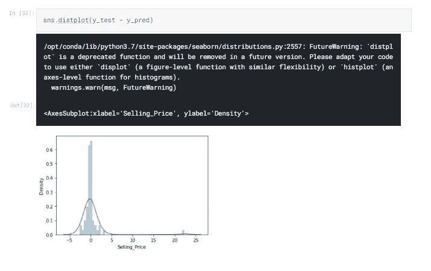

由于图表显示正态分布，这意味着模型给出了很好的结果。

此外，使用散点图绘制结果和比较，以查看我们的结果。

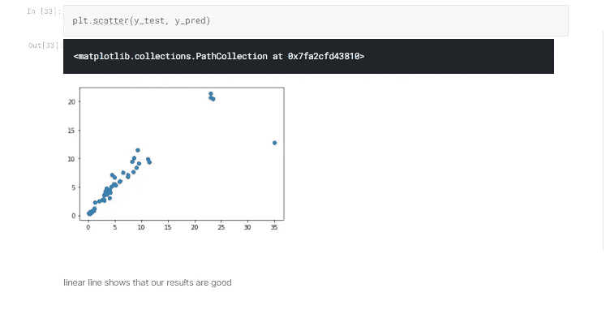

散点图中的线性线表明，我们的模型给出了关于 test_data 的非常准确的结果，现在可以部署了。

> **结论**

我们的模型结果非常准确，现在可以部署了；我们已经对数据集执行了销售价格预测分析，可以找到看不见的数据。

您可以用 HTML 部署项目以实时使用它，但这也不是我们项目的范围。

> **代号**

在 Github 上找到这个项目的完整代码。

[](https://github.com/ashmalvayani/EDA-and-RFR-on-Vehicle-Data) [## GitHub-ashmalvayani/EDA-and-RFR-车载数据:机器学习项目

### 此时您不能执行该操作。您已使用另一个标签页或窗口登录。您已在另一个选项卡中注销，或者…

github.com](https://github.com/ashmalvayani/EDA-and-RFR-on-Vehicle-Data) 

> **和我联系**

[](https://www.linkedin.com/in/ashmal-vayani/) [## Ashmal Vayani -作家-机器学习| LinkedIn

### 我只是一个普通人，在不同的层次上追随他学习编码和逻辑构建的热情…

www.linkedin.com](https://www.linkedin.com/in/ashmal-vayani/)