# EDA 与其说是科学，不如说是一门艺术

> 原文：<https://medium.com/mlearning-ai/eda-is-more-of-an-art-than-science-b03b92e08430?source=collection_archive---------2----------------------->

## 首先了解你的数据——建立模型非常重要。

Photo by [Per Lööv](https://unsplash.com/@perloov?utm_source=unsplash&utm_medium=referral&utm_content=creditCopyText) on [Unsplash](https://unsplash.com/s/photos/brainstorm?utm_source=unsplash&utm_medium=referral&utm_content=creditCopyText)

探索性数据分析(EDA)是为特定问题建立机器学习模型的重要过程(如果不是最重要的)，因为如果不知道你的数据，你很难建立一个有用的模型。

> **“所有的模型都是错的但是有些模型** **是** **有用**”—乔治·E·P·Box

EDA 使我们能够了解数据中的分布、异常和特征之间的关系。不幸的是，EDA 没有标准的程序或过程，因为目前它更多的是一种艺术而不是科学，这就是为什么许多初学者与 EDA 斗争，并且经常不知道如何去做。由于缺乏任何结构，一些人通过应用机器学习算法仓促行事，这些算法通常产生次优模型，该模型可能在特定样本上工作良好，但在生产中却很困难。

EDA 仍然是一门艺术，一旦你在分析中，如果你没有计划，事情往往会变得混乱，所以在这篇博客中，我将尝试记下有多少数据科学家在数据科学项目中使用 EDA 的启发式方法。

# 鸟瞰图:

在直接进入复杂的多变量分析和寻找数据中的相关性之前，通常的做法是对数据有一个基本的了解，如字段、数据类型、可能的数据问题和分布，这将使我们能够在深入分析中提出正确的问题。

> **基本信息:**

了解非常基本的细节，如行数、列数、有多少字段有空值或缺失值，这似乎很简单，对吗？但它将为更高级的探索打下基础。

> **五个号码汇总:**

除了基本的细节，五个数字的总结可以帮助你确定数据的关键统计数据，如平均值、中值、众数、四分位数、标准差、最小值和最大值。这些统计数据有助于确定您是否需要查看更多细节，例如具有很高标准偏差的要素，或者其平均值和中值描绘了两个不同的分布中心点(如果数据存在偏斜)

> **成对分析:**

为了快速了解所有变量之间的关系，pair plot 是一种相当快速和简单的方法来绘制所有可能的组合。这些图表让我们知道不寻常的模式(如果存在)，更重要的是，这是我们开始建立许多假设的地方。

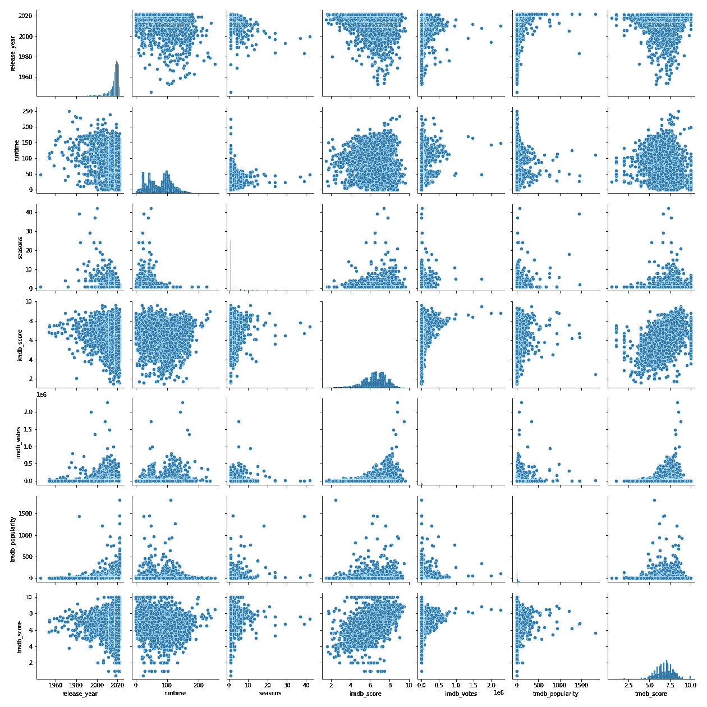

[Seaborn Pairplot](https://seaborn.pydata.org/generated/seaborn.pairplot.html)

> **分布:**

在了解数据的性质时，了解数据的分布会很方便&更重要的是，当应用有自己的一套假设和限制的统计方法时，验证特定的分布以构建更可靠的模型是一个好主意。

虽然五个数字的汇总也提供了关于数据的关键统计数据，这些数据提供了关于分布的理解，但是一般来说，绘制直方图和密度图来理解数据中的形状、异常值和偏斜度是一个好主意。

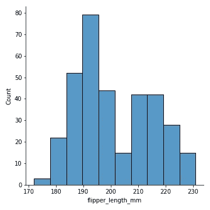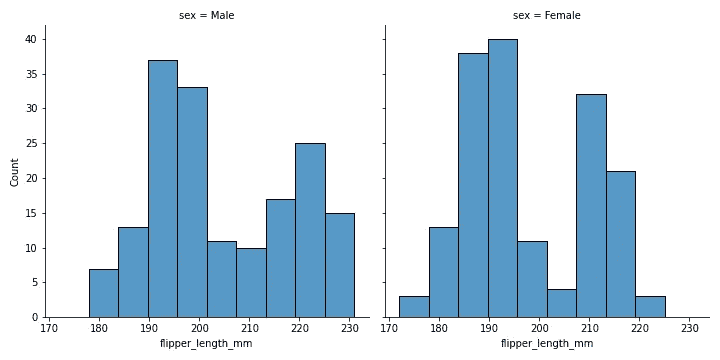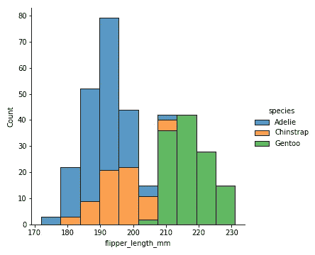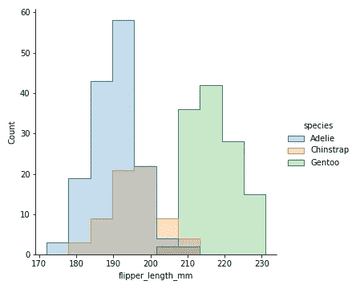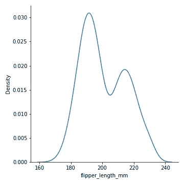

一般来说，EDA 还将为您提供关于哪里需要数据清理和处理的见解，因为真实世界的数据集通常不是最理想的形式。

# 深度开发和构建假设:

一旦我们对数据有了基本的了解，是时候通过提问和建立假设来进行更复杂的分析了。

> **单变量，双变量&多变量分析:**

从质疑数据开始，了解一些关于数据的信息总是一个好主意，比如泰坦尼克号悲剧中的性别会影响生存机会吗？折扣促使人们在一周内去星巴克买咖啡超过三次吗？

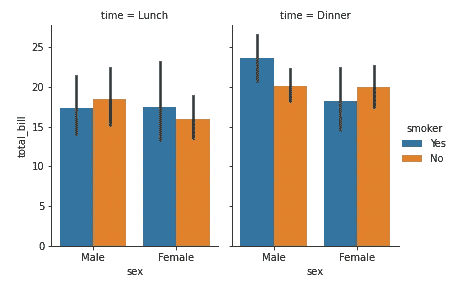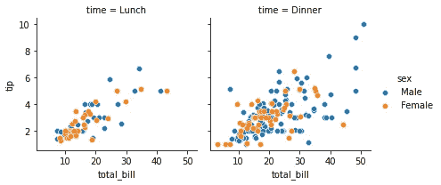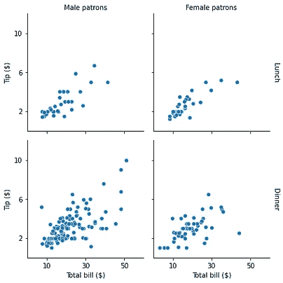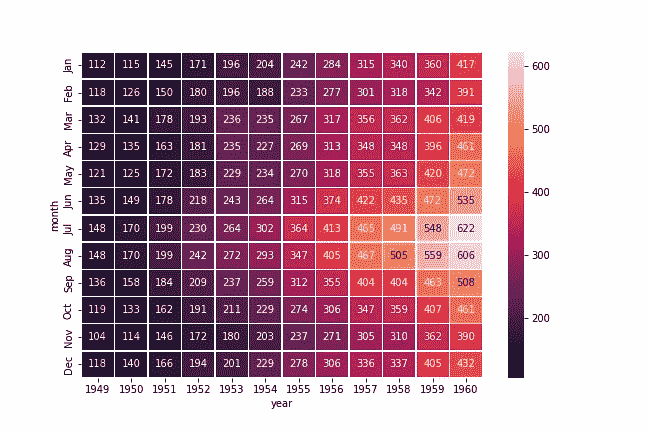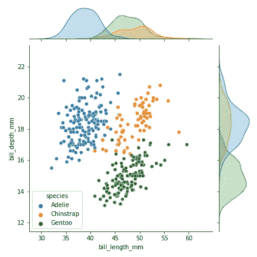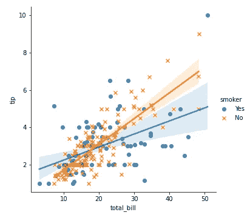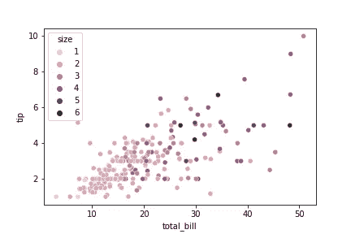

Some examples of Bivariate & Multivariate Analysis

让数据可视化来回答关于数据的问题，在这样做的同时，将会有更多的问题出现在过程中，并且通常会变得更加复杂，从而涉及两个以上的变量(多变量分析)

关于多变量分析的更多细节，你可以阅读我关于这个主题的博客[这里](/analytics-vidhya/multivariate-analysis-with-seaborn-622aaedc6ecc)，同样对于单变量分析，你可以参考[这里](/analytics-vidhya/exploratory-data-analysis-part-i-7992935f0b9b)。

> **假设构建:**

假设简单来说就是“关于数据的假设**”。这些假设将在之前的步骤中形成。首先记下所有的假设，并尝试通过数据可视化来验证它，在第二阶段，有更精确的统计方法来测试假设。**

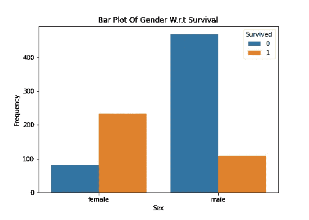

Survival Count wrt Gender in Titanic Dataset

*   **H0(零假设)**:性别没有区分力，不能作为预测乘客生存几率的特征。
*   **H1(替代假设)**:性别可以是预测乘客生存几率的一个相对较好的特征。

根据柱状图，性别似乎对存活率有一定的影响，但在得出结论之前，最好先从统计学角度验证假设。

> **关联&关联:**

首先**“相关性不是因果关系”**简单来说，它表达的是两个数值变量之间的关系，这些变量可以是正相关的，也可以是负相关的。

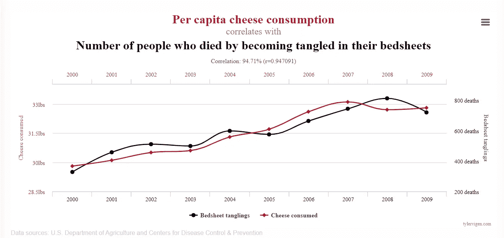

[Spurious Correlations](https://www.tylervigen.com/spurious-correlations)

为什么相关性不是因果关系？因为这可能是由于其他一些共同因素造成的，如食品配送业务中的配送时间可能与周末(需求通常较高)高度相关，这表明周末与配送时间之间存在很强的相关性，但实际上周末工作时间(车队)不足似乎是更合理的原因，而且可能是一个共同因素，因此有时相关性可能具有欺骗性，但这是一个有价值的信息，有助于发现特征。

虽然不同的情况有不同类型的相关性，我将来会为此写一个单独的博客，所以现在我们严格地谈论 ***皮尔逊相关性。***

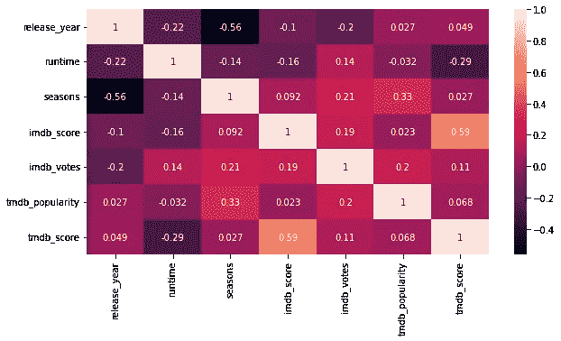

Correlation Heatmap

相关性是指两个变量之间的线性关系，而联想则是指两个变量之间的某种关系(不一定是线性的)。

相关性主要用于数字变量，而关联性用于分类变量，以回答诸如性别真的能影响生存机会之类的问题？特定品牌的手机会更容易出现电池续航能力差的情况吗？

# 推理统计和特征选择:

> **假设检验:**

到目前为止，您已经从数据中构建了很少假设——有些假设只能通过数据可视化和分析来消除。假设检验是指更合理的假设通过更精确的统计方法，如方差分析、T 检验等来验证关于数据的假设。在下面的代码中，ANOVA 用于验证企鹅的体重是否取决于它们的种类。

> **特征选择方法:**

特征选择可以是特征工程的一部分，也可以包含在 EDA 中。在特征工程中，主要关注的是生成更多的特征或降低维数。

有三种方法可以用来找到最相关的特征，从而进行特征选择。

**包装方法** —基于从模型性能得出的推论添加或删除特征的贪婪方法。

**过滤方法** —使用相关、方差分析和卡方检验等统计检验，找出最佳特征集。

**内蕴法** —利用 Lasso 回归、随机森林等机器学习模型，寻找特征重要性。

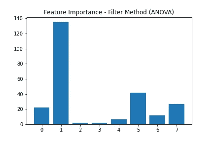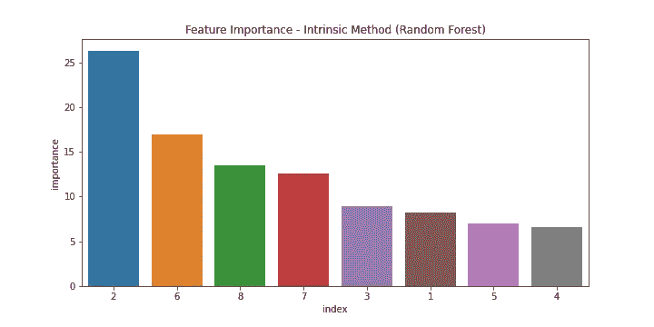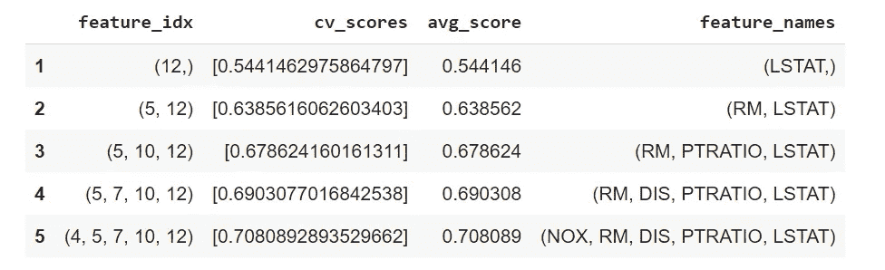

Feature Selection — Wrapper Method

# 最后注意:

虽然 EDA 没有标准的程序，但我已经尝试为任何开始数据科学之旅的人提供一个小结构。虽然这是我如何接近 EDA，并已看到许多数据科学家遵循类似的程序，但我会更高兴地学习，如果你知道一个不同的方法。

谢谢你的时间。你可以随时联系到 [***Sehan。法鲁基***](https://www.linkedin.com/in/sehan-ahmed/)

 [## Mlearning.ai 提交建议

### 如何成为 Mlearning.ai 上的作家

medium.com](/mlearning-ai/mlearning-ai-submission-suggestions-b51e2b130bfb)