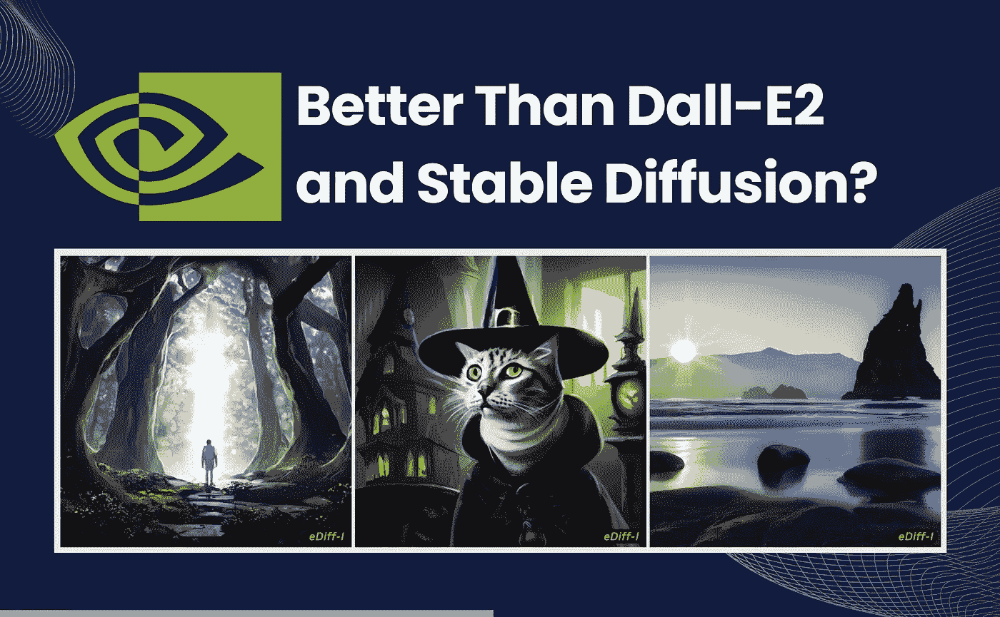

# eDiff-I 是 NVidia 新推出的 AI 图像生成器。比 Dall-E2 和稳定扩散好吗？

> 原文：<https://medium.com/mlearning-ai/ediff-i-is-nvidias-new-ai-image-generator-is-it-better-than-dall-e2-and-stable-diffusion-b33c7778bf3d?source=collection_archive---------0----------------------->

Image by [Jim Clyde Monge](https://medium.com/u/819323b399ac?source=post_page-----b33c7778bf3d--------------------------------)

继 OpenAI 的 DALL-E2、MidJourney 的 V4 和 Stability AI 的 Stable Diffusion 以其令人难以置信的强大图像生成器模型成为头条新闻后，Nvidia 以其名为 [eDiff-I](https://deepimagination.cc/eDiffi/) 的文本到图像模型进入了这一领域。

## 什么是 eDiff-I？