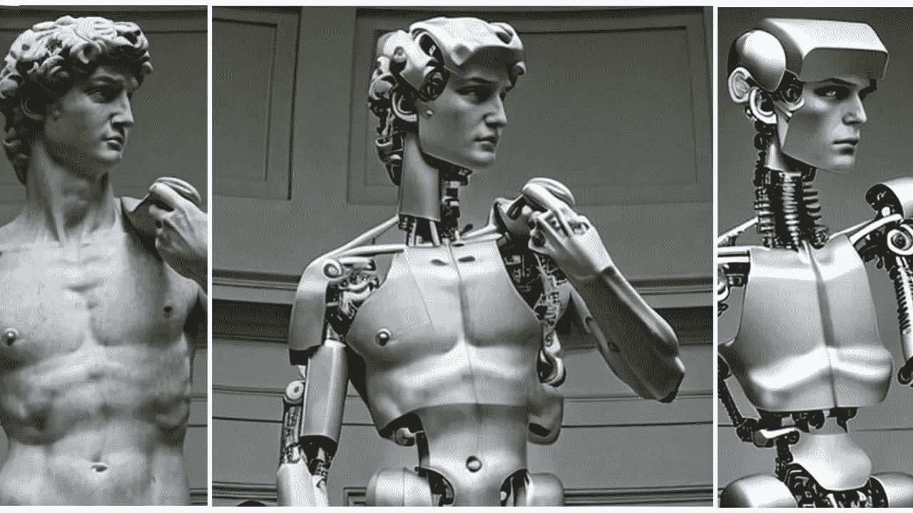

# 编辑指令:“把他变成半机械人！”

> 原文：<https://medium.com/mlearning-ai/edit-instruction-turn-him-into-a-cyborg-f13247214748?source=collection_archive---------2----------------------->

## [免费测试最新款(2022 年 11 月 24 日)](https://open.substack.com/pub/evartology/p/try-the-latest-text-to-image-diffusion?r=9hp4d&utm_campaign=post&utm_medium=web)

## [教导一个遵循人类的生成模型](#f4e1)

[Try the latest Text-to-Image Diffusion 2.0](https://open.substack.com/pub/evartology/p/try-the-latest-text-to-image-diffusion?r=9hp4d&utm_campaign=post&utm_medium=web)

一种新颖的基于人类指令的图片编辑方法如下:给模型一个输入图像和描述它应该做什么的书面命令，然后模型编辑图像…