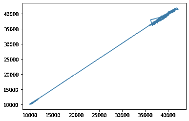
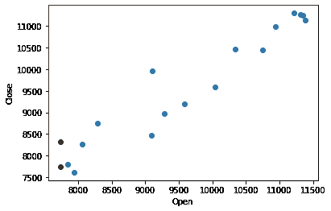

# 基于机器学习的股票价格预测效率分析

> 原文：<https://medium.com/mlearning-ai/efficiency-analysis-of-stock-price-prediction-using-machine-learning-cd65ccb2a2f1?source=collection_archive---------3----------------------->

机器学习技术已经被用来分析和预测一个给定公司的股票价格。这些系统现在相当普遍。但是这些预测有多可靠呢？众所周知，股票价格受许多因素的影响而波动，如经济因素、公司趋势等。在本文中，我们将通过在股票价格数据集上训练模型来评估这些预测的可靠性，然后尝试预测价格何时因某些经济条件而波动。这将有助于我们分析这类系统在情况偏离正常情况时的可靠性。

# 以前的工作

股票价格预测系统由线性或非线性模型(人工神经网络)组成。大多数模型使用开盘价作为特征，收盘价作为目标变量，而一些模型包括日期作为特征墙。股票价格的历史数据用于训练和测试模型。

由于股票价格是时间序列数据，LSTMs 主要用于更好的预测。除了 LSTMs，还使用人工神经网络和线性模型(如果存在线性数据)。

股票的开盘价是模型的常用特征，收盘价是目标变量。在少数系统中，日期也被用作一种特性，尽管日期作为一种特性也很少被使用。

# 方法学

ML 模型用于对所选股票价格数据集(Nifty50)的股票价格历史数据进行训练。然后，在最近不稳定的经济条件下(新冠肺炎一级防范禁闭)，这被用来预测股票价格，以评估其可靠性。

使用的数据集将是 Nifty50 股票价格数据集，数据取自 2018 年 1 月-2020 年 2 月。因此，我们学习锁定期前的数据，并预测锁定期内的价格，以评估与前几年的趋势相比，它应对不稳定经济条件的能力。

在这个实验中，我们将以定量(绝对误差)和定性(从投资者的角度)的方式评估模型预测，以得出其可靠性。

# 履行

数据集的收集日期为 2018 年 1 月至 2020 年 2 月。原因是封锁始于 2020 年 3 月，当时经济形势开始偏离常态。

观察股票的开盘价和收盘价之间的趋势，得到下图。

The trend between opening and closing price shows its a linear fit

对于这种情况，线性模型将工作良好。下面的代码构建了一个线性模型并对其进行训练。训练和测试完成后，它会对异常值进行预测，并在图表中显示结果。

# 结果和结论

经过训练的模型表现良好，训练损失为 0.00005，验证损失为 0.0001。从损失图可以清楚地看出，训练曲线和验证曲线已经完全融合，这表明模型已经达到了良好的拟合。但是当对异常情况进行预测时，很明显模型表现不佳。这表明股票价格不仅取决于开盘价，还取决于许多其他因素。开盘价的暴跌是由新冠肺炎的封锁局势造成的，而收盘价的异常上涨是因为大型交易商以较低的价格购买了股票，因为他们看到了新冠肺炎冲击后的增长潜力。

The green dot is the actual closing price and the red dot is the predicted closing price

执行定性和定量分析，我们可以确认该模型表现不佳。1000 个单位的预测差异对于一个预测的股价来说是一个巨大的差距。

*由此可以得出结论，股票预测需要你在考虑开盘价的同时，还要考虑行业和经济因素。当预测股票价格等波动值时，机器学习会投射出某些限制。因此，可以认为机器学习模型对于股票价格预测是部分有效的。*

感谢您的阅读！

## 有用的链接

在领英上找到我:[https://www.linkedin.com/in/vishnuu0399/](https://www.linkedin.com/in/vishnuu0399/)

更多地了解我:https://bit.ly/vishnu-u

IJSR 出版:[https://www . world wide journals . com/international-journal-of-scientific-research-(IJSR)/file view/efficiency-analysis-of-stock-price-prediction-using-machine-learning _ March _ 2021 _ 7463161120 _ 2738561 . pdf](https://www.worldwidejournals.com/international-journal-of-scientific-research-(IJSR)/fileview/efficiency-analysis-of-stock-price-prediction-using-machine-learning_March_2021_7463161120_2738561.pdf)