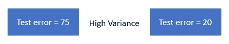
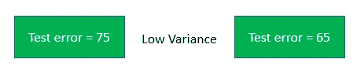
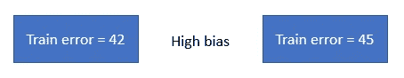
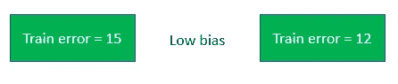
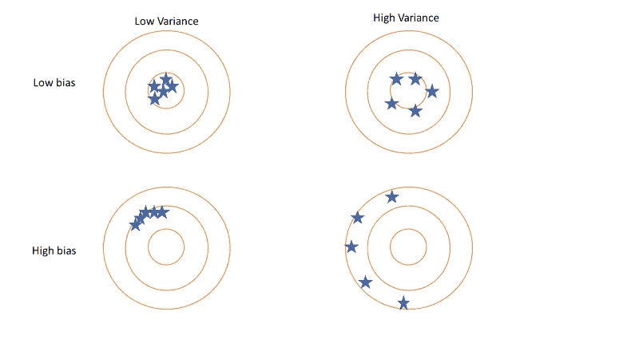
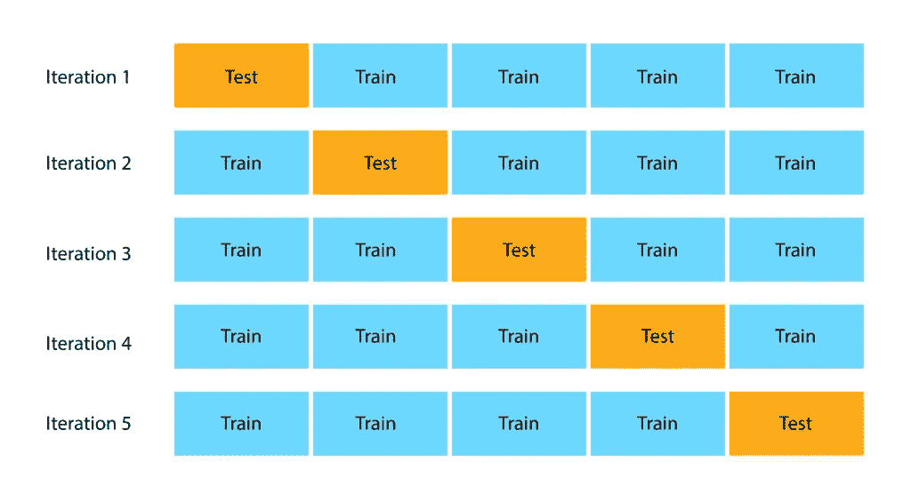
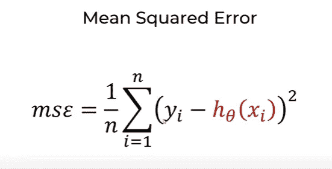
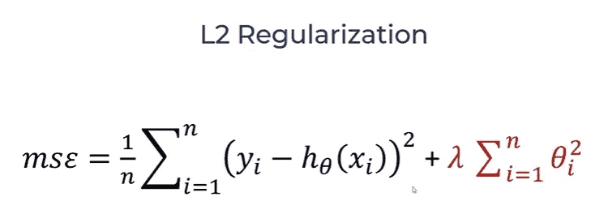
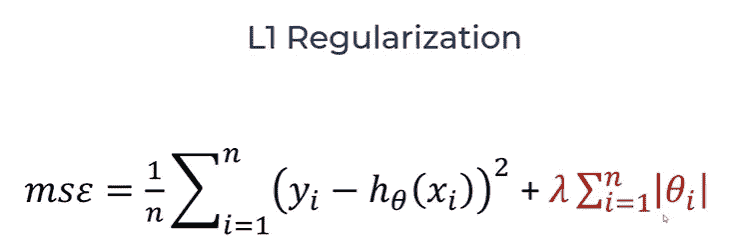
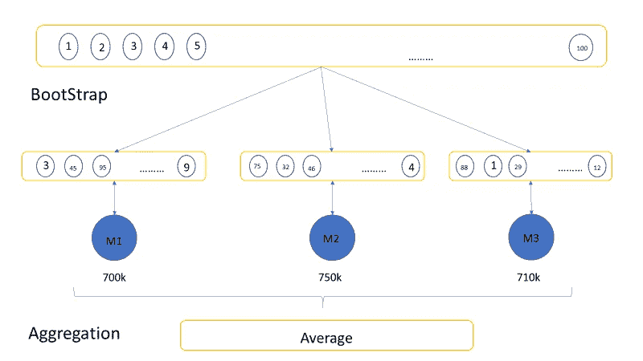

# 平衡拟合模型的有效方法

> 原文：<https://medium.com/mlearning-ai/efficient-ways-for-a-balanced-fit-model-2ab5657e7fd9?source=collection_archive---------2----------------------->

摆脱过瘦和过瘦的模特。

# 动机

当我们开始构建一些机器学习模型时，我们会遇到这些过拟合和欠拟合的角色。我觉得这些都是模型建筑中的怪物，阻止我建造一个完美的模型。为了摆脱这些，我遇到了四种不同的方法来平衡数据集和模型。

Photo by [Tingey Injury Law Firm](https://unsplash.com/@tingeyinjurylawfirm?utm_source=medium&utm_medium=referral) on [Unsplash](https://unsplash.com?utm_source=medium&utm_medium=referral)

有四种方法可以得到一个平衡的模型。

*   k 倍交叉验证
*   L1 和 L2 正规化
*   主成分分析
*   装袋和增压

在进入这四种方式之前，我们将看到一些基本的东西和概念。

# 方差和偏差

方差是在训练和测试时数据集的两个场景之间的可变性。

例如，在数据集的一个场景中，训练错误为 0，测试错误为 75。在第二种情况下，训练误差为 0，测试误差为 20。

*   测试误差在两个测试误差场景之间变化很大的高差异。

Source: “Image by author”

*   低方差，测试误差随测试误差的情况略有变化。

Source: “Image by author”

偏差是对模型在测试数据集中捕捉模式的准确程度的度量。

*   训练误差大时偏高。

Source: “Image by author”

*   当训练误差较小时，偏差较低。

Source: “Image by author”

这里我们有一个方差和偏差的靶心图

Source: “Image by author”

> 当一个模型过度拟合测试数据集时，它会得到高方差，如果过度拟合，它会得到高偏差，而在平衡拟合时，它会得到低方差&低偏差。

# k 倍交叉验证

这是验证测试数据集的最佳方式之一。它在整个数据集上执行折叠，然后在每次迭代中进行一次折叠来测试模型。

Source: “Image by author”

# L1 和 L2 正规化

它也被称为套索和脊回归。

Source: “Image by author”

上图我们可以看到，它陈述了均方误差的公式。通过添加λ，我们将得到 L2 正则化，这有助于使用λ控制 MSE 中的错误率。当λ较小时，误差将较小。它惩罚了更高的θ值。

Source: “Image by author”

在 L2，我们在θ上使用正方形，在 L1，我们在θ上使用绝对值。当θ较小时，总误差将较小。

Source: “Image by author”

# 主成分分析

在 ML 中使用主成分分析来降低维数。

*   它指出了影响目标变量的最重要的特征。
*   在应用 PCA 之前，我们需要缩放特征。

# 装袋和增压

它是引导和聚集技术的结合。

*   Bootstrap 是一种使用替换重采样将数据集划分为数据集子集的技术。
*   聚合是将 bootstrap 的结果与总和或平均值相结合。

Source: “Image by author”

# 结论

通过这些方法，我们可以摆脱过度拟合问题，并为建模设置平衡拟合数据。我们可以使用上述四种方法中的任何一种来获得平衡拟合模型，这也是一种在所选数据集上使用这些方法的试错方法。希望你学到了一些对建模有用的东西。

感谢阅读！！

 [## Mlearning.ai 提交建议

### 如何成为 Mlearning.ai 上的作家

medium.com](/mlearning-ai/mlearning-ai-submission-suggestions-b51e2b130bfb)