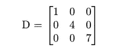
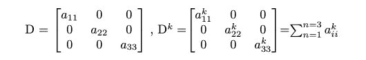
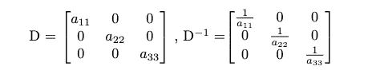
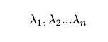
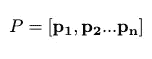
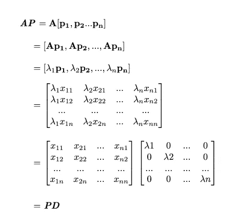
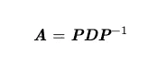
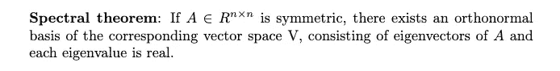
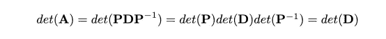
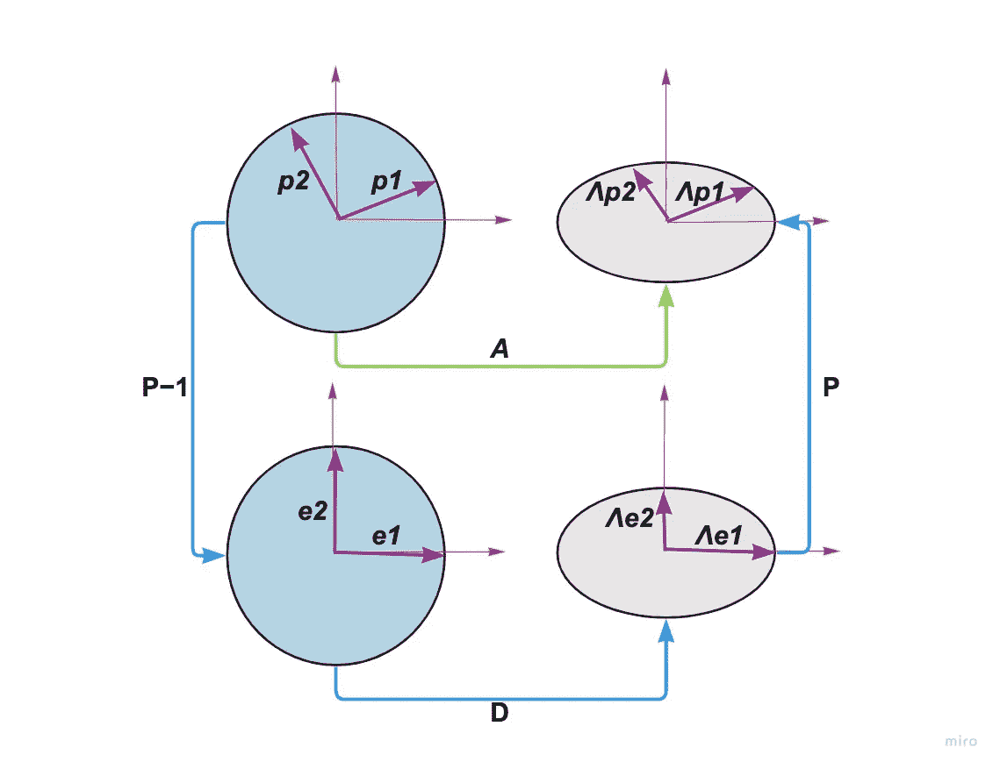

# 特征分解

> 原文：<https://medium.com/mlearning-ai/eigendecomposition-2f04ce896e6f?source=collection_archive---------6----------------------->

线性代数中的概念是特征分解，它是一类称为谱方法的机器学习算法的基础，如主成分分析(PCA)和多维标度(MDS)。它使我们能够提取表征线性映射的有意义的信息。但是这到底是如何工作的，它如何帮助我们，这是我在这篇文章中想要回答的问题:)

在阅读这篇文章之前，确保你熟悉线性代数中的这些概念:

*   [矩阵的行列式](https://en.wikipedia.org/wiki/Determinant)
*   [矩阵的逆矩阵](https://en.wikipedia.org/wiki/Invertible_matrix)
*   [矩阵的特征向量和特征值](https://en.wikipedia.org/wiki/Eigenvalues_and_eigenvectors)
*   [向量空间的基础](https://en.wikipedia.org/wiki/Basis_(linear_algebra))

首先，让我们回忆一下对角矩阵这个术语。它是在所有非对角线元素上具有零值的矩阵。例如:

关于对角矩阵有趣的事情是，它们允许快速计算行列式、幂和逆矩阵。

calculating the power of a diagonal matrix

calculating the inverse of a diagonal matrix

*备注*:如果对角线上的所有元素都是非零值，则对角矩阵的逆矩阵存在，因为否则，行列式将为零。

由于对角矩阵的适当特征，如果可能的话，我们感兴趣的是将矩阵分解成对角形式。这就是特征分解的由来。

假设***A***(n×n 矩阵)具有非退化或不同的特征值:

它们是矩阵 D 的对角元素:

相应的特征向量表示为:

然后:

这导致矩阵 A 的相似性分解:

一个方阵*的分解总是可能的，只要 ***P*** 也是一个方阵。是因为如果 ***P*** 不是一个**方**矩阵，它就没有一个*逆*。这就是所谓的**特征分解**定理。此外，如果矩阵 ***A*** 是对称的，则 ***P*** 的列是正交向量。这直接来自于**谱**T42 定理的说法:*

**

*将矩阵变为对角形式是基变换的应用。新基由初始矩阵的特征向量组成。谱定理指出，在对称矩阵的情况下，我们总能找到这样一个基，它也是**正交的**。*

*有了这个表格，我们就可以高效地计算出矩阵**T3A**的矩阵幂:*

**

*我们已经看到，计算对角矩阵的幂是很容易的。计算矩阵的行列式*同理:**

****

## **特征分解背后的直觉**

**设 A 是某个线性映射相对于标准基的变换矩阵。P-1 表示从标准基到特征基的基变化。矩阵 D 然后通过特征值对特征向量进行缩放。最后，P 将向量转换回标准基坐标。下图对此进行了说明:**

****

## **应用**

**矩阵分解是线性代数中的一个重要概念。它允许我们用不同的基来表示矩阵，并把它们分解成有意义的部分。**

**如开头所述，分解包括统计数据分析的经典方法，例如:**

*   ****主成分分析****
*   ****费希尔判别分析****
*   ****多维标度(MDS)****

**我将在以后的文章中深入研究 PCA。然而，重要的是要注意，特征分解仅用于方阵。可以应用于非方阵的更一般的矩阵分解方法是**奇异值分解(SVD)** ，这将在我的下一篇文章*中讨论，我也将使用 SVD 进行图像压缩，并展示它的一些应用。***

***希望你清楚地理解特征分解是如何工作的，你将继续关注未来的帖子。***

*** [## Mlearning.ai 提交建议

### 如何成为 Mlearning.ai 上的作家

medium.com](/mlearning-ai/mlearning-ai-submission-suggestions-b51e2b130bfb)***