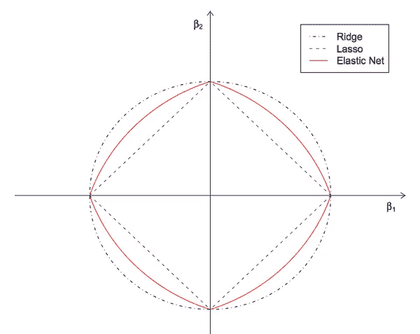
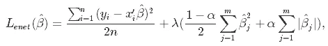

# Python 中的 ElasticNet 回归基础和建模

> 原文：<https://medium.com/mlearning-ai/elasticnet-regression-fundamentals-and-modeling-in-python-8668f3c2e39e?source=collection_archive---------1----------------------->

在这篇博文中，我将首先尝试解释 ElasticNet 回归的基础知识。然后，我们将通过 Python 使用数据集构建模型。最后，我们将通过计算均方差来评估模型。让我们一步一步开始吧。

Resource: [https://www.oreilly.com/library/view/machine-learning-with/9781787121515/5c5ec380-d139-49a5-99b1-3ce32ae5bd6f.xhtml](https://www.oreilly.com/library/view/machine-learning-with/9781787121515/5c5ec380-d139-49a5-99b1-3ce32ae5bd6f.xhtml)

# 什么是 ElasticNet 回归？

ElasticNet 回归的主要目的是通过对这些系数应用惩罚来找到最小化误差平方和的系数。ElasticNet 结合了 L1 和 L2(套索和山脊)方法。因此，它执行更有效的平滑过程。在另一个来源中，它被定义如下:

> 弹性网最早出现是由于对 Lasso 的批评，其变量选择可能过于依赖数据，因此不稳定。解决方案是结合岭回归和套索的惩罚，以获得两全其美。

## ElasticNet 回归的特征

*   它结合了 L1 和 L2 的方法。
*   它执行更有效的正则化过程。
*   它有两个参数需要设置， *λ* 和 *α。*

> 弹性网方法改进了 lasso 的局限性，即 lasso 只对高维数据进行少量采样，弹性网程序提供了“n”个变量，直至饱和。在变量是高度相关组的情况下，lasso 倾向于从这些组中选择一个变量，而完全忽略其余的变量。

Differences between L1, L2, and L1+L2 Norm

# 弹性网络回归模型

弹性网络旨在最小化以下损失函数:

ElasticNet Mathematical Model

数学模型中使用的术语与岭和套索回归中的术语相同。这就是为什么我不会回到这里。你可以从我下面分享的文章中回顾一下关于数学模型的解释。

[岭回归](https://keremkargin.medium.com/ridge-regression-fundamentals-and-modeling-in-python-bb56f4301f62)

[拉索回归](https://keremkargin.medium.com/lasso-regression-fundamentals-and-modeling-in-python-ad8251a636cd)

# 用 Python 建模

现在让我们在一个样本数据集上建立一个`ElasticNet Regression`模型。然后让我们计算模型的平方根，这将给出模型误差。

首先，我们照常导入建模所需的库。

然后我们做数据读取和一些数据编辑操作。

通过 ElasticNet 回归，我们在训练集上建立了模型。

*我不会深入概念细节，例如什么是 fit，什么是列车组。*

根据我们拥有的数据集中的变量，我们发现 ElasticNet 模型中的可变系数如下。

我们发现 ElasticNet 回归模型的常数为 **-6，46** ，函数如下。

## 预言；预测；预告

现在让我们在不指定任何参数的正常条件下进行模型预测。我们可以看到列车组模型预测的前 10 个观察值，如下所示。

同样，我们可以看到测试集的模型预测的前 10 个观察值如下。

然后，我们将在测试集上预测的值保存在一个名为 y_pred 的集群中。作为下面计算的结果，我们发现 RMSE 值为 **357，16** 。

结果，我们发现 R 平方得分为 0，41。R 平方得分是自变量解释的因变量变化的百分比。

换句话说，我们可以说 ElasticNet 回归模型中的自变量解释了该数据集因变量变化的 41.07%。

**什么是 R 平方？**

> r 平方(R2)是一种统计测量方法，表示由回归模型中的一个或多个自变量解释的因变量方差的比例。相关性解释了自变量和因变量之间的关系强度，而 R 平方解释了一个变量的方差在多大程度上解释了第二个变量的方差。因此，如果模型的 R2 是 0.50，那么大约一半的观察到的变化可以用模型的输入来解释。

## 模型调整

在本节中，我们将使用 ElasticNetCV 方法进行运算，以找到最佳的 lambda 值。

相应地，我们发现阿尔法值为 **5230，76** 。

然后，我们可以找到用 ElasticNetCV 建立的模型的常数，如下所示。

我们可以找到用 ElasticNetCV 建立的模型的变量的系数如下。

然后，我们用这个最佳 alpha 值重建调整后的 ElasticNet 模型。然后，我们将测试集中的预测值打印到 y_pred 中。结果，我们发现 RMSE 值为 **394，15。**

# 最后

首先，我们在这篇博文中研究了什么是 ElasticNet 回归。然后我们谈到了 ElasticNet 回归的特性和基础。数学上，我们检查了这个算法的模型。然后在当前条件下建立模型，计算误差值。在模型调整部分，我们通过用 ElasticNetCV 计算最佳α值并根据该α值重建校正模型来计算校正误差值。

# 资源

1.  [https://www . data camp . com/community/tutorials/tutorial-ridge-lasso-elastic-net？UTM _ source = AdWords _ PPC&UTM _ campaignid = 1455363063&UTM _ adgroupid = 65083631748&UTM _ device = c&UTM _ keyword =&UTM _ match type = b&UTM _ network = g&UTM _ adpossion =&UTM _ creative = 27843377095](https://www.datacamp.com/community/tutorials/tutorial-ridge-lasso-elastic-net?utm_source=adwords_ppc&utm_campaignid=1455363063&utm_adgroupid=65083631748&utm_device=c&utm_keyword=&utm_matchtype=b&utm_network=g&utm_adpostion=&utm_creative=278443377095&utm_targetid=aud-299261629574:dsa-429603003980&utm_loc_interest_ms=&utm_loc_physical_ms=1012782&gclid=CjwKCAjwm7mEBhBsEiwA_of-TEfkgJzJgtfZDPfFBSf07sCnxj3oL40GlgMm4-JqD57-oQw7aKyOeBoCOd4QAvD_BwE)
2.  [https://towards data science . com/ridge-lasso-and-elastic net-regression-B1 F9 c 00 ea 3a 3](https://towardsdatascience.com/ridge-lasso-and-elasticnet-regression-b1f9c00ea3a3)
3.  [https://hacker noon . com/an-introduction-to-ridge-lasso-and-elastic-net-regression-CCA 60 B4 b 934 f](https://hackernoon.com/an-introduction-to-ridge-lasso-and-elastic-net-regression-cca60b4b934f)
4.  [https://www . geeks forgeeks . org/elastic-net-regression-in-r-programming/](https://www.geeksforgeeks.org/elastic-net-regression-in-r-programming/)
5.  [https://corporatefinanceinstitute . com/resources/knowledge/other/elastic-net/](https://corporatefinanceinstitute.com/resources/knowledge/other/elastic-net/)
6.  [https://towards data science . com/from-linear-regression-to-ridge-regression-the-lasso-and-the-elastic-net-4 EAE caf 5 F7 e 6](https://towardsdatascience.com/from-linear-regression-to-ridge-regression-the-lasso-and-the-elastic-net-4eaecaf5f7e6)