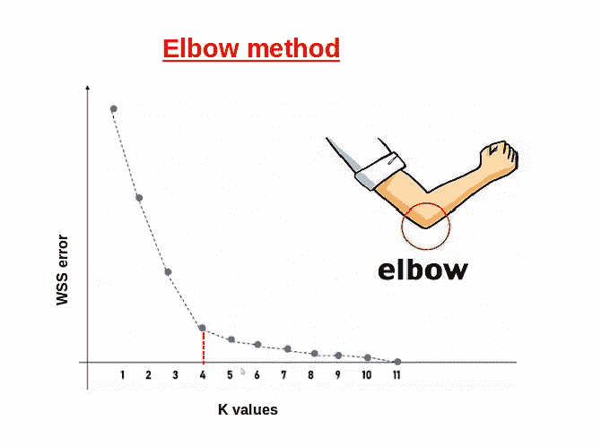
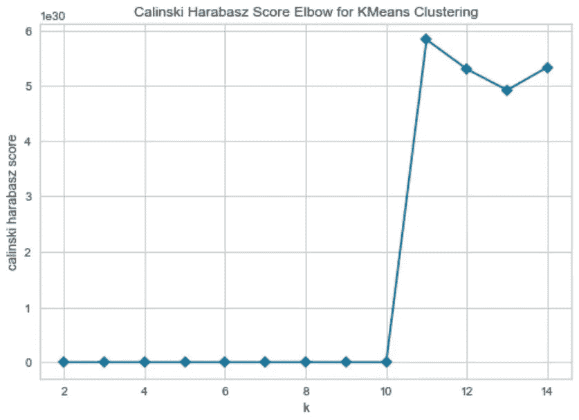
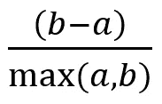

# 肘形法与剪影系数在确定聚类数中的比较

> 原文：<https://medium.com/mlearning-ai/elbow-method-vs-silhouette-co-efficient-in-determining-the-number-of-clusters-33baff2fbeee?source=collection_archive---------1----------------------->

在这篇文章中，我将讨论 k-means 聚类中计算聚类数的最佳方法。K-means 聚类算法有一个称为“K”的特定参数，用于检测聚类数。其他算法，例如，分级聚类、DBSCAN(基于密度的带噪声应用的空间聚类)、OPTICS(用于识别聚类结构的排序点)不需要参数“K ”,因为这些不是基于质心的算法。[1]

有几种方法可以计算出不同工作方式的集群数量。今天我来讨论肘法和廓形系数，并进行比较。

我将使用来自 UCI 知识库的聚类示例数据集来讨论整个过程。

首先，我们需要预处理数据集。

```
**#import libraries**
import pandas as pd
from sklearn.model_selection import train_test_split
from sklearn.preprocessing import LabelEncoder**#Importing the dataset**
dataset = pd.read_csv('Live.csv')
dataset=dataset.drop(['Column1','Column2','Column3','Column4'],axis=1)**#Label Encoding**
lb_make = LabelEncoder()
dataset['status_type']=lb_make.fit_transform(dataset['status_type'])lb_2 = LabelEncoder()
dataset['status_published']=lb_2.fit_transform(dataset['status_published'])X = dataset.values**#Splitting the dataset into the Training set and Test set**
X_train, X_test = train_test_split(X,test_size = 0.2, random_state = 0)
```

如果你对数据预处理不熟悉，可以看看这个[数据预处理](https://www.upgrad.com/blog/data-preprocessing-in-machine-learning/)

## **肘法:**

肘法的概念来自于手臂的结构。但是，根据参数“metric”的值，elbow 方法的结构可能会改变。首先，k-means 聚类算法应用于 k 个聚类(我使用 k = 2 到 15)的数据集，以在未标记的数据中找到数据中的组。[2]

之后，根据参数“metric”计算平均分数。度量参数的默认值是“失真”,它计算距指定质心的平方距离的总和。[3]

当绘制“扭曲”值的图形时，它给出了显示肘部的手臂结构，并表示簇的数量，如图 1 所示。



Figure 1: Elbow method with metric parameter ‘distortion’ (Image from google)

然而，我使用了这个“度量”参数的另一个值，称为“calinski_harabasz”。该参数计算簇之间和簇内的散射比率[3],给出了比其他参数更好的假设。对于此参数，肘部的结构看起来颠倒了。

最后，使用 yellowbrick visualizer [3]将平均分绘制在图表上(k 与 calinski_harabasz 平均分)，如图 2 所示。

```
**#Kmeans Clustering**range_n_clusters = [2, 3, 4, 5, 6, 7, 8, 9, 10, 11, 12, 13, 14, 15]for n_clusters in range_n_clusters:
    **#Initializing the clusterer with n_clusters value and a random   generator**
    clusterer = KMeans(n_clusters=n_clusters, random_state=10)
    cluster_labels = clusterer.fit_predict(X_train) **#Using Elbow Plot**
    visualizer= KElbowVisualizer(clusterer,k=(2,15),
    metric  ='calinski_harabasz',locate_elbow=False, timings= False) **#Fitting the data to the visualizer**
    visualizer.fit(X_train)**#Render the figure**
    visualizer.show() 
```

从图 2 可以看出，肘部指向 k = 11。因此，可以说对于这种方法，最佳聚类的数量是 11。



Figure 2: Elbow plot using metric parameter ‘Calinski _Harabasz’

## **剪影评分法**

轮廓图显示一个测量值，范围为[-1，1]其中[4]，

**+1:这意味着集群被清楚地区分**

**0:这意味着集群本质上是中性的，无法正确区分**

**-1:这意味着聚类分配方式错误**

现在让我们看看，这个轮廓分数是如何计算的，

单一轮廓系数的公式为:



其中，a =平均聚类内距离，b =平均最近聚类距离

在计算每个轮廓系数之后，已经计算了位于[-1，+1]范围内的平均分数。这个平均轮廓分数定义了最佳聚类的数量。

让我们深入研究代码，

```
**#import libraries**
from sklearn.metrics import silhouette_score
from yellowbrick.cluster import SilhouetteVisualizer**#Kmeans Clustering**range_n_clusters = [2, 3, 4, 5, 6, 7, 8, 9, 10, 11, 12, 13, 14, 15]for n_clusters in range_n_clusters:
    **#Initializing the clusterer with n_clusters value and a random   generator** clusterer = KMeans(n_clusters=n_clusters, random_state=10)
    cluster_labels = clusterer.fit_predict(X_train) **#The silhouette_score gives the average value for all the   samples.
    #Calculating number of clusters**
    silhouette_avg = silhouette_score(X_train, cluster_labels)
    print("For n_clusters =", n_clusters,"The average   silhoutte_score is :", silhouette_avg **#Using Silhouette Plot** visualizer = SilhouetteVisualizer(clusterer,colors =  'yellowbrick') **#Fit the data to the visualizer**
    visualizer.fit(X_train) **#Render the figure**
    visualizer.show()
```

**输出:**

```
For n_clusters = 2 The average silhouette_score is : 0.9419743880621418For n_clusters = 3 The average silhouette_score is : 0.8925568467675032For n_clusters = 4 The average silhouette_score is : 0.8854468255579183For n_clusters = 5 The average silhouette_score is : 0.8859344049988384For n_clusters = 6 The average silhouette_score is : 0.896222949688388For n_clusters = 7 The average silhouette_score is : 0.9531228433846561For n_clusters = 8 The average silhouette_score is : 0.9882303235394505For n_clusters = 9 The average silhouette_score is : 0.9942722572401562For n_clusters = 10 The average silhouette_score is : 0.9860105575225317**For n_clusters = 11 The average silhouette_score is : 0.9999999922837097**For n_clusters = 12 The average silhouette_score is : 0.906560275971653For n_clusters = 13 The average silhouette_score is : 0.6440635368489311For n_clusters = 14 The average silhouette_score is : 0.7165267612201155For n_clusters = 15 The average silhouette_score is : 0.6440635368489311
```

从上面的输出可以看出，对于集群 11 的数量，得到了最高的轮廓分数。然而，在图 3 中，我绘制了 12 个聚类的轮廓得分图，因为在跨越 n_clusters = 12 之后，轮廓得分开始下降，这意味着聚类被以错误的方式分配。因为我们知道轮廓分数越高，达到最佳值的机会就越高，所以可以说可能的聚类数应该是 11。

现在我们来讨论一下哪种方法更合适。

然而，我们应该始终记住，如果数据不是非常聚类，肘方法就不能很好地工作。如果你没有看到一个倾斜的图表，那么你将无法找到集群的数量[3]。此外，倾斜图并不总是给出正确的答案。如果有许多重复的数据，那么肘方法可能不会给出正确的输出。在重叠数据的情况下，轮廓系数工作得更好，因为它识别重复的数据。

另一方面，在轮廓分数的情况下，定义聚类的数量不取决于图形的偏斜程度。这取决于剪影分数，它越接近+1，成为最佳剪影的机会就越大。

因此，可以说肘方法的功效取决于数据集的性质。如果相关数据集的模式是有利的，那么肘方法工作良好。另一方面，轮廓分数不依赖于数据集的性质。因为剪影是一种基于距离的方法，所以使用类内对象和最近的类之间的平均距离来找出剪影分数。

然而，在唯一的情况下，当只有一个聚类时，轮廓分数不起作用，因为轮廓分数要求最少 2 个聚类或更多[5]。此外，可以简单地说，如果数据集中只有一个聚类，则该数据集不适合聚类。

总之，可以说，考虑到更高的准确性，得到一个清晰的集群剪影系数的方法是更合适的。然而，在训练集中不包含重复数据的简单且无噪声的数据集的情况下，肘方法将工作良好。

**参考**

[1]维基百科贡献者。(2021 年 2 月 8 日)。*确定数据集中的聚类数*. Wikipedia . https://en . Wikipedia . org/wiki/Determining _ the _ number _ of _ clusters _ in _ a _ data _ set

[2] *fw_error_www* 。(未注明)。甲骨文。[https://blogs . Oracle . com/data science/introduction-to-k-means-clustering](https://blogs.oracle.com/datascience/introduction-to-k-means-clustering)

[3] *弯头法—黄砖 v1.3.post1 文档*。(未注明)。黄砖。[https://www.scikit-yb.org/en/latest/api/cluster/elbow.html](https://www.scikit-yb.org/en/latest/api/cluster/elbow.html)

[4] Bhardwaj，A. (2020 年 5 月 28 日)。*剪影系数——走向数据科学*。中等。[https://towards data science . com/silhouette-coefficient-validating-clustering-techniques-e 976 bb 81d 10c](https://towardsdatascience.com/silhouette-coefficient-validating-clustering-techniques-e976bb81d10c)

[5]*sk learn . metrics . silhouette _ score—sci kit-learn 0 . 24 . 1 文档*。(未注明)。Scikit-Learn.Org。[https://scikit learn . org/stable/modules/generated/sk learn . metrics . silhouette _ score . html](https://scikitlearn.org/stable/modules/generated/sklearn.metrics.silhouette_score.html)