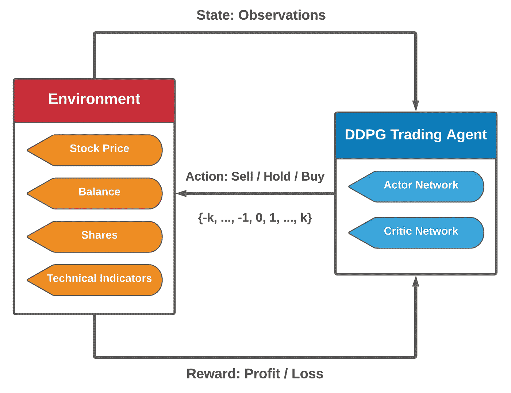
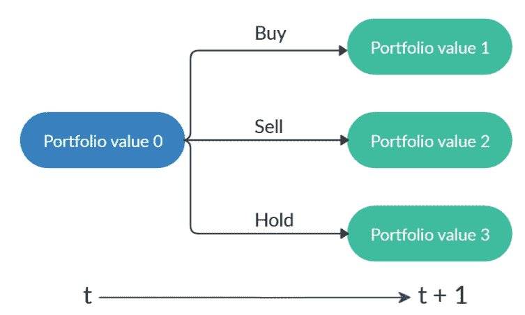
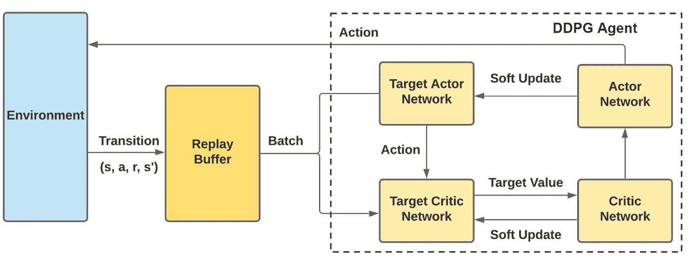
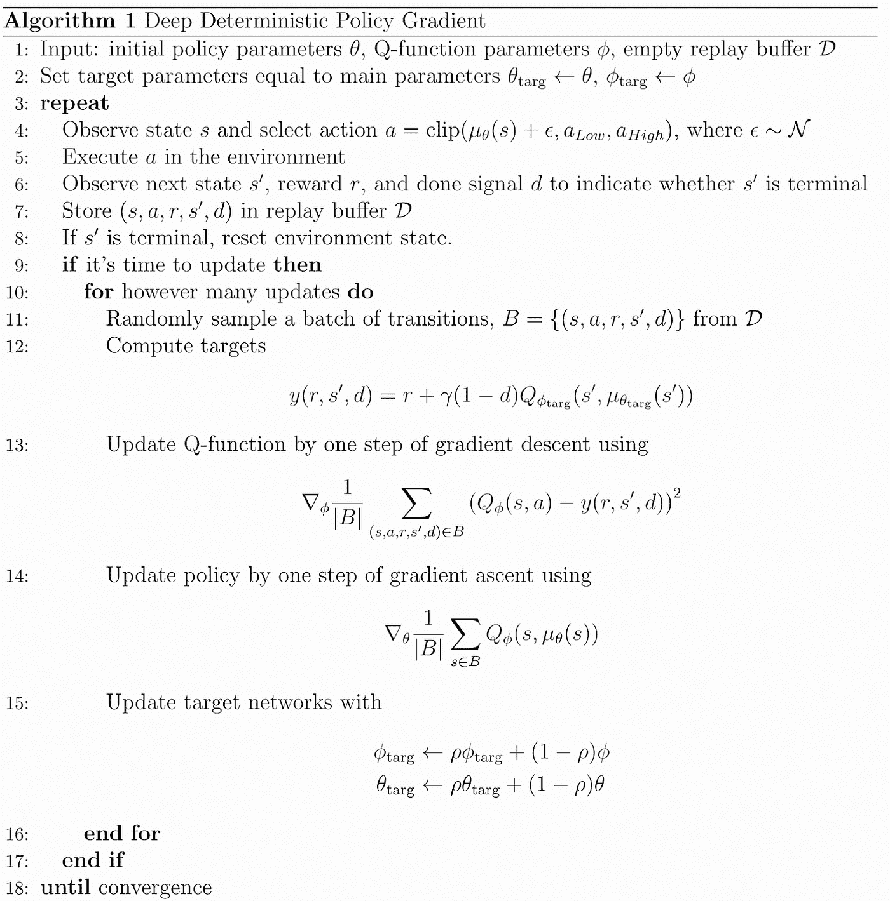

# ElegantRL 演示:使用 DDPG 进行股票交易(第一部分)

> 原文：<https://medium.com/mlearning-ai/elegantrl-demo-stock-trading-using-ddpg-part-i-e77d7dc9d208?source=collection_archive---------2----------------------->

深度确定性策略梯度算法教程(DDPG)

由 Steven Li、[、](https://twitter.com/XiaoYangLiu10)和 Zeng 撰写的这篇文章描述了在 ElegantRL 中使用深度确定性策略梯度(DDPG)算法实现一个股票交易应用程序[1]。股票交易在投资中起着至关重要的作用，开发一个能够在动态的股票市场中获利的自动化代理是一个挑战。为了展示 ElegantRL 的出色表现，我们展示了如何训练一个有效的交易代理。

请查看 ElegantRL 库的介绍性[文章](https://towardsdatascience.com/elegantrl-a-lightweight-and-stable-deep-reinforcement-learning-library-95cef5f3460b)和【1】的[媒体博客](https://towardsdatascience.com/elegantrl-a-lightweight-and-stable-deep-reinforcement-learning-library-95cef5f3460b)。

在第一部分的**中，我们将讨论结合股票交易任务的问题公式的 DDPG 算法。在**第二部分**中，我们将讨论该应用的实现细节及其易于定制的特性。这篇文章之后，你可能会设计自己的股票交易代理，并开始赚钱！**

# **股票交易任务**

股票交易被认为是机器学习中最热门的话题之一，因为一个有利可图的人工智能代理对几乎每个人来说都是不可抗拒的。使用智能交易代理自动操纵股票账户，你唯一需要做的就是打开投资组合，躺在沙发上，数美元。

Figure 1\. The bunny counts the money. [Image from the [link](https://tenor.com/view/bugs-bunny-looney-tunes-cash-money-counting-money-gif-17544086)].

深度强化学习(DRL)已经证明了它在交易领域的能力。在这篇文章中，我们的目标是展示一个受过股票市场数据训练的 DDPG 经纪人可以在回溯测试中获利。

# **问题表述**

DRL 方法有两个核心组成部分:**交易代理**和**环境**。交易代理和市场环境之间的相互作用如图 2 所示:

1.  代理观察市场环境的当前状态。
2.  在当前状态下，代理根据其策略进行操作。
3.  环境基于动作和状态转换向前迈出一步，即转换，然后产生奖励。
4.  代理收到奖励，并使用转换来更新其策略。

Figure 2\. Overview of stock trading using a DRL agent. [Image by authors].

形式上，我们将股票交易建模为马尔可夫决策过程(MDP)，并将交易目标表述为期望回报的最大化:

*   state*s*=【b，**p， ***h*** :一个向量，包含余额 b，股票价格 ***p*** ，股票份额 ***h*** 。 ***p*** 和***是维度为 *D* 的向量，其中 *D* 表示股票的数量。*
*   *动作 ***a*** :对 *D* 股票的动作向量。每只股票允许的操作包括*卖出*、*买入*或*持有*，分别导致*中股票份额的减少、增加或不变。**
*   **奖励 *r* ( *s，* ***a*** *，s’*):采取行动 ***a*** 处于状态 *s* 到达新状态*s’*的资产价值变化。**
*   **策略π( *s* ):状态 *s* 的交易策略，是状态 *s* 的行动概率分布。**
*   **Q-函数 *Q* ( *s* ， ***a*** ):采取行动 ***a*** 在状态 *s* 下的预期收益(报酬)遵循政策π。**
*   **状态转换:在采取动作*后，股票数量*被修改，如图 3 所示，新的投资组合是余额和股票总价值的总和。****

******

***Figure 3\. State transition. A starting portfolio value with three actions results in three possible portfolios. Note that “hold” may lead to different portfolio values due to the changing stock prices. [Image from [2]].***

# *****我们为什么选择 DDPG 算法？*****

***深度确定性策略梯度(DDPG)算法[3]是行动者-批评家框架下的无模型非策略算法，它可以被认为是深度 Q 网络(DQN)和策略梯度的结合。我们选择 DDPG 算法的主要原因如下:***

*   ***与其他先进的(SOTA)算法相比，它非常简单，是 ElegantRL 中 DRL 算法的一个很好的例子。由于简单，用户可以更专注于股票交易策略，并从回测中选择最佳算法。***
*   ***与 DQN 不同，它能够处理连续的而不是离散的状态和动作空间，因此可以交易大量股票。***

***至此，人们可能会问一个问题:**为什么要用连续动作空间进行股票交易？*****

***我们首先定义一个股票交易例子的状态空间和动作空间，假设我们的投资组合总共有 30 只股票:***

*   *****状态空间**:我们用一个由七部分信息组成的 181 维向量来表示多只股票交易环境的状态空间:[b， ***p*** ， ***h*** ， ***M*** ， ***R*** ， ***C*** ， ***X*** ] ***h*** 为股数， ***M*** 为均线收敛发散(MACD)， ***R*** 为相对强弱指数(RSI)， ***C*** 为商品通道指数(CCI)， ***X*** 为平均方向性指数(ADX)。***
*   ****行动空间**:概括一下，我们有三种类型的行动:*卖出*、*买入*和*持有*一只股票。我们用负值表示卖出，正值表示买入，零表示持有。在这种情况下，动作空间定义为{- *k* ，…，-1，0，1，…, *k* }，其中 *k* 为每笔交易中买入或卖出的最大份额。**

**回到问题，我们交易的股票数量是整数，我们卖出、买入或持有的股票数量也是整数。直观上，股票交易的动作空间更可能是离散的，而不是连续的。然而，动作空间的复杂性随着股票数量 d 成指数增长。**

**例如，对于 5 支股票，假设代理被允许在每笔交易中卖出、买入或持有多达 50 支股票。在这种情况下，动作空间是(50+50+1)⁵，大约是 10 ⁰.如果我们将股票数量从 5 个增加到 30 个，那么 10⁶⁰.的行动空间就增加了由于如此大的动作空间几乎不可能离散地表示出来，所以我们假设股票交易的动作空间是连续的。**

**除了 DDPG 处理连续空间，它还有以下优点:**

*   **演员-评论家框架:DDPG 遵循标准的演员-评论家框架，它包含一个产生行动的演员网络和一个估计预期回报的评论家网络。这样的标准框架对于初学者来说入门是很清楚的。**
*   **熟悉招数的可重用性 : DDPG 运用了很多已经在 DQN 使用的招数，比如经验回放，冻结目标网络，探索噪音。在这种情况下，DDPG 的元素很容易理解。**

# ****算法细节和伪代码:****

**DDPG 算法[3]可以分为四个部分:**

*   ****初始化**:初始化变量和网络。**
*   ****采样**:通过行动者网络(策略)与环境的交互获得变迁。**
*   ****计算**:计算相关变量，如目标 Q 值。**
*   ****更新**:基于损失函数更新演员和评论家网络。**

****

**Figure 4\. Overview of the DDPG algorithm. [Image by authors].**

****初始化:****

1.  **我们初始化演员和评论家(Q 函数)网络。Actor network 对每只股票采取行动，决定买入、卖出或持有的股票数量。批评家网络从当前的状态和行动中估计期望的回报。**
2.  **我们为作为目标网络的每个网络制作一个副本。**

****采样:****

1.  **给定状态，我们使用 Actor 网络输出相应的动作。**
2.  **我们坚定地跟随行动，并修改我们对每只股票的持股数量，以使股市环境向前迈进。**
3.  **我们观察我们账户的资产价值变化(余额和股票的总价值)，然后计算报酬。**
4.  **我们将转换(s，a，s’，r)存储到重放缓冲器中，用于将来的训练。**

****计算:****

1.  **我们从重放缓冲区随机抽取一批样本。**
2.  **我们计算目标值，用于最小化均方贝尔曼误差(MSBE)。**

****更新:****

1.  **我们用目标值在 MSBE 上使用梯度下降来更新 Critic 网络。**
2.  **我们使用梯度上升来更新行动者网络，以找到使回报最大化的行动策略。**
3.  **演员目标网络和评论家目标网络通过软更新来同步。**

****

**Figure 5\. The pseudocode of the DDPG algorithm. [Image from [4]].**

**股票市场环境的详细实施、培训流程的实现以及绩效评估将很快在**第二部分中提供。**感兴趣的用户可以在 FinRL 中测试 [Jupyter 笔记本](https://github.com/AI4Finance-LLC/FinRL-Library/blob/master/FinRL_stock_trading_NeurIPS_2018.ipynb)，我们将很快在 ElegantRL 中提供类似的。**

# ****参考文献:****

**[1] Z .熊，，s .钟，杨红阳，a .瓦利德.[股票交易实用深度强化学习方法](https://arxiv.org/abs/1811.07522)。NeurIPS 关于人工智能在金融服务中的挑战和机遇的研讨会:公平性、可解释性、准确性和隐私的影响，2018 年。**

**[2] H .杨，(合初级)，s .钟，a .瓦利德.[自动化股票交易的深度强化学习:一种集成策略](https://papers.ssrn.com/sol3/papers.cfm?abstract_id=3690996)。2020 年 ACM 金融人工智能国际会议。**

**[3]利利拉普、T.P .、亨特、J.J .、普里策尔、a .、赫斯、n .、埃雷兹、塔萨、y .、西尔弗和维斯特拉..[深度强化学习的连续控制](https://arxiv.org/abs/1509.02971)。ICLR 2016。**

**[4] OpenAI 在深度 RL 中旋转起来，[深度确定性政策梯度](https://spinningup.openai.com/en/latest/algorithms/ddpg.html#id1)。**

** [## Mlearning.ai 提交建议

### 如何成为 Mlearning.ai 上的作家

medium.com](/mlearning-ai/mlearning-ai-submission-suggestions-b51e2b130bfb) 

🟠 [**成为 ML 作家**](/mlearning-ai/mlearning-ai-submission-suggestions-b51e2b130bfb)**