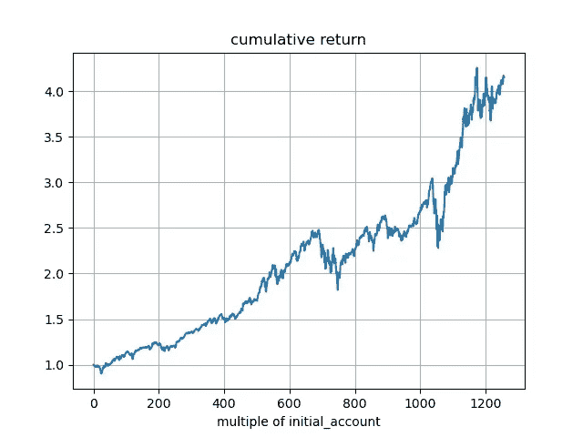
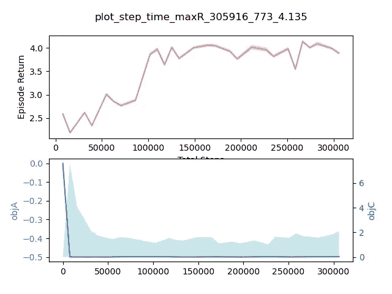

# ElegantRL 演示:使用 DDPG 进行股票交易(第二部分)

> 原文：<https://medium.com/mlearning-ai/elegantrl-demo-stock-trading-using-ddpg-part-ii-d3d97e01999f?source=collection_archive---------0----------------------->

深度确定性策略梯度算法教程(DDPG)

本文由 Steven Li、[、](https://twitter.com/XiaoYangLiu10)和 Zeng 在 [ElegantRL](https://towardsdatascience.com/elegantrl-a-lightweight-and-stable-deep-reinforcement-learning-library-95cef5f3460b) 中描述了一个使用深度确定性策略梯度(DDPG)的股票交易应用。有两个主要部分，股票交易环境和训练回溯测试过程。在股票交易环境中，我们解释了健身房风格的股票交易环境及其易于定制的特性。在训练-回测过程中，我们描述了 ElegantRL 中交易代理的训练过程及其技巧，以及评估其性能的回测过程。

请查看[介绍文章](https://towardsdatascience.com/elegantrl-a-lightweight-and-stable-deep-reinforcement-learning-library-95cef5f3460b)以了解 ElegantRL 库的概述，以及 [ElegantRL 演示:使用股票交易应用程序和 DDPG 算法的 DDPG(第一部分)](/mlearning-ai/elegantrl-demo-stock-trading-using-ddpg-part-i-e77d7dc9d208)进行股票交易。

# **股票交易环境**

该环境是按照 OpenAI gym 风格设计的，被认为是强化学习环境的标准实现。环境分为三个部分，每个部分是一个功能:

*   **初始化**:预处理来自雅虎财经的股票数据，初始化与股票交易任务相关的变量。初始化函数创建一个新的环境，并在训练期间与代理交互。

```
**def __init__(...):
    # Download and Preprocess data**
    train_df, eval_df = self.load_stock_trading_data(start_date,   
                        start_eval_date, env_eval_date)        

    self.price_ary, self.tech_ary = self.convert_df_to_ary(df, 
                                    tech_indicator_list) **# Initialize parameters**
    stock_dim = self.price_ary.shape[1]         
    self.gamma = gamma        
    self.max_stock = max_stock        
    ...        
    self.initial_stocks = np.zeros(stock_dim, dtype=np.float32) if 
                          initial_stocks is None else initial_stocks

    **# reset()** 
    self.day = None         
    self.stocks = None        
    ...
    self.total_asset = None   

    **# environment information  **      
    self.env_name = 'StockTradingEnv-v1'        
    self.state_dim = 1 + 2 * stock_dim + self.tech_ary.shape[1]          
    self.action_dim = stock_dim        
    ...        
    self.target_return = 3.5  # 4.3 
```

*   **复位**:环境的状态和变量被复位到初始设置。一旦模拟情节停止并且需要重新开始，就调用该函数。

```
**def reset():**
    self.day = 0        
    price = self.price_ary[self.day]         
    self.stocks = self.initial_stocks + rd.randint(0, 64,    
                  size=self.initial_stocks.shape)        
    self.amount = self.initial_amount * rd.uniform(0.95, 1.05) -   
                  (self.stocks * price).sum()         
    self.total_asset = self.amount + (self.stocks * price).sum()          
    self.initial_total_asset = self.total_asset        
    self.gamma_reward = 0.0         
    state = np.hstack((self.amount * 2 ** -13,
                       price,                           
                       self.stocks,                            
                       self.tech_ary[self.day],))
            .astype(np.float32) * 2 ** -5        
    return state
```

*   **步骤**:状态从代理处采取一个动作，然后返回三件事的列表——下一个状态、奖励、当前剧集是否完成的指示。环境根据前一篇博客中的状态-动作转换计算下一个状态和奖励。代理调用 step 函数来收集转换。

```
**def step():
    # Get actions and price of the day**
    actions = (actions * self.max_stock).astype(int)
    self.day += 1
    price = self.price_ary[self.day] **# Execute the action: sell first then buy**
   ** # Sell**
    for index in np.where(actions < 0)[0]:
        if price[index] > 0:  # Sell only if current asset is > 0
            sell_num_shares = min(self.stocks[index], -
                              actions[index])
            self.stocks[index] -= sell_num_shares
            self.amount += price[index] * sell_num_shares * (1 - 
                           self.sell_cost_pct) ** # Buy**
    for index in np.where(actions > 0)[0]:  
        ... state = np.hstack((self.amount * 2 ** -13,
                       price,
                       self.stocks,
                       self.tech_ary[self.day],))
                       .astype(np.float32) * 2 ** -5 **   # Calculate reward**
    total_asset = self.amount + (self.stocks * price).sum()
    reward = (total_asset - self.total_asset) * 2 ** -14  # reward scaling
    self.total_asset = total_asset
    self.gamma_reward = self.gamma_reward * self.gamma + reward **# Check if the episode is done**
    done = self.day == self.max_step
    if done:
        reward = self.gamma_reward
        self.episode_return = total_asset / self.initial_total_asset
    return state, reward, done, dict()
```

**易于定制的环境特性**

ElegantRL 中股票交易环境最重要的特性之一是其易于定制的特性。通过将参数传递到环境中，用户能够根据特定需求定义自己的股票交易环境。一般来说，用户可以定制以下功能:

*   **initial_capital** :用户想要投入的初始资金。

```
**# The unit is in dollar**
initial_capital = 1e6
```

*   **tickers** :用户想要交易的股票。

```
**# finrl.config.NAS_74_TICKER**
tickers = ['AAPL', 'ADBE', 'ADI', 'ADP', 'ADSK', 'ALGN', 'ALXN', 'AMAT', 'AMD', 'AMGN', 'AMZN', 'ASML', 'ATVI', 'BIIB', 'BKNG',...,'SNPS', 'SWKS', 'TTWO', 'TXN', 'VRSN', 'VRTX', 'WBA', 'WDC', 'WLTW', 'XEL', 'XLNX'] 
```

*   **initial_stocks** :每只股票的初始股数，默认值为零。

```
initial_stocks = np.zeros(len(tickers), dtype=np.float32)
```

*   **buy_cost_pct，sell_cost_pct** :每笔买入或卖出交易的交易手续费。

```
buy_cost_pct = 1e-3sell_cost_pct = 1e-3
```

*   **max_stock** :用户可以定义每笔交易允许交易的最大股票数量。用户还可以设置投资每只股票的最大资金百分比。

```
max_stock = 1e2
```

*   **tech_indicator_list** :考虑的财务指标列表，用于定义*状态*。

```
**#finrl.config.TECHNICAL_INDICATORS_LIST**
tech_indicator_list = ['macd', 'boll_ub', 'boll_lb', 'rsi_30', 'cci_30', 'dx_30', 'close_30_sma', 'close_60_sma']
```

*   **start_date，start_eval_date，end_eval_date** :训练和回溯测试时间间隔。使用时间日期(或时间戳),一旦指定了训练周期，剩下的就是回溯测试。

```
start_date = '2008-03-19'start_eval_date = '2016-01-01'end_eval_date = '2021-01-01'
```

一旦用户定义了所有可定制的特性，她就可以相应地创建一个独特的交易环境。

```
env = StockTradingEnv('./envs/FinRL', gamma, max_stock, initial_capital, buy_cost_pct, sell_cost_pct, start_date, start_eval_date, end_eval_date, tickers, tech_indicator_list, initial_stocks, if_eval=False)
```

# **ElegantRL 中的培训和回溯测试流程**

## **准备:**

第一步:安装 ElegantRL 和相关的软件包

*   **优雅**
*   yfinance 的目标是通过提供一种可靠的、线程化的、Pythonic 式的方法从雅虎下载历史市场数据来解决这个问题。金融。
*   **Stockstats:** stockstats 对熊猫的继承和延伸。支持股票统计和股票指标的数据框架。

```
!pip install git+https://github.com/AI4Finance-LLC/ElegantRL.git
!pip install yfinance stockstats
```

**第二步:导入包**

```
from elegantrl.run import *
from elegantrl.agent import AgentDDPG
from elegantrl.envs.FinRL.FinRL import StockTradingEnv
import yfinance as yf
from stockstats import StockDataFrame as Sdf
```

## **培训渠道:**

**第一步:指定代理和环境**

```
**# Agent** args = Arguments(if_on_policy=True)
args.agent = AgentDDPG() **# Environment** ...
args.env = StockTradingEnv('./envs/FinRL', gamma, max_stock, initial_capital, buy_cost_pct, sell_cost_pct, start_date, start_eval_date, end_eval_date, tickers, tech_indicator_list, initial_stocks, if_eval=False)
```

**步骤 2:初始化超参数**

```
args.gamma = 0.995
args.break_step = int(2e5)
args.net_dim = 2 ** 9
...
args.if_allow_break = False
args.rollout_num = 2 # the number of rollout workers (larger is not always faster)
```

**第三步:培训和评估代理**

```
**# the training process will terminate once it reaches the target reward.**
train_and_evaluate_mp(args)
```

**回测和评估:**

```
**# Backtesting**
args = Arguments(if_on_policy=True)
args.agent = AgentDDPG()
args.env = StockTradingEnv(cwd='./', if_eval=True)
args.if_remove = False
args.cwd = './AgentDDPG/StockTradingEnv-v1_0'
args.init_before_training()**# Draw the graph**
env.draw_cumulative_return(args, torch)
```



Fig 1\. The cumulative return from the Stock Trading agent. [Image by authors].



Fig 2\. The Episode return and the learning curve. [Image by authors].

查看这个股票交易演示的 [Colab](https://github.com/AI4Finance-LLC/ElegantRL/blob/master/eRL_demo_StockTrading.ipynb) 代码。