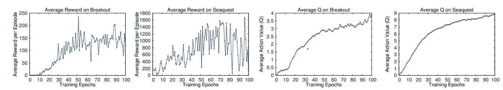
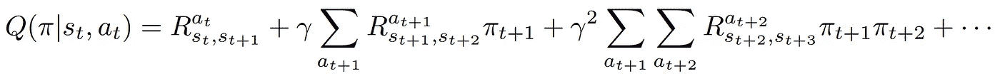
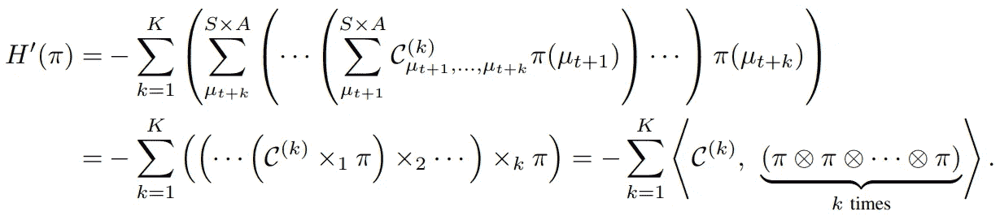
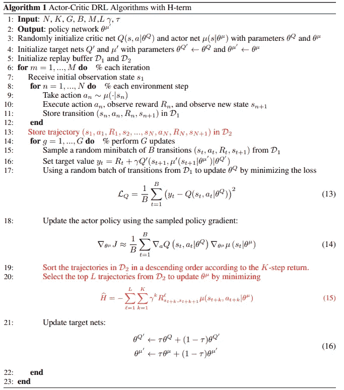
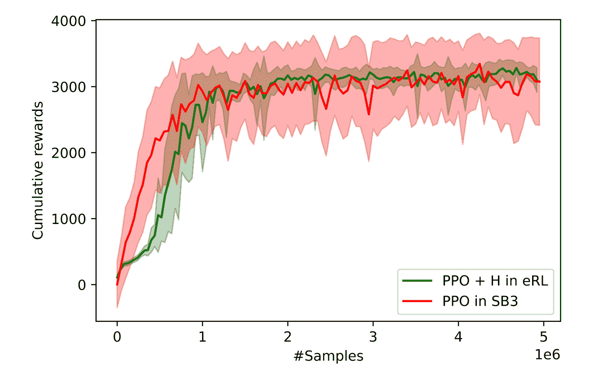
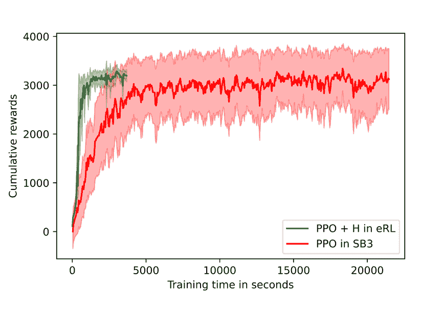

# ElegantRL:比稳定基线 3 更稳定的深度强化学习算法

> 原文：<https://medium.com/mlearning-ai/elegantrl-much-much-more-stable-than-stable-baseline3-f096533c26db?source=collection_archive---------0----------------------->

[ElegantRL](https://github.com/AI4Finance-Foundation/ElegantRL) 专为从业者开发，具有以下优势:

*   云原生:遵循云原生范式，例如， [ElegantRL-Podracer](https://arxiv.org/abs/2112.05923) 和 [FinRL-Podracer](https://arxiv.org/abs/2111.05188) 。
*   可扩展:在多个层面上充分利用 DRL 算法的并行性，使其可以轻松扩展到云平台上的数百或数千个计算节点，例如拥有数千个 GPU 的 [DGX SuperPOD 平台](https://www.nvidia.com/en-us/data-center/dgx-superpod/)。
*   轻量级:核心代码<1,000 lines (check [Elegantrl_Helloworld](https://github.com/AI4Finance-Foundation/ElegantRL/tree/master/elegantrl_helloworld) 。
*   高效:在很多测试案例中(单 GPU/多 GPU/GPU 云)，我们发现它比 [Ray RLlib](https://github.com/ray-project/ray) 更高效。
*   **稳定:比** [**稳定得多——基线 3**](https://github.com/DLR-RM/stable-baselines3)**【2】利用各种系综方法。**

这篇文章由 Steven Li，和撰写，描述了 H 项，这是 ElegantRL 的一个关键设计，它极大地提高了稳定性。

稳定性一直是深度强化学习(DRL)研究中的一个主要挑战。例如，DQN 论文[1]中的学习曲线是如此的不稳定，以至于导致了一种错觉:那些 DRL 的代理人真的在学习什么吗？

Image from [1].

> “图 2 中最左边的两幅图显示了在 Seaquest 和 Breakout 游戏的训练过程中，平均总奖励是如何变化的。这两个平均奖励图确实非常嘈杂，**给人的印象是学习算法没有取得稳定的进展**。——作者 Mnih 等人。全部。

稳定性在将 DRL 应用程序产品化以解决现实世界问题的过程中起着关键作用，这使得它成为 DRL 研究人员和实践者关注的焦点。最近，许多算法和开源软件被开发出来应对这一挑战。一个流行的开源库[稳定基线 3](https://github.com/DLR-RM/stable-baselines3)[2]提供了一组可靠的 DRL 算法实现，可以匹配先前的结果。

在本文中，我们引入了一个**哈密顿项(H-term)** [3]，这是 ElegantRL 中的一个通用附件，可以应用于现有的无模型 DRL 算法。H 项本质上是用计算能力换取稳定性。

# 我们的基本想法

在标准 RL 问题中，决策过程可以建模为马尔可夫决策过程(MDP)。贝尔曼方程给出了 MDP 问题的最优性条件:

The Bellman equation.

上述等式本身是递归的，因此我们将其展开如下:

The recursive form. Copyright by AI4Finance-Foundation.

在实践中，我们的目标是找到一个最大化 Q 值的策略。通过采用变分法，我们可以将贝尔曼方程改写成哈密顿方程。然后，我们的目标转变为找到一个最小化系统能量的策略。(详见我们的[论文](https://www.semanticscholar.org/paper/Quantum-Tensor-Networks-for-Variational-Learning-Liu-Fang/caa14bff1573192b94fe37b8803b6f788d30f472)【3】)。

The Hamiltonian Equation. Copyright by AI4Finance-Foundation.

# 一个简单的附件

(在[论文](https://www.semanticscholar.org/paper/Quantum-Tensor-Networks-for-Variational-Learning-Liu-Fang/caa14bff1573192b94fe37b8803b6f788d30f472)中)的推导和物理解释可能有点吓人，然而，H 项的实际实现超级简单。这里，我们给出了伪代码，并与演员-评论家算法进行了比较(用红色标记):

The pseudocode of Actor-Critic + H. Copyright by AI4Finance-Foundation.

如第 19–20 行所示，我们包括了策略网络的额外更新，以最小化 H 项。与大多数优化单个步骤(批量转换)的算法不同，我们强调来自轨迹(批量轨迹)的顺序信息的重要性。

事实上，优化 H 项是计算密集型的，由超参数 *L* (选定轨迹的数量)和 *K* (每个轨迹的长度)控制。幸运的是，ElegantRL 完全支持从单个 GPU 到数百个 GPU 的并行计算，这提供了用计算能力换取稳定性的机会。

# 性能赋值

目前，我们已经在几个广泛使用的 DRL 算法中实现了 H 项，包括 PPO、SAC、TD3 和 DDPG。这里，我们展示了在基准问题 [Hopper-v2](https://gym.openai.com/envs/Hopper-v2/) 上的性能。

Columative rewards vs. #samples. Copyright by AI4Finance-Foundation.

Columative rewards vs. training time. Copyright by AI4Finance-Foundation.

就方差而言，很明显 ElegantRL 大大优于稳定基线 3 [2]。8 次运行的方差要小得多。此外，ElegantRL 中的 PPO+H 完成 5M 样本的训练过程比稳定基线快约 6 倍 3 [2]。

我们正在将 H-term 作为一个通用的附加组件来实现，并将很快发布一系列的实验和演示！如果你等不及正式发布的版本，请先查看我们在 [GitHub](https://github.com/AI4Finance-Foundation/ElegantRL/blob/master/elegantrl/agents/AgentPPO_H.py) 中的 PPO+H 实现。

**参考文献**

[1] Mnih、Volodymyr、Koray Kavukcuoglu、David Silver、Alex Graves、Ioannis Antonoglou、金奎大·威斯特拉和马丁·里德米勒。“用深度强化学习玩雅达利。”ICLR 2013。

[2]拉芬、安东宁、阿什利·希尔、亚当·格里夫、安西·卡内维斯托、马克西米利安·埃内斯托斯和诺亚·多尔曼。"稳定的基线 3:可靠的强化学习实现."*机器学习研究杂志* (2021)。

[3]和方，变分强化学习的量子张量网络.机器学习中的量子张量网络研讨会。

 [## Mlearning.ai 提交建议

### 如何成为 Mlearning.ai 上的作家

medium.com](/mlearning-ai/mlearning-ai-submission-suggestions-b51e2b130bfb)