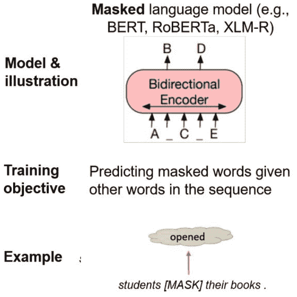
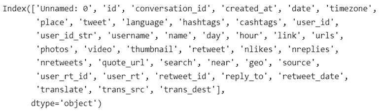
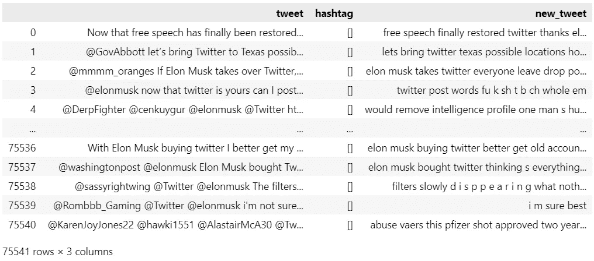
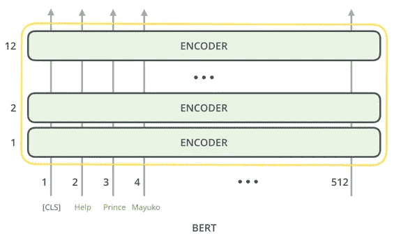
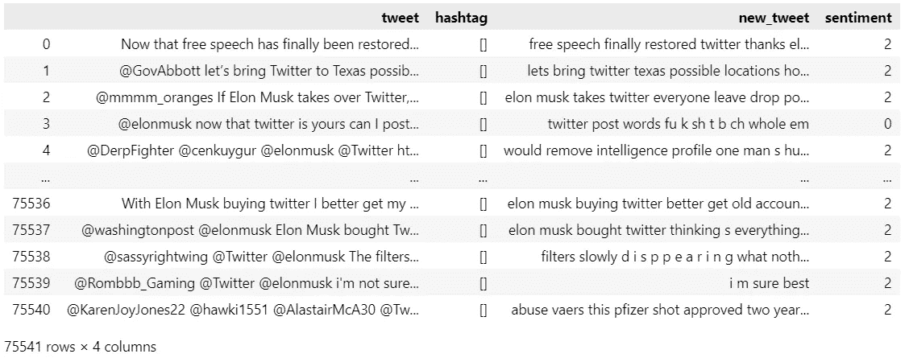
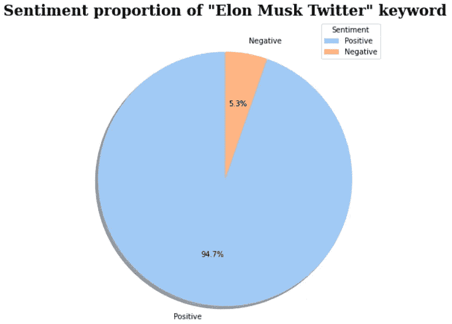
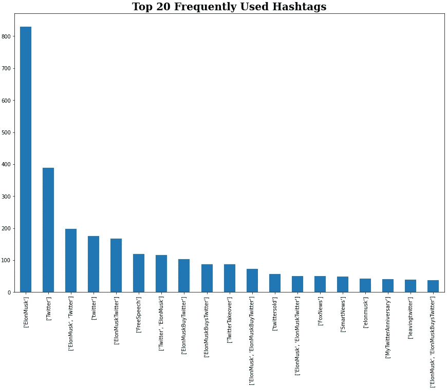
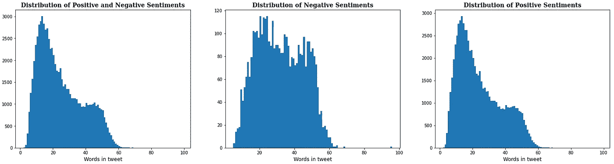
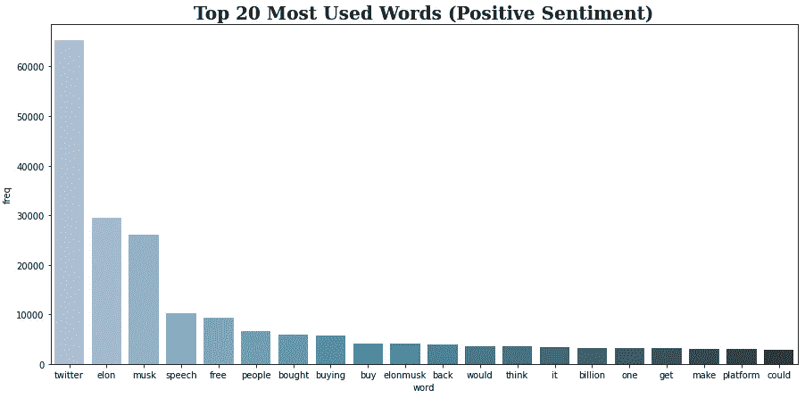
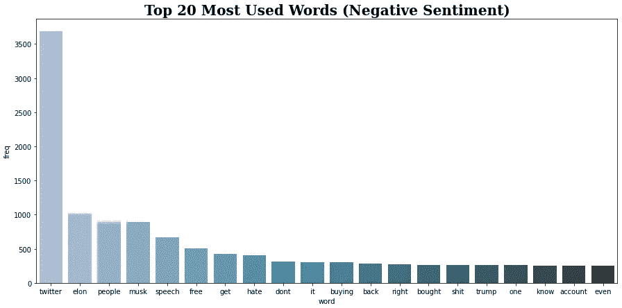

# 变形金刚拥抱脸的推特情感分析(罗伯塔)

> 原文：<https://medium.com/mlearning-ai/elon-musks-twitter-sentiment-analysis-with-transformers-hugging-face-roberta-49b9e61b1433?source=collection_archive---------0----------------------->

Photo by [Souvik Banerjee](https://unsplash.com/@rswebsols?utm_source=medium&utm_medium=referral) on [Unsplash](https://unsplash.com?utm_source=medium&utm_medium=referral)

Twitter 董事会已同意 2022 年 4 月 25 日埃隆·马斯克(Elon Musk)440 亿美元的收购要约。言论自由是他决定收购 Twitter 的原因之一。他还想用新功能来增强产品，使算法开源以增加信任，击败垃圾邮件机器人，并认证所有人[1]。在这篇文章中，我们不会深入探讨这件事的经济学角度或未来影响，而是分析公众对这条新闻的情绪。

在进入下一部分之前，我们将对 BERT 和 RoBERTa 有一个大致的了解。

# 伯特

BERT 代表来自变压器的双向编码器表示。与 XLM-R 一起，伯特和罗伯塔被归类为预训练语言模型(PLM)宇宙中的掩蔽语言模型[2]。该模型的训练目标是在给定序列中其他单词的情况下预测屏蔽单词。通过使用[MASK]令牌随机选择被屏蔽的单词，或者用随机令牌替换。模型应该返回屏蔽的令牌。

Masked Language Model architecture illustration [2]

伯特没有像 GPT 一家那样使用《变形金刚》的解码器，而是使用《变形金刚》的编码器。当学习特定记号的表示时，BERT 堆叠多个变换器的编码器，以通过使用掩蔽的自我注意在两个方向上注意序列中的所有其他记号来学习复杂的表示。RoBERTa 通过 10 倍的训练数据将 BERT 的训练前绩效提高了 2–20%。如果你有兴趣了解更多，你可以关注这个[链接](https://arxiv.org/abs/2111.01243)。

# **数据采集**

这些数据是在 T4 twint 图书馆的帮助下在推特上收集的。我们使用*“埃隆·马斯克推特”*作为关键词，收集了从 2022 年 4 月 26 日 22:36:07 到 2022 年 4 月 27 日 06:59:59 的推文。我们用这些设置收集了 75541 条推文。图 1 和图 2 显示了这一步的代码和结果。之后，我们将数据转换成 csv 文件，以便对这些数据做进一步的分析。数据可以在[这里](https://www.kaggle.com/datasets/prabowoyogawicaksana/elon-musk-twitter-acquisition-opinion?select=elonmusktweet.csv)下载。

Data Gathering

尽管我们只定义了我们想要抓取的英语，我们仍然得到了非英语的 tweets。从 10 万条推文中，我们得到了 75541 条包含“埃隆·马斯克推特”关键词的英文推文。默认配置将生成多个列，如下图所示，我们将只使用“tweet”和“hashtags”列:

Default Columns for Scraped tweets

# **数据预处理**

在我们将文本处理成 RoBERTa 模型之前，我们需要对它们进行预处理，以便从文本中获得实际的结果。由于我们处理的是来自 Twitter 的文本数据，我们还涉及到用户名删除，以减少可能发生的偏差。以下是一些预处理步骤:

*   **移除标签**

下面的代码展示了如何使用正则表达式(ReGex)删除文本中的 hashtags。

Hashtags removal and import preprocessing library

*   **表情符号翻译**

下面的代码将在[这个](https://github.com/NeelShah18/emot/blob/master/emot/emo_unicode.py)库的帮助下翻译表情符号。

Emoji Translation

*   **用户名移除**

这将删除 twitter 的所有用户名，并保留原始文本。

Usernames removal

*   **链接移除**

去掉所有的“http”，“bit.ly”，以及所有无关的链接进行情感分析。

Links removal

*   **非 ASCII 字符移除**

Non-ASCII removal and lower case

*   **电子邮件地址和标点符号删除**

删除文本中的所有电子邮件地址和标点符号。

Email address and punctuation removal

*   **停用词移除**

借助 NLTK 上的停用词库删除停用词。我们可以在列表中添加更多的停用词，比如第 6 行。

Stopwords removal

*   **特殊字符移除**

Special Characters removal

在我们定义了上述所有函数之后，我们将把它们应用到 dataframe:

Apply function to dataframe

所有经过预处理的推文都在“new_tweet”列中。我们可以看到预处理步骤前后的比较。

Preprocessed dataframe

# **情感分类**

数据经过预处理后，现在就可以进行分类了。我们将使用[*cardiffnlp/Twitter-Roberta-base-情操-最新*](https://huggingface.co/cardiffnlp/twitter-roberta-base-sentiment-latest) 模型对这些数据进行分类。这个 RoBERTa 基础模型在 2018 年 1 月至 2021 年 12 月期间对大约 1.24 亿条推文进行了训练(见[此处](https://huggingface.co/cardiffnlp/twitter-roberta-base-2021-124m))，并使用 TweetEval 基准[3]对情感分析进行了微调。该模型将给出情感输出:

*   **0 为负值**
*   **1 为空档**
*   **2 为正**

Calling Huggingface Transformers

在我们调用分类所需的库之后，现在我们可以定义我们的函数来对句子进行分类，并在下面 lambda 函数的帮助下将该函数应用于“new_tweet”列的每一行:

Sentiment Scoring

请注意，BERT 将 512 个令牌作为堆叠编码器层的输入，因此我们可以使用切片来应用它。你可以通过这个[链接](https://jalammar.github.io/illustrated-bert/)来阅读伯特的这幅精美插画。

BERT illustration [4]

在我们应用了上面的分类函数后，我们得到了最终的数据框架，下面是每条推文的情感:

Final Dataframe

# **进一步分析**

在这一节中，我们将对我们得到的标记数据进行一些分析。在此之前，我们将删除空值，因为可能有些推文只提到了其他用户。

Sentiment Proportion

从这些数据中，我们得到了

*   ****的 94.7% (71454 条推文)**正面情绪**
*   **负面情绪**的 5.3% (4031 条推文)****
*   ****中性情绪**的 0% (0 tweet)**

我们还可视化了所有数据中最常用的 20 个标签。结果如下所示。

Frequently Used Hashtags

我们可以看到#ElonMusk 和#Twitter 位于最常用的标签之上，其次是#FreeSpeech。我们可以得出结论，马斯克收购 twitter 的使命——为了言论自由——被 twitter 用户听到了。下一个可视化是关于推文中使用的词频分布。

Words frequency in tweets

整个数据和积极情绪的频率分布非常相似，因为积极情绪在数据中占主导地位(94.7%)。一条推文中使用单词的最高频率范围是每条推文 15-20 个单词(大约 2500-3000 条推文)。

另一方面，负面情绪更加多变。直方图越“胖”就越明显。最高值约为 118 个词，一些推文中有近 100 个词存在异常值。

Top 20 Most Used Words (Positive Sentiment)

关于正面情绪使用最多的词是受“言论自由”、“购买”、“平台”影响。我们可以看到公众对马斯克收购的乐观是受 Twitter 作为自由言论平台的精神影响的。

Top 20 Most Used Words (Negative Sentiment)

尽管负面情绪充满了一些刺耳的话，但言论自由也是这种负面情绪的主导因素。公众也将这一消息与特朗普联系起来。

然而，作为一个推特用户，我们希望这个消息是最好的。我们希望我们可以利用这一点，因为马斯克先生希望用新功能来增强产品，使算法开源以增加信任，击败垃圾邮件机器人，并认证所有人类。

**参考资料:**
【1】[https://www.bbc.com/news/business-61222470](https://www.bbc.com/news/business-61222470)
【2】[https://arxiv.org/abs/2111.01243](https://arxiv.org/abs/2111.01243)
【3】[https://hugging face . co/cardiffnlp/Twitter-Roberta-base-情操-最新](https://huggingface.co/cardiffnlp/twitter-roberta-base-sentiment-latest)
【4】[https://jalammar.github.io/illustrated-bert/](https://jalammar.github.io/illustrated-bert/)

领英:[https://www.linkedin.com/in/prabowoyogaw/](https://www.linkedin.com/in/prabowoyogaw/)

**感谢阅读！** [😁](https://emojipedia.org/beaming-face-with-smiling-eyes/)

 [## Mlearning.ai 提交建议

### 如何成为 Mlearning.ai 上的作家

medium.com](/mlearning-ai/mlearning-ai-submission-suggestions-b51e2b130bfb)