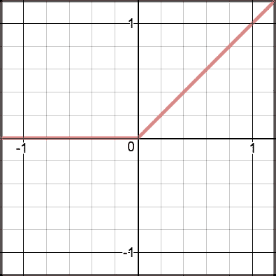
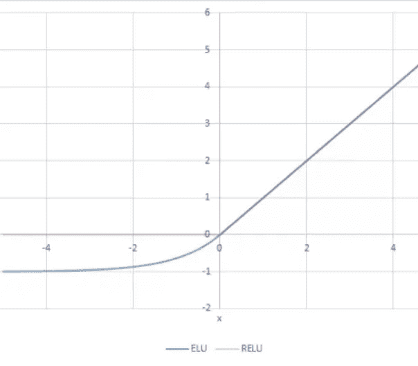

# ELU 是雷鲁的替代者吗？

> 原文：<https://medium.com/mlearning-ai/elu-a-replacement-for-relu-b0a7ab27b2e8?source=collection_archive---------2----------------------->

我最近发现了一篇研究论文，它通过使用 ELU 激活函数而不是 ReLU 函数来提高模型的有效性。我将在这个博客中探索新的 ELU 功能。我还在 Kaggle 上做了一个笔记本，通过代码和互动情节演示 ELU 函数的工作原理。

 [## ELU 赋的一个情节

### 使用 Kaggle 笔记本探索和运行机器学习代码|使用来自无附加数据源的数据

www.kaggle.com](https://www.kaggle.com/code/aristotle609/making-a-plot-of-the-elu-fu/notebook) 

## ReLU 函数

在解释 ELU 之前，我们将从解释 ReLU 函数开始。激活函数返回所有数字，并将负权重转换为零。ReLU 函数旨在降低模型复杂性并增加网络的非线性。以下是该函数的图示。有些神经元可能包含重要信息；但是，由于 ReLU 函数，它们的权重可能不会更新。换句话说，ReLu 会导致不活跃的神经元。以下是该函数的图示。

In the ReLU Function, all negative values become zero after passing through the function.

## ELU 函数

与 ReLU 不同，eLU 函数缓慢平滑到一个常数值。与 ReLU 函数不同，ELU 函数的一个好处是它可以传递负值，同时仍然降低了复杂性。缺点之一就是在训练中比 ReLU 函数慢。这在较小的网络上可能不明显，但随着网络变大，时间会越来越长。以下是 ELU 网络的图示。

The Blue line shows the ELU function

## 结论

虽然有很多关于 ReLU 及其替代品的有效性的讨论，但我发现 eLU 函数非常有吸引力，因为它可以解决垂死的 ReLU 问题并增加网络的非线性。

## 文献学

这是我发现 ELU 潜在用途的研究论文。

容格；改进的 YOLOv5:在各种条件下使用无人机图像的有效目标检测。应用科学。2022, 12, 7255.[https://doi.org/10.3390/app12147255](https://doi.org/10.3390/app12147255)

 [## Mlearning.ai 提交建议

### 如何成为 Mlearning.ai 上的作家

medium.com](/mlearning-ai/mlearning-ai-submission-suggestions-b51e2b130bfb)