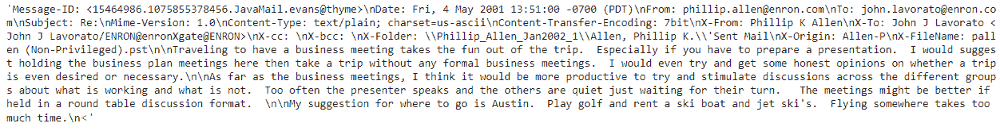
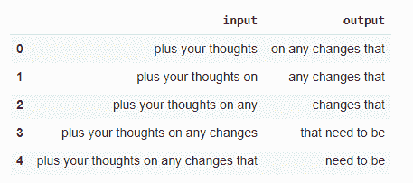
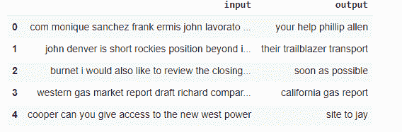
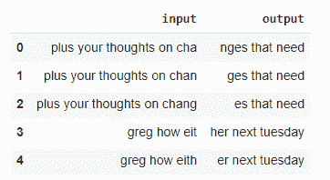
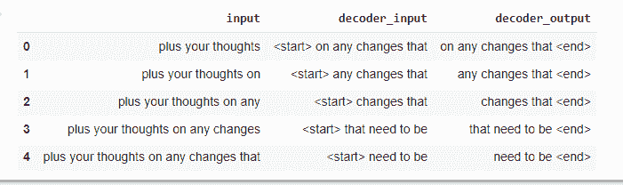
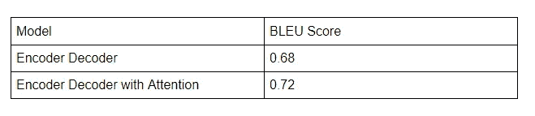
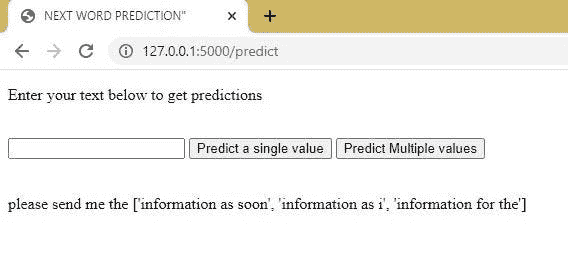

# 通过电子邮件发送下一个单词预测

> 原文：<https://medium.com/mlearning-ai/email-next-word-predictions-7702349bd96?source=collection_archive---------1----------------------->


[source](https://ronelssolutions.com/how-to-improve-your-email-marketing-performance/)

**内容:**

1.介绍

2 业务问题

3 映射到 ML/DL 问题

4 数据来源

5 种现有方法

6 您的第一个切割解决方案

7 EDA，特征工程

8 模型解释

9 个结果，部署

10 未来的工作

11 个人资料

12 篇参考文献

1.  **简介:**

有没有感觉到整天打邮件的负担？曾经困惑过用什么词来使你的邮件专业和良好？在创建电子邮件时，你可以获得下一个单词的建议。那岂不是太好了！让我们在这个案例研究中了解一下它是如何发生的。

**2。商务问题:**

文本在我们的日常生活中被广泛使用。从在社交媒体平台上发短信到官方邮件，我们一天要输入和阅读大量文本。因此，如果我们减少打字(即生成文本)的工作量，效果会更好。这就是自动文本生成的由来。电子邮件通常比较长，所以如果我们在生成邮件时正确预测下一个单词/句子，将会节省很多时间和精力。因此，我们当前的问题是在创建邮件时，根据用户在此之前给出的输入，正确预测句子的完成。

**3。映射到 ML/DL 问题:**

**3.1ML 问题的类型**

如上所述，我们的任务是根据用户输入的文本生成句子。由于要做的预测将是英语句子，我们必须使用序列对序列深度学习模型来解决这个问题。一般来说，它们是为机器翻译而构建的，但也可以用来解决手头的问题。

**3.2 业务约束:**

由于这是一个单词生成问题，模型解释很重要，也就是说，我们应该能够向他们解释/展示为什么基于给定的输入生成特定的单词。

生成的句子应该有意义，即没有语法/拼写错误。此外，答案应该是 100%相关的先前提供的文本。

由于这是用户输入时的单词预测，我们必须在不到一秒的时间内提供答案。

如果我们有好的资源，培训时间不是问题。

**3.3 绩效指标:**

因为这是下一个单词的预测，所以对于生成的单词没有严格的规则。因此，我们不能完全依赖一个指标来对模型的性能进行评级。但是应该有一些分数来决定模型的性能。

由于我们无法手动检查生成的单词对所有数据是否有意义，我们将 bleu score 视为一种度量，以确保模型不会预测错误的单词。

**4。数据来源:**

[https://www.kaggle.com/wcukierski/enron-email-dataset](https://www.kaggle.com/wcukierski/enron-email-dataset)

该数据集在 Kaggle 中可用。它由安然公司的 500，000 封电子邮件组成。它有两列文件，分别是用户的名字、他的电子邮件文件夹和邮件正文。

**5。现有解决问题的方法:**

这些是针对给定问题的现有方法，

*   预测下一个单词
*   用 LSTM 模型预测下一个单词。

**6。第一种解决问题的方法:**

1.  对数据进行分析，如分析电子邮件中的文本，以及如何从电子邮件中仅提取相关文本。
2.  清理文本以提取有用的信息。
3.  以必要的格式准备数据以提供给模型。
4.  实现一个基本的编码器/解码器模型，根据给定的单词预测下一个单词。
5.  尝试看看是否可以做些改进来提高模型的性能。

**7。EDA，特征工程:**

由于电子邮件的文本不直接出现在 excel 中，我们必须先处理它，提取和清理数据，然后对干净的文本进行分析。

**7.1 数据清理和 EDA**

从电子邮件中提取的数据以不同的格式呈现，我们不能直接使用。

例如:



我们需要提取邮件的主题和正文。

这是由一个已经可用的解析函数完成的。

```
import emaildef parse_func(x):b = email.message_from_string(x)body = ''if b.is_multipart():for payload in b.get_payload():body = body+ ' 'body+=payload.get_payload()else:body+=b.get_payload()return bodydef parse_func_subj(x):b = email.message_from_string(x)if b.get('Subject'):subj = b.get('Subject')else:subj = '-'return subjemails['Body'] = emails['message'].apply(parse_func)emails['Subject'] = emails['message'].apply(parse_func_subj)
```

我们为邮件正文和主题创建了一个新列，它是由上述函数提取的。

然后，我们必须处理获得的文本，因为它有许多我们不能/不应该用来建立模型的不需要的字符，如日期、数字、特殊字符等。

在删除任何不需要的字符之前，我们对英文文本使用了缩写，即不能-不能，不应该-不应该等。我们使用正则表达式进行了基本的文本清理，比如删除字母以外的' \n '，' \t '，字符。我们保留了“.”因为这是用来句号的，我们需要它来分隔邮件中的句子。最后我们用一个空格代替了多个空格。在 subject 中，我们还必须删除“Re:”因为它没有任何用处。

```
import rebody = []for text in emails['Body']:text = decontractions(text)text = re.sub(r"\n|\t", ' ', text)text = re.sub("[^a-zA-Z\s.]+",' ',text)text = re.sub("\s+", ' ', text)body.append(text)emails['Processed_Text'] = bodyemails
```

**7.2 分析**

我们从每封邮件中提取字符长度，统计如下。

-最小值为 0，这意味着在清理后，一些邮件包含 0 个字符。我们可以把它们从我们的数据中删除，因为它们没有任何用处。

-最大值为 180 万卢比，这绝对是一个异常值。它可能被错误地输入到数据中，或者某些特定的邮件可能很长。

-我们知道以上是第 75 百分位数据的异常值。长度为 1.5k，为正常长度。

为了进一步分析，我们将看到电子邮件的句子长度和单词长度。

每封电子邮件的中位句子长度为 9 句。由于我们的任务是句子完成，我们必须从电子邮件中提取句子，创建每个句子作为数据点，然后创建所需格式的数据。在分析具有大量句子的电子邮件之后，我们发现邮件在一个邮件链中具有多个邮件。

**7.3 特色工程**

如上所述，有些邮件有邮件链。由于有更多的数据可供我们依赖，我们选择删除存在“转发者”、“原始消息”的行，因为我们在这些行中有许多不需要的数据。

```
remove=[]for i in emails.index:text = emails.loc[i]['Body']if ('Original Message' in text) or ('Forwarded by' in text):remove.append(i)emails.drop(remove,axis=0,inplace=True)emails.reset_index(drop=True,inplace=True)
```

因此，现在我们要建立序列到序列模型，我们需要准备的数据在这种格式，即打破句子，创造输入和输出。所以我们决定有三种数据。

一是让短句作为输入，二是让我们的模型学习长句作为输入，三是打破单词，让我们的模型预测单词完成情况和下一对单词。我们将主题的前 5 个单词附加到输入中，以帮助模型更好地理解上下文并给出更有意义的预测。

有些长句是特定的，在一般情况下不太可能出现。

下面是编写的代码和数据示例。

**7.3.1 短句**

```
input = []output = []for i in emails.index:subject = emails.loc[i]['Processed_Subject']sentences = emails.loc[i]['Processed_Text'].split('.')for sent in sentences:sent = sent.lower()noof_words = len(sent.split())if noof_words in range(5,13):# half = int(noof_words/2)words = sent.split()for i in range(3,noof_words):if i%3==0:if noof_words-i>=4:input.append(' '.join(subject.split()[:5]+words[:i]))output.append(' '.join(words[i:i+4]))elif i%3==1:if noof_words-i>=3:input.append(' '.join(subject.split()[:5]+words[:i]))output.append(' '.join(words[i:i+3]))else:if noof_words-i>=2:input.append(' '.join(subject.split()[:5]+words[:i]))output.append(' '.join(words[i:i+2]))
```



Short sentences data

**7.3.2 长句**

```
import randominput = []output = []for i in emails.index:subject = emails.loc[i]['Processed_Subject']sentences = emails.loc[i]['Processed_Text'].split('.')for sent in sentences:sent = sent.lower()noof_words = len(sent.split())if noof_words in range(10,15):# half = int(noof_words/2)words = sent.split()for i in range(10,noof_words):rn = random.randint(3,6)if noof_words-i>=rn:input.append(' '.join(subject.split()[:5]+words[:i]))output.append(' '.join(words[i:i+rn]))
```



Long sentences data

**7.3.3 断字**

```
input = []output = []for i in emails.index:subject = emails.loc[i]['Processed_Subject']sentences = emails.loc[i]['Processed_Text'].split('.')for sent in sentences:sent = sent.lower()noof_words = len(sent.split())if noof_words in range(5,13):# half = int(noof_words/2)words = sent.split()for i in range(3,noof_words):if len(words[i])>=5 and noof_words-i>=3:for j in range(3,len(words[i])):if len(words[i])-j>=2:half_word_1 = words[i][:j]half_word_2 = words[i][j:]input.append(' '.join(subject.split()[:5]+words[:i-1]+[half_word_1]))output.append(' '.join([half_word_2]+words[i+1:i+3]))
```



然后，我们追加准备好的所有类型的数据，以便模型能够查看和学习所有类型的数据。

现在我们需要准备的数据的格式按照顺序到顺序模型。

由于我们在编码-解码模型中使用教师强制技术，我们准备了三列数据，即编码输入、解码输入、解码输出，我们将在下一部分中详细讨论。

```
new_data['decoder_input'] = '<start> ' + new_data['output'].astype(str)new_data['decoder_output'] = new_data['output'].astype(str) + ' <end>'new_data = new_data.drop(['output'], axis=1)new_data.head()
```



data for encoder decoder

使用这个开始和结束标记是因为在将一个句子作为输入传递给编码器之后，我们将把<start>作为输入传递给解码器的第一步以生成下一个单词，并且当达到/预测到<end>标记时，我们将停止预测。</end></start>

由于我们知道不能将文本数据直接传递给模型，因此需要将其转换为数字形式。这就是 Tokenizing 发挥作用的地方，它会获取所有单词，并为词汇表中的每个单词分配唯一的 id/索引。

```
from tensorflow.keras.preprocessing.text import Tokenizerfrom tensorflow.keras.preprocessing.sequence import pad_sequencestokenizer_encoder = Tokenizer(oov_token='out_of_vocab')tokenizer_encoder.fit_on_texts(new_data['input'].values)tokenizer_decoder = Tokenizer(filters='!"#$%&()*+,-./:;=?@[\\]^_`{|}~\t\n')tokenizer_decoder.fit_on_texts(np.append(new_data['decoder_input'].values,'<end>')) #to add <end> in the corpusvocab_size_enc = len(tokenizer_encoder.word_index)+1vocab_size_dec = len(tokenizer_decoder.word_index)+1print("Vocab sizes of encoder and decoder are ",vocab_size_enc,vocab_size_dec)
```

现在，在对输入和输出句子进行标记化之后，我们需要填充。填充基本上是使所有的输入和输出具有相同的长度，以便更容易地处理句子。

```
tokenzd_seq_enc = tokenizer_encoder.texts_to_sequences(new_data['input'].values)tokenzd_seq_dec_ip = tokenizer_decoder.texts_to_sequences(new_data['decoder_input'].values)tokenzd_seq_dec_op = tokenizer_decoder.texts_to_sequences(new_data['decoder_output'].values)enc_padded = pad_sequences(tokenzd_seq_enc, maxlen=max_len_enc, dtype='int32', padding='post')dec_ip_padded = pad_sequences(tokenzd_seq_dec_ip, maxlen=max_len_dec, dtype='int32', padding='post')dec_op_padded = pad_sequences(tokenzd_seq_dec_op, maxlen=max_len_dec, dtype='int32', padding='post')BATCH_SIZE=1024train_dataset = tf.data.Dataset.from_tensor_slices(((enc_padded, dec_ip_padded),dec_op_padded))train_dataset = train_dataset.batch(BATCH_SIZE, drop_remainder=True)
```

为了更快更好地加载数据，我们使用了 tf.data.Dataset。

**8 .型号说明:**

既然我们决定用序列来序列，我们就用两个模型。一个是基本的编码-解码模型，另一个是使用注意的编码-解码模型。

**8.1 基本编码器—解码器型号:**

编码器层有两个步骤。嵌入层和 LSTM 层。我们将标记化的填充输入传递给编码器的嵌入层。在嵌入层，每个单词/标记被转换成 n 维向量，以保持单词之间的关系。然后，我们将嵌入的矩阵传递给编码器的 LSTM 层。这里，每个单词的嵌入矩阵按顺序传递给它。它从句子中学习信息，并返回 LSTM 的隐藏状态和最后一个时间步长的单元格状态，我们将把它们作为初始状态传递给解码器的 LSTM。

**8.2 编码器—解码器模型注意:**

在上面的模型中，我们只使用了来自编码器的最后一个时间步长的隐藏和单元状态。这样，如果输入的句子很长，我们的模型将无法从句子中更好地学习趋势或上下文。这就是一个叫做“注意”的美丽方法出现的地方。

我们将所有时间步长的隐藏状态作为编码器 LSTM 的输出。在解码过程中，在每个时间步，我们计算解码器的相似性得分/注意力权重-LSTM 的前一步的隐藏状态与编码器-LSTM 的所有步骤的隐藏状态。因此，我们有解码器的先前状态信息以及编码器的所有步骤信息来预测解码器中的下一个字。同样，通过注意力权重，我们可以了解编码器中的哪个单词对解码器中的预测单词给予了更多的权重。因为要在解码器中预测每个单词，我们有来自编码器的所有步骤的信息，这更好地保留了长句中的关系。因为我们在解码器的每一步都计算注意力权重，所以我们使用一个单步解码器层来执行注意力动作。然后在解码器中，我们循环运行一步解码器。

因为我们手头的任务是基于输入单词预测下一个单词，所以关于预测没有硬性的规则。一个输入可能有多个可能的下一个单词，例如，“我愿意”可能有下一个单词组合，如“请你帮个忙”、“告诉你一件事”、“和你谈谈”。所以我们目前只给出一个基于高概率的句子。但是在有很多可能性的情况下，为什么要坚持只说一句话。为此，我们有波束搜索逻辑。它的工作原理如下:

**8.3 光束搜索**

我们在解码器的第一步取前三个预测。

我们将这三个字传递给解码器的下一步，并为之前生成的三个字中的每一个生成三个字。我们取 9 个单词组合的组合概率，对它们进行排序，并从中取前三个单词组合。然后重复这个过程，直到我们在三个单词组合中得到<end>令牌。</end>

这就是我们如何为给定的输入生成前三个预测。

**9。结果，部署:**

**9.1 结果**

尽管我们不能完全依赖 bleu 分数，但由于我们使用了该指标来评估模型的性能，以下是模型获得的 bleu 分数的结果，



Results

由于注意力模型比之前的模型给出了更好的 bleu 分数和更好的预测，我们选择它作为最终模型。

以下是一些预测的例子:

根据基本编码器-解码器模型，

单一预测

— ip:信函副本请参见 attac — prd: hed 信函至

前三大预测，

— ip:您要求 cgi nightrider 删除的信息进一步— prd: ['她的邮件回复'，'她的邮件来自'，'她的邮件列表']

从注意力模型来看，

单一预测

— ip:投标周价格请告诉我— prd:如果您有

三大预测:

— ip: executive reports viewer 我收到了一封邮件 morni—prd:[' ng about the '，' ng and represent '，' ng about this ']

**9.2 部署**

我们已经使用 Flask 应用程序部署了该模型。

用 Flask 部署很简单。

我们需要编写一个 py 文件来加载模型并进行预测。这个 py 文件本身就像一个 flask 应用程序。

我们将在模板文件夹中有一个 html 文件，并在应用程序中导入该模板。

我们创建了一个基本的 html 模板，并部署了 flask 应用程序来预测接下来的单词。

下面是同样的截图，



deployment

**9.3 错误预测分析:**

尽管我们不能完全依赖 bleu 分数，我们还是分离出了预测的 bleu 分数较低的句子。

注意:示例顺序:输入 _ 原始 _ 预测

从以上来自普通编码器/解码器模型和注意力模型的例子中，我们可以看到多种情况，

-预测比原来更好

你能给我发一封电子邮件确认吗

我们不得不把离职日期推迟几个小时

-因为句子很长，模特不能正确地学习

例如:全球 eol 保留清单替代这些实体的交易对手仍在接受安然公司信贷法律和合同部门的审查

-预测与原始预测一样有意义，但两者不匹配

嘿，马特，我给了她我的号码，让她给我打电话，我的号码是

例如:达博尔史蒂夫请看看下面的链接

-输入和原始很少出现，即如此具体

例如:tagg 交换用户我想从托德·沃里克·弗兰克开始

我和布莱恩·尼科尔斯谈论了 8 月份网上初选的事情

-一些示例看起来很简单，但模型预测不准确

我想你说过明天下午 5 点会工作到下班

**10。未来工作:**

目前我们最多给出 4 到 5 个单词作为预测。您可以尝试给出更多的预测词，但我们需要确保邮件的上下文，并且在预测更多的词时应该有一些概率阈值。

你可以尝试不同类型的注意机制，看看模型的表现如何。

11。简介:

**11.1 Github 回购:**

[https://github.com/satwikparlapalli/nextwordsprediction](https://github.com/satwikparlapalli/nextwordsprediction)

**11.2 LinkedIN:**

[https://www . LinkedIn . com/in/naga-satwik-parla palli-2b 93 b 1182/](https://www.linkedin.com/in/naga-satwik-parlapalli-2b93b1182/)

**12 .参考:**

*   [https://www.appliedaicourse.com/](https://www.appliedaicourse.com/)
*   [https://towards data science . com/next-word-prediction-with-NLP-deep-learning-48 B9 fe0a 17 BF](https://towardsdatascience.com/next-word-prediction-with-nlp-and-deep-learning-48b9fe0a17bf)
*   [https://machinerlearnishingtable . com/calculate-bleu-score-for-text-python/](https://machinelearningmastery.com/calculate-bleu-score-for-text-python/)
*   [https://towards data science . com/word-level-English-to-maradi-neural-machine-translation-use-seq2seq-encoder-decoder-lstm-model-1a 913 F2 DC 4a 7](https://towardsdatascience.com/word-level-english-to-marathi-neural-machine-translation-using-seq2seq-encoder-decoder-lstm-model-1a913f2dc4a7)
*   [https://towards data science . com/Gmail-style-smart-const-use-char-n-gram-language-models-a 73c 09550447](https://towardsdatascience.com/gmail-style-smart-compose-using-char-n-gram-language-models-a73c09550447)
*   [https://www . tensorflow . org/addons/教程/networks_seq2seq_nmt](https://www.tensorflow.org/addons/tutorials/networks_seq2seq_nmt)
*   [https://towards data science . com/an-直观解释波束搜索-9b1d744e7a0f](https://towardsdatascience.com/an-intuitive-explanation-of-beam-search-9b1d744e7a0f)
*   [https://stackoverflow . com/questions/19790188/expanding-English-language-language-constraints-in-python/47091490 # 47091490](https://stackoverflow.com/questions/19790188/expanding-english-language-contractions-in-python/47091490#47091490)
*   [https://stackoverflow . com/questions/17874360/python 如何解析原始电子邮件中的正文假定原始电子邮件不存在](https://stackoverflow.com/questions/17874360/python-how-to-parse-the-body-from-a-raw-email-given-that-raw-email-does-not)