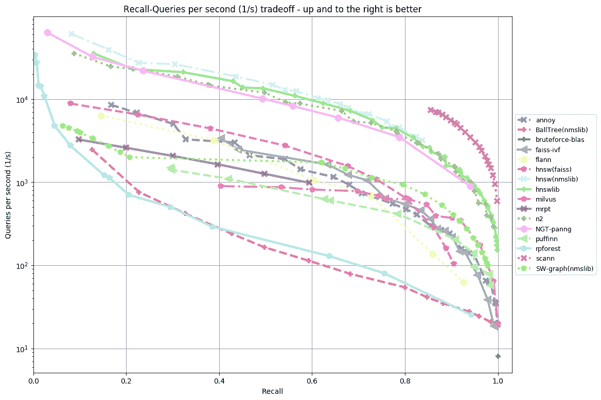

# 嵌入相似性搜索

> 原文：<https://medium.com/mlearning-ai/embedding-similarity-search-25c6911240af?source=collection_archive---------0----------------------->


Photo by [Michael Dziedzic](https://unsplash.com/@lazycreekimages?utm_source=medium&utm_medium=referral) on [Unsplash](https://unsplash.com?utm_source=medium&utm_medium=referral)

搜索相似的东西是许多信息检索系统、推荐引擎、同义词搜索等的关键概念。基本上到处都是，在数据库中进行精确搜索是不可行的(例如，您不能只保存单词，还保存其含义和上下文的表示)。

在这种情况下，大多数工具、深度学习算法或统计 ML 方法都使用高维空间中向量形式的初始项目表示进行操作，称为嵌入。这允许表示初始项目(如文本、图像等。)以更有效和灵活的方式保存其特征，有时甚至保存其上下文。

所以，基本上搜索相似项意味着搜索其表示空间中彼此接近的向量表示(找到它们之间的欧几里德或其他距离)。

考虑到上述情况，搜索相似项目将遵循以下算法:

*   将数据集中的所有项目表示为嵌入
*   为一对嵌入定义一个[度量](https://developers.google.com/machine-learning/clustering/similarity/measuring-similarity)。该度量可以是[余弦相似度](https://wikipedia.org/wiki/Cosine_similarity)、[欧几里德距离](https://wikipedia.org/wiki/Euclidean_distance)或点积。
*   搜索查询对象的嵌入
*   选择靠近查询对象的嵌入

检索这些结果是一个 k 近邻搜索，可以用几种不同的方式完成。如果数据集中没有那么多项目(几百或几千)，则可以计算所有向量之间的距离度量。尽管如果实时需要结果，并且数据集非常大，搜索最近邻需要是近似的。这可以通过创建允许快速搜索项目的索引数据结构来实现。

让我们回顾一下搜索 k 近邻的不同方法，从最简单的方法到可用于大数据集的方法:

***采用直接计算***

**使用 numpy 从头开始:**最简单的方法是计算从查询向量 X 到 S 中每隔一个向量的距离，并识别具有最小距离的 k 个向量。由于评估了所有可能的匹配，这是一个*强力*搜索。该操作需要计算 N*N 距离，然后找到底部的 k 值:

```
import numpy as np
N = 10000
d = 10
k = 5
# create an array of N d-dimensional vectors (our search space)
S = np.random.random((N, d)).astype('float32')
# create a random d-dimensional query vector
x = np.random.random(d)
# compute distances
distances = np.linalg.norm(S - x, axis = 1)
# select indices of vectors having the lowest distances from the X
neighbours = np.argpartition(distances, range(0, k))[:k]
```

**使用 scikit-learn:** scikit-learn 提供了一种简单的方法来搜索 k 个最近的邻居(使用[sk learn . nearest neighbors . nearest neighbors](https://scikit-learn.org/stable/modules/generated/sklearn.neighbors.NearestNeighbors.html)):

```
from sklearn.neighbors import NearestNeighbors
knn = NearestNeighbors(n_neighbors=k)
knn.fit(S)
# select indices of k nearest neighbours
neighbours = knn.kneighbors([x], return_distance = False)
print(neighbours)
```

结果与使用 numpy 相同(因为精确的距离是计算出来的)。在这两种方法中，我们都需要将整个距离矩阵放入内存，这可能有点问题。

***利用近似相似度***

当数据集比 RAM 大得多时，或者应该实时提供答案时，有两种主要方法来近似嵌入相似性:基于树的方法和散列方法。

基本思想类似于建立数据库索引。在基于树的方法中，以分而治之的方式递归地划分数据，这使得树中的相似向量彼此靠近。树索引需要大量内存，并且性能会随着高维数据而降低。

在基于散列的方法中，想法是学习一个将项目转换成代码的模型，其中相似的项目将产生相同或相似的代码。这种方法大大减少了所需的内存。

有几个开源库[实现了近似相似性匹配技术。让我们回顾一下其中最受欢迎的。](https://github.com/erikbern/ann-benchmarks)

**非度量空间库(NMSLIB)** 核心库没有任何第三方依赖关系。它包含在[亚马逊弹性搜索服务](https://aws.amazon.com/about-aws/whats-new/2020/03/build-k-nearest-neighbor-similarity-search-engine-with-amazon-elasticsearch-service/)中。它是用 C++编写的，可以两种方式使用——直接用 C++和 Python。

可以精确地回答查询，即通过返回不包含错误元素的完整结果集，或者近似地回答查询，例如通过仅找到一些邻居。因此，这些方法是根据效率-效果权衡来评估的，而不仅仅是根据它们的效率。一个常见的有效性度量是 recall，它被计算为由该方法返回的真实邻居的平均分数(任意打破平局)。

```
import hnswlib
import numpy as np# Declaring index
p = hnswlib.Index(space='l2', dim=d)  # possible options are l2, cosine or ipp.init_index(max_elements=N+1, ef_construction=100, M=16)
# Controlling the recall by setting ef:
# higher ef leads to better accuracy, but slower search
p.set_ef(10)
p.add_items(S)
# Query the elements for themselves and measure recall:
labels, distances = p.knn_query(S, k=1)
print("Recall:", np.mean(labels.reshape(-1) == np.arange(len(S))), "\n")# Query the elements for themselves and measure recall:
labels, distances = p.knn_query(x, k=k)
print(labels[0])
```

因为我们是在一个非常小的数据集上进行测试，所以使用的搜索方法不一定优于强力搜索。通常，语料库越大，相对于强力搜索的效率改善越大。

**Faiss(脸书人工智能搜索)**

Faiss 是脸书开发的一个库，可以有效处理大型数据集和高维稀疏数据。它包含了几种相似性搜索的方法。它们中的大多数使用向量的压缩表示，并且不需要保持原始向量。这通常以更近似的搜索为代价，但是这些方法可以扩展到主存储器中的数十亿个向量。

Faiss 是围绕存储一组向量的索引类型构建的，并提供了一个通过 L2 和/或点积向量比较在其中进行搜索的功能。一些索引类型是简单的基线，比如精确搜索。大多数可用的索引结构对应于以下各种权衡

*   搜索时间
*   搜索质量
*   每个索引向量使用的内存
*   训练时间
*   无监督训练需要外部数据

使用 Faiss 选择索引类型有几种不同的可能性:

*   如果没有太多的搜索，内存是一个问题，需要精确匹配，那么最好的选择是“平面”索引
*   如果数据集很大，内存是一个问题，那么需要选择 NHSW。和在 NMSLIB 中一样，我们选择了 M 参数。4 个<= M <= 64 is the number of links per vector, higher is more accurate but uses more RAM. The memory usage is (d * 4 + M * 2 * 4) bytes per vector.

Also there are different settings for the clustering of the dataset has to be done beforehand. After clustering, “Flat” parameter just organizes vectors into the buckets, and does not compress them, the storage size is the same as that of the original dataset. The tradeoff between speed and accuracy is set via the nprobe parameter which can reduce dimensionality, make quantization of the vectors into *M 个* 4 位码等(更多[在此](https://github.com/facebookresearch/faiss/wiki/Guidelines-to-choose-an-index))。

```
import faiss
import numpy as np# Param of PQ
M = 8  # The number of sub-vector. Typically this is 8, 16, 32, etc.
nbits = 8 # bits per sub-vector. This is typically 8, so that each sub-vec is encoded by 1 byte
# Param of IVF
nlist = 100  # The number of cells (space partition). Typical value is sqrt(N)
# Param of HNSW
hnsw_m = 32  # The number of neighbors for HNSW. This is typically 32
# Setup
quantizer = faiss.IndexHNSWFlat(d, hnsw_m)
index = faiss.IndexIVFPQ(quantizer, d, nlist, M, nbits)
# Train
index.train(S)
# Add
index.add(np.array([x])
# Search
index.nprobe = 8  # Runtime param. The number of cells that are visited for search.
dists, ids = index.search(x=np.array([x])[:3], k=k)
print(ids)
```

**Spotify 的** [**惹库**](https://github.com/spotify/annoy)

Annoy 是一个带有 Python 绑定的 C++库，可以构建[随机投影](http://wikipedia.org/wiki/Locality-sensitive_hashing#Random_projection)树。索引是用一个由`k`棵树组成的森林构建的，其中`k`是一个可调参数，在精度和性能之间进行权衡。它还创建了大型的只读的、基于文件的数据结构，可以在许多进程之间共享。

```
from annoy import AnnoyIndex
import randomt = AnnoyIndex(d, 'angular')  # Length of item vector that will be indexed
for i in range(len(S)):
    t.add_item(i, S[i])

t.build(10) # 10 trees
print(u.get_nns_by_vector(x, k)) # will find the k nearest neighbours
```

**结论**

[这里的](https://github.com/erikbern/ann-benchmarks)代表了具有不同数据集和距离度量的所有库的基准。正如我们所见，数据集越小，不同方法的工作速度之间的差异就越小。



Benchmarks for different datasets [[from here](https://github.com/erikbern/ann-benchmarks)]

因此，在本教程中，我们使用不同的库和方法构建了一个 brut-force 和一个近似 k-NN 相似性搜索特性。此外，还回顾了用于近似 k-NN 相似性的不同类型的指标。

代码可以用 [Google Colab](https://colab.research.google.com/drive/18kCP5TpSScL2SbujJORiQcxRfNaxT0FN?usp=sharing) 试用。

**来源:**

[](https://github.com/facebookresearch/faiss) [## GitHub - facebookresearch/faiss:一个高效的相似性搜索和密集聚类库…

### Faiss 是一个用于高效相似性搜索和密集向量聚类的库。它包含算法搜索…

github.com](https://github.com/facebookresearch/faiss) [](https://github.com/spotify/annoy) [## GitHub-Spotify/aroy:c++/Python 中的近似最近邻居，针对内存使用和…

### 是一个带有 Python 绑定的 C++库，用来搜索空间中的点…

github.com](https://github.com/spotify/annoy) [](https://github.com/nmslib/hnswlib) [## GitHub - nmslib/hnswlib:用于快速近似最近邻的仅头文件 C++/python 库

### 使用 python 绑定的仅头文件 C++ HNSW 实现。新闻:Hnswlib 现在是 0.5.2。错误修正-感谢@ marekhanus

github.com](https://github.com/nmslib/hnswlib) [](https://davidefiocco.github.io/nearest-neighbor-search-with-faiss/) [## 大搜索空间中 k-最近邻搜索的第一步

### TL；faiss 库允许以一种有效的方式执行最近邻搜索，可以扩展到几百万…

davidefiocco.github.io](https://davidefiocco.github.io/nearest-neighbor-search-with-faiss/) [](https://github.com/erikbern/ann-benchmarks) [## GitHub-erikbern/ann-Benchmarks:Python 中近似最近邻库的基准

### 在高维空间中快速搜索最近邻是一个越来越重要的问题，但到目前为止…

github.com](https://github.com/erikbern/ann-benchmarks) [](https://github.com/facebookresearch/faiss/wiki/Guidelines-to-choose-an-index) [## 选择索引的指南 facebookresearch/faiss Wiki

### 选择指数不是显而易见的，所以这里有几个基本问题可以帮助选择指数。他们…

github.com](https://github.com/facebookresearch/faiss/wiki/Guidelines-to-choose-an-index)