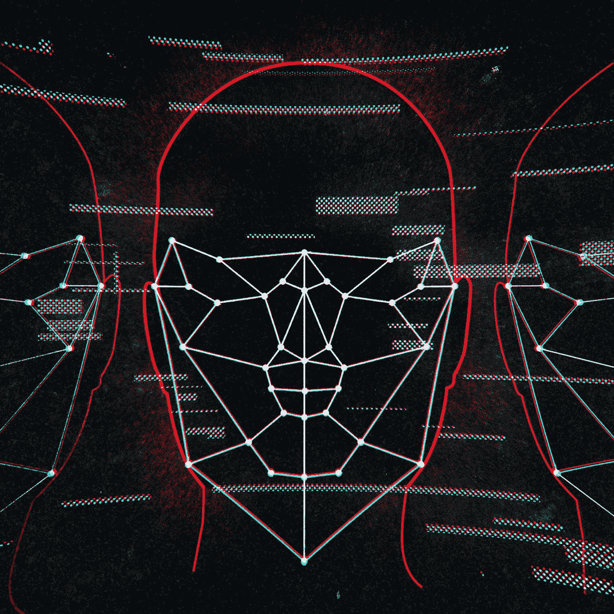

# 情感人工智能:深度学习的面部关键点检测(残差卷积神经网络)

> 原文：<https://medium.com/mlearning-ai/emotion-ai-facial-key-points-detection-with-deep-learning-residual-convolutional-neural-network-83fedd9977f2?source=collection_archive---------0----------------------->

([Illustration by Alex Castro](https://www.theverge.com/2019/7/25/8929793/emotion-recognition-analysis-ai-machine-learning-facial-expression-review))

# 介绍

在新冠肺炎之前，智能城市中对各种面部识别应用的需求已经越来越多，如视频监控(家庭安全到边境控制)、身份识别(解锁手机到机场登机)、犯罪识别、楼宇门禁控制以及…