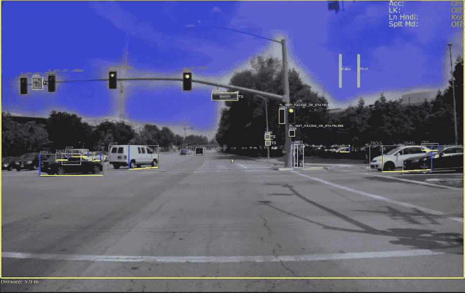

# 计算机视觉情感和人工意识

> 原文：<https://medium.com/mlearning-ai/emotional-computer-vision-and-machine-consciousness-9e082ae612d0?source=collection_archive---------5----------------------->

AVC via NVIDIA

从内部来说，计算机视觉应该对它看到的任何东西进行情感解读——不管是不是人类。这在当时和随后，将有助于了解、调整，然后磨练模式检测和识别。

人们努力让相机更好地识别人类的情感。虽然这是必要的，但如果它是独立的，没有相机有自我情绪的阅读，它是有限的。

用来拍摄战争的相机，不应该只是擅长锐利。自动驾驶汽车的摄像头不应该只是检测和识别人脸、物体和模式。安全摄像头不应该只记录正在进行的一切。观察污染、野火、洪水的摄像机不应该是哑的，显示然后让人类承担所有的情感代价。

这些相机应该看到场景，知道它们的意思，并有情感的给予——这可能会模糊一些，锐化一些，保持不变，或者在角落里表达出关于危险或异常的眼泪。

对相机缺乏内在的情感，使其与哺乳动物的眼睛相差甚远。

眼睛感知视觉，整合到思想{理论上}，它分裂，进入记忆被认识，然后前进到感觉效果被确定的地方。这可能是温和的，也可能是极端的。反应随之而来，可能是平行的，也可能是垂直的。

眼睛不只是检测和识别。他们的部分转换流在决定情绪的地方结束。虽然大多数是温和的，但它到达那里。

情绪也通过记忆获得，这种学习确保指导如何管理和驾驭各种情况，以获得生存、安全和技能。

相机数据将被分割成几部分，其中的大部分可能会进入 D&R，但有些必须是被动的，而另一些则带有情感色彩。反应可能在较低的角落，或颜色变化。

这种反应可能会变成如何引起别人的注意。它还可以帮助调查或评估报告和历史。

思想是大脑的核心，数据是计算机的核心。数据必须采取一种思维的形式来表现路径。

imsplt、impsv、imemo、imsde、imrtn 和其他函数可以成为新的 OpenCV 函数，实现计算机视觉情感化。

[思维规则](/codex/neuroscience-thought-basis-of-predictive-coding-theory-663dfbb6b89b)可以作为数据规则的模型。将数据分成类别是可能的，但困难的部分将是使数据等于大脑中最小的思维单位。

尽管芯片小型化，单位面积的处理能力更强，但比特是迄今为止最小的数据单位。

最小的思想单位，仍然是不可测量的，比比特“可能”小一百万倍以上，所以要实现思想-数据奇偶校验还很遥远。

然而，朝着比特分裂是可能的，以实现人工情感的某些结果。

 [## Mlearning.ai 提交建议

### 如何成为 Mlearning.ai 上的作家

medium.com](/mlearning-ai/mlearning-ai-submission-suggestions-b51e2b130bfb)