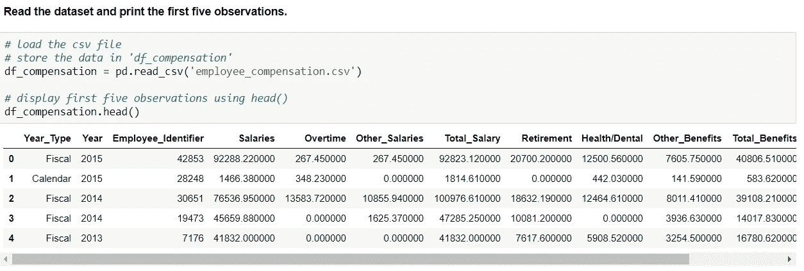
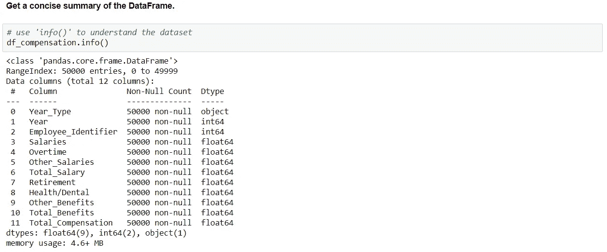
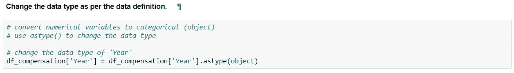
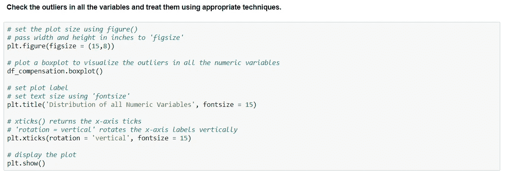
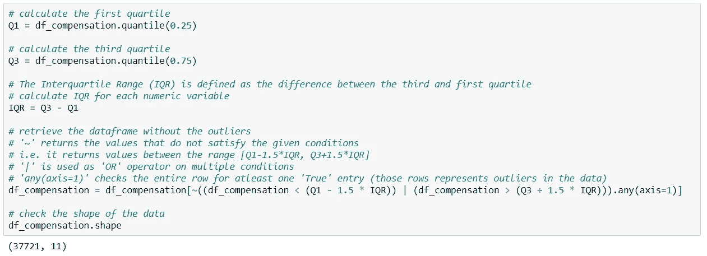
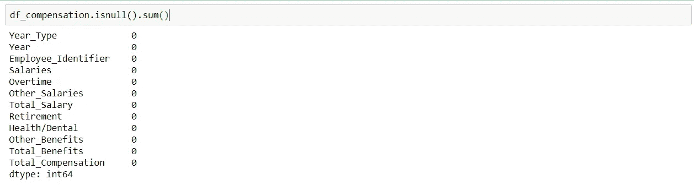
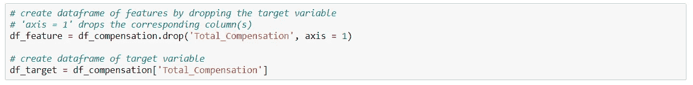
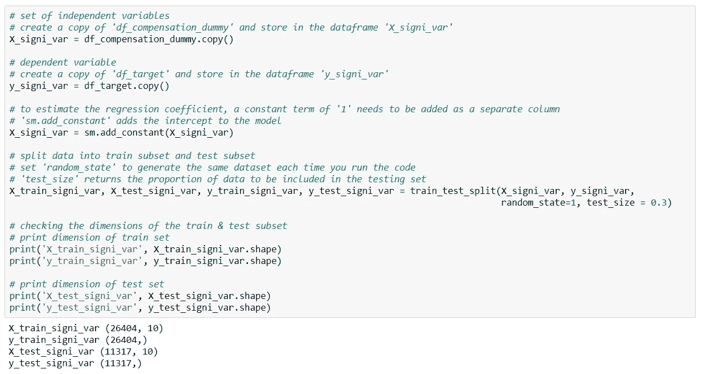
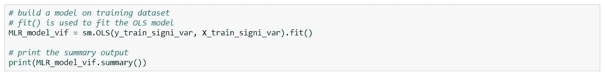
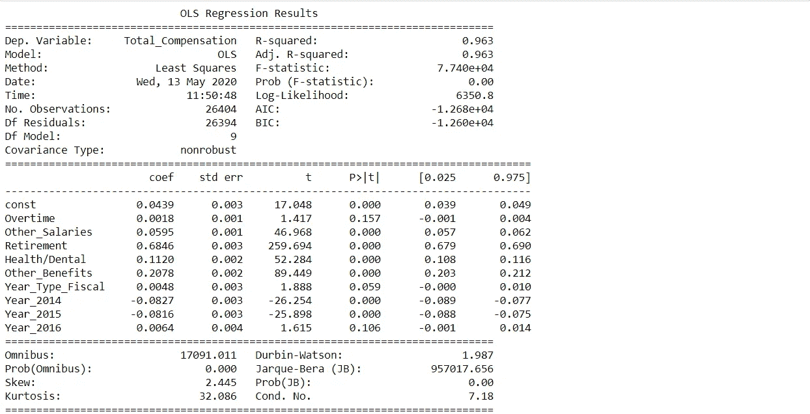

# 使用线性回归预测员工薪酬

> 原文：<https://medium.com/mlearning-ai/employee-compensation-prediction-using-linear-regression-72969e33999a?source=collection_archive---------0----------------------->

纽约市主计长办公室维护着一个自 2013 财年以来支付给该市雇员的工资和福利的数据库。这是代表员工薪酬报告的数据。

**年份类型:**会计(七月至六月)或日历(一月至十二月)

**年:**12 个月的会计期。纽约市的财政年度从 7 月 1 日开始，到下一年的 6 月 30 日结束。截至 2012 年 6 月 30 日的财年表示为 2011–2012 财年。

**员工标识符:**“员工标识符”栏中的每个不同数字代表一名员工。这些识别号是没有意义的，而是为了建立这个数据集而随机分配的。

**工资:**支付给永久或临时城市雇员的正常工资。

**加班:**支付给每周工作超过 40 小时的城市雇员的金额。

**其他工资:**支付给城市雇员的各种非正常款项，包括奖金、奖金或其他一次性付款。

**工资总额:**支付给城市员工的所有工资的总和。

**退休:**城市对员工退休计划的贡献。

**健康/牙科:**城市支付的健康和牙科保险计划的保险费，涵盖城市雇员。为了保护法律要求的机密性，按比例分配的全市平均值代替了员工特定的健康和牙科福利。

**其他福利:**代表员工支付的强制性福利，如社会保障(FICA 和医疗保险)缴款、失业保险费以及不包括在上述类别中的小额自由支配福利。

**福利总额:**支付给城市雇员的所有福利的总和。

薪酬总额:支付给金融城雇员的所有工资和福利的总和。

该数据有 50000 个观察值和 12 个变量。变量`Year_Type`是分类的。所有其他变量都是数字。从上面的输出中，我们看到`Year`的数据类型是‘int 64’。但是根据数据定义，`Year`是分类变量，被错误地解释为‘int 64’，所以我们将这些变量的数据类型转换为‘object’。

列`Employee_Identifier`包含雇员的 id，这对于进一步的分析是多余的。因此，我们删除该列。

让我们用 IQR 方法来剔除异常值。

检查数据中是否存在缺失值，并进行处理。

我们可以看到数据中没有空值，并对数据进行缩放。

让我们为独立变量和目标变量创建数据框架，以检查线性回归的假设。并对分类变量进行编码。

将数据拆分为训练集和测试集。

使用 OLS 方法建立模型

从该模型获得的 R 平方值是 0.963，这意味着上述模型解释了 Total_Compensation 中 96.3%的变化。

此外，我们可以看到几个变量的 p 值大于 0.05。我们可以通过删除这些不重要的变量来优化模型。