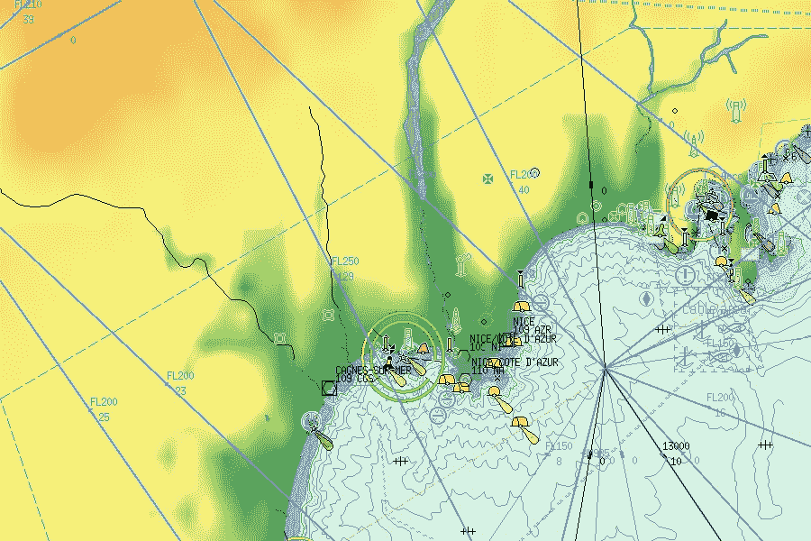
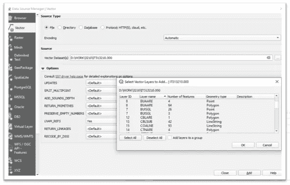

# 电子海图和地理信息系统携手推进水空间革命

> 原文：<https://medium.com/mlearning-ai/enc-and-gis-hand-in-hand-for-hydrospatial-revolution-c71090d80a0e?source=collection_archive---------0----------------------->

## 导航和海事地理信息系统的未来

[image from 7Cs Company Website](https://www.sevencs.com/chartserver/wms-chartserver/)

我敢肯定，你们所有人在生活中都会使用一两次手机来获取从一个地方到另一个地方的方向，或者去你正在访问或工作的城市或国家的某个地方，这是完全可能的，因为你的智能手机配备了 GPS 和 GoogleMaps，但你有没有想过这些数据是如何收集的，它们是如何相互关联的，以给你指示和如何到达这些地方？

所有地理数据的来源都是数字化，无论是通过卫星或航空勘测，还是通过主动传感器(如全站仪和与复杂定位系统相连的回声测深仪)进行的主动地形和水文勘测，都可以被动地在纸质海图或地理参考图像上进行数字化，专业人员进行这些工作的原因只是为了提供关于现实世界对象的额外信息，并向用户提供交互式体验，以便他或她可以根据其使用目的深入质疑数据。

ENC 数据是一个特例，但与前面提到的并不完全不同。

# 你说的这个 ENC 是什么？

电子航海图 **(ENCs)** 由数字化的特征对象组成，这些特征对象根据 IHO(国际水文组织)在其文件中规定的安全航行所需的一套规则来描述海洋环境。

就像我们之前提到的使用手机 GPS 从一个地方到另一个地方一样，电子海图通过在世界地理系统 WGS84 中编辑电子海图的所有特征对象使之在海上成为可能，WGS 84 代表了地球的最接近的数学模型和全球所有 GPS 和 GNSS(全球导航卫星系统)使用的定位系统，但是我们如何表示和使用制图人员编辑的数据并使其方便我们的目的呢？

IHO 根据 IMO(国际海事组织)、SOLAS(海上人命安全)和 IALA(国际航海和灯塔管理机构海上救助协会)对该产品进行监管，并发布出版物，要求官方生产商遵守一套[规则，以汇编数据](https://iho.int/en/standards-and-specifications)，并将其显示在经认证的 ECDIS(电子海图显示信息系统)或 ECS(电子海图系统)上，我们将回头讨论这两者之间的差异。

IHO 的产品规范 S57 是关键文件，它规定了编辑 ENC 上所有特征对象的技术细节以及它们如何通过关联或收集相互关联，而 S52 规范规定了数据如何在 ECDIS 或 ECS 上显示，并使用户能够与称为“意大利面几何”的特殊几何结构相关的独特内容进行充分交互。

电子海图数据可以由与官方 H.Os(水文办公室)打交道的官方经销商购买，如 IC-ENC、Jeppesen、UKHO、NOAA，或设法从 IHO 获得生产许可证并推出 web [电子海图门户网站的私人机构，如 NOAA](https://www.charts.noaa.gov/InteractiveCatalog/nrnc.shtml) 制作的电子海图门户网站，免费提供导航和下载数据，直接销售单个电子海图单元或用于远程导航的电子海图束，如 IC-ENC、PRIMAR 和 [Navionics](https://www.navionics.com/fin/) 。

电子海图确实是通过电子海图系统或电子海图系统为海上导航而创建的，但是随着近年来 GIS(地理信息系统)行业的发展和网络的迅速发展，电子海图的使用不仅局限于导航，还可以用于定位沉船或海岸，例如用于捕鱼或更科学的目的，如对某一区域的探测数据进行插值以创建 DTM(数字地形模型),并与其他数据一起应用以推断某一现象。

*Image by the Author using QGIS*

几乎所有 GIS 应用程序都可以将电子海图数据导入和导出为其他格式，以用于除导航之外的其他目的，QGIS 等免费 GIS 应用程序可以导入此类数据并指定要导入的特征对象，如图像示例，唯一的条件是. 000 S57 数据没有根据 [S63 IHO 规范](https://en.wikipedia.org/wiki/S-63_(encryption_standard))进行加密以保护电子海图。正确导入您想要使用的要素对象后，您可以将它们导出为您想要的任何格式，如 GML(地理标记语言)，或者使用 [Javascript 库传单](https://leafletjs.com/)使用您的数据、正确托管和使用 API(如 NOAA 使用 ArcGIS 创建的 [Geo 平台)来创建交互式免费网络地图。](https://noaa.maps.arcgis.com/home/index.html)