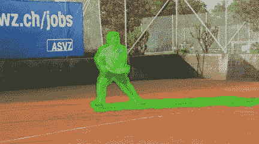

# 用于流引导视频修复的端到端框架

> 原文：<https://medium.com/mlearning-ai/end-to-end-framework-for-flow-guided-video-inpainting-c5e2d8b61d20?source=collection_archive---------4----------------------->

## [机器学习艺术](https://mlearning.substack.com)

## 尝试通过 colab 修复您的视频

[https://mlearning.substack.com](https://mlearning.substack.com)

最近的**视频修复系统**利用光流，通过沿其路径传播像素来捕捉跨帧的运动信息。手工制作的基于流程的程序被单独应用来构建整个修复…