# 基于开源数据的端到端图像识别—第 1 部分:数据采集和模型训练

> 原文：<https://medium.com/mlearning-ai/end-to-end-image-recognition-with-open-source-data-part-1-data-acquisition-model-training-fe9f4be9b915?source=collection_archive---------3----------------------->

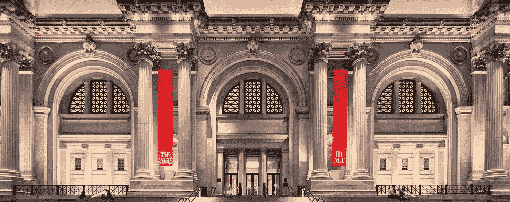

The Metropolitan Museum of Art in New York City

探索大都会艺术博物馆的艺术图像宝库，并预测一幅画来自哪里。

由于新冠肺炎疫情，世界各地的许多博物馆都已经关门，纽约大都会艺术博物馆也不例外。该博物馆通常被称为“大都会博物馆”，在两个地点展示了跨越 5000 年艺术史的大量藏品，分别位于上东区的第五大道和大都会修道院。它的收藏比每年向公众展示的作品要多得多，包括数十万件珍贵的艺术品。

对于那些有兴趣探索更多博物馆藏品的人，或者在疫情期间错过大都会博物馆的人，博物馆在其 [open API](https://metmuseum.github.io/) 上有一个广泛的数据列表。

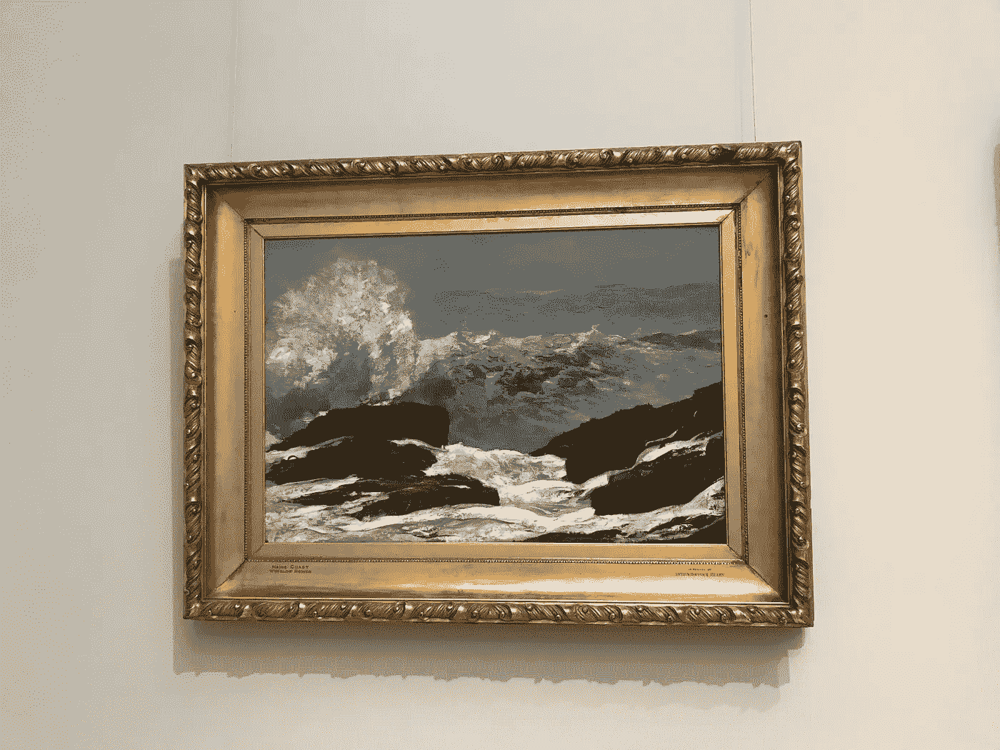

A painting contained in the dataset, seen inside the Met. Photo taken by the author.

## 关于 API

大都会博物馆的艺术收藏 API 提供了一个关于博物馆收藏的数据宝库。对于收藏中的一件给定作品，关于该艺术作品的数据，例如它的类别、标题、它来自的地区、它属于哪种文化，甚至是该艺术作品制作的年份或时间框架。

也许更令人兴奋的是，许多片段还包含片段的图像，作为每个对象的元数据的一部分存储为链接。

# 关于项目

Met 易于使用的 API 代表了一个使用开源数据尝试图像识别技术的绝佳机会。

在这个系列(第 2 部分[这里](https://data4help.medium.com/end-to-end-image-recognition-with-open-source-data-part-2-model-deployment-with-plotly-dash-and-3c8608b99faa))中，我们将介绍如何使用通过 Met 的 API 获得的开源数据，以及如何使用卷积神经网络为自动图像识别准备图像。然后我们将讨论训练这个模型来预测一幅画来自哪个文化。

最后，在本系列的下一篇文章中，我们将展示如何将绘画文化预测模型部署为交互式仪表板，用户可以在其中自己尝试分类器。

目标是展示使用网络上免费提供的开源数据和免费的开源部署工具来创建一个用于图像识别的工作机器学习项目是多么容易。

## 使用 API 访问数据

这个项目的第一步当然是通过 Met 的 API 访问可用的数据。

该 API 非常简单易用:它不需要任何注册或访问令牌。Met 集合中的所有对象都通过一个名为`objectID`的键进行组织。第一个 API 端点称为“Objects ”,它只是为每个可能的对象返回一个所有可能的 objectIDs 列表。接下来，使用这个列表，我们可以调用名为“Object”的下一个 API 端点，它获取单个对象的 objectID 并返回关于该对象的数据。

最后，为了获取对象的图像，我们对保存在每个对象数据中名为“primaryImageSmall”的数据字段下的链接进行请求调用。如果存在链接，我们可以用它来下载。它链接到的 jpg 文件。

下面的代码显示了访问数据的过程:

与 web 抓取一样，访问 API 有时会涉及处理错误。在访问数据的代码中，我们可以看到出现了问题并且必须处理，主要是条件语句和异常。例如，并非所有项目都有相关联的图像。此外，并不是所有的图片链接都有效。用一个新的数据集处理这些问题总是涉及一些试错。

# 探索和分析数据

既然我们已经从他们的免费 API 下载了所有的气象数据，是时候看看我们有什么了。

总的来说，我们获得了大约 130，000 个物体的图像数据。除了对象图像，数据还包含 57 列关于艺术品的元数据。下表显示了在这些列中找到的给定示例艺术品(来自日本的印刷品)的数据:

Example artwork, “Four Friends of Calligraphy: Lady Komachi”

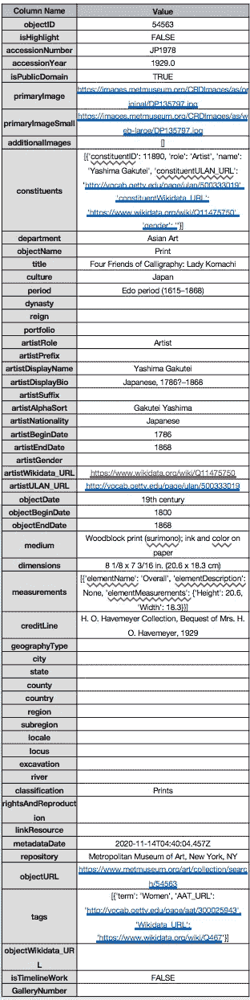

Metadata values for the example artwork

我们可以看到，对于给定的作品，只有一些元数据列包含数据。

然而，通过查看元数据列，我们看到未来机器学习模型的潜在目标变量的许多选项，我们可以使用这些数据进行训练。例如，我们可以为对象的类型，或者它的起源/文化的国家，或者它的时间周期或时代建立一个分类器。

在决定我们的目标变量是什么之前，我们首先直接将图像可视化，以感受收藏中的艺术作品组合。这也将有助于我们了解可用于预测给定目标变量的数据的相对数量和质量。例如，在示例图像的元数据中，我们看到国家和地区字段是空白的。如果集合中的许多其他部分也是如此，那么该变量可能不是用作目标变量的最佳选择。

我们的第一个可视化是图像数据随机采样的网格图，如下所示。

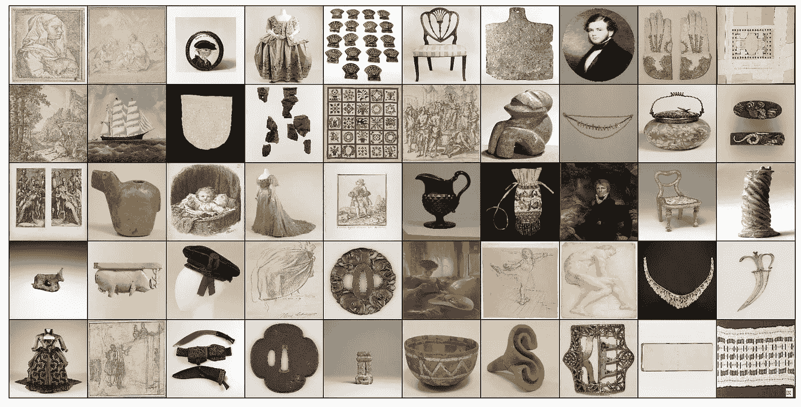

Sample images from the Met collection

正如我们所见，该系列包含许多不同类型的艺术品，从绘画、素描到陶瓷、时装和家具。此外，大多数图像是彩色的，但一些图像是黑白的。创建图像网格的代码如下所示。

接下来，我们探索数据的组成。我们的目标是回答这样的问题:我们有多少来自每种文化的艺术作品？我们的数据集中有多少幅画？几幅画？多少雕塑？最常用的媒介是什么？

为了解决这些问题，我们将创建一些基本的分析图。在第一个情节中，我们看了收藏品中各种类型的艺术品。

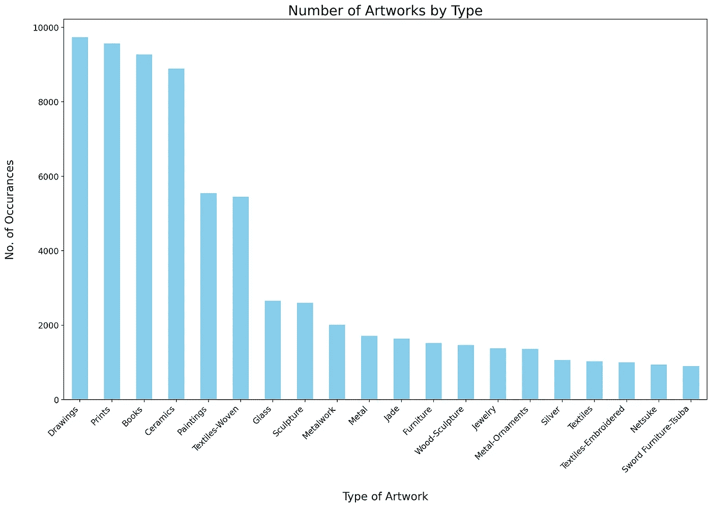

在这个最初的可视化中，我们可以看到数据集包含许多不同类型的艺术品的良好平衡。我们也看到一些艺术品类型有多个名字或别名，如“金属制品”、“金属”和“金属饰品”。这将是以后训练模型时要记住的事情。

鉴于有超过 450 种不同类别的艺术品，我们认为这太多了，难以分类，特别是考虑到许多类别没有太多样本。相反，我们只选择了一种艺术品类型，即**画**，并试图预测这幅画来自哪个国家。国家实际上掌握在一个叫做“文化”的变量中。

下一个图像显示了每个国家的绘画数量。

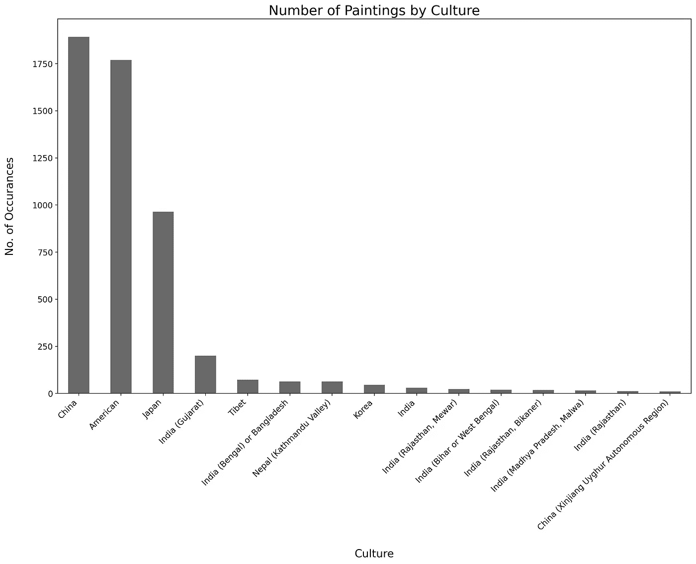

我们看到，大多数画作来自中国或美国，日本排在第三位。还有很多来自印度各个地区的画作。

最后，我们决定训练一个分类模型，对样本画最多的前 4 个国家的图像进行分类:**中国、日本、美国**和**印度**。对于印度，我们将文化名称中包含“印度”一词的所有绘画归为一类。

接下来，我们想看看是否能用我们“天真”的人类眼睛来辨别不同文化的绘画之间的差异。为了做到这一点，我们用 4 种文化中的每一种画创建了一个图像网格。这些网格如下所示。

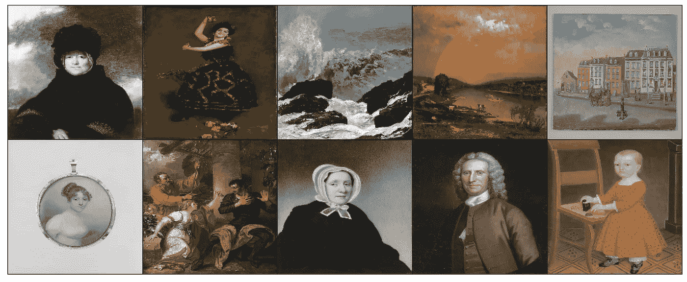

Example paintings for the “American” culture

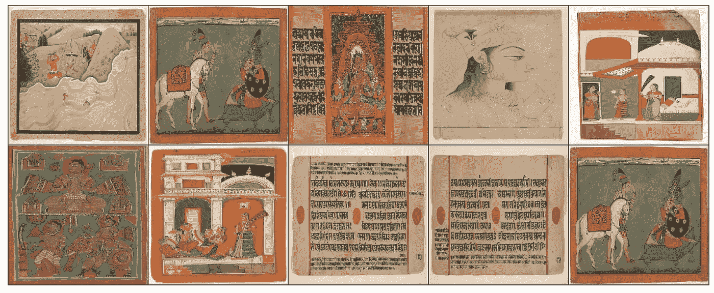

Example paintings for the “Indian” culture

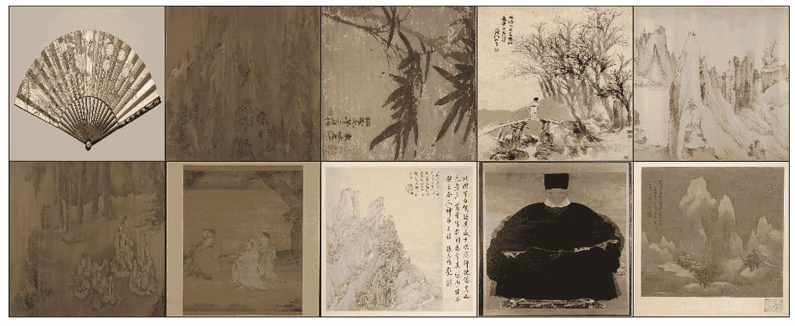

Example paintings from the “Chinese” culture

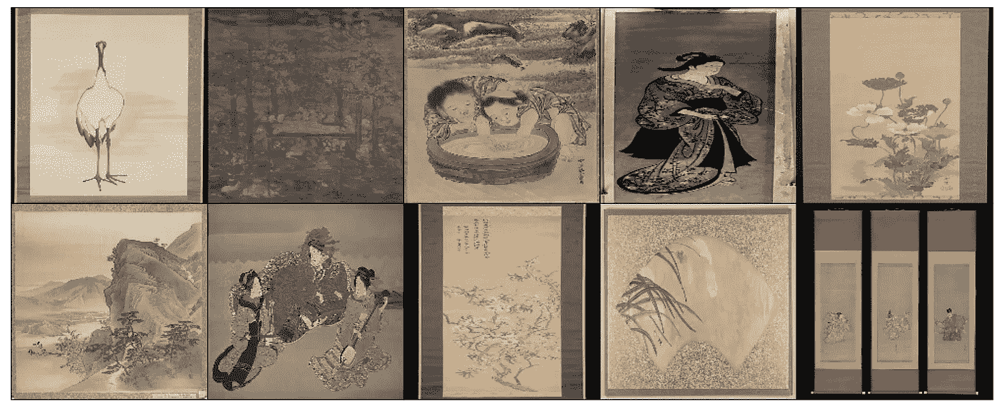

Example paintings from “Japanese” culture

在我们的培训数据集中看到 4 种文化在风格上的差异是很有趣的。例如，来自印度的绘画中使用的颜色是非常明显的，它们经常在画的周围包含一个边界。美国绘画倾向于包含许多肖像和风景。中国和日本的绘画倾向于包括更多简约的自然场景，例如展示一两朵花或鸟。许多来自两种文化的绘画也在绘画的一侧加入了书法元素。然而，我们一致认为，我们未经训练的西方眼睛很难立即认出一幅画是来自日本还是中国。看看我们的模型是否能够比我们更好地识别差异，这将是非常有趣的！

现在我们已经可视化了我们的数据，并决定了我们的绘画起源文化的目标变量，是时候开始为建模准备我们的数据了。

# 为建模准备数据

为了进行图像分类，我们必须将我们的训练数据图像转换为模型可以阅读和理解的数字。为此，我们将使用开源包 **OpenCV** 。

OpenCV 包含的工具和函数可以完成几乎所有的预处理步骤，使我们的图像数据为建模做好准备。更好的是，这些命令中的大多数可以在一行代码中串在一起。这可以从下面的函数中看出。

让我们看一下这段代码的各个部分在做什么。

首先，我们定义图像的新尺寸。原始图像的大小各不相同，但是 ML 模型要求输入数据的维度保持一致。在这里，我们将所有的图像整形为一个 150x150 像素的正方形。这是通过函数`cv2.resize()`完成的。注意，我们将这些定义的行和列作为第二个参数传递给该函数。第一个参数是另一个 openCV 函数`cv2.image`的输出。这个函数读入一个图像。我们使用参数`cv2.IMREAD_COLOR`告诉 openCV 该图像是彩色图像，而不是黑白图像。我们传递给`cv2.resize()`的最后一个参数是 interpolate。这就是调整大小的方法。您可以在此阅读更多关于此参数[的各种选项。](https://chadrick-kwag.net/cv2-resize-interpolation-methods/)

这个 openCV 函数字符串返回一个形状为(150，150，3)的三维 numpy 数组。这意味着它包含 3 个矩阵，每个矩阵为 150x150。这 3 个中的每一个都包含一个颜色通道的数据，即红色、绿色和蓝色(RGB)。我们将这些三维数组中的每一个添加到我们的训练数据数组中，称为`x`。同时，我们将数据的标签添加到名为`y`的标签数组中。

现在我们已经调整了数据的大小并保存了数据，我们可以应用另一个预处理步骤，通过缩放、移动图像等方式稍微改变图像来增加和增强我们的数据。这是通过 Keras 的一个名为`ImageDataGenerator()`的类来完成的。这个类所做的是将这些小的变化应用到训练图像，在这个过程中生成一些额外的数据。这个类最好的地方是它的输出可以作为输入直接输入到我们的 ML 模型中。

应用图像数据生成器的代码如下所示。

请注意，我们需要两个不同的生成器:一个用于生成额外的训练数据，另一个用于维持测试数据。测试数据生成器仅将重新缩放应用于图像像素，并且不生成任何附加数据。还要注意，在测试数据生成器中，我们将批量大小更改为 1。这是为了使生成器一次只返回一幅图像，并使图像与我们的预测标签保持一致。

# 模型建立和培训

既然我们已经准备好了训练和测试数据生成器，那么是时候设置和训练我们的模型了！

为了建立我们的模型，我们将使用流行的深度学习框架 keras。Keras 构建在 TensorFlow 之上，旨在提供比原生 TensorFlow 更容易使用的 API。

在选择了我们的深度学习框架之后，下一步就是选择一个模型架构来实现。在深度学习中，模型架构指的是结合起来形成神经网络的层的数量、形状和种类。几乎有无限的架构组合，并且几乎每天都有新的论文提出新的组合。对于这个项目，我们采用了一种通用的图像识别架构，这也可以在[这篇博文](https://towardsdatascience.com/image-detection-from-scratch-in-keras-f314872006c9)中看到，并且与[这篇博文](/@ageitgey/machine-learning-is-fun-part-3-deep-learning-and-convolutional-neural-networks-f40359318721)非常相似，只是省略了漏层。

请注意，网络的最后一层的输出大小为 4:这是因为我们有 4 个可以预测的潜在类别，即日本、美国、中国和印度的 4 种文化。每个输出节点表示图像属于一个类别的概率。如果这是一个二元分类问题，如垃圾邮件分类，我们的最终层的输出大小将为 2，其中一个输出表示电子邮件属于肯定类别(是垃圾邮件)的概率，另一个表示它不属于肯定类别(不是垃圾邮件)的概率。

类似地，我们在最后使用`softmax`的激活函数，因为这是多类分类问题最常见的[。对于二进制分类问题，我们将把它改为`sigmoid`。](https://datascience.stackexchange.com/questions/10048/what-is-the-best-keras-model-for-multi-class-classification)

我们选择`categorical_crossentropy`作为损失函数，因为这是一个多分类问题。[这篇很棒的博文](https://machinelearningmastery.com/how-to-choose-loss-functions-when-training-deep-learning-neural-networks/)提供了更多关于为你正在应用深度学习的其他类型的问题选择损失函数的信息。

使用这个相当简单的架构，我们准备开始训练我们的模型。我们开始时只有 50 个训练时期，但后来增加到 100 个，看起来模型在 50 个时期后仍在学习。

下图显示了在培训期间培训和验证的准确性是如何提高的。

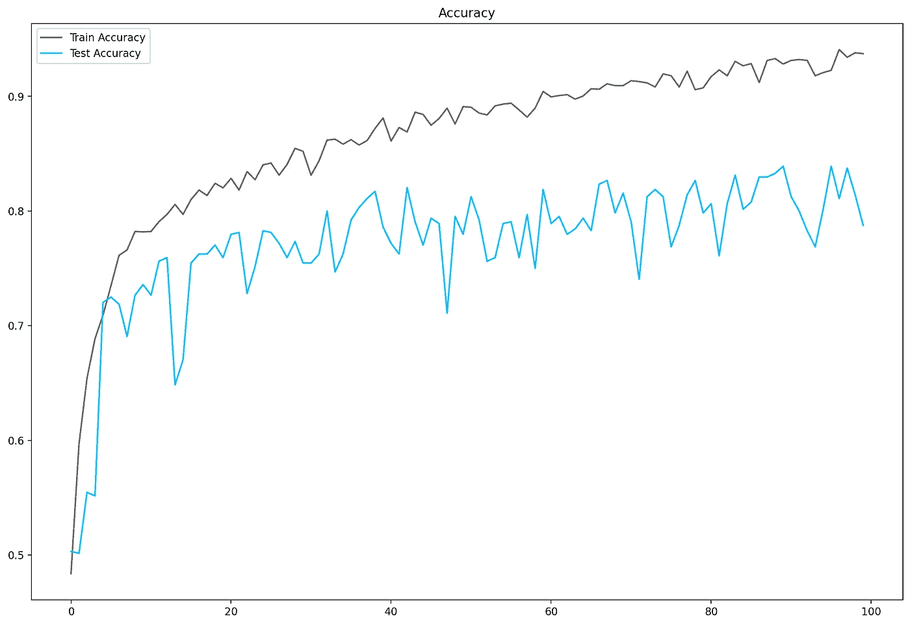

Accuracy over the 100 training epochs

我们可以看到，在训练结束时，验证准确率徘徊在 80%左右。

# 包装它

到目前为止，我们完成了什么？我们分析了使用 Met 的 API 下载的数据，并使用这些数据决定了一个预测问题。我们决定仅限于绘画图像，并预测这些画属于 4 种文化中的哪一种:中国、日本、印度或美国。然后，我们对图像进行预处理，并将其输入到具有 4 个输出节点的卷积神经网络中，每个输出节点对应一个类别。

既然我们已经有了一个训练好的模型，下一步就是让这个模型可以根据新数据进行预测。这个过程叫做**部署**。

在下一篇博文的[中，我们将展示如何构建一个简单的前端仪表板，并将我们训练有素的机器学习模型部署为一个实时后端应用程序。](https://data4help.medium.com/end-to-end-image-recognition-with-open-source-data-part-2-model-deployment-with-plotly-dash-and-3c8608b99faa?sk=7675b8f30a40369e079803baef3ffde2)