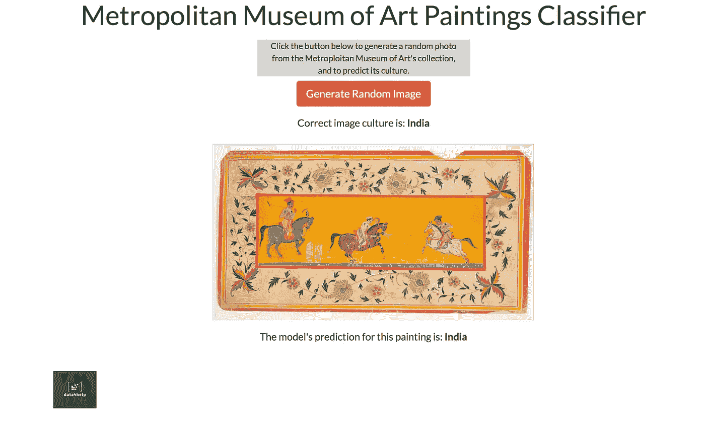
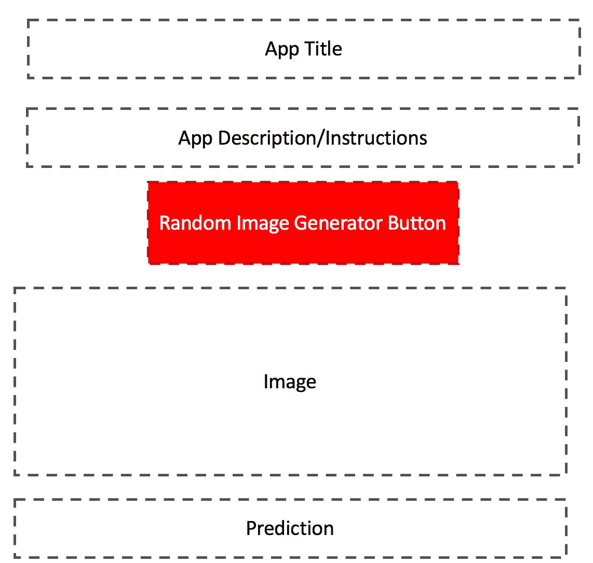
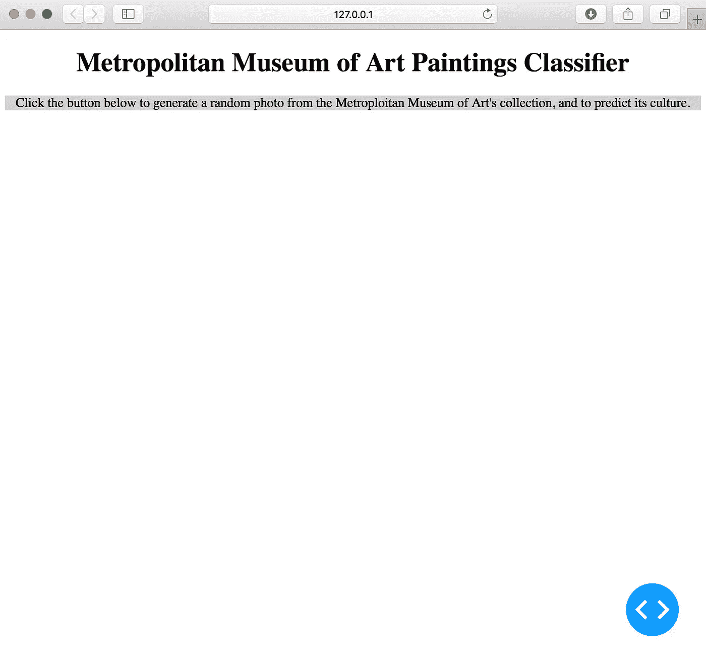
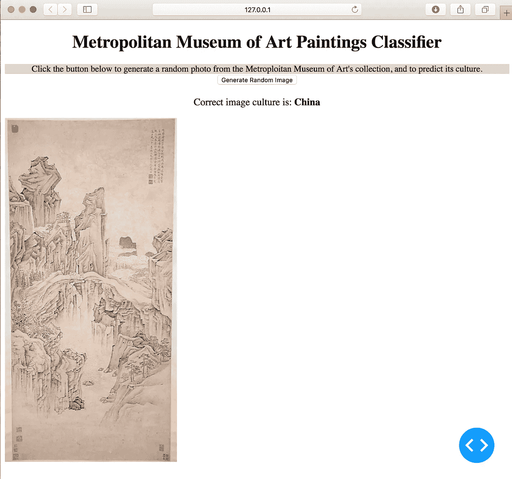
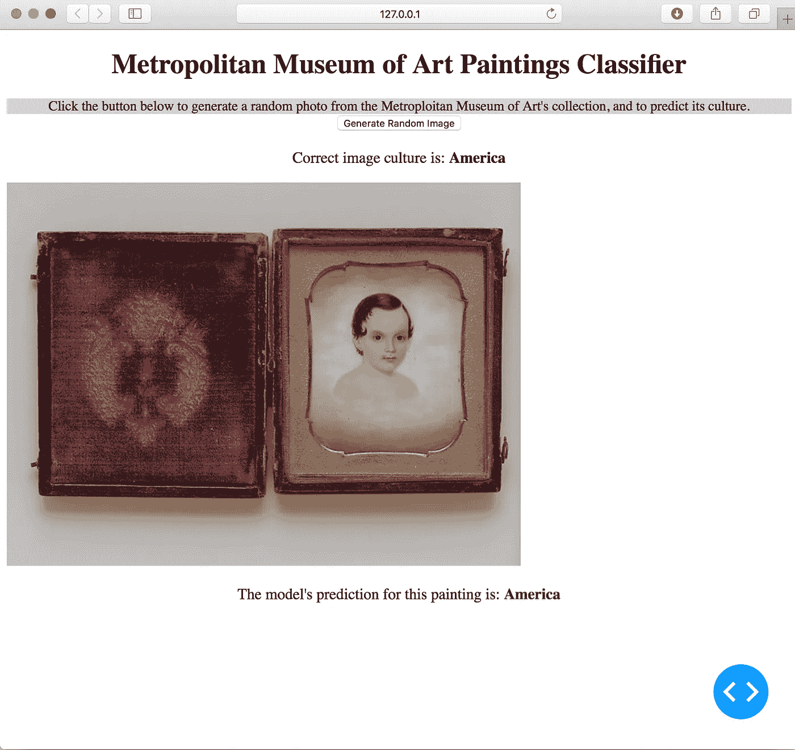
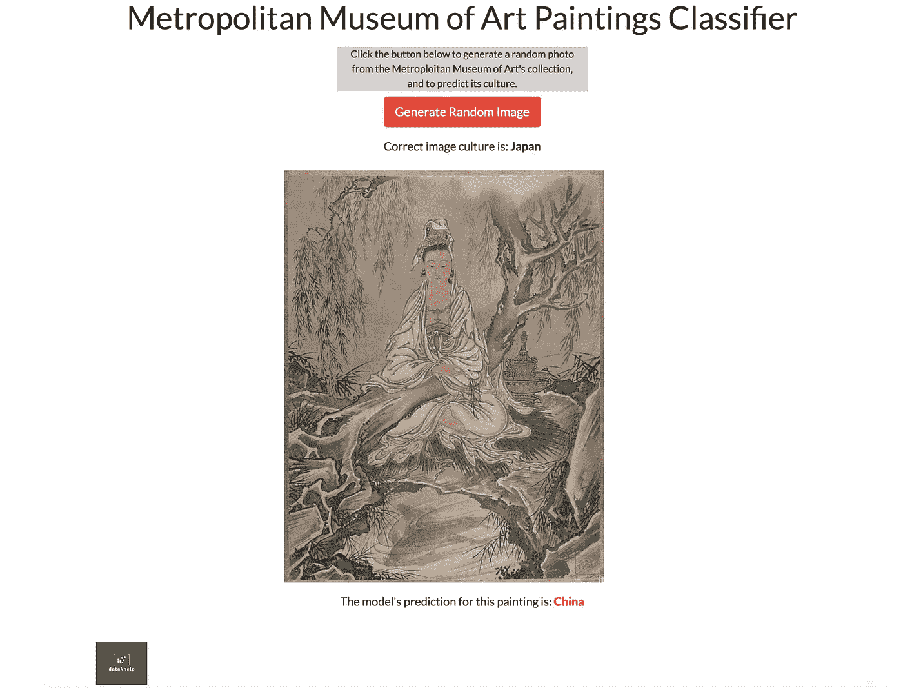

# 使用开源数据的端到端图像识别—第 2 部分:使用 Plotly Dash 和 Heroku 的模型部署

> 原文：<https://medium.com/mlearning-ai/end-to-end-image-recognition-with-open-source-data-part-2-model-deployment-with-plotly-dash-and-3c8608b99faa?source=collection_archive---------2----------------------->

Dash 部署初学者指南:部署一个对纽约大都会艺术博物馆的绘画进行分类的模型

在本系列的第 1 部分[中，我们展示了我们如何从大都会艺术博物馆收集和分析开源图像数据，以构建一个图像分类器，根据画作的来源国对其进行分类。在本帖中，我们将更进一步，展示如何利用这个训练有素的模型，并通过一个交互式前端仪表板将它变为现实。](https://data4help.medium.com/end-to-end-image-recognition-with-open-source-data-part-1-data-acquisition-model-training-fe9f4be9b915)

这篇文章旨在为那些对部署他们的模型和学习 Plotly Dash 和 Heroku 的基础知识感兴趣的数据科学家提供一个教程。

# 如何部署？

部署的第一步是决定如何以及在哪里部署你的应用。你可能会问自己有哪些选择，以及如何最好地展示你的预测。这有很多选择。

最直接的选择之一是将您的模型部署为一个简单的 web 应用程序。这意味着您的模型变成了一个可以接受请求的 web 服务。假设最初用于训练模型的输入要素相同，您可以将请求视为模型预测的订单。然后，web 服务通过模型运行这些输入要素，并将预测作为输出返回。web 服务的美妙之处在于，它的输出几乎可以被任何其他应用程序使用，包括用其他语言编写的应用程序。这使得简单的 web 服务非常适合与其他计算机组件进行交互。在这里，我们将介绍如何将您的模型部署为一个简单的 web 应用[。](/swlh/bringing-your-ml-models-to-life-with-flask-620c21461c8)

但是如果我们不太在意自己的预测很容易被其他 app 消费呢？如果我们更关心它们容易被人类吃掉呢？图像识别尤其是机器学习的一个高度视觉化的领域。在这种情况下，不仅仅是从 web 服务中以文本字符串的形式返回预测，而是将它与相应的图像一起显示，通常是有意义的。

为此，我们需要构建一个前端可视化应用程序。为此，我们将使用 Plotly Dash，这是一个用 Python 构建前端应用程序和仪表板的流行框架。本质上，Dash 允许你用 Python 写 HTML 和 CSS 代码。这两种语言通常用于创建网站，以添加按钮和滚动条等元素，并更改网页中的颜色和字体。

# 我们应用的架构

在深入研究代码之前，重要的是要考虑我们希望我们的前端应用程序是什么样子，以及我们的用户将如何与之交互。

## 模型输入

第一步是决定如何将输入图像输入到我们的模型中。我们为此考虑了多种不同的选择。例如，用户可以选择上传一幅新的、看不见的画。然而，这需要用户做更多的工作，因为他们首先需要找到并下载一张图片，然后上传到应用程序中。我们的主要目标是让用户能够与模型互动并立即看到预测，因此我们开始考虑用户可以生成模型预测图像的其他方式。

最终，我们决定最好是让用户从大都会博物馆的收藏中随机生成一幅图像，并在此基础上进行预测。

另一种选择是利用下拉选择器来允许用户选择特定的绘画，或者从给定的文化中选择绘画。

## 模型输出

一旦我们决定创建一个随机图像生成器来生成模型的输入图像，我们就必须决定输出预测应该如何显示。

我们决定简单地在图像下面显示预测，用预测标签的颜色变化来表示预测是否正确:如果预测不正确，预测标签应该显示为红色，如果正确，则显示为绿色。

另一个想法是显示模型预测的每个文化标签的相对可能性，而不是简单地显示可能性最高的标签(最终预测)。对于那些被模型错误预测的画作来说，这将是特别有趣的。

设计我们的应用程序架构的最后一步是勾画出我们希望我们的简单应用程序是什么样子，这样我们就知道在哪里放置每个组件。这个粗略的轮廓如下所示。

Rough sketch of the layout of the app

# 构建应用程序

既然我们已经决定了应用程序的输入和输出，也就是说它应该显示什么以及应用程序的用户应该如何与之交互，那么是时候开始使用 Plotly Dash 来构建它了。

构建 Dash 应用程序的第一步是初始化应用程序。只要运行包含应用程序代码的 Python 脚本(方便地称为 app.py ),就会调用该应用程序。当调用应用程序时，它通过本地端口呈现。在命令行中运行 app.py 脚本后，端口地址将显示在终端中。点击这个本地端口链接会启动一个显示应用程序的浏览器页面。这一步的简单启动代码如下所示。启动一个 app 就这么简单！

Starter script for building your first Dash app

在`app.run_server()`调用中，我们设置了`debug=True`,使我们的应用程序能够在我们做出更改时自动更新。

一开始，这款应用只是一个空白的网页。**要构建我们的应用程序，我们只需将 Dash 组件添加到这个空白页，按照我们希望它们在网页上出现的顺序。**

该应用程序的所有组件都将存在于`app.layout`的“孩子”列表中。为了增加应用程序的额外功能，我们只需将 [Dash 组件](https://dash.plotly.com/dash-core-components)添加到这个子列表中。Dash 组件几乎适用于你想添加到应用程序中的任何东西，包括交互式图表和下拉菜单，也适用于更简单的组件，如文本块。

为了决定在哪里添加哪些组件，我们参考了我们在上一节中绘制的粗略应用草图。第一步是添加标题。这个组件很容易添加，因为它只包含文本。为了添加它，我们使用行和列的 [Dash 引导组件](https://dash-bootstrap-components.opensource.faculty.ai/)向我们的应用程序页面添加一个新行。Dash bootstrap 组件在基本组件之外添加了一些附加组件，并且基于 CSS 中流行的 [bootstrap 框架](https://www.w3schools.com/whatis/whatis_bootstrap.asp)。这些列和行元素帮助我们分隔应用程序的组件。

第一个组件的代码，以及标题下类似的描述部分，如下所示。

我们首先为每个元素添加一行，然后添加一列。最后，我们添加一个 HTML 组件，说明我们想要的文本类型。标题将在 HTML，H1 提供的最大标题尺寸。描述将以普通文本的形式出现，这里称为`Font`。

然后，我们使用关键字参数字典来指定颜色和文本对齐等内容。这段代码的输出如下所示。

The first text components of our basic Dash app

在这一点上，我们不太担心应用程序的字体看起来如何，主要只是关心功能和获得必要的部分。

## 使用应用程序回调

下一步是创建随机图像生成器按钮。这一步比我们在上一步中创建的静态文本组件要复杂一些，因为我们希望按钮实际上激活一些功能，即呈现一个图像。

为此，我们需要使用一个叫做`@app.callback()`的重要破折号特性。这个特性是一个 Python 装饰器，从函数开头的`@`符号可以看出。装饰器就放在一个函数的前面，为它增加一些额外的功能。在这种情况下，装饰者让我们编写的任何函数都与我们的 Dash 应用程序的组件一起工作。它使用 Dash `Input()`和`Output()`组件使我们编写的任何函数的输入和输出可被应用程序中的其他组件更新。例如，当我们的“随机图像生成器”按钮被点击时，我们可以使用这个点击动作作为函数的输入，告诉它运行。每次按钮点击的输出可以返回到应用程序的其他部分。下面的代码显示了“随机图像生成器”按钮的工作原理。它使用由我们的训练数据制作的简单 CSV，其中只包含每幅画的两列:一列包含其标签，它被标记为文化，另一列包含到大都会博物馆服务器上相应图像的超链接。

由于我们不希望`image_culture`立即显示，而是保存，我们将其作为一个组件返回，并将其关键字参数设置为不显示。我们对另一个名为`random_image`的输出进行同样的操作。这是因为它实际上只是图像的 URL 链接，而不是图像本身。我们需要将它传递到另一个 Dash 组件中，以便完全呈现图像。

下一步显示为添加到下面的代码中。我们还添加了一个额外的组件，用于在图像上打印出绘画的正确文化。

请注意，这里我们使用了两个额外的回调函数:一个简单地生成一个标签，该标签在每次单击按钮时使用新的图像文化进行更新，另一个使用图像的 URL 链接来获取图像数据并在应用程序中呈现它。这些更新后的应用程序的新输出如下所示。

The “random image generator” button now generates and displays a random painting from the Met’s collection.

## 整合 ML 模型

我们现在已经对模型的输入进行了排序:我们的应用程序允许用户根据我们的需要从大都会博物馆的收藏中生成一张随机图像，并且它还会显示该图像。

下一步是使用我们的模型对这些新数据进行预测。为此，我们将从本系列第 1 部分讨论的模型训练阶段加载我们保存的模型，并使用它的`.predict()`方法为新生成的图像生成预测。

我们还必须确保对这些新图像应用与训练模型时相同的预处理步骤。

首先，我们加载训练后保存为泡菜的训练模型。我们还设置了一些重要的变量，即图像的高度和宽度。

我们更新的应用程序(如下所示)现在在图像下方显示模型的预测。

请注意，在代码中，我们如何通过简单地将区域性标签作为用条件检查更新的变量来指定其颜色的变化。

我们的应用程序现在做了我们希望它做的一切:为用户自动从集合中生成随机图像，渲染图像，并返回颜色编码的预测。构建应用程序的最后一步只是改善应用程序的外观和感觉，并修复对齐。为此，我们调整各种组件的宽度和对齐方式。接下来，我们添加一个 CSS 样式表来更改字体。

瞧！应用程序已完成:

The final app, showing a mis-classified painting.

# 使用 Heroku 部署应用程序

现在，我们的应用程序在本地运行良好，看起来符合我们的要求，是时候向全世界展示了。

为此，我们使用 Heroku，这是一个免费的开源应用托管平台。按照他们的[非常容易使用的说明](https://devcenter.heroku.com/articles/getting-started-with-python)，我们能够部署应用程序。这些步骤包括添加一个需求文件和 Procfile，并将您的代码库推送到 Heroku。

然而，在将我们的代码推送到 Heroku 时，我们确实遇到了一些小错误和问题。我们得到一个错误，说“slug size”太大了，这实质上意味着我们的代码和依赖项太大了，无法在 Heroku 上免费部署。TensorFlow 可能太大了，由于 Heroku 目前不提供 GPU 支持(这是标准 TensorFlow 库作为一个依赖项如此庞大的很大一部分原因)，我们切换到了`tensorflow-cpu`而不是标准 Tensorflow。这也导致我们不得不切换到不同版本的 CV2，我们使用的预处理库，叫做`opencv-python-headless`。这些变化将我们的项目规模缩小到足以在 Heroku 上免费部署。如果您计划将来在 Heroku 上部署您的图像识别项目，请记住这一点。

现在这款应用已经在 Heroku 上线，你可以在这里试用一下: [**试用这款应用！**](https://met-paintings-classifier.herokuapp.com)