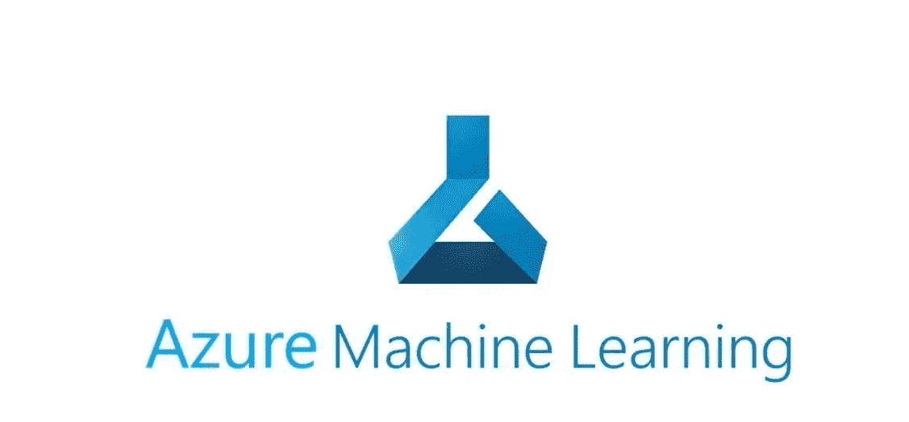

# 使用 Azure Machine Learning Studio Designer 的端到端 ML 管道

> 原文：<https://medium.com/mlearning-ai/end-to-end-ml-pipeline-using-azure-machine-learning-studio-designer-63f726a7366f?source=collection_archive---------1----------------------->

Azure Machine Learning 是一个云服务，用于加速和管理机器学习项目生命周期。机器学习专业人员、数据科学家和工程师可以在日常工作流程中使用它:训练和部署模型，以及管理 MLOps。

你可以在 Azure Machine Learning 中创建一个模型，或者使用一个从开源构建的模型…