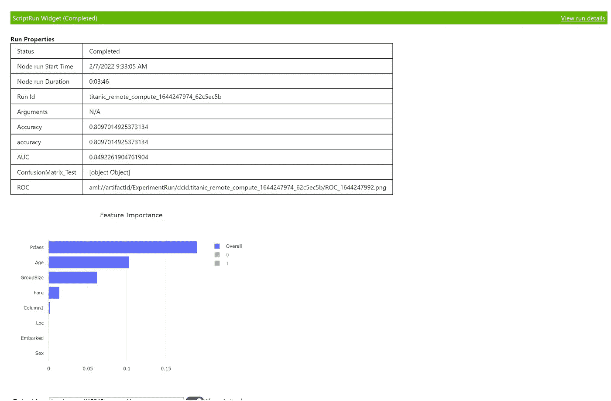
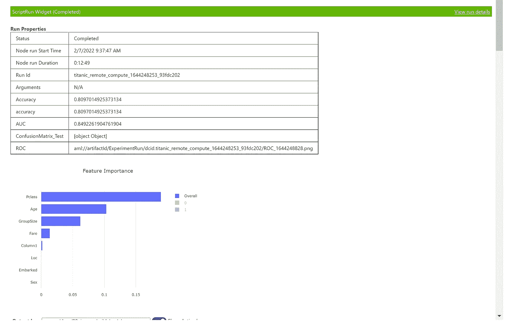
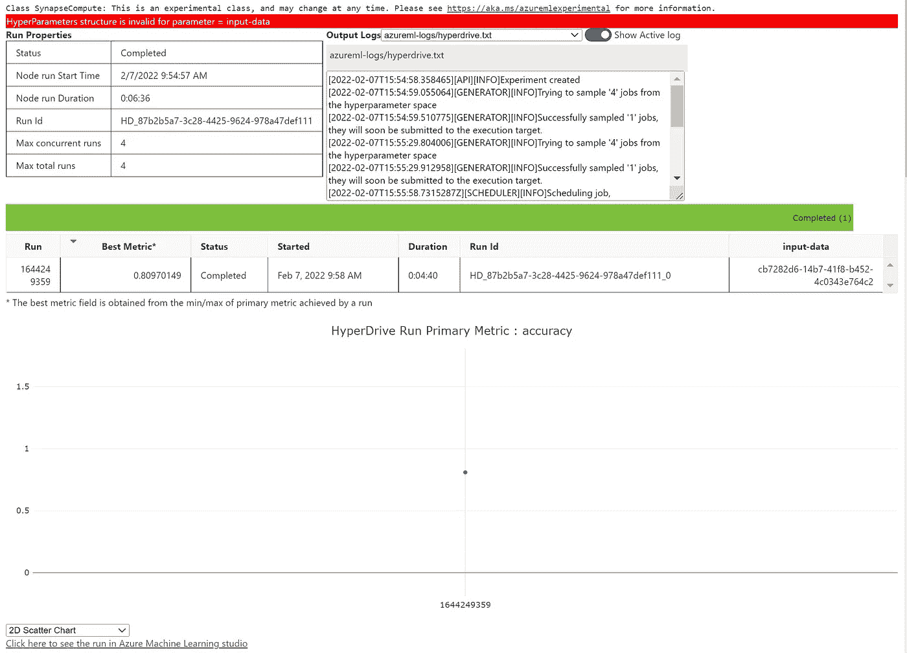

# 反洗钱渠道端到端负责任的人工智能

> 原文：<https://medium.com/mlearning-ai/end-to-end-responsible-ai-with-aml-pipelines-b104705220bc?source=collection_archive---------2----------------------->

# 在培训脚本中使用负责任的 AI 和 Azure ML 进行端到端分类

# 先决条件

*   Azure 帐户
*   存储帐户
*   天蓝色 ML

# 设置

*   登录 Azure ML 工作区
*   使用 Python 3.6 和 Azure ML SDK 创建笔记本
*   让安装

```
!pip install raiwidgets
!pip install --upgrade raiwidgets
!pip install --upgrade pandas
```

*   安装后重启内核
*   测试安装

```
from raiwidgets import ResponsibleAIDashboard
from responsibleai import RAIInsights
```

# 代码/步骤

*   检查 AML 版本

```
import azureml.coreprint("SDK version:", azureml.core.VERSION)
```

*   发送诊断遥测

```
from azureml.telemetry import set_diagnostics_collectionset_diagnostics_collection(send_diagnostics=True)
```

*   登录 Azure ML 工作区

```
import azureml.core
from azureml.core import Workspace
import pandas as pd# Load the workspace from the saved config file
ws = Workspace.from_config()
print('Ready to use Azure ML {} to work with {}'.format(azureml.core.VERSION, ws.name))
```

*   加载数据
*   确保在相应的文件夹中有 titanic.csv

```
df= pd.read_csv('./Data/titanic.csv')
print(df.shape)
print(df.columns)df['Age'] = df.groupby(['Pclass', 'Sex'])['Age'].apply(lambda x: x.fillna(x.median()))
df.isnull().sum()
```

*   将客舱转换为 loc

```
df['Loc']= df['Cabin'].apply(lambda x: x[0] if pd.notnull(x) else 'X')
```

*   删除我们不需要的列

```
df.drop(['Cabin', 'Ticket'], axis=1, inplace=True)df.loc[:,'GroupSize'] = 1 + df['SibSp'] + df['Parch']
```

*   为空值填充 S

```
df['Embarked'] = df['Embarked'].fillna('S')
```

*   清理数据集

```
LABEL = 'Survived'
columns_to_keep = ['Pclass', 'Sex','Age', 'Fare', 'Embared', 'Deck', 'GroupSize']
columns_to_drop = ['Name','SibSp', 'Parch', 'Survived']
df_train = df
df = df_train.drop(['Name','SibSp', 'Parch', 'PassengerId'], axis=1)df.head(5)
```

*   创建培训文件夹

```
import os
script_folder = os.path.join(os.getcwd(), "train_remote")
print(script_folder)
os.makedirs(script_folder, exist_ok=True)
```

*   验证文件是否已上传

```
df.to_csv('./train_remote/titanic.csv')
df.head(2)
```

*   创建数据集

```
from azureml.core import Dataset#use default datastore retrieved from the workspace through the AML SDK
default_ds = ws.get_default_datastore() default_ds.upload_files(files=['./train_remote/titanic.csv'], # Upload the diabetes csv files in /data
                        target_path= 'Titanic-data', # Put it in a folder path in the datastore
                        overwrite=True, # Replace existing files of the same name
                        show_progress=True)
#Create a tabular dataset from the path on the datastore 
dataset = Dataset.Tabular.from_delimited_files(default_ds.path('Titanic-data/titanic.csv'))# Register the dataset
try:
    tab_data_set = dataset.register(workspace=ws, 
                                name= 'Titanic-tabular-dataset',
                                description='Tintanic data',
                                tags = {'format':'csv'},
                                create_new_version=True)
    print('Dataset registered.')
except Exception as ex:
        print(ex)
```

*   现在从数据集读取

```
# azureml-core of version 1.0.72 or higher is required
# azureml-dataprep[pandas] of version 1.1.34 or higher is required
from azureml.core import Workspace, Datasetsubscription_id = 'xxxxxxxxxxxxxxxxxxxx'
resource_group = 'RGName'
workspace_name = 'AMLWorkspaceName'workspace = Workspace(subscription_id, resource_group, workspace_name)dataset = Dataset.get_by_name(workspace, name='Titanic-tabular-dataset')
dataset.to_pandas_dataframe()
```

*   创造一个实验

```
from azureml.core.experiment import Experiment
experiment = Experiment(ws, 'titanic_remote_compute')
```

*   创建一个文件夹来存储培训脚本

```
import os
script_folder = os.path.join(os.getcwd(), "train")
print(script_folder)
os.makedirs(script_folder, exist_ok=True)
```

*   创建培训脚本

```
%%writefile $script_folder/training.pyimport os
import sys
import argparse
import joblib
import pandas as pd
import numpy as npfrom azureml.core import Run, Dataset, Workspace, Experimentfrom sklearn.compose import ColumnTransformer
from sklearn.impute import SimpleImputer
from sklearn.linear_model import LogisticRegression
from sklearn.model_selection import train_test_split
from sklearn.pipeline import Pipeline
from sklearn.preprocessing import OneHotEncoder, StandardScaler
from sklearn.metrics import roc_auc_score,roc_curve
from interpret.ext.blackbox import TabularExplainer
from azureml.interpret import ExplanationClientfrom raiwidgets import ResponsibleAIDashboard
from responsibleai import RAIInsights# Calculate model performance metrics
from sklearn.metrics import confusion_matriximport matplotlib.pyplot as pltfrom azureml.core import Model
from azureml.core.resource_configuration import ResourceConfigurationdef getRuntimeArgs():
    parser = argparse.ArgumentParser()

    parser = argparse.ArgumentParser()
    parser.add_argument("--input-data", type=str)
    args = parser.parse_args()
    return argsdef buildpreprocessorpipeline(X_raw):
    categorical_features = X_raw.select_dtypes(include=['object']).columns
    numeric_features = X_raw.select_dtypes(include=['float','int64']).columns categorical_transformer = Pipeline(steps=[('imputer', SimpleImputer(strategy='constant', fill_value="missing")),
                                              ('onehotencoder', OneHotEncoder(categories='auto', sparse=False, handle_unknown='ignore'))])
    numeric_transformer = Pipeline(steps=[('scaler', StandardScaler())])

    preprocessor = ColumnTransformer(
        transformers=[
            ('numeric', numeric_transformer, numeric_features),
            ('categorical', categorical_transformer, categorical_features)
        ], remainder="drop")

    return preprocessordef model_train(LABEL, df, run):  
    y_raw = df[LABEL]
    X_raw = df.drop([LABEL], axis=1)

     # Train test split
    X_train, X_test, y_train, y_test = train_test_split(X_raw, y_raw, test_size=0.3, random_state=0)

    lg = LogisticRegression(penalty='l2', C=1.0, solver='liblinear')
    preprocessor = buildpreprocessorpipeline(X_train)

    #estimator instance
    clf = Pipeline(steps=[('preprocessor', preprocessor),
                               ('regressor', lg)]) model = clf.fit(X_train, y_train)

    # calculate AUC
    y_scores = model.predict_proba(X_test)
    auc = roc_auc_score(y_test,y_scores[:,1])
    print('AUC: ' + str(auc))
    run.log('AUC', np.float(auc)) # calculate test accuracy
    y_hat = model.predict(X_test)
    acc = np.average(y_hat == y_test)
    print('Accuracy:', acc)
    run.log('Accuracy', np.float(acc)) # plot ROC curve
    fpr, tpr, thresholds = roc_curve(y_test, y_scores[:,1])
    fig = plt.figure(figsize=(6, 4))
    # Plot the diagonal 50% line
    plt.plot([0, 1], [0, 1], 'k--')
    # Plot the FPR and TPR achieved by our model
    plt.plot(fpr, tpr)
    plt.xlabel('False Positive Rate')
    plt.ylabel('True Positive Rate')
    plt.title('ROC Curve')
    run.log_image(name = "ROC", plot = fig)
    plt.show() # plot confusion matrix
    # Generate confusion matrix
    cmatrix = confusion_matrix(y_test, y_hat)
    cmatrix_json = {
        "schema_type": "confusion_matrix",
           "schema_version": "v1",
           "data": {
               "class_labels": ["0", "1"],
               "matrix": [
                   [int(x) for x in cmatrix[0]],
                   [int(x) for x in cmatrix[1]]
               ]
           }
    }

    run.log_confusion_matrix('ConfusionMatrix_Test', cmatrix_json)

    os.makedirs('outputs', exist_ok=True)

    model_file = os.path.join('outputs', 'titanic_model.pkl')
    joblib.dump(value=model, filename=model_file)

    run.upload_file(name='titanic_model.pkl', path_or_stream=model_file)
    run.log('accuracy', acc)
    run.set_tags({ 'Accuracy' : np.float(acc)})

    # Register the model
    print('Registering model...')
    run.register_model(model_path='titanic_model.pkl', model_name= 'titanic-model',
                   tags={'Model Type':'Logistic Regresssion'},
                   properties={'AUC': np.float(auc), 'Accuracy': np.float(acc)})

    #features = "'Column1', 'Pclass', 'Sex', 'Age', 'Fare', 'Embarked', 'Loc', 'GroupSize'"
    #df1 = df.drop('Survived', inplace=true)
    #df1 = df
    columns = ['Survived']
    #df = df.drop('Survived', axis=1, inplace=True)
    df = df.drop(columns, axis=1)
    print(df.columns)
    client = ExplanationClient.from_run(run)
    # Explain predictions on your local machine
    tabular_explainer = TabularExplainer(model, X_train, features=df.columns) # Explain overall model predictions (global explanation)
    # Passing in test dataset for evaluation examples - note it must be a representative sample of the original data
    # x_train can be passed as well, but with more examples explanations it will
    # take longer although they may be more accurate
    global_explanation = tabular_explainer.explain_global(X_test) # Uploading model explanation data for storage or visualization in webUX
    # The explanation can then be downloaded on any compute
    comment = 'Global explanation on regression model trained on boston dataset'
    client.upload_model_explanation(global_explanation, comment=comment, model_id=model)
    categorical_features = X_raw.select_dtypes(include=['object']).columns
    target_feature = LABEL
    train_data = X_train.copy()
    test_data = X_test.copy()
    train_data[target_feature] = y_train
    test_data[target_feature] = y_test
    #data.feature_names rai_insights = RAIInsights(model, train_data, test_data, LABEL, 'classification', 
                               categorical_features=['Sex','Embarked','Loc'])
    # Interpretability
    rai_insights.explainer.add()
    # Error Analysis
    rai_insights.error_analysis.add()
    # Counterfactuals: accepts total number of counterfactuals to generate, the range that their label should fall under, 
    # and a list of strings of categorical feature names
    rai_insights.counterfactual.add(total_CFs=20, desired_class='opposite')
    rai_insights.compute()
    ResponsibleAIDashboard(rai_insights) return model, auc, acc
    # Save the trained model

def main():
    # Create an Azure ML experiment in your workspace
    args = getRuntimeArgs()

    run = Run.get_context()
    client = ExplanationClient.from_run(run) dataset_dir = './dataset/'
    os.makedirs(dataset_dir, exist_ok=True)
    ws = run.experiment.workspace
    print(ws)    print("Loading Data...")
    dataset = Dataset.get_by_id(ws, id=args.input_data)
    # Load a TabularDataset & save into pandas DataFrame
    df = dataset.to_pandas_dataframe()

    print(df.head(5))

    model, auc, acc = model_train('Survived', df, run)

    #os.makedirs('outputs', exist_ok=True)

    #model_file = os.path.join('outputs', 'titanic_model.pkl')
    #joblib.dump(value=model, filename=model_file)

    #run.upload_file(name='titanic_model.pkl', path_or_stream=model_file)
    #run.log('accuracy', acc)
    #run.set_tags({ 'Accuracy' : np.float(acc)})

    # Register the model
    #print('Registering model...')
    #run.register_model(model_path='titanic_model.pkl', model_name= 'titanic-model',
    #               tags={'Model Type':'Logistic Regresssion'},
    #               properties={'AUC': np.float(auc), 'Accuracy': np.float(acc)})
       run.complete()if __name__ == "__main__":
    main()
```

*   创建环境文件

```
%%writefile $script_folder/experiment_env.yml
name: experiment_env
dependencies:
  # The python interpreter version.
  # Currently Azure ML only supports 3.5.2 and later.
- python=3.6.2
- scikit-learn
- ipykernel
- matplotlib
- pandas
- pip
- pip:
  - azureml-defaults
  - pyarrow
  - interpret
  - azureml-interpret
  - lightgbm
  - raiwidgets
```

*   创建环境对象并提供上述文件

```
from azureml.core import Environment# Create a Python environment for the experiment (from a .yml file)
experiment_env = Environment.from_conda_specification('experiment-env', script_folder + "/experiment_env.yml")# Let Azure ML manage dependencies
experiment_env.python.user_managed_dependencies = False # Print the environment details
print(experiment_env.name, 'defined.')
print(experiment_env.python.conda_dependencies.serialize_to_string())
```

*   现在在本地模式下运行实验

```
import azureml.core.runconfig
from azureml.core import Environment, Experiment
from azureml.core import ScriptRunConfig
from azureml.widgets import RunDetails# Get the training dataset
titanic_ds = ws.datasets.get('Titanic-tabular-dataset')# Create a script config
script_config = ScriptRunConfig(source_directory=script_folder,
                                script='training.py',
                                arguments=['--input-data', titanic_ds.as_named_input('titanic')], # Reference to dataset
                                environment=experiment_env) # submit the experiment
run = experiment.submit(config=script_config)
RunDetails(run).show()
run.wait_for_completion()
```



*   本地运行是确保代码正常工作
*   实际代码应该在远程计算机上运行
*   现在创建远程计算机群集

```
from azureml.core.compute import ComputeTarget, AmlCompute
from azureml.core.compute_target import ComputeTargetExceptioncluster_name = "cpu-cluster"try:
    # Check for existing compute target
    training_cluster = ComputeTarget(workspace=ws, name=cluster_name)
    print('Found existing cluster, use it.')
except ComputeTargetException:
    # If it doesn't already exist, create it
    try:
        compute_config = AmlCompute.provisioning_configuration(vm_size='STANDARD_DS11_V2', max_nodes=2)
        training_cluster = ComputeTarget.create(ws, cluster_name, compute_config)
        training_cluster.wait_for_completion(show_output=True)
    except Exception as ex:
        print(ex)
```

*   现在在远程模式下运行实验

```
import azureml.core.runconfig
from azureml.core import Environment, Experiment
from azureml.core import ScriptRunConfig
from azureml.widgets import RunDetails# Get the training dataset
titanic_ds = ws.datasets.get('Titanic-tabular-dataset')# Create a script config
script_config = ScriptRunConfig(source_directory=script_folder,
                                script='training.py',
                                arguments=['--input-data', titanic_ds.as_named_input('titanic')], # Reference to dataset
                                environment=experiment_env,
                                compute_target=cluster_name)# submit the experiment
run = experiment.submit(config=script_config)
RunDetails(run).show()
```



*   现在运行超空间引擎优化模型

```
from azureml.core.run import Run
run_logger = Run.get_context()
#run_logger.log("accuracy", float(accuracy))
```

*   设置提前终止

```
from azureml.train.hyperdrive import BanditPolicy
early_termination_policy = BanditPolicy(slack_factor = 0.1, evaluation_interval=1, delay_evaluation=5)
```

*   加载数据集以获取数据集 id

```
ds = Dataset.get_by_name(ws, name="Titanic-tabular-dataset")
```

*   现在运行超光速引擎

```
from azureml.train.hyperdrive.runconfig import HyperDriveConfig
from azureml.train.hyperdrive.sampling import RandomParameterSampling
from azureml.train.hyperdrive.run import PrimaryMetricGoal
from azureml.train.hyperdrive.parameter_expressions import choice

#arguments=['--input-data', titanic_ds.as_named_input('titanic')], # Reference to datasettitanic_ds = ws.datasets.get('Titanic-tabular-dataset')# Create a script config
script_config = ScriptRunConfig(source_directory=script_folder,
                                script='training.py',
                                arguments=['--input-data', titanic_ds.as_named_input('titanic')], # Reference to dataset
                                environment=experiment_env,
                                compute_target=cluster_name) param_sampling = RandomParameterSampling( {
    "input-data": ds.id
    }
)early_termination_policy = BanditPolicy(slack_factor=0.15, evaluation_interval=1, delay_evaluation=10)hd_config = HyperDriveConfig(run_config=script_config,
                             hyperparameter_sampling=param_sampling,
                             policy=early_termination_policy,
                             primary_metric_name="accuracy",
                             primary_metric_goal=PrimaryMetricGoal.MAXIMIZE,
                             max_total_runs=4,
                             max_concurrent_runs=4)
hyperdrive_run = experiment.submit(hd_config)
from azureml.widgets import RunDetails
RunDetails(hyperdrive_run).show()
```



*   原文—[samples 2022/eto erai . MD at main balakreshnan/samples 2022(github.com)](https://github.com/balakreshnan/Samples2022/blob/main/AzureML/etoeRAI.md)

[](/mlearning-ai/mlearning-ai-submission-suggestions-b51e2b130bfb) [## Mlearning.ai 提交建议

### 如何成为 Mlearning.ai 上的作家

medium.com](/mlearning-ai/mlearning-ai-submission-suggestions-b51e2b130bfb)