# 通过语义和相关性匹配增强信息检索

> 原文：<https://medium.com/mlearning-ai/enhancing-information-retrieval-via-semantic-and-relevance-matching-64973ff81818?source=collection_archive---------3----------------------->

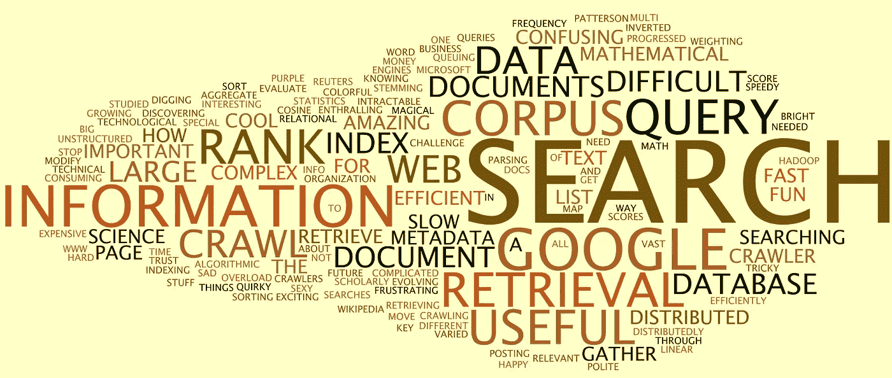

Information retrieval

# 介绍

数据是 21 世纪的黄金。我们每天都在创造万亿字节的数据。信息是经过处理和提炼的具有逻辑意义的数据形式。无论我们在搜索引擎上搜索，在电子商务网站上搜索产品，还是在其他任何地方搜索文章、产品、人物等，信息检索无处不在，已经成为我们日常生活不可或缺的一部分。

# 理解信息检索

在计算机科学领域中，信息检索被定义为从大量文档中获取满足信息需求的相关文档的过程。在大多数情况下，所需的信息以查询字符串的形式表示(例如:google search)，信息也是一个字符串(例如:google 上的搜索结果)。

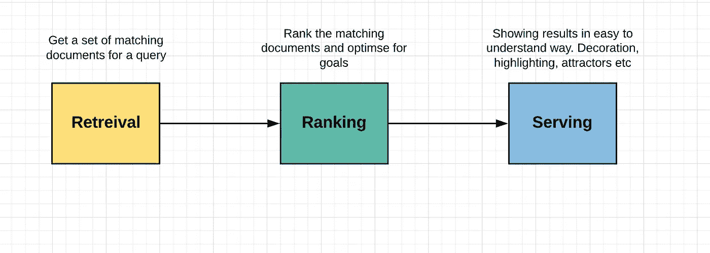

Sample IR system

信息检索的核心任务是首先为查询找到匹配的文档(**检索阶段**)，然后对匹配的文档进行排序(**排序阶段**)。匹配发生在查询和集合中的每个文档之间，因为集合非常大(以十亿计)，匹配逻辑必须高效。接下来，基于文档对于查询的内容相关性、文档的性能度量和用户上下文来进行排名。

在本文中，我们将讨论旨在根据文本内容和语义找到与查询最相关的文档的算法。我们将讨论将文档与查询匹配的发展，以及如何在排序中使用匹配信号来增加结果的相关性。

# 匹配算法的分类

下图展示了红外匹配的重要算法。在高层次上，我们有以下方法。

*   **单词包模型**(将查询和文档作为单词包进行集合交集操作进行文本匹配)
*   **基于单词嵌入的**(匹配发生在将文本翻译到嵌入空间并在该空间中进行代数匹配之后，一些流行的嵌入技术是 word2vec 和 fasttext。这些嵌入是以这样的方式学习的，即语义相似的查询在嵌入空间中是邻近的，而不相关的查询在远处)

下一级分类基于算法是基于神经网络还是基于非神经网络。基于神经网络的进一步分类为基于**表示的**(查询和文档首先被单独翻译到嵌入空间，而彼此不知道，然后进行匹配，存在丢失精确匹配信号的风险)和基于**交互的**(显式地模拟查询词和文档术语之间的交互，精确匹配信号不会丢失)。

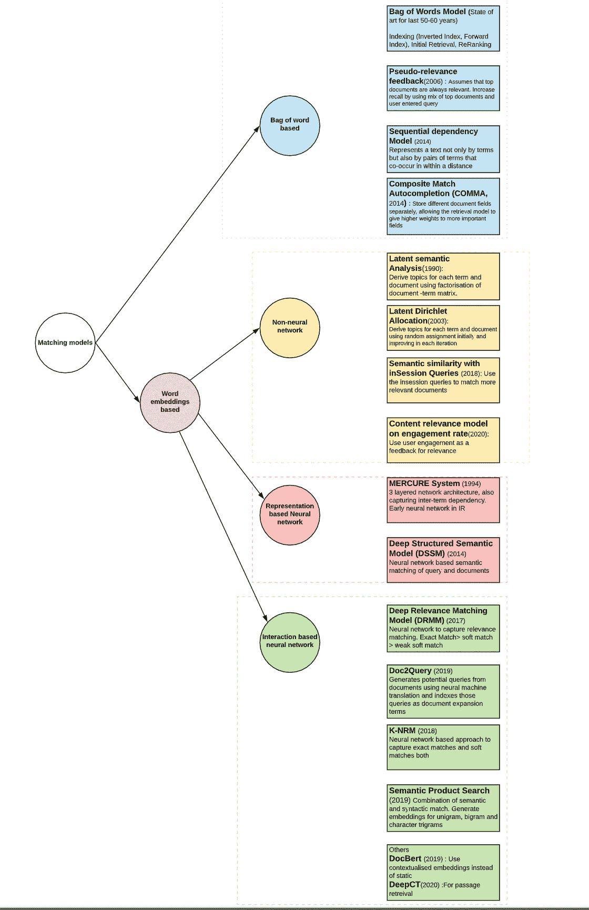

Classification of Matching algorithms in IR

现在，我们将从关键点的角度来讨论每一个问题。我们试图涵盖广度并省略实现细节，并在本文中作为新颖的想法导出关键要点。

# 基于单词的包

## 基本词汇模型

*   在过去的 50-60 年里，这一直是最先进的技术，而且效果很好
*   将查询和文档视为一个单词包。对于语料库中的每个术语，创建一个术语到包含该术语的文档列表的离线散列表(倒排索引的简单描述)。在在线匹配过程中，使用这个 hashmap 获取所有查询术语的公共文档。

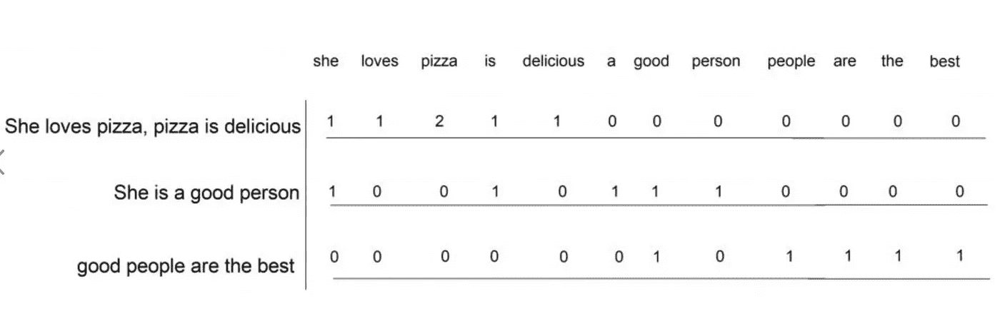

Term-Document matrix to enable efficient retrieval

*   有效(因为精确匹配是相关性的重要信号)和高效(因为倒排索引，我们不需要迭代所有文档)
*   理解人类语言的肤浅方式，不考虑意义和上下文。例如*非中文电话*文档将匹配查询*中文电话*。
*   词汇不匹配。*人*不会配*人*
*   **要点:**基本单词包模型对于正常用例是有效的

## 伪相关反馈

*   参考资料:[曼宁书](https://nlp.stanford.edu/IR-book/html/htmledition/pseudo-relevance-feedback-1.html)，[乐百氏 PSR](http://times.cs.uiuc.edu/czhai/pub/sigir06-mix.pdf) ( 2006)
*   旨在当查询只返回少量文档时提高召回率
*   假设顶部文档与查询相关。通过使用查询+热门文档返回结果来提高召回率
*   顶部文档可能有一些不相关的内容，这些内容可能会将结果引向完全不同的方向。为了避免这种情况，我们以迭代的方式对每个反馈文档中潜在的不同数量的相关信息进行建模(如下图)

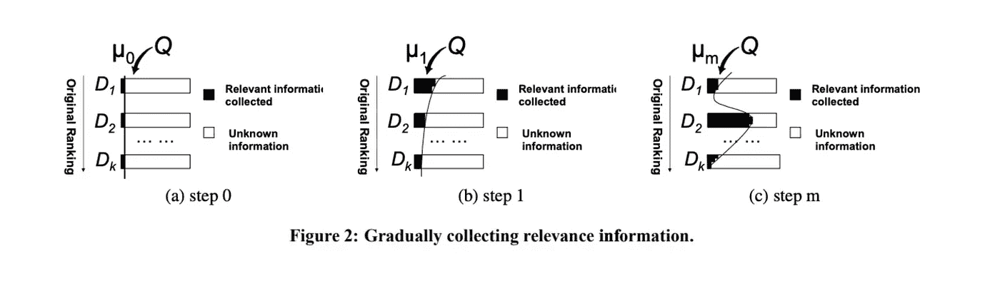

*   **要点:**使用已知的相关文档进行查询，提高召回率

## 顺序依赖模型

*   参考资料: [SDM](http://web.cs.ucla.edu/~yzsun/classes/2014Spring_CS7280/Papers/Probabilistic_Models/A%20Markov%20Random%20Field%20Model%20for%20Term%20Dependencies.pdf) (2014)
*   不仅通过术语，而且通过在一定距离内共现的术语对来表示文本
*   如果在查询中接近的术语在文档中也接近，那么有强有力的证据支持相关性。
*   使用马尔可夫模型，它对查询术语 qi 描述文档的可能性以及术语接近度的重要性进行建模

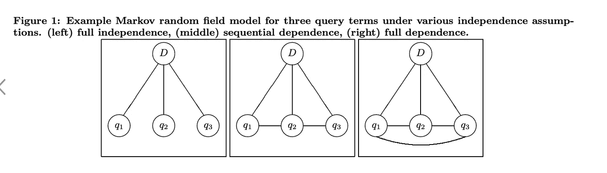

*   **要点:**单词 n-grams 的匹配是匹配中的一个重要信号。与一组不连续的查询术语相比，在查询中连续出现的术语提供了关于信息需求的不同(更强)的证据

## 复合匹配自动完成(逗号)

*   参考文献:[逗号](https://www.researchgate.net/publication/262220118_Composite_match_autocompletion_COMMA_A_semantic_result-oriented_autocompletion_technique_for_e-marketplaces) (2014)
*   该算法试图通过在多个领域如类别和方面上进行匹配来进行语义匹配
*   我们对每个查询应用 3 个过滤器
    1)标题与查询匹配的文档(语法匹配)
    2)类别与查询匹配的文档(语义匹配)
    3)方面与查询匹配的文档(语义匹配)
*   最后一组是所有 3 个元素的结合。类别和方面匹配是仅带有前缀术语的语法匹配(给出伪语义匹配)。
*   对句法相关性和语义相关性(类别匹配、方面匹配的数量、方面显著性)进行排序

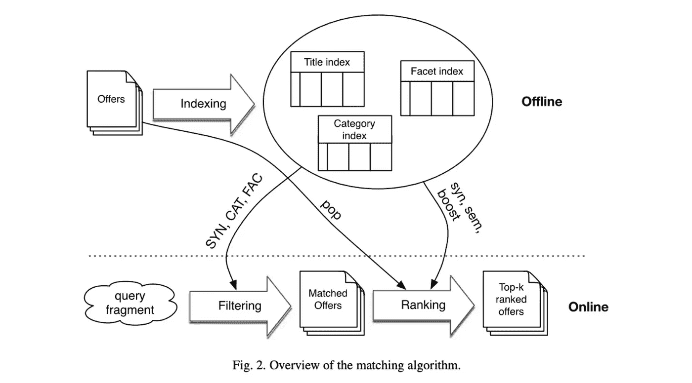

*   **要点:**类别匹配和方面匹配信号有助于在顶部显示更多相关文档。即使当查询的所有术语都与文档标题不匹配时，类别匹配和最大方面匹配也会存在，这将有助于提高召回率

## 潜在语义分析

*   参考文献:[博客](https://www.datacamp.com/community/tutorials/discovering-hidden-topics-python)，[大规模集成电路](http://citeseerx.ist.psu.edu/viewdoc/download;jsessionid=AC2BD6B1A006FD5867BD022C0E4D754D?doi=10.1.1.108.8490&rep=rep1&type=pdf) (1990)
*   如果我们说(雪，冬天)这个词对比(狗，冬天)这个词对更频繁地出现在一起，那就意味着它比(狗，冬天)这个词对承载着更高的语义。这是算法的基本环境。
*   每个文档都与主题相关联，每个术语都与主题相关联，匹配发生在主题空间中
*   然后对术语-文档矩阵进行奇异值分解(SVD)以获得主题

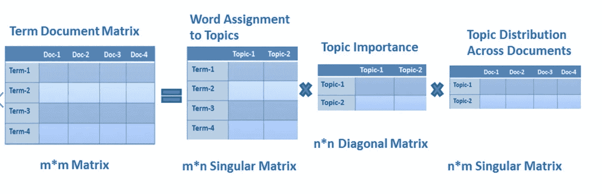

SVD factorisation to learn topics

*   **要点:** LSI 是主题的无监督学习，因此可能存在精度问题。然而，它可以用来扩充单词模型的基本包，其中包含查询术语匹配以及主题空间中的匹配的文档将被认为更相关。

## 潜在狄利克雷分配

*   参考资料:[博客](https://www.mygreatlearning.com/blog/understanding-latent-dirichlet-allocation/)， [LDA](https://ai.stanford.edu/~ang/papers/jair03-lda.pdf) (2003)
*   以不同于 LSI 的方式学习文档和单词的主题
*   初始化每个单词的随机主题。在每次迭代中向最终赋值收敛
*   LDA 比 LSI 具有更好的准确性

## 会话查询的语义相似性

*   参考文献:[与会话内查询的语义相似度](https://iopscience.iop.org/article/10.1088/1742-6596/1004/1/012018/pdf) (2018)
*   在 word2vec 方法的基础上，考虑候选文档和在同一会话中点击的先前文档之间的语义相似性(在语料库中共享共同上下文的单词在空间中彼此靠近)
*   **要点:**在会话中，上下文可以用来更好地理解用户的意图并匹配文档

## 基于参与度的内容相关性模型

*   参考资料:[在 Twitter 上的相关性排名](https://dl.acm.org/doi/10.1145/3340531.3412743) ( 2020)
*   对用户反馈进行建模是提高相关性的好方法

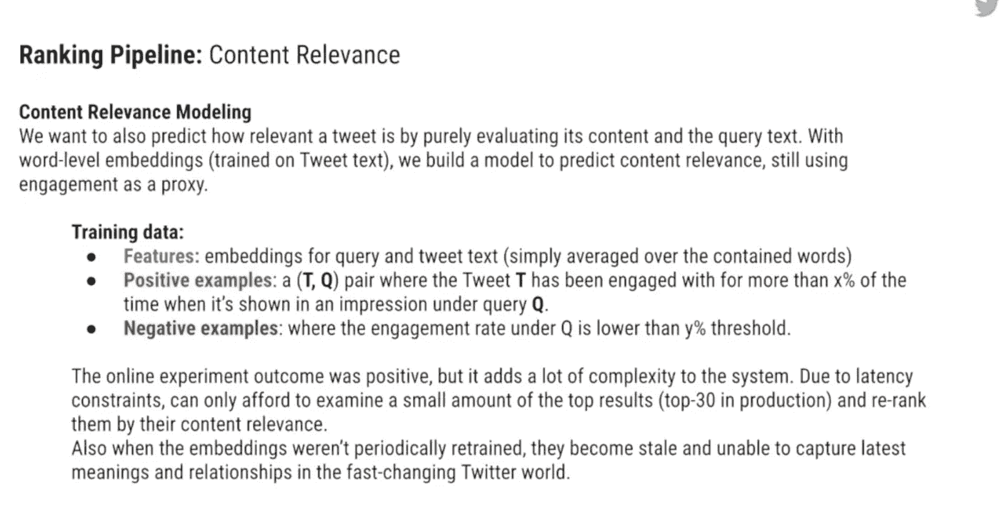

Twitter Content Relevance

## MERCURE 系统

*   参考资料: [MERCURE](https://dl.acm.org/doi/pdf/10.5555/2856823.2856867) (1994)
*   3 层网络体系结构，也捕获了术语间的依赖性。国际关系领域中的早期神经网络

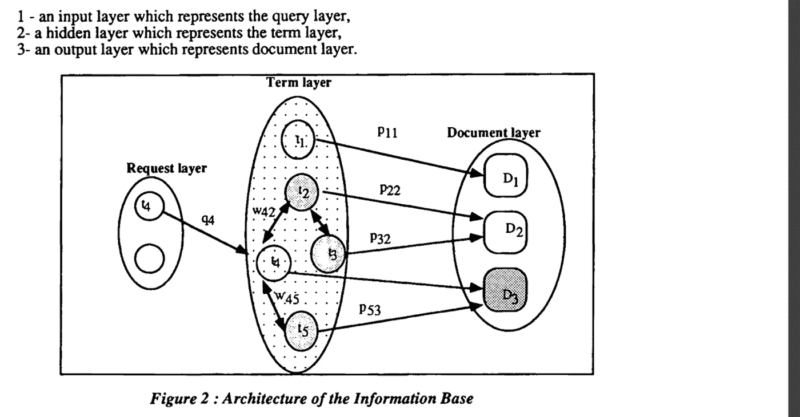

## 深层结构化语义模型(DSSM)

*   参考文献: [DSSM](https://posenhuang.github.io/papers/cikm2013_DSSM_fullversion.pdf) (2013 年) [CDSSM](https://www.iro.umontreal.ca/~lisa/pointeurs/WWW2014.pdf) (2014 年)
*   基于神经网络的查询和文档语义匹配
*   神经网络的输入:高维术语向量(一种热编码来表示所包含的术语)。为了降低术语向量的维数(从 500 K 到 30K)，我们对字符三元模型使用一键编码。
*   输出:低维语义特征空间中的概念向量

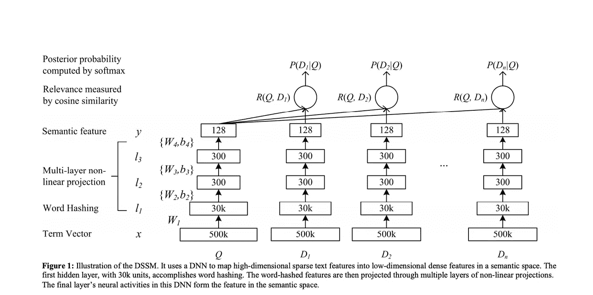

Deep semantic similarity model

*   特征和模型都是自动学习的
*   查询-使用过去的文档点击数据进行训练
*   使用卷积神经网络具有额外的优势
*   **要点:** DSSM 帮助自动学习语义匹配特征。精确匹配信号(对于相关性匹配非常有用)在匹配之前丢失。在基于交互的神经模型(例如 DRMM)中克服了这个缺点，该神经模型也对查询术语和文档术语之间的交互进行建模，以保留精确匹配信号

## 深度相关匹配模型

*   参考资料: [DRMM](https://arxiv.org/pdf/1711.08611.pdf) (2017)
*   捕获相关性匹配的神经网络
*   **语义匹配**(含义应该相同，对查询和文档一视同仁)与**相关性匹配**(精确匹配信号，查询术语重要性，考虑查询通常小于文档)
*   与此匹配的文档的得分顺序一般是这样的:精确匹配>软匹配>弱软匹配
*   对于查询中的每个术语和文档中的所有术语，它计算嵌入空间中的余弦相似性。例如:给定一个查询术语“汽车”和一个带有术语(汽车、出租、卡车、颠簸、禁令、跑道)的文档，基于余弦相似性的相应局部交互是(1，0.2，0.7，0.3，0.1，0.1)
*   此外，它通过将每个余弦相似度分类到这些二进制值之一{[1，0.5]，[0，0.5]，[0.5，1]，[1，1]}来创建直方图。Bin [1，1]捕捉精确匹配信号。对于前面的例子，我们将获得一个匹配直方图[0，1，3，1，1]
*   该直方图池旨在将精确匹配与软匹配分开，并将强软匹配与弱软匹配分开。

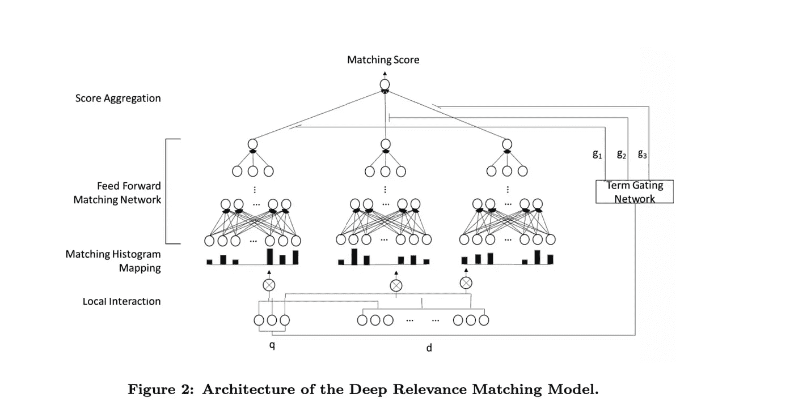

*   **要点:**这捕获了文档与查询的相关性。这里的限制是，我们试图将查询的一个术语与文档的一个术语匹配，这可能无法捕获所有的词汇匹配场景(例如:美国对美国，LHS 的一个术语与 RHS 的三个术语匹配)

## Doc2Query

*   参考资料: [Doc2Query](https://arxiv.org/pdf/1904.08375.pdf) (2019)
*   使用神经机器翻译从文档中生成潜在查询，并将这些查询索引为文档扩展术语
*   对于长段落和 FAQ 类型的搜索很有用

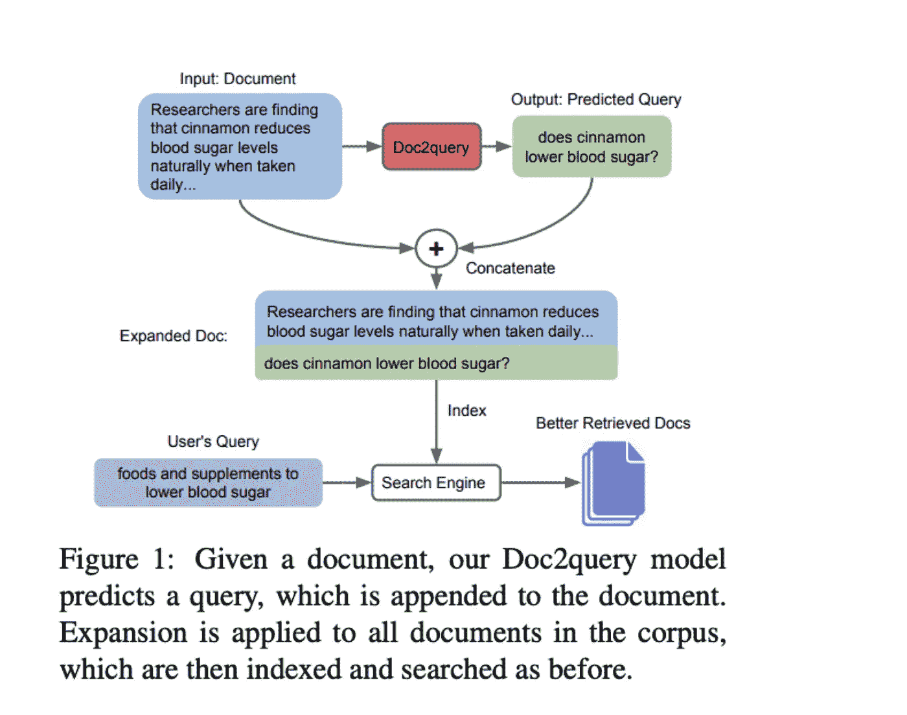

Doc2Query

## K-NRM(基于核的神经排序模型)

*   参考资料: [K-NRM](https://arxiv.org/pdf/1706.06613.pdf) (2017)、 [K-NRM1](https://arxiv.org/pdf/1809.10522.pdf) (2018)、 [Conv-K-NRM](http://www.cs.cmu.edu/~./callan/Papers/wsdm18-zhuyun-dai.pdf) (2019)
*   首先，我们为查询和文档生成单词嵌入
*   然后交叉匹配不同长度的查询 n 元文法和文档 n 元文法(处理 DRMM 的缺点)
*   使用内核池区分有用的软匹配和有干扰的软匹配

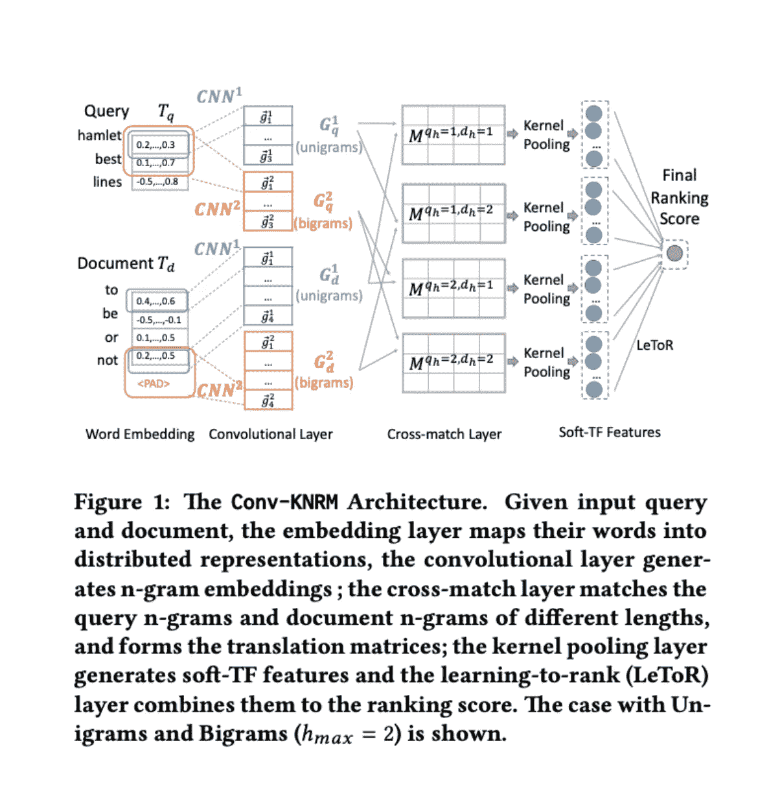

K-NRM model architecture

## 语义产品搜索

*   参考:[产品搜索](https://arxiv.org/pdf/1907.00937.pdf) ( 2019)
*   为查询和文档生成 Unigrams+Bigrams+Char 三元模型的嵌入，然后进行匹配
*   使用一致散列法处理 OOV 词

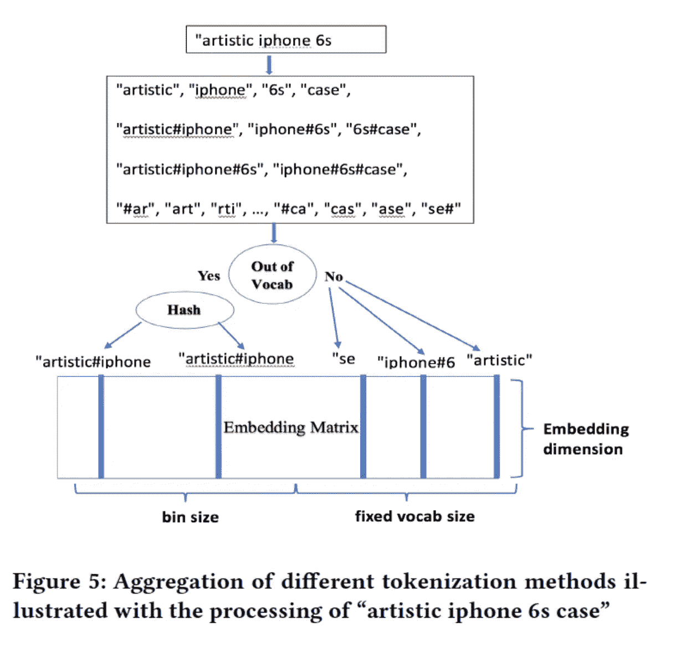

Generating embedding for document and query

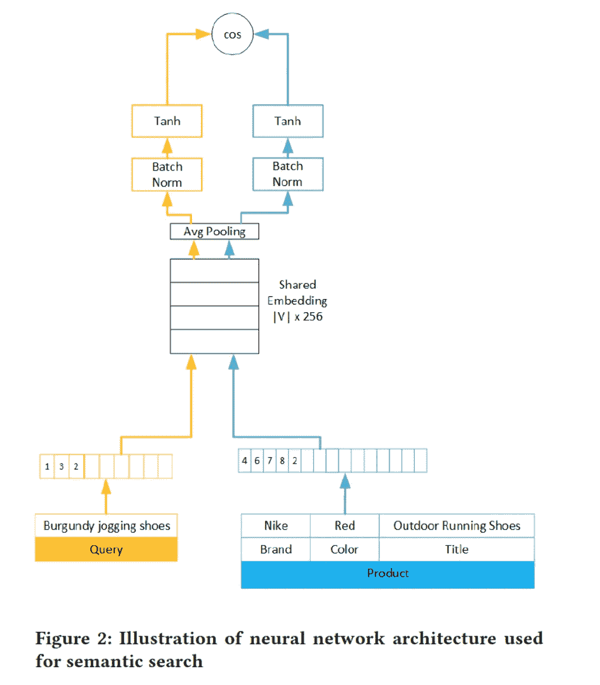

Neural network for semantic product search

## 多伯特

*   参考文献:[多伯特](https://arxiv.org/pdf/1905.09217.pdf) (2019)
*   使用单词的语境化表示
*   令牌被嵌入到嵌入中。为了进一步将查询从文档中分离出来，段嵌入‘Q’(对于查询令牌)和‘D’(对于文档令牌)被添加到令牌嵌入中。为了捕捉词序，添加了位置嵌入。代币要经过几层变压器

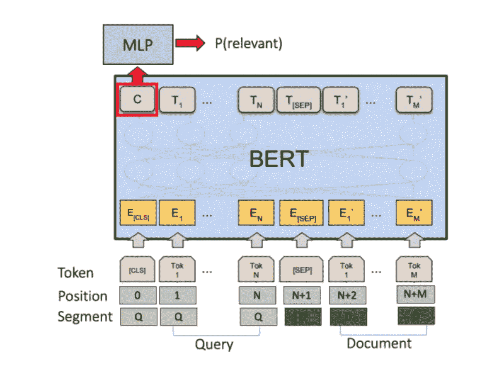

Bert Contextualised embedding

*   **要点:**一个术语的所有出现不会被同等对待。这取决于该术语是否出现在文档或查询中，还取决于该术语出现的位置。这些有助于更好地模拟术语的上下文。

## 深度上下文化术语加权框架(DeepCT)

*   参考资料:[DeepCT](https://dl.acm.org/doi/pdf/10.1145/3397271.3401204)(2020)[HDCT](https://dl.acm.org/doi/pdf/10.1145/3366423.3380258)(2020)
*   识别长文本中的重要术语，有助于段落检索
*   根据意思而不是词频来查找文本中的核心词

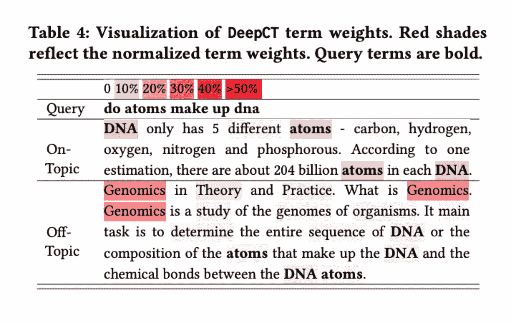

DeepCT in action

*   **要点:**它有助于找到一段话中最核心的词，这样它就可以匹配那些核心词出现在查询中的文档。在上面的例子中，第二个文档离题了，即使它包含更多的 DNA 术语。

# 摘要

1.  单词袋模型非常**有效**(因为精确的术语匹配是非常重要的相关性信号)和**高效**(由于倒排索引，获得具有匹配术语的文档非常快，并且不需要迭代文档)
2.  单词模型包有一定的局限性，它**不理解人类语言** e(非中文电话的文档将匹配查询中文电话)，不理解**词汇不匹配**(例如小狗的文档将不匹配狗的文档)。术语的重要性是由术语的频率决定的，而不是由语义理解决定的。
3.  我们可以通过混合使用热门文档和用户输入的查询作为反馈来返回更多的文档，从而提高召回率
4.  对文档中的短语重要性和文档中的术语重要性进行建模( **P(文档/短语)，P(文档/术语)**)可以增加相关性
5.  如果在查询中接近的术语在文档中也接近，那么有强有力的证据支持相关性。
6.  **将**查询不仅与文档标题匹配，还与**类别和方面**匹配，并为这些领域中的匹配导出排名信号，这有助于增加相关性
7.  语义匹配和关联匹配的区别。**语义匹配**(含义相同，对查询和文档一视同仁)与**相关性匹配**(精确匹配信号、查询术语重要性、查询通常小于文档)
8.  使用用户对查询文档的参与度作为相关性的度量。
9.  所讨论的各种神经检索模型(DSSM、DRMM、K-NRM、语义搜索)试图捕捉以下内容:

*   查询文档术语之间的交互
*   查询-文档字符三元组之间的交互
*   查询文档的不同长度单词 n 元文法之间的交互
*   考虑精确匹配和软匹配的信号
*   考虑哪些信号是查询和文档中最重要的术语

# 反馈

有问题吗？评论？联系方式: [LinkedIn](https://www.linkedin.com/in/suryakant-pandey/) ， [Instagram](https://www.instagram.com/pd.skant/)