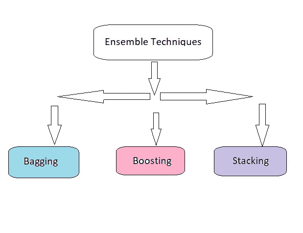
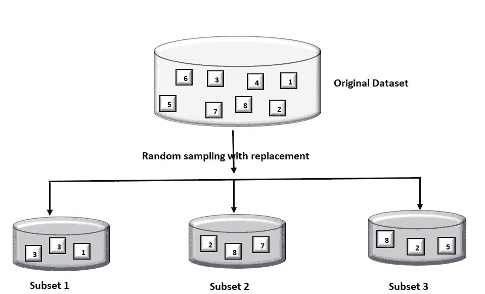
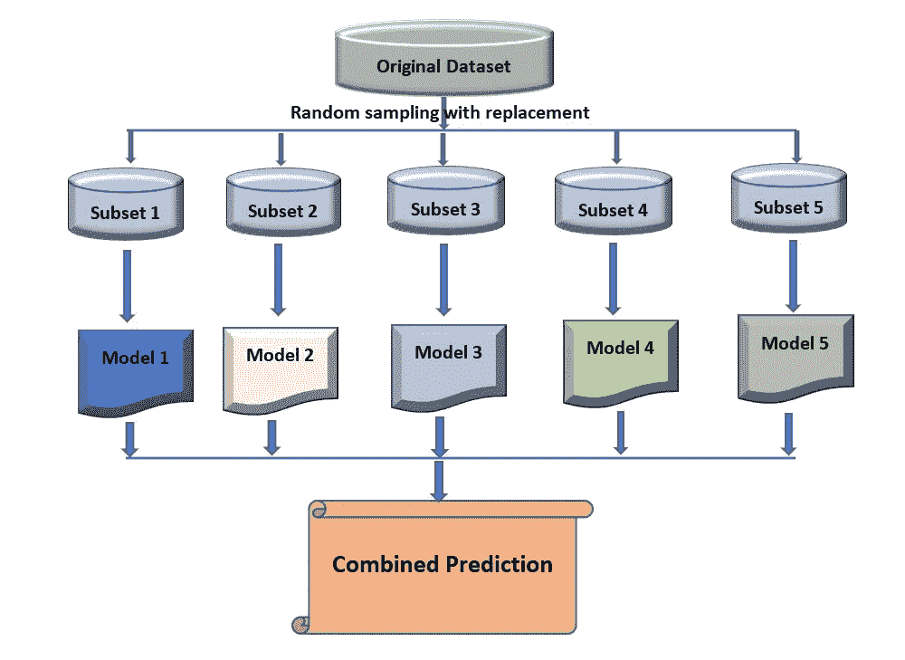
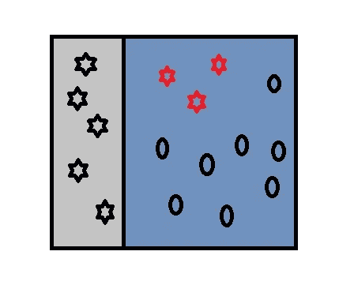
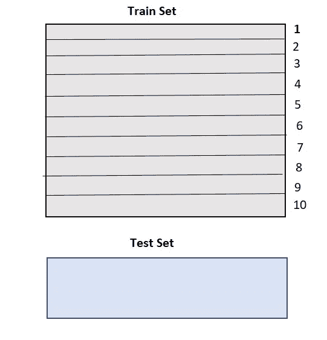
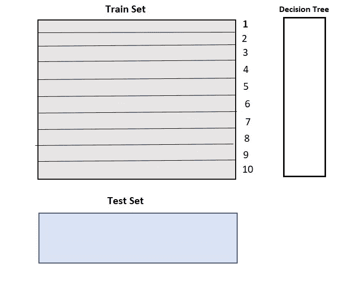
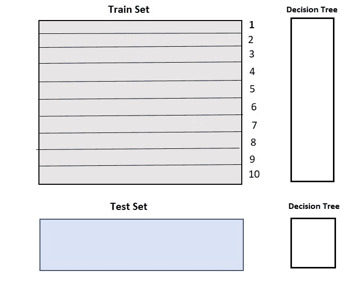
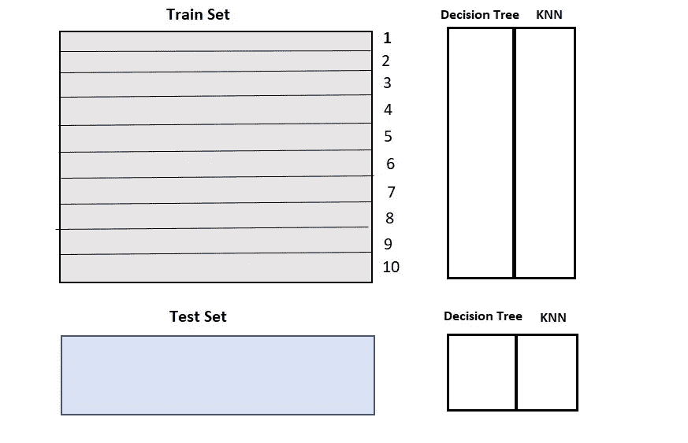
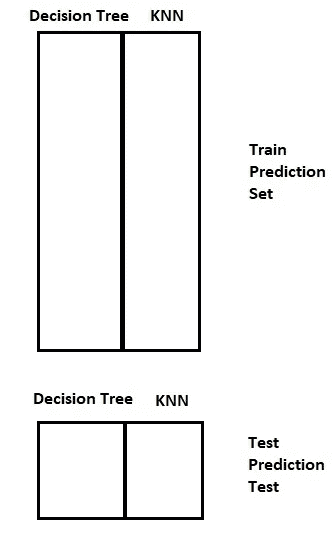

# 集成学习:打包、提升和堆叠

> 原文：<https://medium.com/mlearning-ai/ensemble-learning-bagging-boosting-and-stacking-fad5cc8d7c2c?source=collection_archive---------4----------------------->

Photo by [Wylly Suhendra](https://unsplash.com/@wylly_suhendra?utm_source=medium&utm_medium=referral) on [Unsplash](https://unsplash.com?utm_source=medium&utm_medium=referral)

> ” ***光靠我们能做的就这么少；我们一起可以做很多事情。***”—海伦·凯勒

在机器学习中，在处理任何算法时，偏差和方差的权衡是每个从业者关注的关键问题之一。为了解决这个问题，他们可以利用一些基于 ***集成学习*** 的技术。它基于“群体的智慧”理论，该理论假设一个多样化的独立个体群体的集体意见比一个专家的意见更好。

**什么是合奏技法？**

> 集成技术是使用多个学习算法或模型来产生一个最佳预测模型以获得更好预测性能的方法。

集成学习是一种机器学习技术，其中几个模型被组合起来以建立更强大的模型。集成主要用于提高模型的性能。这些技术是当今使用的一些最有用的机器学习技术，因为它们以相对较低的成本展示了很高的性能水平。

**合奏技法有哪些类型？**

Fig 1\. Types of Ensemble Techniques |Image by author

**什么是套袋技术？**

Bagging 是一种方法，其中多个同质机器学习模型(例如，所有决策树)的结果被组合以获得一般化的结果。

但是，当我们试图在同一组数据上创建所有模型，然后将它们组合在一起时，会发生什么呢？会有用吗？这些模型很有可能给出相同的结果，因为它们得到了相同的输入。接下来是 **Bootstrapping 技术**，这是一种随机采样技术，我们通过替换来创建原始数据集的子集。在统计学中，带替换的随机抽样称为 bootstrapping。

Fig 2\. Example of Bootstrapping |Image by author

Fig 3\. Bagging Technique |Image by author

在这些子集的每一个上创建一个基础模型(弱模型)。这些模型将并行运行，并且相互独立。通过组合来自所有模型的预测来构建元分类器或回归量，从而做出最终预测。在回归的情况下，它采用所有模型的平均值，对于分类问题，它采用投票方法。

**什么是助推？**

在 bagging 中，我们假设所有的基础模型都会给出正确的结果或预测。当一个基础模型错误地预测了一个数据点，然后是下一个(可能是所有的)，会发生什么？将基础模型的所有预测结合起来有用吗？好吧，在这种情况下，助推来拯救我们。

> Boosting 是一种顺序技术，其中每个后续模型都通过关注前一个模型所犯的错误来尝试提高模型的稳定性。后续模型依赖于前一个模型。

术语“增强”指的是将多个弱学习者结合起来形成强学习者的一系列算法。

让我们考虑垃圾邮件识别的例子。这里，为了识别邮件是否是垃圾邮件，通常使用以下标准:

**我**。如果邮件包含受感染的附件或可疑链接，那么它就是垃圾邮件。

**ii** 。如果邮件只有一张图片(促销)，那就是垃圾邮件。

**三世**。如果它包含像“你赢得了 xxxxx 的奖金”这样的句子，它就是垃圾邮件

**四**。如果它的来源已知，那么它就不是垃圾邮件。

**v** 。来自已知来源的邮件，不是垃圾邮件。

为了将电子邮件分类为垃圾邮件或非垃圾邮件，我们定义了上述规则。单独来看，这些规则不足以将一封电子邮件划分为“垃圾邮件”或“非垃圾邮件”。因此，这些规则被称为弱学习者。为了将弱学习者转化为强学习者，我们将使用以下方法结合每个弱学习者的预测:

a.使用平均值/加权平均值

b.考虑预测有较高的票数。

例如，我们定义了五个弱学习者。在这五种垃圾邮件中，3 种被认为是垃圾邮件，2 种被认为不是垃圾邮件。在这种情况下，我们会将该邮件归类为垃圾邮件，因为我们对垃圾邮件的投票率较高。

升压是一种迭代和连续的方法。它在每次迭代后自适应地改变训练数据的分布。

**升压步骤:**

1.  从原始数据集创建一个子集。
2.  最初，所有的数据点被赋予相等的权重，即所有的数据点被认为对于随机采样是同样可能的。
3.  在随机采样的子集上训练基本模型。
4.  使用实际值和预测值计算误差。

Fig 4\. Example of classification in Boosting |Image by author

5.被错误预测的观察值被给予较高的权重。(这里，三个错误分类的红星点将被赋予更高的权重)。由于这些观察值的权重较高，因此将在下一次模型训练的下一次数据采样中首先选取这些观察值，然后根据需要随机选取其余的观察值。

6.将创建另一个模型，并对数据集进行预测。(这个模型试图纠正前一个模型的错误)。

7.类似地，将使用更新的权重创建多个模型，每个模型都校正前一个模型的误差。

8.当弱学习者的所有训练过程都完成后，就组合在一起形成了强学习者。最终模型(强学习者)是所有模型(弱学习者)的加权平均值。

Fig 5\. Boosting Technique |Image by author

**什么是堆叠手法？**

堆叠是一种集成学习技术，它使用来自多个模型(例如决策树、KNN 或 SVM)的预测来构建新模型。该模型用于对测试集进行预测。

简单堆叠集成学习技术的步骤如下:

1.  列车组分为 10 个部分。

Fig 6\. Image by author

2.基础模型(假设决策树)适用于 9 个部分，并对第 10 个部分进行预测。对列车组的每个部分都要这样做。

Fig 7\. Image by author

3.基础模型(在这种情况下，决策树)然后适合整个训练数据集。

Fig 8\. Image by author

4.对另一个基本模型(比如说 KNN)重复步骤 2 到 4，从而得到训练集和测试集的另一组预测。

Fig 9\. Image by author

5.来自训练集的预测被用作建立新模型的特征。

Fig 10\. Image by author

6.该模型用于对测试预测集进行最终预测。

**装袋和增压的区别:**

*   Bagging 的目的是减少差异，而不是偏见。但是，增强试图减少偏差，而不是方差。
*   Bagging 试图解决过拟合问题。就其本身而言，增压无助于避免过度拟合；其实这个技术本身就面临这个问题。
*   在装袋的情况下，每个模型都是独立构建的。但是在 boosting 的情况下，每个新模型都会受到先前构建的模型的性能的影响。
*   在 bagging 中，不同的训练数据子集被随机抽取，替换来自整个训练数据集。但是，在 boosting 的情况下，每个新的子集都包含被之前的模型错误分类的元素。
*   如果分类器不稳定(高方差)，那么我们应该应用 bagging。然而，如果分类器稳定且简单(高偏差)，我们应该使用 boosting。

***今天就到这里。希望你喜欢这篇文章。快乐阅读！！！***

 [## Mlearning.ai 提交建议

### 如何成为 Mlearning.ai 上的作家

medium.com](/mlearning-ai/mlearning-ai-submission-suggestions-b51e2b130bfb)