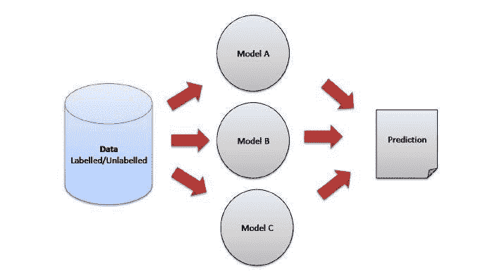
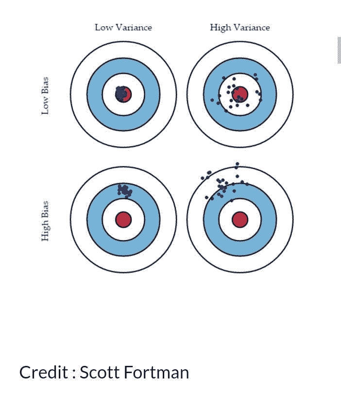

# 虚拟机器学习中的集合

> 原文：<https://medium.com/mlearning-ai/ensembling-in-machine-learning-for-dummies-60221fce1f92?source=collection_archive---------7----------------------->

随着第四次工业革命的深入，现实和虚拟之间的界限继续模糊，人工智能、机器学习和深度学习等主题已经成为中心舞台。我们今天要聚焦的是机器学习。让我们把“机器学习”作为“人工智能国家”的一个县——一个巨大而复杂的国家。那个似乎在发号施令的人，市长，是**‘集合/集合学习’**。是的，这是每个人都想与之交流的大男孩(问问 Kaggle 的竞争对手)。让我们试着看看这个人是谁，他是什么样的人。简单的几句话。

人们可能会生气的第一件事是你如何读他们的名字。我不知道你说的是哪种英语变体，但剑桥词典不得不分享你如何称呼这个人，以及他的名字意味着什么，以免你最终无法了解他:

**合奏:**

名词[ C，+单数动词]

美国:/ˌɑːnˈsɑːm.bəl/英国:/ˌɒnˈsɒm.bəl/

*   *作为一个整体行动的一群事物或人，尤指经常在一起演奏的一群音乐家。*

他的母亲可能在他父亲解决了一场长期的种族冲突的那一天生下了他。

在*机器学习‘郡’*，这是他们对他的评价。

*   *集成是一种将不同的学习者集合(单个模型)结合在一起的艺术，以即兴发挥模型的稳定性和预测能力。* ( [塔维什；分析 Vidhya，2015 年](https://www.analyticsvidhya.com/blog/2015/08/introduction-ensemble-learning/)

在这个县，市长(Ensembling)不使用不同的训练(数据集)来训练官员(模型)，而是将他们从不同的地方聚集在一起，让他们展示他们“协调”表演(预测)的技能。

*“结合多种不同模式的优势。集成通常不涉及在单独的数据集上训练模型——不同的是模型本身。一般来说，模型越多样化越好。例如，集成可能包括以下模型:支持向量机(SVM)、随机森林、梯度推进模型(GBM)、逻辑回归、k-最近邻和神经网络瑞安·佐蒂*

信用:Ashish Patel， [medium](/ml-research-lab/ensemble-learning-the-heart-of-machine-learning-b4f59a5f9777)

很多时候，当我们想要在现实世界中做出某些决定时，我们实际上表现得像市长一样，而没有意识到这一点。一个经典的例子是试图决定是否投资某家公司的股票。作为商业头脑，我们会与在知识和经验方面有不同**偏见**和**差异**的不同人交谈，我们希望优化这些偏见和差异，以便充满信心地“看到未来”，接近靶心。

有无数种方法可以做到这一点，但在“*机器学习县”，*市长——集会，有他的心情(类型)和展望未来(预测)的方式(技术)。让我们仔细研究一下这些，因为它会让我们对为什么他是市长有所了解。

市长的情绪(类型)

1.  **平均**:取官员(模型)的想法(预测)的平均值。这是在一个*回归*问题或者试图告诉一个*分类*问题在“县”中的可能性(概率)的情况下。
2.  **多数投票:**在试图说出一个*分类*问题的结果时，从许多官员(模特)那里获取最受欢迎的想法(预测)。
3.  **加权平均**:根据许多官员(模型)的输出，对他们的想法(预测)赋予不同的重要性/重要性(权重)，然后“二加二”(平均)。

*市长的(集结)方式(技巧)*

1.  **装袋:**提高军官(模型)输出的总体强度和准确性，从而缩小他们的差异(方差)，使任务(预测)更加可行。
2.  **Boosting(聚合自举):**顾名思义，就是用所有的演练(整个数据集)训练一队军官(模型)，把一部分留在小队里，把另一部分分配到其他队伍(模型)。就像每个队都有海豹突击队一样。这总体上减少了偏差并提高了任务的成功率。
3.  许多军官(模型)被排列成行，一个接一个，较低的级别将信息传递给较高的级别，最高的级别做出最终决定(预测)。

因此，根据市长的情绪(类型)和方法(技术)，让我们看看他的一些优点和缺点。

**优势**

1.  经过验证的准确性和方法(技术)在大多数情况下有效。
2.  机器学习竞赛中的获胜策略。

**弱点**

1.  耗时。
2.  会变得非常复杂和难以理解。

耶！我相信你已经很了解市长了。

*了解市长(Ensembling)；进一步阅读*

[*https://data science . stack exchange . com/questions/11057/ensembling-vs-clustering-in-machine-learning*](https://datascience.stackexchange.com/questions/11057/ensembling-vs-clustering-in-machine-learning)

[https://www . analyticsvidhya . com/blog/2017/02/introduction-to-ensembling-along-in-implementation/](https://www.analyticsvidhya.com/blog/2017/02/introduction-to-ensembling-along-with-implementation-in-r/)

[*https://medium . com/ml-research-lab/ensemble-learning-the-heart-of-machine-learning-b4f 59 a5f 9777*](/ml-research-lab/ensemble-learning-the-heart-of-machine-learning-b4f59a5f9777)

[*https://www . analyticsvidhya . com/blog/2015/08/introduction-ensemble-learning/#*](https://www.analyticsvidhya.com/blog/2015/08/introduction-ensemble-learning/#)

 [## Mlearning.ai 提交建议

### 如何成为 Mlearning.ai 上的作家

medium.com](/mlearning-ai/mlearning-ai-submission-suggestions-b51e2b130bfb)