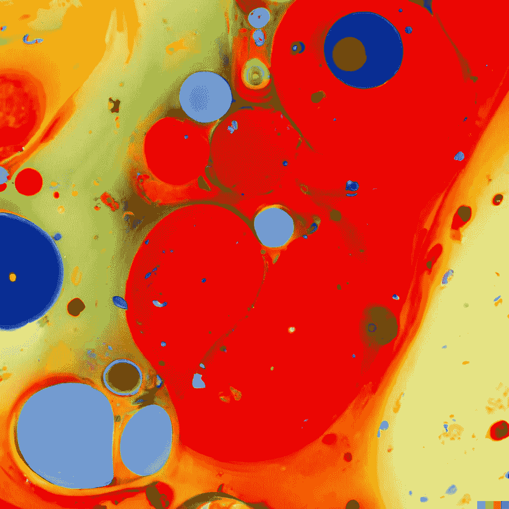

# 进入扩散模型的世界

> 原文：<https://medium.com/mlearning-ai/enter-the-world-of-diffusion-models-4485fb5c5986?source=collection_archive---------0----------------------->

## [机器学习艺术](https://mlearning.substack.com)

## 扩散模型教程，[DALL E**2**，Imagen 等](https://mlearning.substack.com/p/a-good-alternative-to-dalle-2-that?r=z7zu8&s=w&utm_campaign=post&utm_medium=web)

[A good alternative to DALL·E 2 that you can use while waiting](https://mlearning.substack.com/p/a-good-alternative-to-dalle-2-that?r=z7zu8&s=w&utm_campaign=post&utm_medium=web) — [Images Created with DALL·E, an AI system](https://mlearning.substack.com/p/a-good-alternative-to-dalle-2-that?r=z7zu8&s=w&utm_campaign=post&utm_medium=web)

**扩散模型**已经成为生成式建模的可能框架，它将图片和视频创作问题的**技术状态**向前推进。为了得到最好的结果，扩散模型使用一个引导策略来增加样本保真度(在…