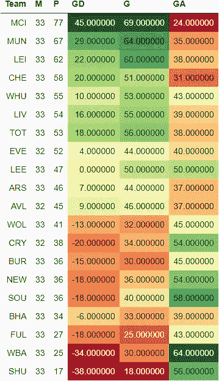
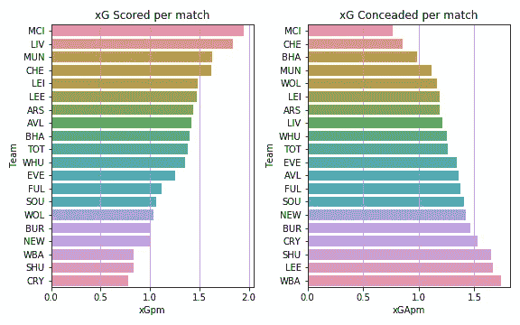
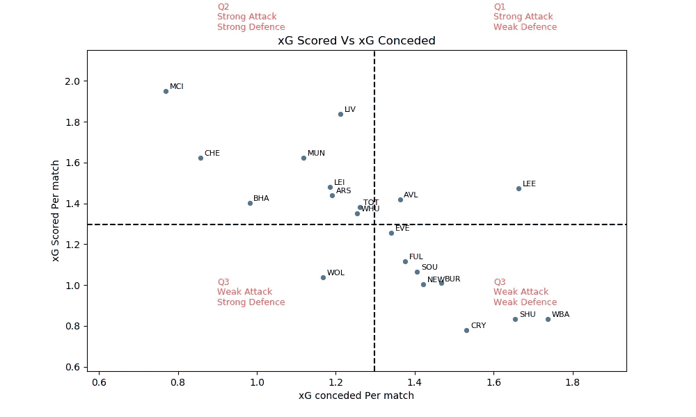
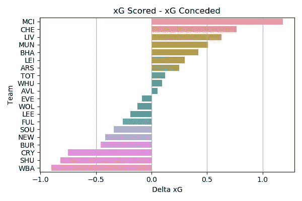
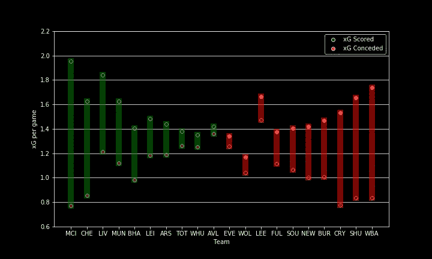
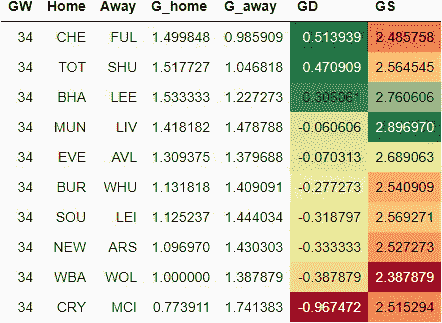
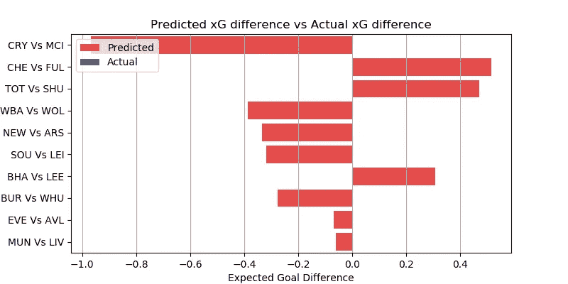

# EPL 分析和 GW 34 预测

> 原文：<https://medium.com/mlearning-ai/epl-analysis-and-gw-34-prediction-a821c48ba574?source=collection_archive---------1----------------------->

## 使用 xG 统计数据预测英超联赛结果的数据驱动尝试

这是我的 EPL 预测系列的一篇文章。你可以看看对第 33 周比赛的预测，以及它与实际表现的对比。

[预期目标或 xG](/@abhijithchandradas/xg-xplained-27b1dbafa943) 是用于预测的参数。如果你对理解预测算法感兴趣，我推荐你去看看[这篇文章，里面有详细的解释](https://towardsdatascience.com/epl-2020-21-season-analysis-and-prediction-5502e20dce26)。

 [## xG 解释！

### 如果你关注足球，你不可能从未遇到过“预期目标”(缩写为 xG)这个术语。xG…

abhijithchandradas.medium.com](https://abhijithchandradas.medium.com/xg-xplained-27b1dbafa943) 

数据提供:[足球参考](https://fbref.com)

# 截至第 33 周比赛的分析

Epl Table (Image by Author)

英超联赛进入了最后阶段，只剩下 5 个比赛周。曼城正等待着在几周内加冕英格兰冠军。第 33 周比赛只有 8 场比赛，曼城和热刺在 EFL 杯决赛中相遇，前者举起了他们本赛季的第一座奖杯。曼联本周末有机会将冠军之间的差距缩小到个位数。然而，他们不得不接受 0-0 战平利兹的结果，利兹的防守在过去几周有了很大的改善。曼联以 67 分落后同城对手 10 分，还有 5 场比赛要打。排名第三的莱斯特城凭借伊赫亚纳乔的火热状态赢得了对宫殿的比赛。在切尔西和西汉姆争夺第四名的比赛中，图切尔的球队以 0-1 赢得了比赛，这是他们一贯的风格。排在第六位的红军没能利用铁锤帮丢分的机会，加时赛扳平了与纽卡斯尔的保级战。埃弗顿目前排名第八，落后切尔西 6 分，还少赛一场。他们在酋长球场战胜了枪手。安切洛蒂的球队仍然有机会进入前四。

在积分榜的末尾，已经降级的刀片队以 1 比 0 战胜了布莱顿队，布莱顿队仅比危险区高出 7 分。西布朗队在客场对阵比利亚斯队的比赛中获得了一分。25 分的麻雀落后富勒姆 2 分。伯恩利在莫利纽克斯以 4-0 击败狼队，从联赛排名第 17 位上升到第 14 位。

xG scored vs xG conceded per match (Image by Author)

在 33 个比赛周之后，曼城统治了进攻和防守，因为它拥有最高的 xG 得分和最低的 xG 失球率。红军在 xG 得分上排名第二。紧随其后的是场均得分超过 1.5 xG 的蓝军和红魔。

水晶宫是每场比赛 xG 得分最少的球队。垫底的两支球队在前场也缺乏创造力。

曼城场均失球约 0.75 xG，尽管在最近的比赛中丢了几个球，但似乎是最好的防守单位。图切尔的切尔西紧随其后，位居第二。海鸥是另一支每场比赛失球少于 1 xG 的球队。

大多数球队每场比赛承认 1 到 1.5 xG。西布朗、谢菲尔德联队、利兹联和皇宫队未能阻止他们的对手创造进球机会，每场比赛失球超过 1.5 克。

xG scored vs xG conceded per match (Image by Author)

根据 xG 得分和 xG 失球，球队可以分为 4 个象限，如上图所示。
水平虚线表示每场比赛的平均 xG 得分。水平虚线上方的球队是强攻方，下方的球队是弱攻方。
垂直虚线显示每场比赛的平均 xG 失球。左边的队伍防守强，右边的队伍防守弱。

delta xG per game (Image by author)

曼城在 delta xG 方面遥遥领先于其他球队，xG 得分和 xG 失球之间的差距超过 1。利物浦和切尔西是仅有的另外两支 delta xG 高于 0.5 的球队。西布朗，水晶宫和谢菲尔德联队，delta xG 低于-0.5，另一方面，他们在球场两端都在疲软的进攻和漏洞百出的防守中挣扎。

Delta xG (Image by Author)

利兹联队在每场比赛创造的 xG 中名列前茅。然而，球队有负的 delta xG，因为对手发现很容易穿透利兹的防守。在过去的几场比赛中，该队加强了他们的防守。
另一方面，狼队是一支防守不错的球队，但由于劳尔·吉米内兹的受伤，他们缺乏攻击力。

布莱顿按照 delta-xG 排名表排在第 5 位，然而他们在联赛中排在第 17 位，因为他们缺乏高质量的前锋。

# 游戏第 34 周预测

在进行预测之前，让我澄清一下，这是一个非常简单的算法，只是基于过去的 xG，所以只能预期基线性能。该算法也不能预测高得分游戏。该模型也没有考虑球队的选择，球员因受伤/停赛而缺席，阵型，战术变化等。

然而，该模型在预测比赛的势头方面表现得相当好。你可以在下面看看实际表现如何与前一周的预测相比较。

 [## EPL 分析和 GW 33 预测

### 使用 xG 统计数据预测英超联赛结果的数据驱动尝试

medium.com](/codex/epl-analysis-and-gw-33-prediction-42239e5206cc) 

下表提供了对第 32 周比赛的预测。
GD 的绝对值显示了比赛的竞争力。该值越高，预计匹配越偏向一侧，预测的准确性也越高。GD 值越低，这场比赛就越可能是任何人的游戏。GD 的正值表示主场胜，负值表示客场胜。

Prediction for gameweek 34

水晶宫 vs 曼城估计是周末最一边倒的比赛，预测 delta-xG 差不多一场。预计城市将压倒老鹰队。蓝军和热刺有望在降级区主场对阵富勒姆和谢菲尔德联队的比赛中确保三分。
该算法为狼队、枪手、铁锤帮和狐狸队提供了确保 3 分的好机会。
算法预测海鸥胜过家里的孔雀。然而，该算法没有考虑到孔雀最近在防御性能上的改进和海鸥最近在状态上的下降。

Delta xG Predicted (Image by Author)

红军在超级星期天的比赛中造访梦幻剧场是周末最令人期待的比赛。这也是周末最激烈的比赛。这可能是任何人的游戏，然而，算法预测红军略有优势。
如果曼城击败水晶宫，利物浦击败曼联，曼城将成为本周日的冠军。

本周末另一场势均力敌的比赛是周六晚上埃弗顿和阿斯顿维拉的比赛。算法预测安切洛蒂的人会有微弱优势。

## 成为会员

我希望你喜欢这篇文章，我强烈推荐 [**注册*中级会员***](https://abhijithchandradas.medium.com/membership) 来阅读更多我写的文章或成千上万其他作者写的各种主题的故事。
[你的会员费直接支持我和你看的其他作家。你也可以在媒体上看到所有的故事。](https://abhijithchandradas.medium.com/membership)

# 预测结果与实际结果的对比将在第 34 周比赛后更新

您可能喜欢的其他文章:

 [## 使用事件数据开始足球分析

### 演练如何使用 stats bomby 包从 stats bomby 获得免费的足球赛事数据

medium.com](/mlearning-ai/getting-started-with-soccer-analytics-with-event-data-6ecd3143e78)  [## 用 Python 可视化期权交易策略

### 如何使用 python 中的 opstrat 包绘制期权收益图

medium.datadriveninvestor.com](https://medium.datadriveninvestor.com/visualizing-option-trading-strategies-in-python-35bfa61151d9)  [## 使用 Mplfinance 的股票市场数据可视化

### 如何获得股票市场数据和创建可视化(烛台，OHLC，PnF 等)。)在 Python 中使用 mplfinance…

medium.com](/mlearning-ai/stock-market-data-visualization-using-mplfinance-1d35a8d48e4) 

Photo by [Bermix Studio](https://unsplash.com/@bermixstudio?utm_source=medium&utm_medium=referral) on [Unsplash](https://unsplash.com?utm_source=medium&utm_medium=referral)