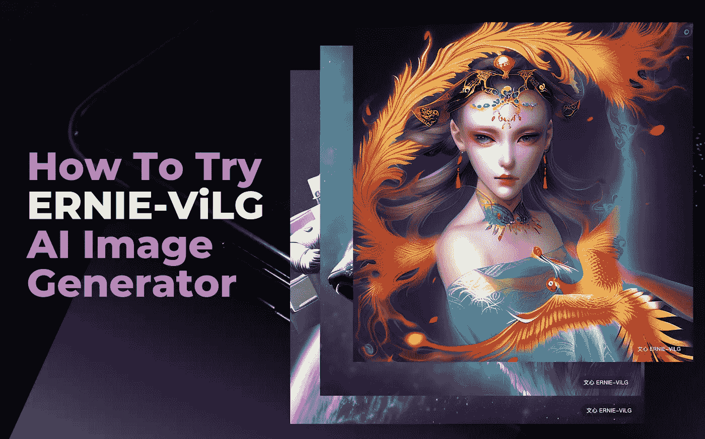

# 厄尼——中国的人工智能图像生成器完全免费

> 原文：<https://medium.com/mlearning-ai/ernie-chinas-ai-image-generator-is-completely-free-e1404c89600b?source=collection_archive---------0----------------------->

Sample images from Baidu’s ERNIE. Cover image created by [Jim Clyde Monge](https://medium.com/u/819323b399ac?source=post_page-----e1404c89600b--------------------------------)

人工智能图像生成器现在风靡一时。虽然 [Dall-E2](https://openai.com/dall-e-2/) 、[midway](https://www.midjourney.com/)和 [Stable Diffusion](https://beta.dreamstudio.ai/dream) 是目前的中心舞台，但还有另一种人工智能模型一直在互联网上流传。

ERNIE-ViLG 是由中国科技巨头百度开发的开源人工智能图像生成器。

## 什么是厄尼-维尔格？