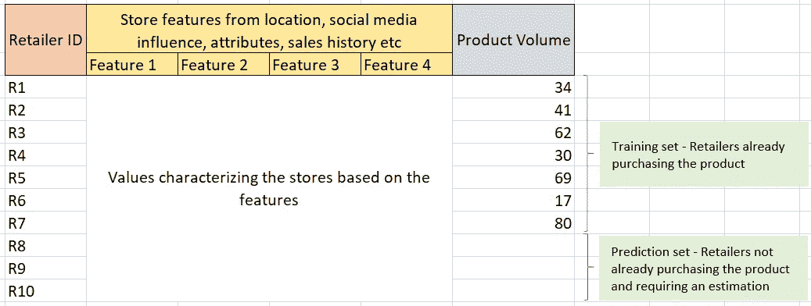
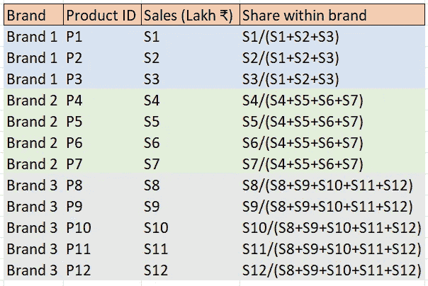
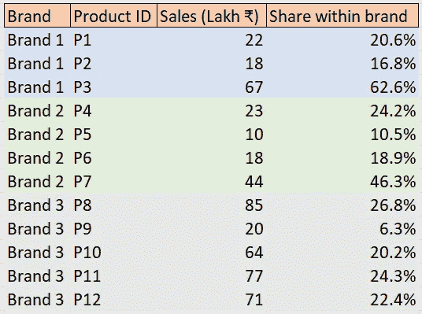
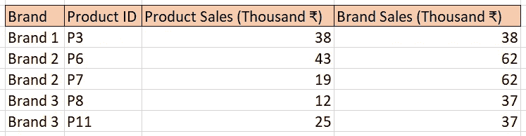
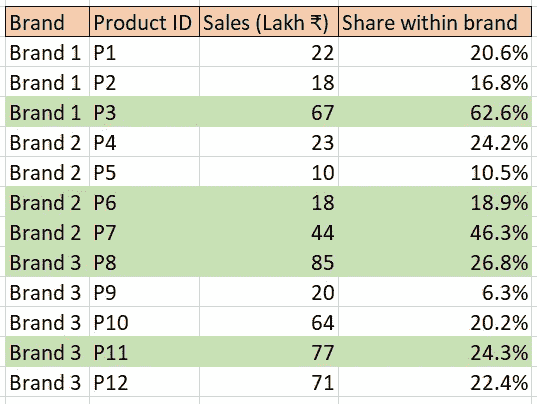
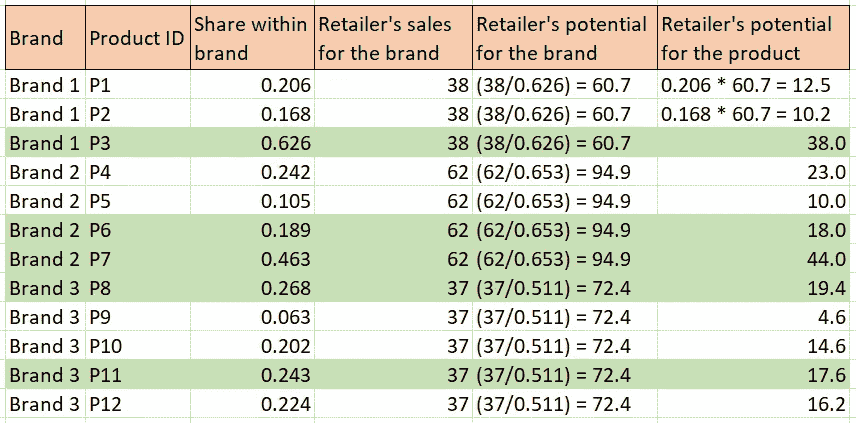

# 零售商评估产品的销售潜力

> 原文：<https://medium.com/mlearning-ai/estimating-the-sales-potential-of-a-product-by-retailer-cc77d394d9e?source=collection_archive---------8----------------------->

# 介绍

当消费品公司向零售商销售产品时，确定每个零售商中每个产品的**销售潜力非常有用。他们可以将这些潜力用于一系列应用，例如**推荐定制产品组合、发起有针对性的促销活动、改进销售代表的拜访时间表**等等。现在，有很多方法可以通过统计学和机器学习来解决这个问题。最常见的方法之一是**通过创建如图 1 所示的零售商及其特征**的**数据集，并将**产品销售额设置为目标变量**，来训练模型**(分别针对每种产品)。然后，这个训练好的模型可用于预测该产品尚未销售的剩余零售商的潜力。**

Fig 1 — Dataset for training an ML model

然而，对于训练一个合理的模型，有一些最低要求。
1。**数据集应该足够大**。因此，我们无法对少数零售商购买的产品进行这项测试。
2。应该有一些 r **零售商级别的特性**可以提供给模型。我们肯定可以从销售数据本身设计一些特征，但这些还不够，因为它们只捕捉了零售商的有限方面。

还有许多基于售罄数据的方法。然而，这种数据很少具有良好的覆盖面。因此，在本文中，让我们来看一个**简单的数值方法(没有机器学习)**它对数据点或特征没有最小阈值。我们主要只需要零售商(参与本练习的零售商)**自己的销售数据**。所有剩余的所需信息通常都可以在**PnL 公司信息**中找到。

# 方法论演示

让我们**以一个零售商为例**来估计它尚未购买的所有产品的潜力。假设我们是一家公司，有 **3 个品牌出售，每个品牌有多个 SKU**。从我们的内部数据中，我们将知道每种产品的总销售额。使用这些值，我们可以很容易地**计算出每个 SKU 在其各自品牌中的市场份额，**如图 2 所示，并在图 3 中用虚拟数字展示。

Fig 2 — Calculating shares of products within their brands

Fig 3— Calculating shares of products within their brands (with dummy numbers)

现在，假设**我们有一个零售商从特定品牌购买特定数量的特定产品**。图 4 显示了零售商的每件产品的总销售额，也汇总到了品牌级别。基于此，我们可以重新创建图 3，并将购买的产品标记为绿色，如图 5 所示。

Fig 4 — Aggregated sales by product and brand for the retailer

Fig 5 — Products purchased by the retailer are marked as green

现在，我们可以说**零售商只是在每个品牌**中获得了一定比例的市场份额(在公司产品中)。例如，在品牌 2 中，仅对应于 65.3%份额(无论数量多少)的产品被购买。剩下的 34.7%是品牌 2 内部的缺口，可以通过订购 P4 和 P5 来填补。同样，品牌 1 和品牌 3 的缺口也有对应的产品。对于这些产品，潜力将取决于两个因素
1。个别产品的品牌内份额
2。零售商对其所属品牌的亲和力

让我们来看一个简单的计算。零售商购买了品牌 2 中价值为₹62000 的产品，并获得了 65.3%的份额。因此，**如果零售商获得了 100%,它将(理论上)购买价值**的产品

> (₹62000/0.653) = ₹94946

如果零售商**购买品牌**中的所有产品，这就是品牌 2 的**总潜力。现在，这种潜力**可以利用其品牌内份额**分为 P4 和 P5 的潜力。这就是我们如何计算 P4 的潜力**

> P4 = ₹94946 * 0.242 = ₹22977

然后，可以对所有品牌的所有产品重复**计算**，得出每种产品的销售潜力。最后，整个过程可以为其他零售商重复**。最理想的方法是使用 python 或 r 等编程语言。图 6 通过图 3 中的份额和图 4 中的品牌销售额演示了这种计算。**

Fig 6 — Sales potentials for each product for the retailer

值得注意的一点是**对已购产品的预估潜力与实际情况**并不相符。这是意料之中的，因为**零售商显然不会按照市场份额的比例进行订购**。现在有人可能会说，为什么我们认为其他产品也会出现这种情况。答案是，我们谈论的是潜力，而不是预测。

# 结论

应该注意的是，这些数字**主要是方向性的，可能不是很准确**。但是大多数方法都是如此。如果我们对准确的实际销售预测感兴趣，时间序列分析是最好的方法。但它不能用于零售商尚未销售的产品。另一方面，如果想法是以某种方式**为每个零售商优先考虑产品，或者为每个产品优先考虑零售商**，这些估计数字应该足够好了。

人们可能会试图只根据零售商的规模对其进行分类，或者只根据其市场份额对产品进行分类。这肯定是一个选项，但它没有留下任何定制的空间。所有的零售商最终都会收到相同的推荐，所有的促销活动最终都会有相同的零售商。实际上，不同的战略和产品与不同的零售商相关。因此，**确定产品零售商层面的销售潜力仍然是一个需要深入研究的话题**。