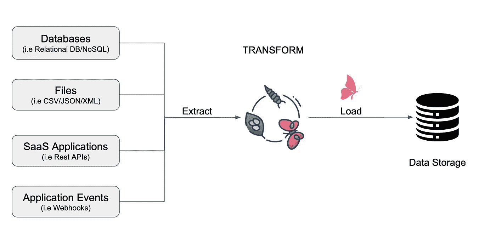

# 使用 py toolter 的 ETL 管道

> 原文：<https://medium.com/mlearning-ai/etl-pipeline-with-pyjanitor-7834e6e6f946?source=collection_archive---------3----------------------->

*使用 Python ETL 工具*提取、清理和存储数据。

# **概述**

机器学习算法需要高质量的数据来训练，以便做出正确的预测。这是通过 ETL 完成的。

什么是 ETL？

Photo by Maxine Attobrah (Author)

ETL(提取转换负载)是创建高效机器学习算法的基础。ETL 是一个三步数据…