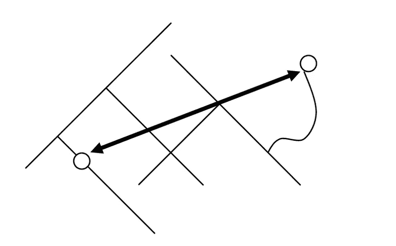
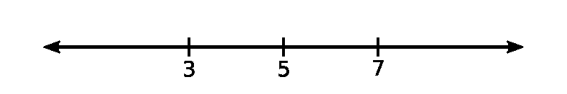
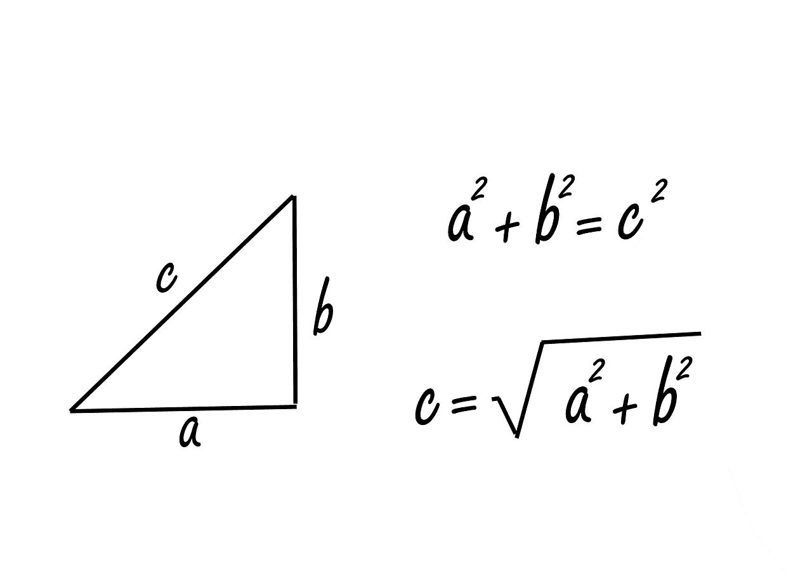
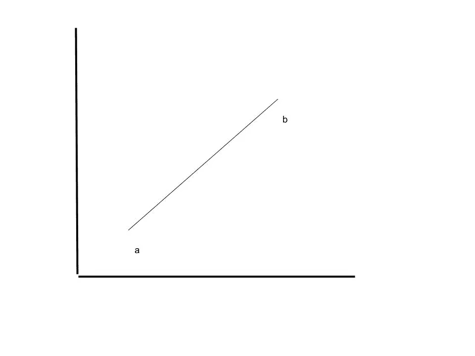

# 欧几里得距离

> 原文：<https://medium.com/mlearning-ai/euclidean-distance-8fae145ef5f3?source=collection_archive---------3----------------------->

欧几里德距离或毕达哥拉斯距离是世界上最普遍认可的度量之一。这是大多数人联想到的距离。

在本文中，我们将从基本定义和较小维度中的距离开始，并概括计算的定义。然后，我们将使用 Python 中的代码来计算相同的时间和空间复杂度。稍后，我们将讨论度量标准的局限性。最后，我们最终会看到所有使用这个距离的机器学习算法。



Creative Commons Attribution-Share Alike 3.0 Unported

从 A 点到 B 点，可以走无数条路。最短路径是我们将在本文中讨论的内容。

# 计算欧几里德距离

## **一维距离**

在一维空间中，欧几里德距离不仅直观，而且易于计算。

> d(a，b) = |a - b|



Fig 1\. [Creative Commons](https://en.wikipedia.org/wiki/en:Creative_Commons) [CC0 1.0 Universal Public Domain Dedication](https://creativecommons.org/publicdomain/zero/1.0/deed.en)

在上图中，显然 3 和 5 之间的距离是 2，3 和 7 之间的距离是 4。

但是，我们将使用下面的公式，而不是上面的公式

> d(a，b) = sqrt((a - b))

从数学上来说，这等同于之前的公式，然而，当我们进入更高维度的时候，我们用这个来标准化度量。

## 二维距离

欧几里得距离也被称为毕达哥拉斯距离的原因是，当我们在 2-D 空间中时，我们使用毕达哥拉斯定理来计算计算两点之间距离的斜边。



Licensed under Creative Commons

为了计算距离 ***c*** ，在下图中，我们计算了 ***a*** 和 ***b*** 的一维距离，并使用毕达哥拉斯定理计算了 ***c*** 的值。

如果我们说直角处的点为 0，那么距离为 ***c*** 的直线两端的点就变成了(a，0)和(0，b)。

那么，一维距离 ***a*** 和 ***b*** 就是 sqrt( ***a*** )和 sqrt( ***b*** )。同理，将使 ***c*** 成为 sqrt(***a***+***b***)。

一般来说，如果等效点的坐标为( ***a1*** ， ***a2*** )和( ***b1*** ， ***b2*** )，它们之间的距离如下

> d((a *1* ，a2)，(b1，b*2*))= sqrt((B1-a1)+(B2-a2))

## 任意维数的距离

按照与上面类似的思路，我们可以几何地显示(至少对于 3-D ),计算欧几里德距离的公式如下

> d((a *1* ，a2，a3，..，an)，(b1，b2，b3，..，bn)=
> 
> sqrt((B1-a1)+(B2-a2)+(B3-a3)+……+(bn-an))

这个距离符合我在我的[早期文章](https://srikgorthy.medium.com/distance-metrics-9f5830322dee)中提到的所有距离属性，并且它们可以用最小的努力来证明。

在这一节中，我将使用 Python 代码来计算欧几里德距离。这可能不适合非编码人员。您可以继续下一部分，在那里我将讨论欧几里德距离的局限性和用途。

# 计算距离的 Python 代码

下面是 Python 中计算欧氏距离的代码。对于给定的列表向量 **a** 和 **b** 。

```
>>> def euclidean(a, b):
      len_a = len(a)
      len_b = len(b)
      dist = 0
      if len_a != len_b:
          print("Lengths of the vectors don't match. Retry again.")
      else:
          for i in range(len_a):
              dim_dist = (b[i] - a[i])**2
              dist = dist + dim_dist
          dist = dist ** 0.5
      return dist
```

使用它的结果如下

```
>>> print(euclidean([0,0,0,0], [1,1,1,1]))
2.0
```

> 考虑到确定 **a** 和 **b** 的量级为 O(1 ),其时间复杂度的量级为 O(n ),空间的量级为 O(1)。这同样适用于后面幻灯片中的其他计算方法

然而，这通常在实践中从未使用过，因为有明确定义的函数可以绕过定义它。那么，让我们来看看人们计算欧几里德距离的通常方法。

使用 Scipy，

```
from scipy.spatial import distancea = (0, 0, 0, 0)
b = (1, 1, 1, 1)print(distance.euclidean(a, b))
```

使用 Numpy，

```
import numpy as npa = np.array((0, 0, 0, 0))
b = np.array((1, 1, 1, 1))

print(np.linalg.norm(a - b))# or alternatively print(np.sqrt(np.sum(np.square(a-b))))
```

运用数学，

```
from math import dist

a = (0, 0, 0, 0)
b = (1, 1, 1, 1)print(dist(a,b))
```

# 欧几里德距离的局限性

即使欧几里德距离直观且易于计算，它也有一定的局限性。我们将在本节中看到其中的两个

## 规模差异

如果改变计算距离的尺度，欧几里得距离会改变，但不一定成比例。

例如，假设我们有以下点 a，b



Image by Srik Gorthy

假设 ***a*** 在 x 和 y 维度上是 1 英寸，b 是 5 英寸。

如果我们使用前面的公式来计算距离，我们最终得到的是 sqrt((5–1)+(5–1))，大约是 5.7 英寸。

现在让我们把 y 轴转换成厘米，做同样的事情。记住 1 英寸是 2.54 厘米，我们最后得到的点， ***a*** 为(1，1)，点， **b** 为(12.7，12.7)。这里的距离是 16.5 个单位(注意，这既不是英寸也不是厘米)。当我们按照不同的单位和不同的分布处理不同的维度时，这种基于标度的距离值的差异会产生问题。为了解决这个问题，我们使用诸如*标准化*或*标准化*之类的技术。(我目前计划在以后的文章中讨论这些主题)

## 维度的诅咒

随着维数的增加，计算欧几里德距离变得复杂。就计算本身而言，这仍然具有相同的复杂程度。但是增加更多的维度会让所有的点看起来都是等距的(注意这不是指[等距](https://en.wikipedia.org/wiki/Equidistant)，数学概念)。

我将在后面的文章中单独处理这个问题，并尽力提供直观的解释。

# 机器学习中的用途

欧几里德距离在许多最大似然算法中是一个有用的度量。我在下面的列表中给出了一些例子。

。线性回归(计算损失函数中的误差)

。k-最近邻

。k 均值聚类

总的来说，欧几里德距离对于具有低维数据的模型是一个很好的距离度量。

在下一篇文章中，我会讲一个克服了维数灾难的距离度量， ***余弦相似距离*** 。

# 参考

。[https://stack overflow . com/questions/24309974/时间复杂度欧几里德距离](https://stackoverflow.com/questions/24309974/time-complexity-of-euclidean-distance)