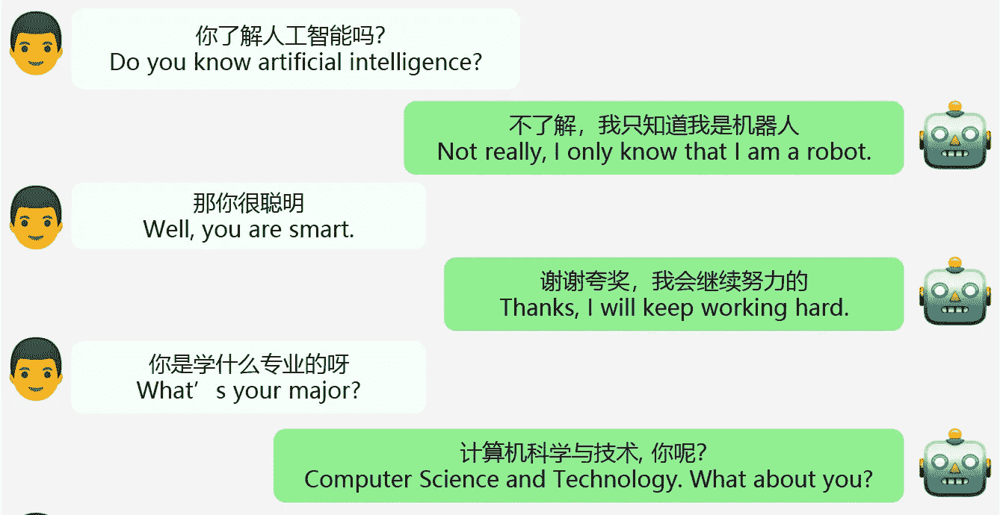

# EVA 2.0

> 原文：<https://medium.com/mlearning-ai/eva-2-0-70ee23c15283?source=collection_archive---------3----------------------->

## [机器学习艺术](https://mlearning.substack.com/)

## 开放域对话系统

[An example of the conversation between a human and the EVA2.0 model.](https://mlearning.substack.com/)

**功能强大的拟人聊天机器人**是为用户提供拟人聊天体验的必备工具。近年来，许多强大的开放领域对话模型已经作为开源发布。但大部分是英语，其他语言的代表力有限。