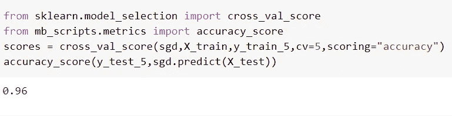
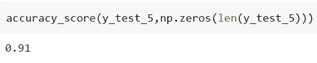
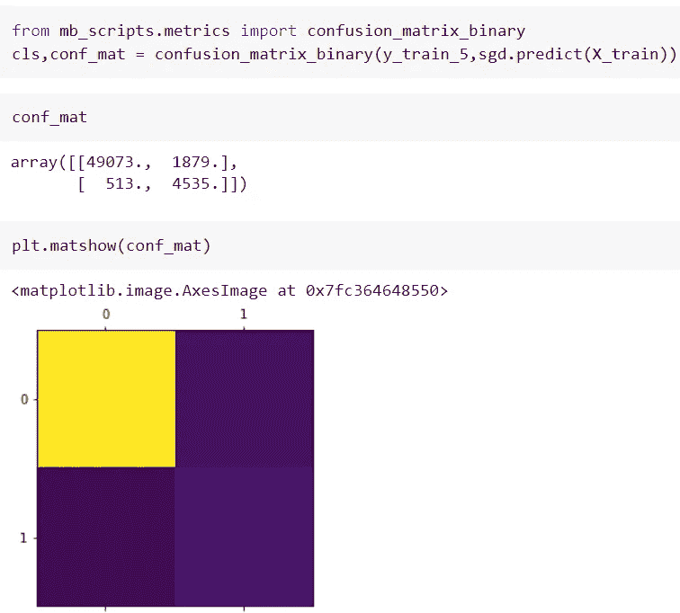
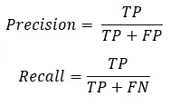
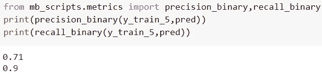
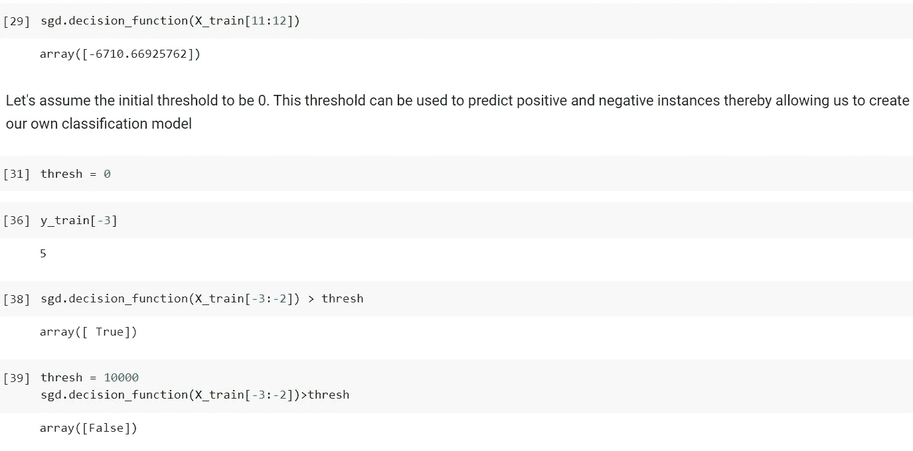
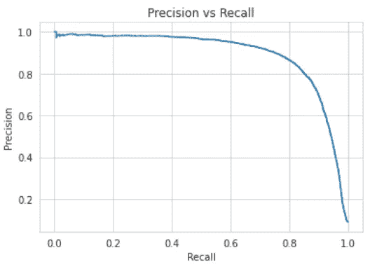
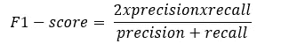
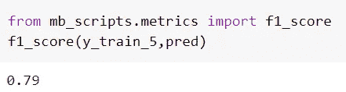
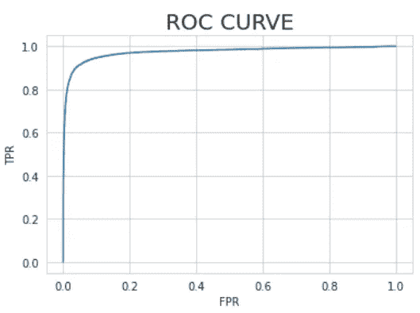

# 评估分类模型

> 原文：<https://medium.com/mlearning-ai/evaluating-classification-models-943758b285be?source=collection_archive---------3----------------------->

萨提亚·克里希南·苏雷什

源代码:[https://github . com/sathyakrishnan 1211/Low-key-ML/blob/master/Notebooks/Evaluating _ classification _ models . ipynb](https://github.com/SathyaKrishnan1211/Low-key-ML/blob/master/Notebooks/Evaluating_classification_models.ipynb)

在过去的几篇文章中，讨论了一些分类算法。那么我们如何为一个特定的问题选择一个模型呢？这是一个非常重要的问题，因为有许多分类模型，而只有一个模型或模型集合被选择用于部署。

基于一组特定的度量标准，从可用的模型中选择一个模型。我们永远不会根据单一指标来选择模型。它通常是指标的组合，或者取决于适合问题的特定指标。在本文中，我们将研究以下分类指标，
1。准确性。
2。混乱矩阵。
3。精确度和召回率。
4。f1-分数
5。ROC 曲线。

为了理解各种指标，我们将训练一个模型，只对 MNIST 数据集上的 5 进行分类。

**准确性:**
准确性是最简单的衡量标准，也很容易理解。它是正确分类的实例与实例总数的比率。

即使我们获得了 96%的准确度，该模型也远不是一个好的分类器，因为即使一个模型仅仅预测所有实例为“假”,其准确度也将为 90%,因为负面实例的数量构成了数据集的大约 90%。

因此，当我们使用准确性作为衡量标准时，我们应该确保数据中没有偏斜。如果数据偏向正面或负面的情况，则不应使用准确度分数。

**混淆矩阵:**
混淆矩阵对于二进制和多类分类问题都是非常有用的工具。这是一个矩阵，由真阳性、真阴性、假阳性和假阴性的数量组成。在混淆矩阵中，行代表实际的类，列代表预测的类。行中值的总和给出了属于特定类的实例的实际数量。对于一个好的分类模型，所有对角线元素与非对角线元素相比将具有更大的值(理想情况下，我们希望非对角线元素为 0，但这在现实世界的问题中不会发生)。

正如我们从上图中看到的，对角线元素与其他值相比具有较大的值，但是也有许多误报(1879 ),这意味着我们的模型没有足够好地捕捉独特的模式。你可以从混淆矩阵中得出很多推论。其中两个是使用混淆矩阵中的 TPs、FPs 计算的精度和召回率。

**查准率和查全率:**
查准率和查全率是评估分类模型最广泛使用的两个指标。
Precision 就是正面预测的准确性，就这么简单。从混淆矩阵中，通过将第 2 行第 2 列的值除以第 2 列的值的总和来获得精度。
召回率是训练实例中真实阳性与阳性总数的比率。从混淆矩阵中，通过将第 2 行第 2 列的值除以第 2 行值的总和来获得回忆。回忆也称为真阳性率或灵敏度。

上图显示，该模型的精度仅为 0.71，这意味着存在大量的假阳性，我们在混淆矩阵中也看到了这一点。

还有一件事，关于精度和召回，我们必须讨论的是精度和召回之间的权衡。当你试图增加其中一个时，另一个就会下降。这是因为大多数分类器基于阈值对实例进行分类。当你试图提高精确度时，也就是当你试图减少假阳性时，你将阈值推得更高，这样预测的阳性总是正确的，从而导致更高的精确度。但是这样做的话，大量的阳性实例被归类为阴性，导致假阴性的增加，从而降低了召回率。当你试图提高召回率时，情况正好相反，会产生更多的误报，导致准确率下降。

为了选择一个给出良好的精度和召回率的阈值，我们可以使用精度召回图。下图向我们展示了在特定区域中，召回率和精确度的值都在 0.8 到 0.85 之间。我们可以选择对应于该区域的阈值来构建分类器。

**F1-score:**
用两个指标——精度和召回率——比较分类模型有点困难。F1-score 通过取调和平均值将这两个指标结合在一起。选择调和平均值而不是平均值或加权平均值，因为它对较低的值给予更大的权重。这意味着只有当两个值都很高时，F1 分数才会更高。

上述值 0.79 是对分类模型的公平评价。这与我们在混淆矩阵和精度得分中看到的值一致。

**ROC 曲线:**
ROC(接收方操作员特征)曲线为真阳性率(TPR)与假阳性率(FPR)之间的曲线图。这里，TPR 也被称为回忆或敏感性。FPR 1-TNR。

ROC 曲线背后的主要思想是提高 TPR，降低 FPR。ROC 曲线用于通过测量曲线下面积(AUC)对分类模型进行大量比较。AUC 最高的模型是性能最好的模型。理想的模型将沿着图的左上轴。

**结论:**
分类模型的选择有多种评价尺度。这里已经讨论了几个。我希望你喜欢这篇文章。

 [## Mlearning.ai 提交建议

### 如何成为移动人工智能的作者

medium.com](/mlearning-ai/mlearning-ai-submission-suggestions-b51e2b130bfb)