# 简化评估分类模型。

> 原文：<https://medium.com/mlearning-ai/evaluating-classification-models-simplified-b5929146504e?source=collection_archive---------8----------------------->

Photo by [Giorgio Trovato](https://unsplash.com/@giorgiotrovato?utm_source=unsplash&utm_medium=referral&utm_content=creditCopyText) on [Unsplash](https://unsplash.com/s/photos/win?utm_source=unsplash&utm_medium=referral&utm_content=creditCopyText)

> 如果你不能衡量它，你就不能改善它。~开尔文勋爵

任何有人做的项目都可以被称为成功或失败。机器学习世界也没什么不同，我们需要一种方法知道什么时候停下来，说我们的模型是成功的。

# 介绍

Photo by [Mufid Majnun](https://unsplash.com/@mufidpwt?utm_source=unsplash&utm_medium=referral&utm_content=creditCopyText) on [Unsplash](https://unsplash.com/s/photos/covid?utm_source=unsplash&utm_medium=referral&utm_content=creditCopyText)

# 术语

**阳性等级** -例:一组患者正在进行新冠肺炎检测，医生说 70%的被检者检测结果为阳性，这是什么意思？这仅仅意味着患者已被证实患有新冠肺炎病。

**阴性等级**——以上例中，如果医生说剩余 30%的患者检测结果为阴性，则意味着患者没有新冠肺炎病。

**真阳性(TP)** :该病例为阳性，预测为阳性。您预测客户将拖欠银行贷款，而他们实际上已经违约。

**真阴性(TN)** :该病例为阴性，预测为阴性。您预测客户不会拖欠银行贷款，他们也没有拖欠。

**假阴性(FN)** :该病例为阳性，但预测为阴性。您在预测客户不会拖欠银行贷款，而他们实际上已经拖欠了。

**假阳性(FP)** :病例为阴性，但预测为阳性。您预测客户不会拖欠银行贷款，但他们仍然拖欠。

***真阳性和真阴性总是好的。假阳性也称为 1 型错误，只是假警报。假阴性(也称为 2 型错误)是不好的。因此，您的目标是确定您是想减少类型 1 错误还是类型 2 错误。这将完全由您的业务问题来解决。我们将在本文后面看到例子。***

# 混淆矩阵

混淆矩阵是描述分类模型性能的表格。它显示真阳性、真阴性、假阳性和假阴性的结果。因此，您可以简单地说，它是一个表，显示了我们的模型在预测各种类的示例方面有多好。

假设您预测的是糖尿病患者，那么各种类别计数的混淆矩阵可能如下所示，具体取决于您的模型的表现:

**注:**

**0:阴性(非糖尿病)**

**1:阳性(糖尿病级)**

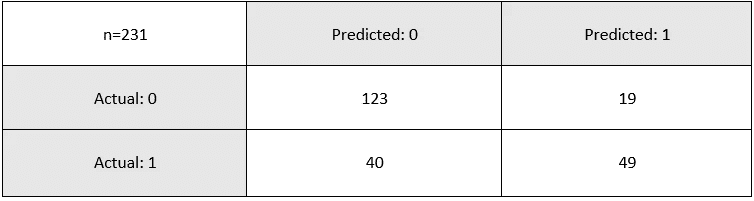

source — Author

**真阳性[1，1]-** 我们正确预测了**49 人患糖尿病。**

****真阴性[0，0]-** 我们正确预测了 123 人没有糖尿病。**

****假阳性【0，1】-**我们预测有 19 个人有糖尿病，但是他们没有糖尿病。**

****假阴性【1，0】-**我们预测 40 个人没有糖尿病，但他们实际上有糖尿病。**

**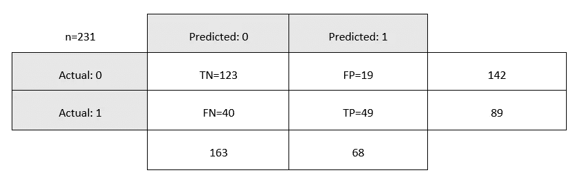**

**source- Author**

**混淆矩阵帮助我们计算分类模型的评估指标。这些指标将帮助我们获得一个分数，并衡量模型的表现如何，然后如果需要，将模型调整到我们获得高分的点。这些指标是**准确度、精确度、召回率和 F1 分数。****

# **准确(性)**

**准确性意味着您希望计算正确预测的样本与所有样本的比率。**

**根据下图中的课程，我们想计算出在生病[1]的课程中我们答对了多少题，在没有生病[0]的课程中我们答对了多少题。因此，这就是**真阳性**(我们预测他们会生病，但他们确实生病了)，以及**真阴性**(我们预测他们不会生病，但他们确实没有生病)**

**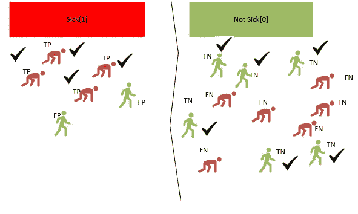**

**Accuracy: Source- Author**

**混淆矩阵的准确度计算如下:**

**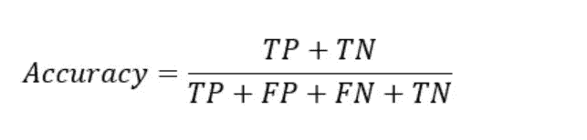**

**从上面的图像例子来看，准确率是 10/18 或 55.56%，其中 10 是真阳性和真阴性，18 是我们的全部观察值。**

**声明:如果你有一个倾斜的数据集，那么准确性不是最好的指标，所以使用。这是因为模型有可能给出不正确的预测，但仍然具有高精度。例如，如果 95%的数据集属于一个类，那么您的模型将学习得很好，只预测这一个类，从而获得高精度分数。在高度不平衡的数据集下，你几乎可以在没有机器学习模型帮助的情况下猜测一个样本属于哪个类。因此，我们决定采用其他指标来帮助评估。这些是精确度、召回率和 F1 分数。**

# **精确**

**它被表述为，在由模型预测的所有阳性样本(类别标签 1)中，有多少实际上是阳性的。例如:在我们预测会生病的所有人中(包括 TP 和 FP)，有多少人实际上生病了(TP)。**

**记住精度的最好方法是记住我们关注的是类别标签 1【正面预测】。**

**从下面的图片来看，真阳性和假阳性都是在预测生病的人这一边。为了精确起见，我们忽略了 ***非病侧【0】***，而将注意力集中在**病侧【1】**，这里我们既有 **TP 又有 FP。****

****

**Precision: Source- Author**

**混淆矩阵的精度计算如下:**

**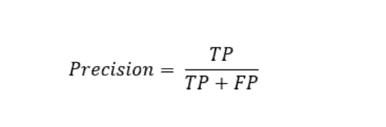**

**因此，根据上面的图像，我们的精度是 8/8+2=0.8 或 8/10，其中 8 是我们正确预测为生病(TP)的人数，10 是观察到的总人数或我们预测为生病的所有人，无论他们是生病(TP)还是没有生病(FP)**

**0.8 到百分比是 80%。这意味着 80%我们预测会生病的人实际上都生病了。就比例而言，这意味着每 10 个被贴上糖尿病标签的人中有 2 个是健康的，8 个是糖尿病患者。**

**高精度意味着我们有大量的真阳性。低精度意味着我们有大量的假阳性。**

# **回忆**

**为了回忆，我们观察双方，但重点是任何一方实际生病的人(TP 和 FN)。我们包括来自 ***病侧【1】***和非**病侧【0】**的观察，其中我们有 **TP 和 FN。****

**记住 TP 和 FN 意味着我们的病人实际上是生病了。从下图来看，真阳性和假阳性都在 ***病侧【1】***而不是**病侧【0】。****

**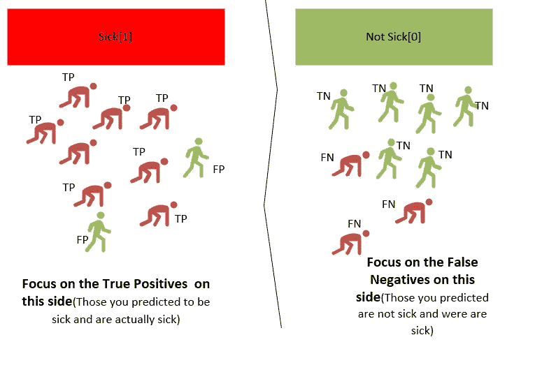**

**source — Author**

**混淆矩阵的精度计算如下:**

**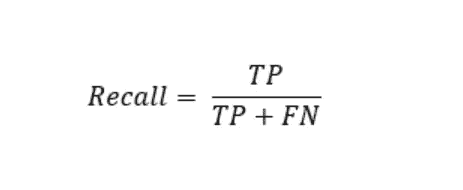**

****从上图回忆:****

*****预测患病人数(TP)？8*****

*****实际患病人数(TP 和 FN)有多少？8+3*****

**因此，回忆是 8/(8+3)或 8/11 =0.73，其中 8 是我们正确预测为生病的人数，11 是正确和错误预测为生病的总人数。**

**0.73 到 73%的百分比。这意味着 73%的患病人群被正确预测。**

**低召回分数可能表明我们有大量的假阴性。例如，从下图中，如果我们预测了更多的假阴性(那些预测没有生病但实际上生病的)，我们的回忆将会改变，并且是:2/(2+6)或 2/6 = 0.33 分或 0.33%**

**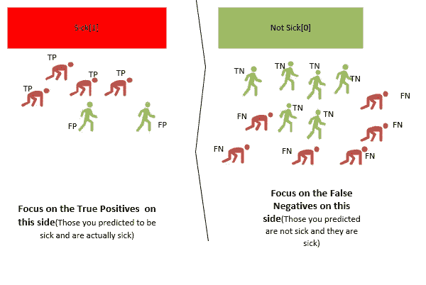**

**source-Author**

# **F1-分数**

**如果精度提高，召回率降低，反之亦然。因此，引入了一种新的测量方法，称为 F1 分数。F1-Score 计算精确度和召回率，并给出传达精确度和召回率之间平衡的单一分数。最好的分数是 1.0，而最差的分数是 0.0。**

****

# **人们应该关注哪些指标？**

**这个问题的答案很大程度上取决于你的业务目标，咨询领域专家来指导你总是好的。根据手头的业务问题，精确度和召回率都很重要。**

**在查看召回率或准确率之前，先确定是 FP 还是 FN 更重要。**

**如果你的目标是减少假阴性，那么你会自动知道我们正在寻找召回。**

**如果你的目标是减少假阳性，那么你知道我们正在寻找精确度。**

**如果你想在查全率和查准率之间取得平衡，那么使用 F1 分数。**

# **示例 1:**

**预测糖尿病患者为阳性(存在)或阴性(不存在)的模型被期望检测糖尿病患者，以便他们可以被治疗。**

*   **目标是减少假阳性或假阴性吗？假阴性是危险的，因为许多人可能得不到治疗，最终导致严重的健康问题。**

**在这种情况下，我们希望减少假阴性，我们将主要关注**召回—(高召回)**。**召回率越高，我们的假阴性就越少。****

# **示例 2:**

**预测电子邮件是否为垃圾邮件的模型。**

*   **目标是减少假阳性或假阴性吗？误报的风险更大，因为你可能有重要的真正的电子邮件会被发送到垃圾邮件，因此错过了重要的信息。在这种情况下，误报更容易被接受，因为垃圾邮件可能不会导致任何重要信息的丢失。在这种情况下，我们希望减少误报，因此关注**精度****

# **示例 3:**

**检测交易是否是欺诈性的。**

*   **目标是减少假阳性或假阴性吗？FP(你预测他们是欺诈性的，不是欺诈性的)。FN(你预测它们不是欺诈性的，实际上是欺诈性的)。**

**在这种情况下，我们希望减少假阴性，我们将主要关注**召回—(高召回)**。召回率越高，我们的假阴性就越少。**

**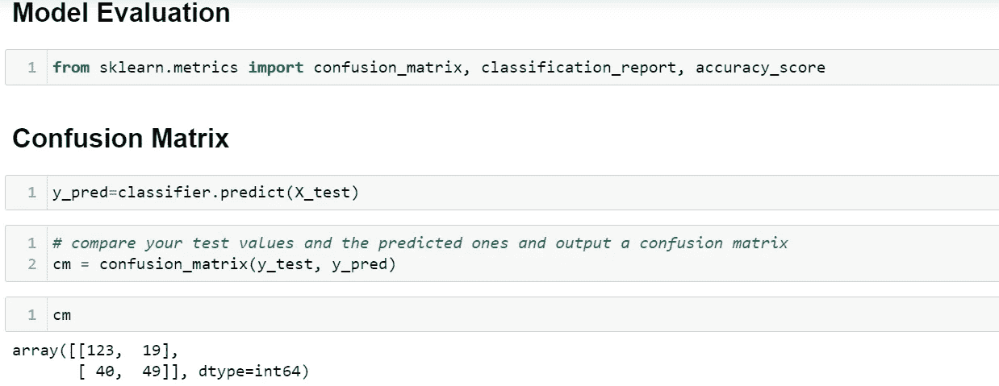**

# **混淆矩阵**

**我的混淆矩阵是通过比较我的预测值(y_pred)和实际值(y_test)计算出来的**

**在下图中，我只是用 seaborn 美化了混淆矩阵:**

**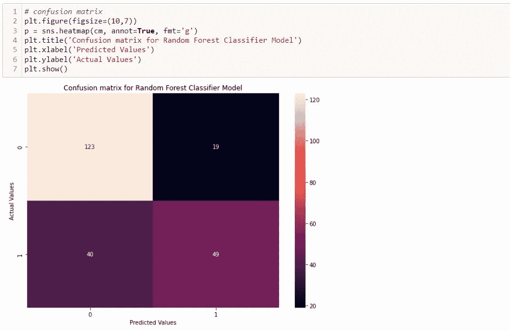**

# **准确度、精确度、召回率和 F1 分数**

**我们现在得到了准确性分数、精确召回率和 f1 分数，如下图所示。**

**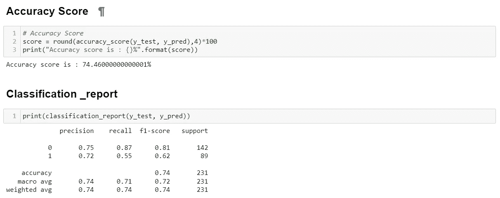**

**宏观和加权平均略有不同。强烈推荐这篇[文章](https://towardsdatascience.com/micro-macro-weighted-averages-of-f1-score-clearly-explained-b603420b292f)，了解两者的区别，选择哪个平均值。**

**感谢您的阅读。链接到 [Github 代码](https://github.com/Jnjerry/ArticlesCode/tree/main/Evaluating%20Classification%20Models)**

** [## Mlearning.ai 提交建议

### 如何成为 Mlearning.ai 上的作家

medium.com](/mlearning-ai/mlearning-ai-submission-suggestions-b51e2b130bfb)**