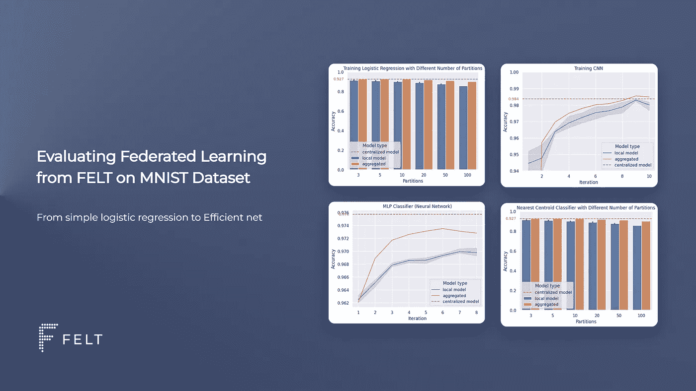
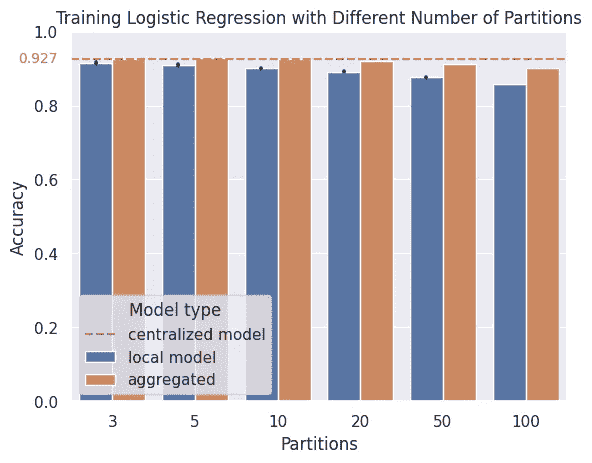
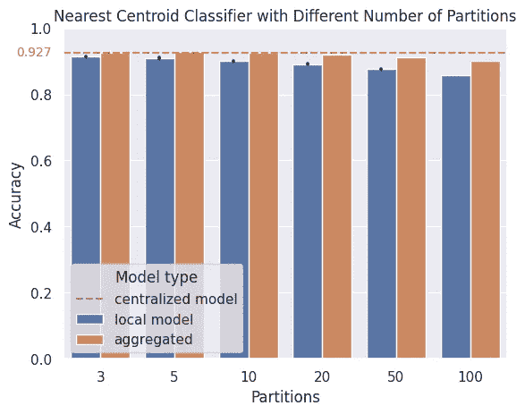
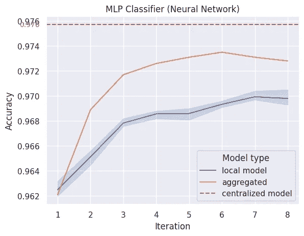
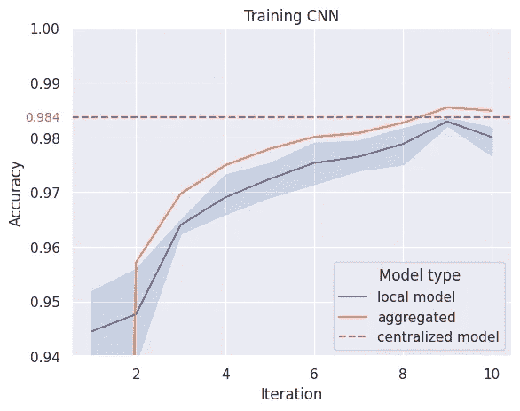
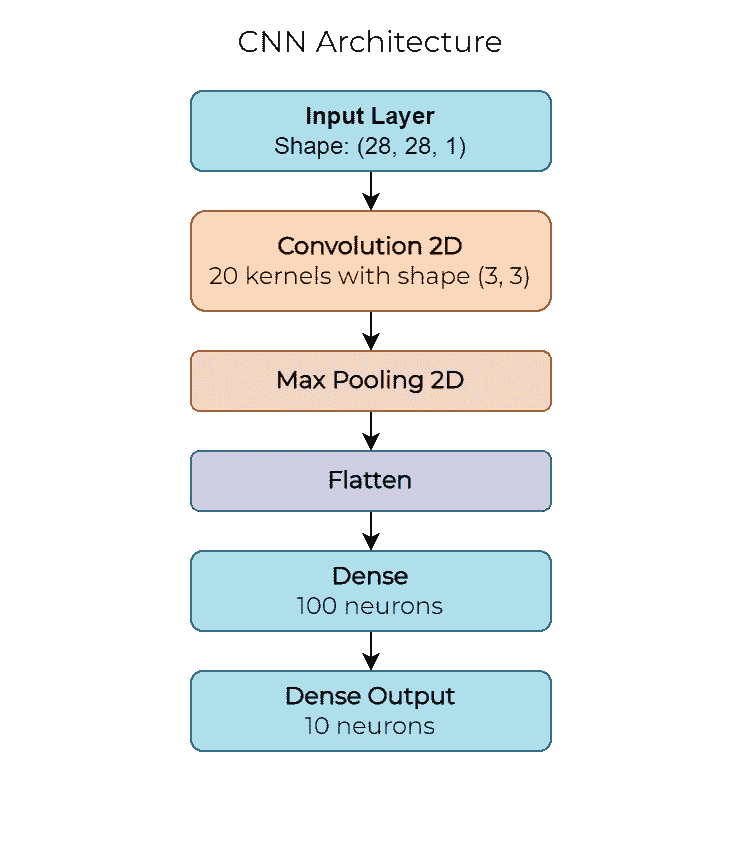
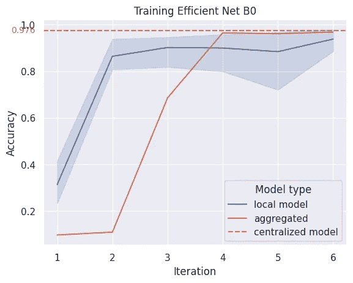

# 在 MNIST 数据集上评估 FELT Labs 的联合学习

> 原文：<https://medium.com/mlearning-ai/evaluating-federated-learning-from-felt-labs-on-mnist-dataset-cbe081b28786?source=collection_archive---------0----------------------->

在 MNIST 数据集上测试不同的联邦学习模型

[FELT Labs](https://feltlabs.ai/) 是一个关于去中心化数据的数据科学工具。你可以用它在多个分散的数据集上训练机器学习模型，并聚合结果——联邦学习。本文将尝试回答这个简单的问题，“它实际上有效吗？”我们将使用 FELT 支持的模型来评估和比较联合学习与在 [MNIST 数据集](https://en.wikipedia.org/wiki/MNIST_database)上的集中训练。

这里提供了本文中用于生成图表的源代码:

 [## GitHub - FELT-Labs/mnist-demo:在 mnist 数据集上演示测试 FELT

### 此时您不能执行该操作。您已使用另一个标签页或窗口登录。您已在另一个选项卡中注销，或者…

github.com](https://github.com/FELT-Labs/mnist-demo) 

*储存库包含* [*jupyter 笔记本*](https://github.com/FELT-Labs/mnist-demo/blob/main/main_tests.ipynb) *所有结果在此呈现。*

# 评估流程

在我们研究单个模型之前，我们必须定义如何测量性能。我们使用 MNIST 数据集，分为训练和测试数据。在训练和评估模型时，我们将遵循以下规则:

*   对于联合学习，我们将训练集随机划分为 X 个分区(我们固定随机种子，因此划分对所有模型都是一样的)。
*   对于集中训练，我们使用整个训练数据集。
*   使用准确性度量在测试集上评估产生的每个模型。
*   如果我们运行联合学习的 X 次迭代，我们将为集中式模型运行相同数量的迭代(时期)。

为了更好地控制这一过程，培训在当地环境中进行，遵循与分散设置相同的程序。记住这些规则，我们就可以开始训练一些模型了！

## 数据预处理

MNIST 数据集包含大小为 28x28 像素的图像。大多数 scikit-learn 模型只期望一个一维向量作为输入。出于这个原因，我们把每张图片展平成一个矢量。此外，我们将像素值从[0，255]缩放到[0，1]范围。

## 如何阅读图表

每个图表包含三个主要数据点:集中式模型、本地模型和聚合模型:

*   **集中式模型**是在全 MNIST 数据集上训练产生的模型。
*   **局部模型**是分别在数据集的每个分区上训练的模型。(图表显示平均精度和误差范围)
*   **聚合模型**是通过聚合本地模型产生的模型。这是毛毡的最终输出。

因此，我们主要寻找局部模型(在单个数据集上训练的)和由它们的组合产生的聚集模型(**平均模型的权重**)之间的比较。

# 简单模型

我们将从评估 scikit-learn 库中的简单模型开始。对于这种情况，我们选择了两个模型:[逻辑回归](https://scikit-learn.org/stable/modules/generated/sklearn.linear_model.LogisticRegression.html)和[最近质心分类器](https://scikit-learn.org/stable/modules/generated/sklearn.neighbors.NearestCentroid.html#sklearn.neighbors.NearestCentroid)。我们可以称这些模型为简单模型的主要原因是，它们可以在联邦学习的一次迭代中被训练。我们使用了 scikit-learn 库中的所有默认超参数。

我们将针对不同数量的分区评估这些模型。对于每个划分，我们将运行一次联合学习的迭代。

Comparison between the accuracy of local and aggregated models for different numbers of partitions (separate datasets).

正如我们从图表中看到的，聚合对于这些模型非常有效。随着分区数量的增加，本地模型的准确性会降低(这是意料之中的，因为每个分区中的数据量会减少)。这也是意料之中的，因为两个模型都具有线性结构，使得平均聚合非常适合。此外，我们看到，随着分区数量的增加，聚合带来的**额外好处也会增加**。

# 神经网络

由 scikit-learn 提供并由 FELT 支持的一个更复杂的模型是 [MLP 分类器](https://scikit-learn.org/stable/modules/generated/sklearn.neural_network.MLPClassifier.html?highlight=mlp+classifier#sklearn.neural_network.MLPClassifier)，一个简单的神经网络。在我们的例子中，我们使用了一个有两个隐藏层的网络，都有 50 个神经元。同样值得一提的是，在每次迭代中，我们只运行 50 个训练步骤，批量大小为 50。这确保了来自每个分区的本地模型不会相差太多，并且平均聚合具有有益的效果。

> 从现在开始，所有展示的图表将来自 3 个分区的培训。

Accuracy of MLP Classifier trained using 8 iterations of federated learning on 3 partitions (datasets).

正如我们所看到的，第一次迭代主要初始化模型权重。因为来自第一次迭代的本地模型有很大的不同，所以聚合没有什么好处。从第二次迭代开始，聚合的效果更加明显。

# 张量流 CNN 模型

MNIST 包含图像，如果不包括至少一个卷积神经网络 CNN，这将不是一个正确的评价。我们最近在 FELT 中添加了对 TensorFlow 模型的支持，这仍然是一个实验性的功能。这一部分主要是为了表明，事实上，我们可以在一个联合设置中训练这些网络，即使是简单的平均聚合。

首先，我们尝试训练一个具有一个卷积层和一个全连接层的简单网络。

Accuracy of CNN model trained on 10 iterations of federated learning trained on 3 partitions.

从图表中，我们可以看到聚合的好处低于以前的模型。聚合的第一次迭代不会产生好的结果，因为模型差异很大。我们至少需要运行两次迭代才能从聚合中获益。

让我们疯狂一点，试着训练高效的网络。这是一个拥有数百万参数的庞大网络，我们从零开始训练它。重点主要是说明 FELT 甚至可以处理大型模型。

Accuracy of Efficient Net model trained using federated learning on 3 partitions (datasets).

我们的聚合方法对于这样的大型模型并不理想。尽管如此，在几次迭代之后，聚集模型提供了与最佳局部训练模型相当的结果。这意味着由 FELT 产生的模型至少不会导致更差的准确性。

## 后续步骤

正如现在所做的，使用高效网络的联合学习不是一个好方法。它从头开始训练所有参数。我们仍然包括结果，以表明我们可以训练这些模型。更好的方法是采用预先训练好的模型，只对最后一层进行微调。我们将在下面的文章中尝试这种方法！

# 结论

我们评估了当地环境中几种不同型号的毛毡的性能。很高兴看到，事实上，对多个分散的数据集进行聚合是有好处的。然而，在大型模型方面还有很多工作要做。微调可能是处理这些模型的一个可能的解决方案。

*在 Twitter 上关注我们*[*@ FELT _ Labs*](https://twitter.com/FELT_labs)*了解我们开发的更多更新。*

 [## Mlearning.ai 提交建议

### 如何成为 Mlearning.ai 上的作家

medium.com](/mlearning-ai/mlearning-ai-submission-suggestions-b51e2b130bfb)