# 分类问题的评价方法

> 原文：<https://medium.com/mlearning-ai/evaluation-methods-for-classification-problems-a388bb56d635?source=collection_archive---------3----------------------->

在这篇文章中，我们将看看机器学习中分类问题的一些评估方法。我们将讨论的方法有:

*   混淆矩阵
*   准确(性)
*   精确
*   回忆
*   f1-分数
*   精确召回曲线
*   ROC 曲线(受试者工作特性曲线)
*   曲线下面积

让我们从混淆矩阵开始…

# 混淆矩阵

混淆矩阵是一个表格，我们可以清楚地看到预测类别和实际类别。二元分类的混淆矩阵如下所示:

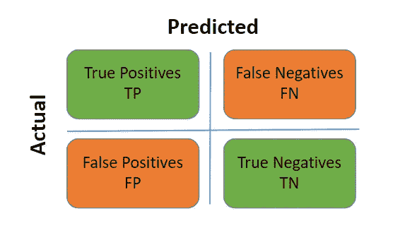

Source: Author

**真阳性(TP):** 预测阳性和实际阳性。

**假阳性(FP):** 预测为阳性而实际为阴性。

**真否定(TN):** 预测否定，实际否定。

**假阴性(FN):** 预测为阴性，实际为阳性。

为了计算混淆矩阵，我们将使用 sklearn 库中的 ConfusionMatrixDisplay 类。

[混淆矩阵显示文档](https://scikit-learn.org/stable/modules/generated/sklearn.metrics.ConfusionMatrixDisplay.html)

```
from sklearn.datasets import load_breast_cancer
from sklearn.model_selection import train_test_split
from sklearn.metrics import ConfusionMatrixDisplay
from sklearn.linear_model import LogisticRegressionX**,**y **=** load_breast_cancer**(**return_X_y **=** **True)**X_train**,** X_test**,** y_train**,** y_test **=** train_test_split**(**X**,** y**,** test_size**=**0.2**,** random_state**=**42**)**clf **=** LogisticRegression**(**max_iter**=**10000**)**
clf**.**fit**(**X_train**,** y_train**)**ConfusionMatrixDisplay**.**from_estimator**(**clf**,** X_test**,** y_test**,** display_labels **=** **[**'malignant'**,** 'benign'**])**
```

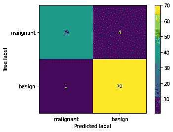

Source: Author

根据某些问题，查看假阴性或假阳性的数量可能非常重要。这就是混淆矩阵派上用场的地方，因为它就是这么做的。

在这种情况下，我们有癌症数据集的精度矩阵。我们可以看到真阳性的数量是 39。这意味着该模型能够正确识别 39 个癌症样本。

然而，我们也有 1 个假阳性(病人实际上没有癌症，但模型说病人有癌症)。在这种情况下，假阳性可能不是那么严重，因为额外的医疗控制将在以后揭示患者没有癌症(除了对患者来说几天困难的日子……)。

这里非常关键的是预测为无癌症的 4 名患者，但他们实际上患有癌症(假阴性)。这是一个我们根本不想要的病例，因为癌症患者的生命危在旦夕。因此，对于这个问题，我们的目标是尽可能减少假阴性。另一个问题是，减少误报的数量可能更重要。这就是为什么当涉及到分类问题时，混淆矩阵非常重要。

# 多类分类的混淆矩阵

当我们从二元分类问题转移到多类分类问题时，混淆矩阵变得更大。多类问题的混淆矩阵看起来是这样的:

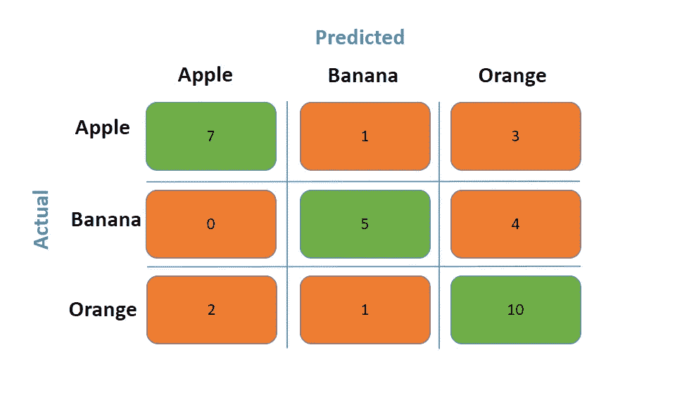

Source: Author

混淆矩阵的大小与目标类别的数量相同。混淆矩阵的一个很大的优点是，它允许我们看到哪个类别有多少样本被错误分类，以及哪个预测类别与哪个实际类别混淆。

# 准确(性)

准确性是衡量分类器做出正确预测的频率。它是总正确预测与总预测的比率。

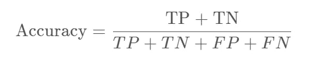

准确性是一个易于理解的指标，在数据集平衡时非常有用。但是，在评估不平衡的数据集时可能会产生误导。当数据集中的目标类在样本方面存在较大差异时，就是一个不平衡的数据集。在处理不平衡的数据集时，准确性不是最佳的衡量标准。让我们看看下面的例子。

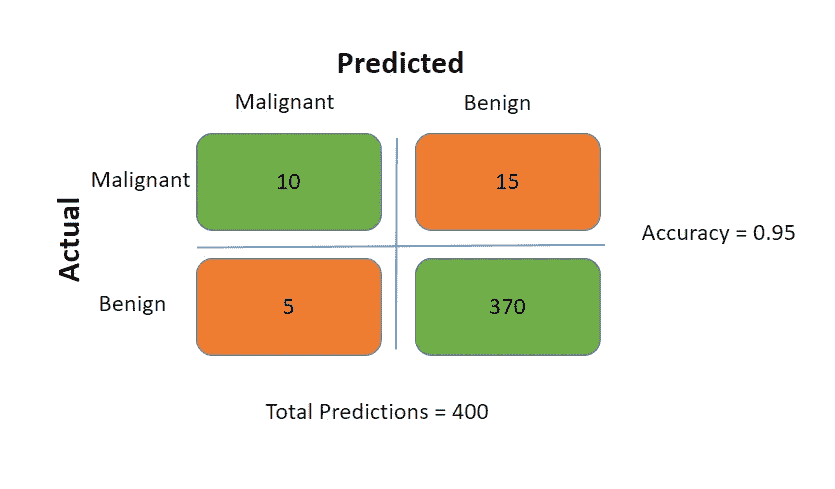

Source: Author

当我们仔细查看混淆矩阵时，我们发现只有 25 名患者实际患有癌症，而实际上没有癌症的患者为 375 名。该模型的精度为 0.95，表现相当不错，是吗？不完全是，该模型在预测没有癌症的患者方面相当不错，但我们不能对实际患有癌症的患者说同样的话(在 25 名实际患有癌症的患者中，只有 10 名预测正确)。因为准确度只考虑正确预测与总预测的比率，所以最常见的类性能支配着度量，当数据集不平衡时，会导致对模型性能的误导性解释。

为了计算准确度，我们将使用 sklearn 库中的 accuracy_score 函数。

[准确度分数文件()](https://scikit-learn.org/stable/modules/generated/sklearn.metrics.accuracy_score.html)

```
y_pred **=** clf**.**predict**(**X_test**)***#calling the accuracy_score function from metrics*
accuracy_score **=** metrics**.**accuracy_score**(**y_test**,** y_pred**)***print***(**"Accuracy score is: {:.2f}"**.**format**(**accuracy_score**))**Accuracy score is: 0.96correct_predictions **=** **[**pred **for** i**,**pred **in** *enumerate***(**y_pred**)** **if** pred **==** y_test**[**i**]]**accuracy_manual **=** *len***(**correct_predictions**)/***len***(**y_pred**)***print***(**"Accuracy score is: {:.2f}"**.**format**(**accuracy_manual**))**Accuracy score is: 0.96
```

# 精确

精度是模型的真实正预测与总正预测之比的度量。在假阳性比假阴性更重要的情况下，精度是一个有用的指标。这种情况可能是推荐系统，误报会导致客户流失，进而降低业务成功。

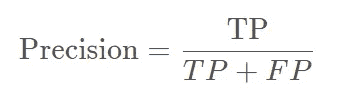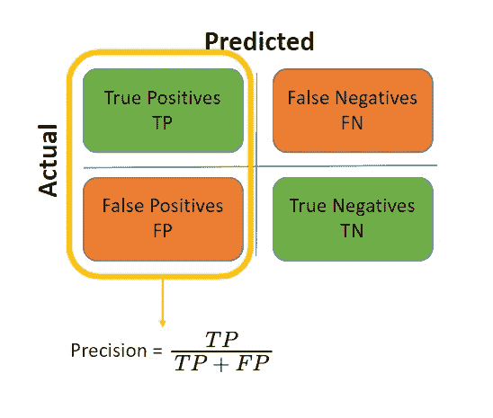

Source: Author

我们前面例子的精度是:

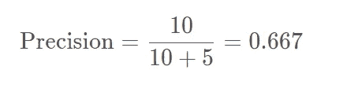

不如准确性好，对吧？在这种情况下，假阴性比假阳性更重要，我们不想误诊任何癌症患者为阴性，如果他们实际上有癌症！我们也有一个度量标准，召回！

为了计算精确度，我们将使用 sklearn 库中的 precision_score 函数。

【precision _ score()文档

```
precision_score **=** metrics**.**precision_score**(**y_test**,** y_pred**)***print***(**"Precision score is: {:.2f}"**.**format**(**precision_score**))**Precision score is: 0.95TP **=** **[**pred **for** i**,**pred **in** *enumerate***(**y_pred**)** **if** **(**pred **==** y_test**[**i**]** **&** pred **==** 1**)]**
TP_FP **=** **[**pred **for** i**,**pred **in** *enumerate***(**y_pred**)** **if** **(**pred **==** 1**)]**precision_manual **=** *len***(**TP**)** **/** *len***(**TP_FP**)***print***(**"Precision score is: {:.2f}"**.**format**(**precision_manual**))**Precision score is: 0.95
```

# 回忆

回忆是模型能够正确预测的阳性病例数的比率。当假阴性比假阳性更重要时，召回是一个有用的指标。如我们所述，例如，在不想遗漏任何实际阳性的医疗病例(如癌症数据集)中，这一点很重要，而误报(假阳性)则不那么重要。

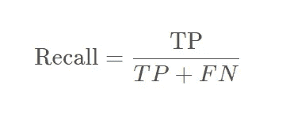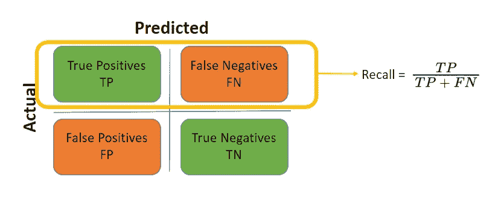

Source: Author

我们前面示例中的召回将是:

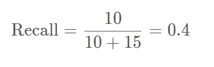

我们可以看到，与准确度和精确度相比，我们的召回率要高得多，在这种情况下，准确度和精确度实际上是最重要的指标。在这里，我们可以清楚地看到，使用不平衡数据集的准确性可能会产生误导。

为了计算准确性，我们将使用 sklearn 库中的 recall_score 函数。

[recall _ score()的文档](https://scikit-learn.org/stable/modules/generated/sklearn.metrics.recall_score.html#sklearn.metrics.recall_score)

```
recall_score **=** metrics**.**recall_score**(**y_test**,** y_pred**)***print***(**"Recall score is: {:.2f}"**.**format**(**recall_score**))**Recall score is: 0.99TP **=** **[**pred **for** i**,**pred **in** *enumerate***(**y_pred**)** **if** **(**pred **==** y_test**[**i**]** **&** pred **==** 1**)]**
TP_FN **=** **[**pred **for** i**,**pred **in** *enumerate***(**y_pred**)** **if** **(**y_test**[**i**]** **==** 1**)]**recall_manual **=** *len***(**TP**)** **/** *len***(**TP_FN**)***print***(**"Precision score is: {:.2f}"**.**format**(**recall_manual**))**Precision score is: 0.99
```

# f1-分数

F1 分数是精确度和召回率的结合。它是查准率和查全率的调和平均值，当查准率等于查全率时最大。因此，当我们寻求两全其美时(当我们在假阳性和假阴性之间没有显著性差异时)，f1 是我们的度量。

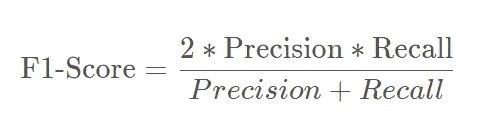

我们之前示例中的 F1 分数为:

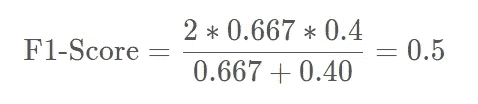

F1 分数对极端值的惩罚更大，当添加更多数据而对结果没有影响时，或者当我们有大量真阴性时，f1 分数是一个有效的指标。当我们处理不平衡的数据时，与准确性相比，这也是一个更好的选择。

为了计算准确性，我们将使用 sklearn 库中的 f1_score 函数。

[f1 _ score()的文档](https://scikit-learn.org/stable/modules/generated/sklearn.metrics.f1_score.html#sklearn.metrics.f1_score)

```
f1_score **=** metrics**.**f1_score**(**y_test**,** y_pred**)***print***(**"F1-score is: {:.2f}"**.**format**(**f1_score**))**F1-score is: 0.97f1_manual **=** 2*****precision_manual*****recall_manual**/(**precision_manual **+** recall_manual**)***print***(**"F1-score is: {:.2f}"**.**format**(**f1_manual**))**F1-score is: 0.97
```

# 精确召回曲线

PR 曲线是说明二进制分类的精度值相对于召回值的变化的图。通过计算分类器不同阈值的精度和召回值并绘制这些值来绘制 PR 曲线。《出埃及记》对于逻辑回归，阈值将是属于正类的预测的预测概率。

它常用于不平衡数据集的问题。y 轴上是精度值，x 轴上是召回值。我们在前面的例子中看到了哪些用例精度和召回指标可能是合适的。PR 曲线允许我们考虑指标和一个指标相对于另一个指标的变化。

当两个目标类之间的样本不平衡时，同时考虑精度和召回率会很有用。当负类(类 0)的样本多于正类(类 1)的样本时，情况尤其如此。精确度和召回率都不考虑真阴性的数量，而是集中在对阳性类别的错误预测的纠正上。

为了绘制分类器的 pr 曲线，我们将使用 sklearn 库中的 precision_recall_curve()函数。

【precision _ recall _ curve()的文档

我们可以使用 predict_proba()方法获得概率，然后使用这些概率来构建 PR 曲线。决策阈值通常为 0.5。这意味着如果概率大于 0.5，那么它将被预测为正。

```
from sklearn.metrics import precision_recall_curve
import matplotlib.pyplot **as** plt
**%**matplotlib inlineprobabilities **=** clf**.**predict_proba**(**X_test**)[:,**1**]**precision_vals**,**recall_vals**,**thresholds **=** precision_recall_curve**(**y_test**,** probabilities**)**plt**.**plot**(**recall_vals**,** precision_vals**,** label **=** 'PR Curve'**,** marker**=**'o'**)**
**for** i**,**val **in** *enumerate***(**precision_vals**):**
  **if** precision_vals**[**i**]** **!=** precision_vals**[-**1**]:**
    plt**.**text**(**recall_vals**[**i**],** val**,** *str***(***round***(**thresholds**[**i**],**3**)),** fontsize**=**10**)**
plt**.**axvline**(**x**=**1**,**ymin**=**0**,** ymax**=**0.95**,** color**=**'r'**,** label**=**"Best Model"**)**
plt**.**axhline**(**y**=**1**,** xmin**=**0**,** xmax**=**0.95**,** color**=**'r'**)**
plt**.**xlabel**(**'Recall'**)**
plt**.**ylabel**(**'Precision'**)**
plt**.**legend**([**'PR Curve'**,** 'Best model'**],** loc **=** 'best'**)**plt**.**show**()**
```

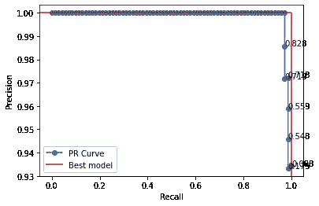

Source: Author

这里，我们计算了每个阈值的精度和召回值，并绘制了它们。红线代表完美的分类器应该是什么样子。我们的公关曲线似乎也表现不错。在每个标记上，我们还可以看到相关的阈值概率值。我们想选择更接近完美红线的门槛。这里取决于我们的目标是最大化哪个度量，我们可以据此选择阈值。如果我们对查全率或查准率没有偏好，我们也可以计算每个阈值的 f1 值，并据此进行选择。

```
f1_score **=** **(**2 ***** precision_vals ***** recall_vals**)** **/** **(**precision_vals **+** recall_vals**)**f1_score:array([0.96598639, 0.95890411, 0.96551724, 0.97222222, 0.97902098,
       0.97183099, 0.9787234 , 0.98571429, 0.97841727, 0.97101449,
       0.96350365, 0.95588235, 0.94814815, 0.94029851, 0.93233083,
       0.92424242, 0.91603053, 0.90769231, 0.89922481, 0.890625  ,
       0.88188976, 0.87301587, 0.864     , 0.85483871, 0.84552846,
       0.83606557, 0.82644628, 0.81666667, 0.80672269, 0.79661017,
       0.78632479, 0.77586207, 0.76521739, 0.75438596, 0.74336283,
       0.73214286, 0.72072072, 0.70909091, 0.69724771, 0.68518519,
       0.6728972 , 0.66037736, 0.64761905, 0.63461538, 0.62135922,
       0.60784314, 0.59405941, 0.58      , 0.56565657, 0.55102041,
       0.53608247, 0.52083333, 0.50526316, 0.4893617 , 0.47311828,
       0.45652174, 0.43956044, 0.42222222, 0.40449438, 0.38636364,
       0.36781609, 0.34883721, 0.32941176, 0.30952381, 0.28915663,
       0.26829268, 0.24691358, 0.225     , 0.20253165, 0.17948718,
       0.15584416, 0.13157895, 0.10666667, 0.08108108, 0.05479452,
       0.02777778, 0\.        ])import numpy **as** np
ix **=** np**.**argmax**(**f1_score**)**
*print***(**'Best Threshold=%f, F1-Score=%.3f' **%** **(**thresholds**[**ix**],** f1_score**[**ix**]))**Best Threshold=0.851244, F1-Score=0.986
```

# ROC 曲线(受试者工作特性曲线)

ROC 曲线是通过绘制真阳性率(召回)对假阳性率(FPR)来指示不同分类阈值的分类模型的性能的图。它与 PR 曲线有相似的想法，但我们在这条曲线上绘制的是 FPR 而不是精度。

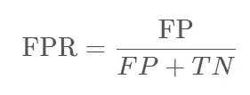

为了绘制分类器的 ROC 曲线，我们将使用 sklearn 库中的 roc_curve()函数。

[roc _ curve()的文档](https://scikit-learn.org/stable/modules/generated/sklearn.metrics.roc_curve.html)

```
from sklearn.metrics import roc_curve
fpr**,** tpr**,** thresholds **=** roc_curve**(**y_test**,** probabilities**)**plt**.**plot**(** fpr**,** tpr**,**  label **=** 'ROC Curve'**,** marker**=**'o'**)**
**for** i**,**val **in** *enumerate***(**tpr**):**
    plt**.**text**(**fpr**[**i**],** val**,** *str***(***round***(**thresholds**[**i**],**3**)),** fontsize**=**10**)**
plt**.**xlabel**(**'FPR'**)**
plt**.**ylabel**(**'TPR'**)**
plt**.**legend**(**loc **=** 'best'**)**
plt**.**show**()**
```

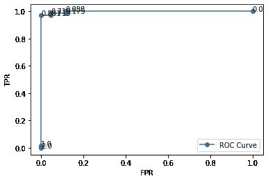

Source: Author

通过降低分类阈值，更多的预测被识别为肯定的。这增加了假阳性率和真阳性率。因此，该曲线看起来与 PR 曲线不同。

在 ROC 曲线中，我们寻找最接近左上角的理想点。用一个数字来估计我们的曲线离左上角有多近是有用的，对吗？曲线下面积(AUC)是另一种可以帮助我们的方法。

# 曲线下面积

曲线下的 AUC /面积是 ROC 曲线下的整个二维面积。AUC 帮助我们将 ROC 曲线(也可用于 PR 曲线)中的信息总结为一个值。

ROC 曲线基本上是概率(阈值)曲线，AUC 基本上是类别可分性的度量。它告诉我们该模型能够多好地预测类别。因此，更高的 AUC 值意味着更好的分类器。AUC 值在 0 和 1 之间变化，意味着值 1 将意味着完美的分类器。

为了计算 roc 的 AUC 分数，我们将使用 sklearn 库中的 roc_auc_score()函数。

【roc _ auc _ score()的文档

在继续之前，让我们再次绘制 ROC 曲线，直观地检查曲线下的区域。

```
plt**.**plot**(** fpr**,** tpr**,**  label **=** 'ROC curve'**)**
plt**.**fill_between**(**fpr**,** tpr**,** alpha**=**0.3**)**
plt**.**xlabel**(**'FPR'**)**
plt**.**ylabel**(**'TPR'**)**
plt**.**legend**(**loc **=** 'best'**)**
plt**.**grid**()**
plt**.**show**()**
```

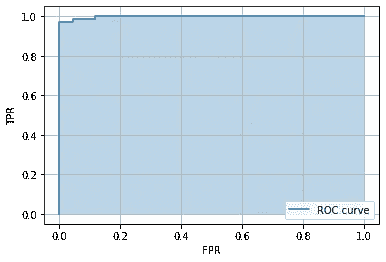

Source: Author

不能区分两个类别的分类器模型(无技能分类器)将预测最频繁出现的类别或所有预测的随机类别，并且它将具有 0.5 的 AUC。它的 ROC 曲线是一条对角线，如下所示。一直预测错误(0%正确预测)的分类器看起来与最佳曲线完全相反。

```
from sklearn.metrics import roc_curvepnt_1 **=** **[**0**,** 1**]**
pnt_2 **=** **[**0**,** 1**]**
fpr**,** tpr**,** thresholds **=** roc_curve**(**y_test**,** probabilities**)**
plt**.**plot**(** fpr**,** tpr**,**  label **=** 'ROC curve for DecisionTree'**)**
plt**.**plot**(** pnt_1**,** pnt_2**,**  label **=** 'ROC curve for AUC=0.5'**,** color**=**'r'**)**
plt**.**fill_between**(** pnt_1**,** pnt_2**,** alpha**=**0.3**,** facecolor**=**'r'**)**
plt**.**axvline**(**x**=**1**,**ymin**=**0.05**,** ymax**=**0.95**,** color**=**'r'**,** linestyle**=**'--'**,** label**=**"ROC curve for AUC=0.0"**)**
plt**.**axhline**(**y**=**0**,** xmin**=**0.05**,** xmax**=**0.95**,** color**=**'r'**,** linestyle**=**'--'**)**
plt**.**xlabel**(**'FPR'**)**
plt**.**ylabel**(**'TPR'**)**
plt**.**legend**(**loc **=** 'best'**)**
plt**.**show**()**
```

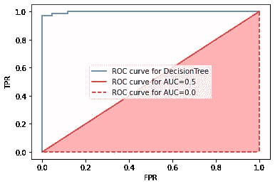

Source: Author

我们可以使用 sklearn 库中的 roc_auc_score 函数来计算上图的 ROC AUC 分数

```
from sklearn.metrics import roc_auc_scoreroc_auc_score**(**y_test**,** probabilities**)**0.9977071732721913
```

**优点:**

*   AUC 不随比例变化。这是对预测排名好坏的衡量，而不是它们的绝对值。
*   AUC 对分类阈值是不变的。它是对模型性能(预测正确性)的一种度量，与选择的分类阈值无关。

**缺点:**

*   对比例的不变性并不总是需要的。有时我们需要适应良好的概率输出。
*   对阈值的不变性并不总是需要的。当在假阴性和假阳性方面有很大差异时，我们可能希望只将其中一个最小化。例如，在前面的癌症例子中，我们提到了减少假阴性的重要性。在这种情况下，AUC 将不是一个有用的指标。

# PR 曲线对 ROC 曲线

*   ROC 曲线适用于处理更多的平衡数据集，而 PR 曲线适用于不平衡数据集。
*   PR cuve 不考虑真正的否定，因此当我们有一个不平衡的数据集时，它是一个有用的度量，如果否定类是多数类，考虑做出正确的否定预测对问题来说不是那么关键。
*   由于 ROC 曲线也考虑了真正的负面因素，如果当负面类别也很重要时(当 TP 和 TN 都很重要时)，这是一个更好的度量标准。

在这篇文章中，我们讨论了分类问题的评估方法。我希望这有助于理解这些普遍使用的指标。如果您有任何问题或反馈，请随时在下面留言！

如果你喜欢这个，欢迎关注我，获取更多免费的机器学习教程和课程！

[](/mlearning-ai/mlearning-ai-submission-suggestions-b51e2b130bfb) [## Mlearning.ai 提交建议

### 如何成为 Mlearning.ai 上的作家

medium.com](/mlearning-ai/mlearning-ai-submission-suggestions-b51e2b130bfb)