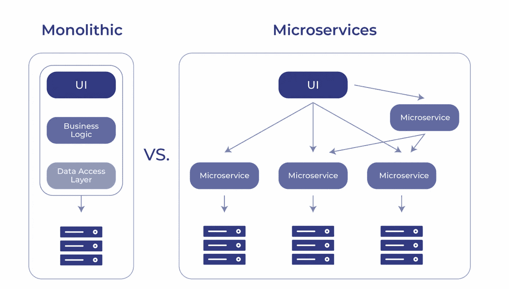
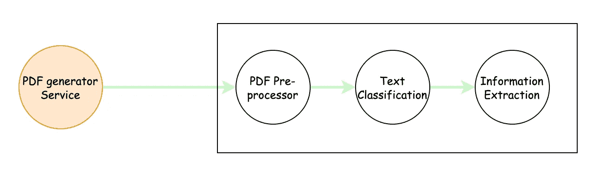
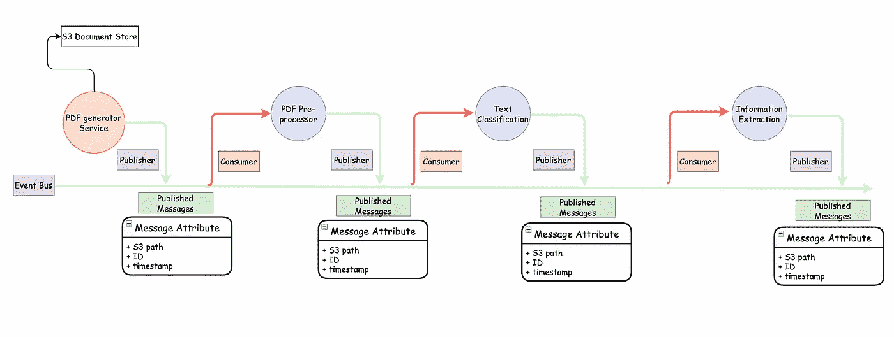
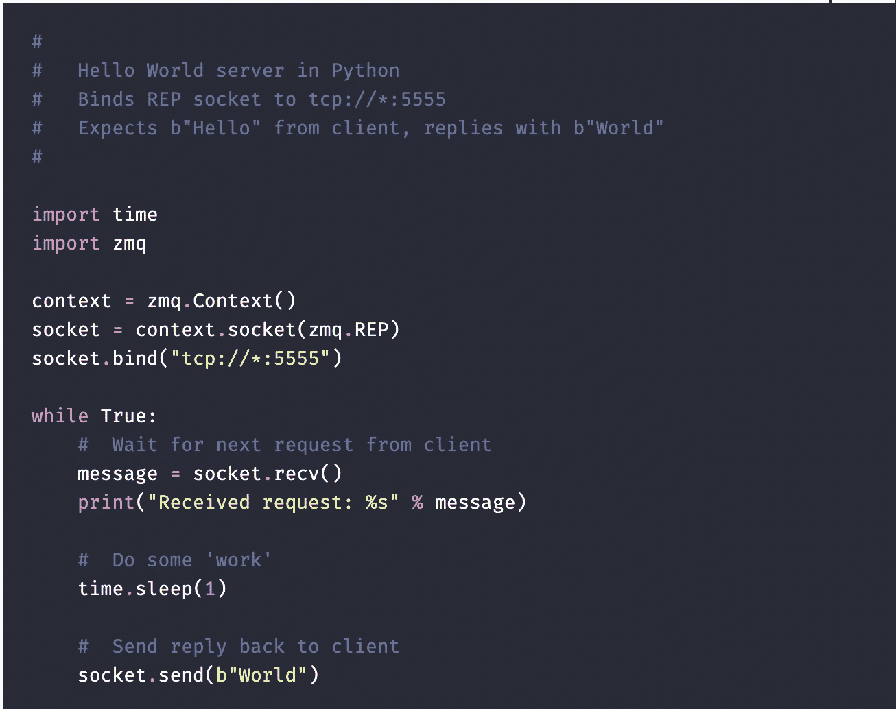
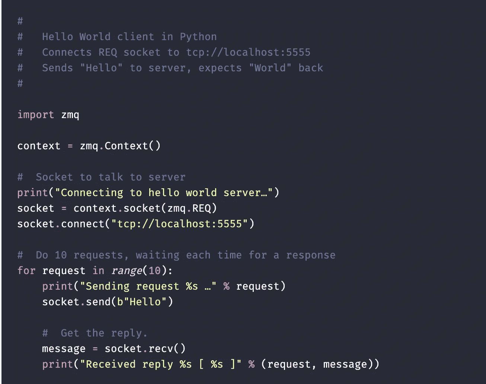

# 数据科学中的事件驱动微服务

> 原文：<https://medium.com/mlearning-ai/event-driven-microservices-in-data-science-31710a2c393c?source=collection_archive---------3----------------------->

> ***事件驱动的微服务*** 通过事件消息相互通信。当业务事件发生时，生产者用消息发布它们。同时，其他服务通过事件侦听器来使用它们。
> 
> 因此，事件驱动系统的主要好处是异步行为和松散耦合的结构。例如，应用程序不是在需要时请求数据，而是在需要之前通过事件消费数据。因此，应用程序的整体性能会提高。另一方面，保持耦合松散是微服务环境的主要关键点之一

# 问题陈述—信息提取

那么，当我们谈论数据驱动项目的微服务时，事件在哪里起作用呢？我将尽可能用简单的语言来解释用例。

*考虑以下场景*

> 数字 PDF 是实时生成的，您需要执行一些步骤，如 **PDF 解析- >文本分类- >信息提取和- >转储提取的信息**。结果可能实时需要，也可能不需要。

我可以用一种整体的方式将 3 种功能包装在 3 个不同的微服务中，它们可以达到目的。看起来相当容易。

Architecture 1

现在考虑这个；

在生成的 **nG** 张单据中， **nF** 张单据处理失败。
它不需要在信息提取的最后阶段失败，它可以在生成器服务生成 PDF 后的任何给定点失败。

暂时假设失败的原因可能是 API 停机，我的**文本分类 API** 关闭。如果我有了**架构-1** 会发生什么？在停机期间，我将面临一个问题，即**PDF-预处理器-API** 生成的信息将在大批量中未被处理。在解决了**Text-class ification-API**的宕机问题后，我们肯定可以创建一个快速修复程序，但是有没有更好的方法来解决这个问题呢？

# 作为解决方案的事件驱动架构

***Event-driven microservices***

> 您有许多微服务必须彼此异步交互。您可能希望您的服务是可伸缩的、相互独立的、独立维护的。您可能还希望您的微服务生成其他服务可以使用的事件。这就是事件驱动的微服务发挥作用的地方。

分解上述体系结构中命名的组件

*   事件总线:可以把它看作一个邮箱，服务生成的所有消息都在这个邮箱中发布，但是只能由地址写在消息有效负载上的服务使用。
*   发布者:每个微服务都有一个发布者控制器，它的工作是触发一个带有预定义负载的消息，该消息包含其他服务消费者可以使用的所需信息。
*   消费者:顾名思义，消费者说明了一切。它使用事件总线中发布的消息。每个消费者基本上都在听一些事件，等待各自的发布者。
*   事件消息:工作完成后，事件服务在事件通道/总线中发布具有特定/预定义有效负载结构的消息，其中包含重要信息，供消费者使用并完成剩余的任务。

请参见下面来自 ZeroMQ 的示例

Server

Client

我希望这给出了这些服务将会做什么以及事件驱动服务如何成为未来的高度概述。

 [## Mlearning.ai 提交建议

### 如何成为 Mlearning.ai 上的作家

medium.com](/mlearning-ai/mlearning-ai-submission-suggestions-b51e2b130bfb)