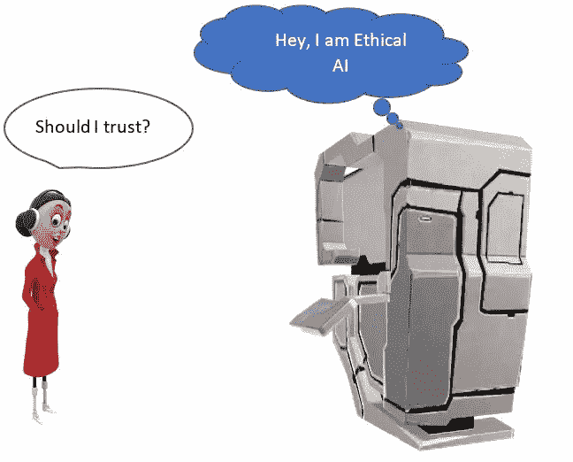
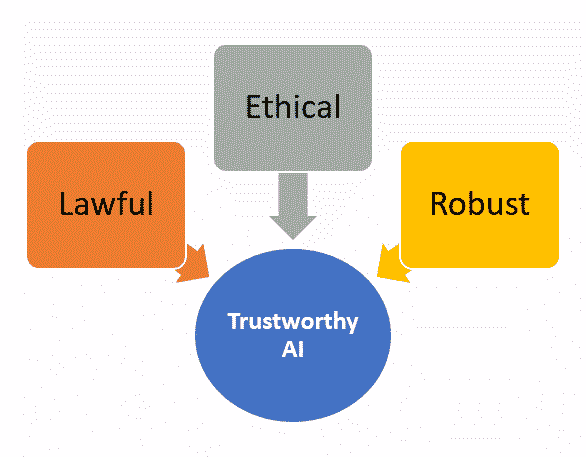
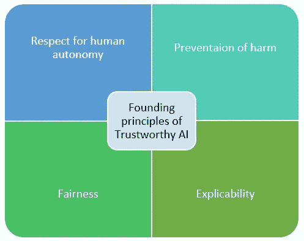
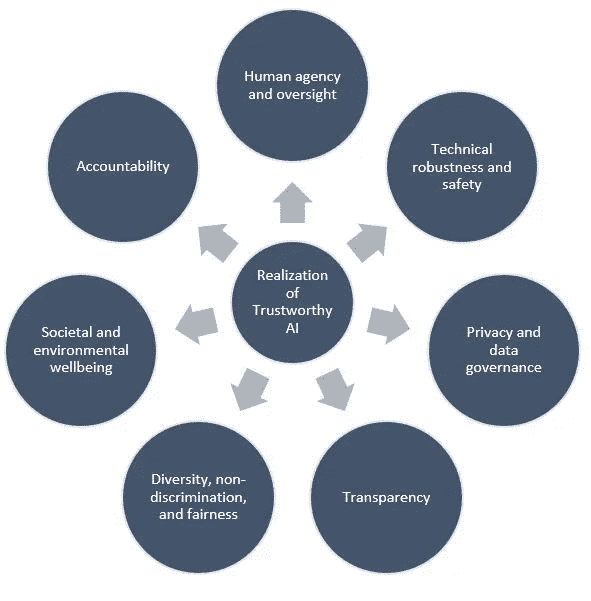
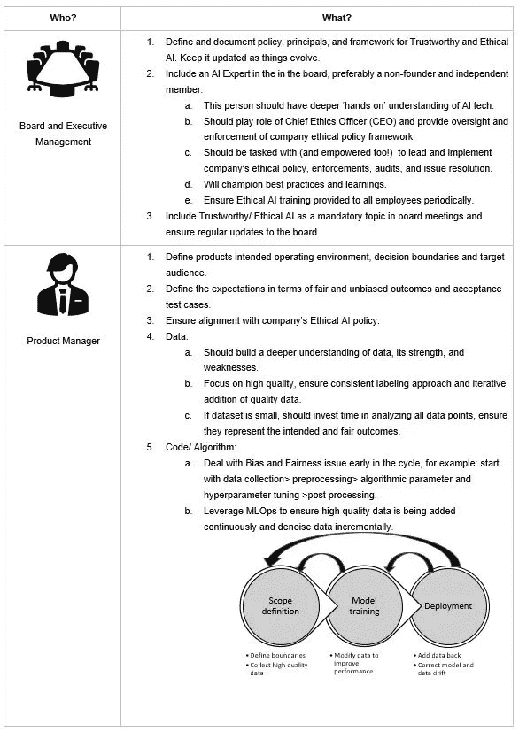
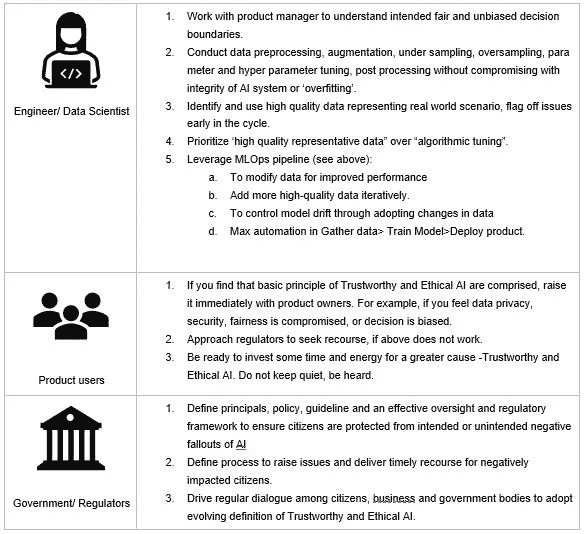

# 构建值得信赖和有道德的人工智能是每个人的责任

> 原文：<https://medium.com/mlearning-ai/everyone-has-a-role-to-play-to-actrustworthy-and-ethical-ai-49a72fd50193?source=collection_archive---------4----------------------->

"成为你希望世界发生的变化。"**圣雄甘地**

**语境**

无论你是否意识到，人工智能(AI)已经迅速成为我们日常生活的一部分。随着金融科技、媒体、医疗保健、制药和制造业等传统行业和企业近年来迅速采用人工智能，与道德和可信度有关的问题越来越多。

今天，人工智能“协助”许多影响人们生活和福祉的关键决策，例如，信誉，抵押贷款审批，疾病诊断，就业装修，等等。据观察，即使有人类的监督，复杂的人工智能系统最终可能会造成更多的社会危害，而不是社会利益。

构建值得信赖和有道德的人工智能是一项集体责任。我们必须在人工智能的整个生命周期中应用基础知识，例如，产品定义、数据收集、预处理、模型调整、后处理、生产部署和退役阶段。毫无疑问，政府和监管机构可以通过监控和确保为每个人提供公平的竞争环境来发挥作用，对于构建、部署和使用人工智能系统的人来说也是如此。这包括执行领导、产品经理、开发人员、MLOps 工程师、数据科学家、测试工程师、HR/培训团队和用户。

偏见和不公平

虽然可信和道德的人工智能是一个更广泛的话题，但它与防止偏见和不公平紧密相关。正如人工智能国家安全委员会(NSCAI)在最近的一份报告中所观察到的那样:“如果不加以检查，看似中立的人工智能(AI)工具可以并将延续不平等，实际上是自动歧视。”

人工智能从对过去数据的观察中学习。它学习数据的特征并简化数据表示，以便发现模式。在此过程中，数据被映射到低维(或潜在)空间，其中“相似”的数据点在图上靠得更近。举个例子，即使我们从训练数据中去掉了‘种族’这样不需要的特征，算法仍然会通过邮政编码这样的潜在特征进行间接学习。这意味着，仅仅放弃“种族”不足以防止人工智能从数据中学习偏见。这也带出一个事实，数据的‘偏差’和‘不公平’反映了我们所生活的社会的真相。

由于没有足够的数据点属于代表不足的社会阶层，他们很有可能受到人工智能决策的负面影响。此外，人工智能将通过其“倾斜”学习创造更多数据，这些数据将用于进一步训练它，并最终通过其决策创造进一步的差异。

**值得信赖和道德的人工智能很重要**

可信度意味着“诚实可信的能力”。组织必须确保他们的人工智能系统是值得信赖的，如果缺乏信任，可能会发生不良后果，如业务、声誉和商誉损失、诉讼和集体诉讼，这些对任何业务都可能是致命的和危及生命的。

按照欧洲委员会的说法，可信人工智能是由合法、道德和健壮的人工智能组成的。

Trustworthy AI should be Lawful, Ethical, and Robust

尊重人类的自主性、公平性、可解释性和防止伤害是可信人工智能的四个关键创建原则。基本的想法是，人工智能应该为人类的福祉工作，确保安全，应该总是在人类的控制之下，在任何情况下，它都不应该伤害任何人。

Founding principles

此外，EC 建议通过七个动作来实现可信 AI:

Realization

谁在推动道德人工智能？

虽然领先的科技公司已经宣布了一种或另一种道德人工智能计划和执行授权，但是，由于缺乏对基准原则、指导方针和框架的一致意见，很难评估这些计划背后的真正“意图”和实际进展。当人类和社会的很大一部分成为潜在的受害者时，仅仅“自我证明”是不够的。

政府应该在道德人工智能方面发挥主导作用，并为行业、监管机构、法院和用户定义政策基线。这应包括原则、政策、指导方针以及有效监督和监管框架的定义，以确保公民免受人工智能有意或无意的负面影响。这一基线框架应不断改进和完善。

最近，美国联邦政府签署了一项关于促进种族平等和支持服务不足社区的行政命令，然而，还需要和期待更多。

欧盟、联合国和国防部已经在这方面走在了前列，欧盟委员会关于可信人工智能的道德准则、联合国教科文组织关于人工智能道德的建议以及美国国防部关于人工智能的道德原则应该被视为定义可信和道德人工智能的实用和成熟准则的基线工作。

**涵盖主要利益相关者的行动计划。**

虽然我们希望政府、监管机构和企业自己带头确保部署的人工智能是可信和道德的，但这里有一个针对整个生态系统角色的建议行动计划:

**结论**

我们必须共同努力，为人类和社会建立值得信赖和有道德的人工智能。通过协调和坚持不懈的努力，这是完全可能的。