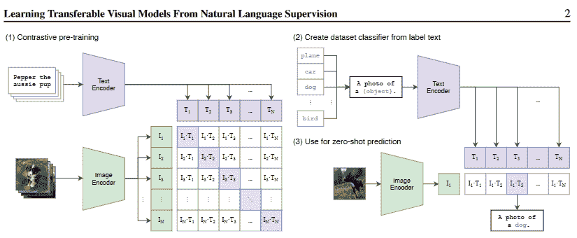
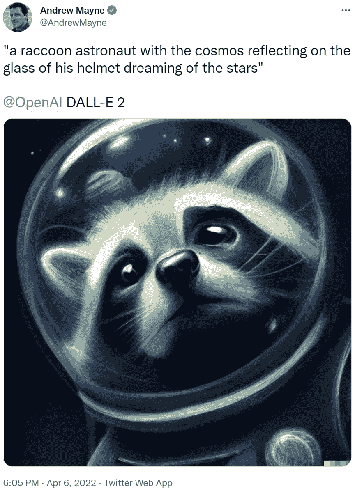

# 每个人都在谈论它:什么是 DALL。E 2？

> 原文：<https://medium.com/mlearning-ai/everyones-talking-about-it-what-is-dall-e-2-86ffad43e438?source=collection_archive---------6----------------------->

作为一名初级数据科学家，我没有该领域的广泛知识。在这篇文章中，我的目的是解释 DALL。E 2 是什么，它基于什么架构，用比专家可能写的更简单的话。我可能有点晚了，但我希望你仍然觉得有趣。

**让我们先了解一下背景**

我叫达尔。据说“E”是指电影《瓦力》及其同名机器人主角，以及西班牙著名艺术家萨瓦尔多·达利。

达尔。e 是 OpenAI 开发的一款软件。如果你熟悉这个领域，你肯定听说过他们。如果没有，下面是对该公司的简要描述:OpenAI 是一个专注于人工智能问题的研究实验室，旨在促进有益于人类的友好人工智能，而不是对人类构成风险。你可能听说过 DeepMind 的 *AlphaGo* 击败了世界上最好的围棋选手，OpenAI 参与了视频游戏 DOTA 2 的一个类似项目，他们在大量游戏中训练机器人。

达尔。2022 年 4 月)是该算法的第二个版本，紧随 DALL 之后。2021 年 1 月)。如果你有兴趣自己尝试看看它能做什么，你必须耐心等待，因为你需要在 [OpenAI 的网站](https://labs.openai.com/waitlist)上注册，才能被列入等待名单，有机会获得访问权。然而，有一个简化的开源版本，叫做 DALL。E Mini。请在这里[随意查看它](https://huggingface.co/spaces/dalle-mini/dalle-mini)，即使结果不那么令人印象深刻。

**打什么主意。E 2 真的有吗？**

DALL 的主要特点。E 1 和 2 是它将文本作为输入并基于该文本输出图像的能力。你可以获得任何人、物体、地点、情况等的图像。任何风格——你只需要在你的提示中清晰明了。

达尔。E 2 还可以编辑现有的图片，并在考虑阴影、反射和照明的同时添加和删除对象。此外，它可以从现有的图片中提出不同风格的图片变体。你可以在 OpenAI 的网站上找到不同功能的演示。

**它是怎么做到的？(这一部分我们可能需要更专业一点)**

达尔。E 2 由两个主要部分组成。第一个名为 CLIP [1]，由 OpenAI 研究人员开发。它由一个并行图像编码器和一个文本编码器组成，两者都是在没有权重初始化的情况下从头开始训练的。

The method used for CLIP from the research paper [1]

对于图像编码器，他们使用了两种不同的架构。第一个是 ResNet-50 的基础架构，有一些调整，我不会在这里列出，但你可以在论文中找到— *第 4–2.4 页。选择和缩放模型。*使用的第二个模型是一个视觉转换器，稍加修改。训练是在具有不同参数的 5 个 ResNets 和 3 个视觉变压器上进行的。一些参数在模型之间是通用的，比如时期数——32——或者选择的优化器——Adam。

文本编码器是一个转换器，也做了一些架构上的修改。它对 49，152 个标记词汇表进行操作，全部小写，并使用字节对编码(BPE)。BPE 是一种用数据中不存在的另一个字符替换重复字符对的方法[2]。

OpenAI 中有很多关于这种方法的更有价值的信息，但我尽量保持简单。如果您对模型、方法甚至所用参数的更多细节感兴趣，您可以在参考文献[1]中找到研究论文的链接。

组成 DALL 的第二个元素。E 2 是一个生成式预训练转换器，也是由 OpenAI 开发的。使用的版本是 GPT-3 [3]的实现，有 120 亿个参数，而原始模型在其当前版本中使用了 1750 亿个参数。有关 GPT-3 的更多信息，请参见参考资料。

我们现在知道什么是建筑了。E 2 是基于的，如果你有兴趣阅读 OpenAI 提出的完整方法，你会在这里或参考文献中找到研究论文的链接[。](https://arxiv.org/pdf/2204.06125.pdf)

**结论**

达尔。E 2 是一种 SoA(最先进的)算法。我们可以更深入地探讨这个问题，但我想我会失去很多人——坦率地说，我也可能会迷路。如果你是一个专家，你可能甚至不会读这篇文章，并且有兴趣阅读关于 CLIP，DALL 的全部研究论文。E 2，甚至 GLIDE [1][4][5]，你会在参考资料部分找到所有的链接。

达尔。研究 E 2 真的很有趣，因为它使用不同的模型组合成一个“超级”模型，可以创建像下面这样令人印象深刻的作品——你可以在 Andrew Mayne 的 Twitter feed 上找到许多其他例子:

Example of DALL.E 2 powerfulness from Andrew Mayne’s twitter

正如我在文章开头提到的，我在这个领域还是个新手，所以如果你发现了任何对论文的误解或任何错误，我将很高兴在评论区接受批评。

*敬请期待更多！如果你喜欢阅读，考虑留下一个关注或掌声。*🙂

**参考文献**

[1]剪辑:亚历克·拉德福德，琼·金旭，克里斯·哈拉西，阿迪蒂亚·拉梅什，加布里埃尔·高，桑迪尼·阿加瓦尔，吉里什·萨斯特里，阿曼达·阿斯克尔，帕梅拉·米什金，杰克·克拉克，格雷琴·克鲁格，伊利亚·苏茨基弗，*从自然语言监督中学习可转移的视觉模型*，[https://arxiv.org/pdf/2103.00020.pdf](https://arxiv.org/pdf/2103.00020.pdf)

[2]字节对编码:【https://en.wikipedia.org/wiki/Byte_pair_encoding】T4

[3] GPT-3: Sciforce，*什么是 GPT-3，它是如何工作的，它实际上做什么？I* ，[https://medium . com/sci force/what-is-GPT-3-how-it-work-and-what-it-actually-do-9f 721d 69 e5c 1](/sciforce/what-is-gpt-3-how-does-it-work-and-what-does-it-actually-do-9f721d69e5c1)

[4]达尔。E 2: Aditya Ramesh，Prafulla Dhariwal，Alex Nichol，Casey Chu，陈唐山，*分层文本条件，带剪辑潜伏的图像生成*，[https://arxiv.org/pdf/2204.06125.pdf](https://arxiv.org/pdf/2204.06125.pdf)

[5] GLIDE: Alex Nichol，Prafulla Dhariwal，Aditya Ramesh，Pranav Shyam，Pamela Mishkin，Bob McGrew，Ilya Sutskever，陈唐山， *GLIDE:用文本引导扩散模型实现照片真实感图像生成和编辑，*[https://arxiv.org/pdf/2112.10741.pdf](https://arxiv.org/pdf/2112.10741.pdf)

 [## Mlearning.ai 提交建议

### 如何成为 Mlearning.ai 上的作家

medium.com](/mlearning-ai/mlearning-ai-submission-suggestions-b51e2b130bfb)