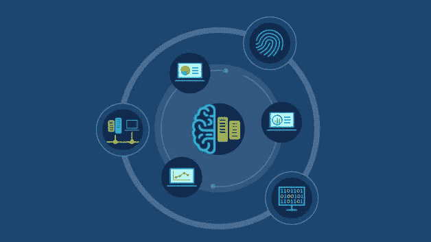
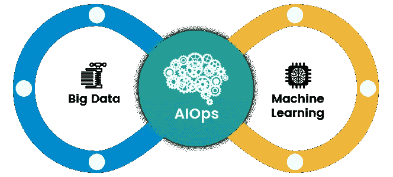
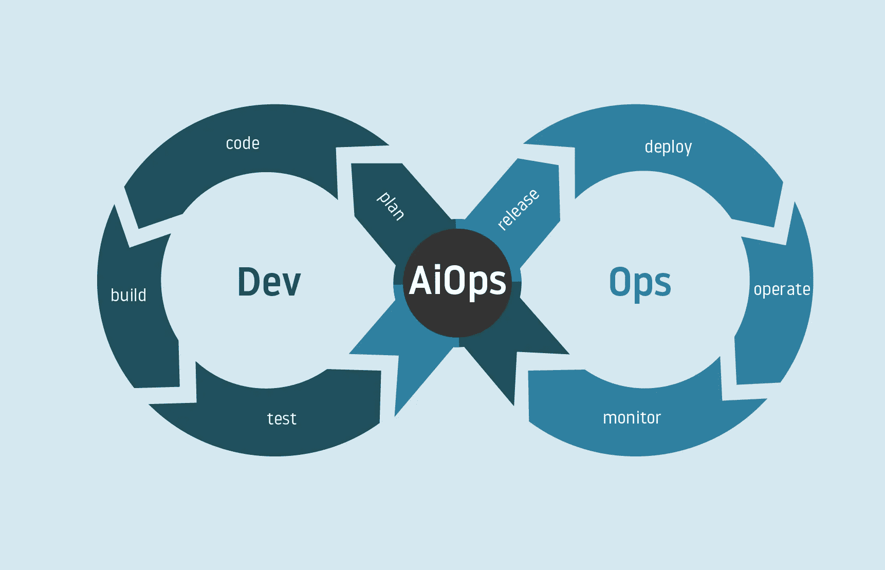
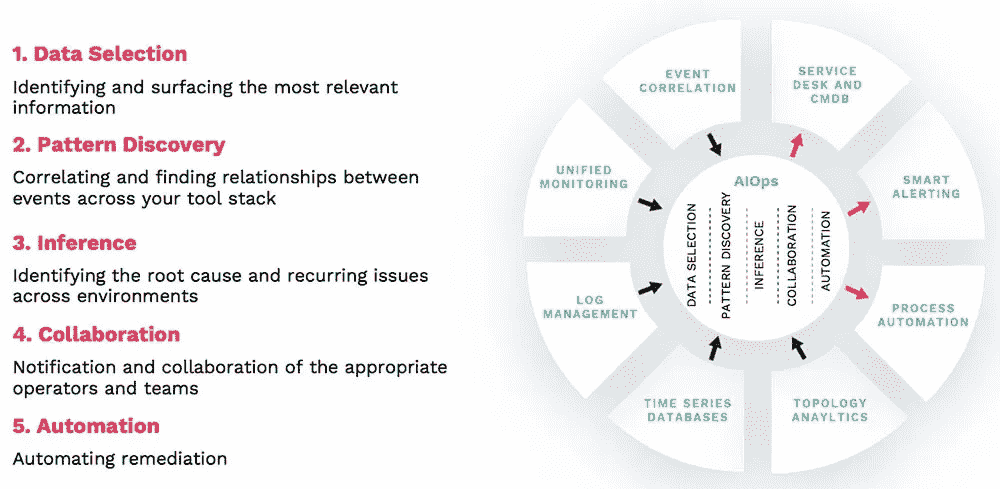
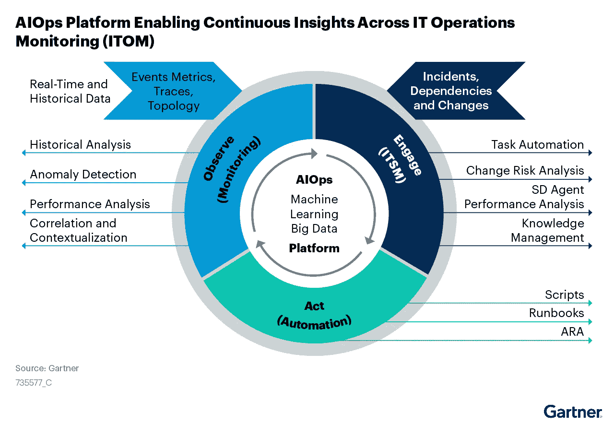
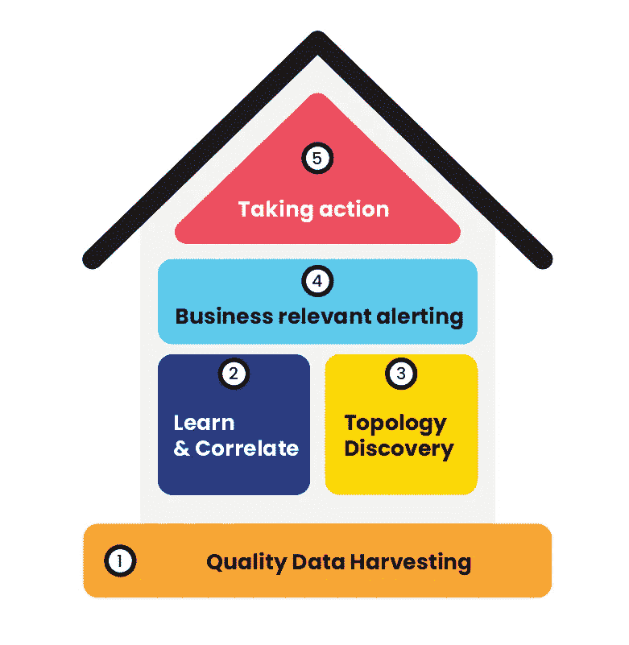

# 关于 AIOps 的一切。

> 原文：<https://medium.com/mlearning-ai/everything-about-aiops-in-less-than-10-minutes-693ef1e0f128?source=collection_archive---------11----------------------->

我的文章中使用的图像是各自组织的财产，在此仅用于参考、说明和教育目的。(图片来源:Google【除了少数图片，在图片下方特别提到了其来源】)

*让我们搞清楚一件事——*

*AI ops 中的“AI”并不意味着人类操作员将被自动化系统取代。相反，人类和 AIOps 平台一起工作，AI 和 ML 算法增强了人类的能力，使 Ops 专业人员能够专注于有意义的事情。*

AIOps 代表 IT 运营的人工智能，在本文中，我们将了解您需要了解的所有信息。

# 什么是 AIOps？

AIOps 是人工智能在增强 IT 运营方面的应用。具体来说，AIOps 使用大数据、分析和机器学习能力。

它是人工智能和相关技术的应用，如 ML 和 NLP 在传统 It 运营活动和任务中的应用。

*“ai ops 结合了大数据和机器学习来自动化 IT 运营流程，包括事件关联、异常检测和因果关系确定。”—高德纳公司*

以下是 AIOps 可以做什么的一些例子。

*   收集和汇总由多个 IT 基础架构组件、应用程序和性能监控工具生成的大量且不断增长的运营数据。
*   诊断根本原因并向 IT 部门报告，以便快速响应和补救，或者在某些情况下，自动解决这些问题，无需人工干预。
*   智能地从“噪音”中筛选出“信号”,以识别与系统性能和可用性问题相关的值得注意的事件和模式。

Gartner 使用上图中的图表解释了 AIOps 平台的工作原理。AIOps 有两个主要组成部分:大数据和 ML。

它需要摆脱孤立的 It 数据，在大数据平台内聚合观察数据(如监控系统和作业日志中的数据)以及参与数据(通常在票据、事故和事件记录中找到)。

然后，AIOps 针对合并后的 IT 数据实施全面的分析和 ML 策略。期望的结果是自动化驱动的洞察力，产生持续的改进和修复。AIOps 可以被认为是核心 IT 功能的持续集成和部署(CI/CD)。

# 为什么 AIOps 很重要？

成功的数字化转型需要 AIOps。对业务敏捷性的推动在复杂性方面留下了一个不受欢迎的副产品——使人类极难跟上。

虽然敏捷性是业务创新和客户体验的核心，但对它的执行却造成了 it 工作负载和流程的高度短暂状态。

仅举几个例子，分布式架构、多云、容器和微服务的重大进步已经产生了大量多维数据流，这些数据流产生了过多的噪音，抑制了 IT 识别和解决服务事件的能力。

# AIOps 是如何工作的？

*来源:Moogsoft*

并非所有 AIOps 工具都是生而平等的。为了获得最大价值，组织应该将 it 部署为一个独立的平台，从所有 IT 监控源获取数据，并作为一个中央参与系统。

这种平台必须由 5 种类型的算法提供支持，这些算法可以完全自动化和简化 IT 运营监控的 5 个关键方面。它们是:

## 数据选择

*   从现代 IT 环境中产生的大量高度冗余和嘈杂的 IT 数据中选择表明存在问题的数据元素，这通常意味着过滤掉高达 99%的数据。

## 模式发现

*   关联和查找选定的有意义的数据元素之间的关系，并对它们进行分组，以便进行进一步的高级分析。

## 推理

*   也称为根本原因分析，确定问题和重复出现的问题的根本原因，以便您可以对发现的问题采取行动。

## 合作

*   当个人分散在不同的地理位置时，通知适当的操作员和团队，并促进他们之间的协作，以及保存有关事故的数据，以加速将来对类似问题的诊断。

## 自动化

*   尽可能自动化响应和补救，以使解决方案更加精确和快速。

# AIOps 的元素

来源:BMC 博客

Source: Gartner

**广泛多样的 IT 数据**

*   在黑色和蓝色的人字纹中列举的 AIOps 是基于将来自 IT 运营管理(指标、事件等)的不同数据集合在一起。)和 IT 服务管理(事故、变更等)。).
*   这通常被称为“打破数据孤岛”——将来自不同工具的数据整合在一起，以便它们可以相互“交流”，并加快根本原因识别或实现自动化。

## **聚合大数据平台**

*   平台的核心，即上图的中心，是大数据。随着数据从孤立的工具中解放出来，需要将它们整合在一起以支持更高层次的分析。这不仅需要离线进行(如在使用历史数据的法庭调查中),还需要在摄取数据时实时进行。

## **机器学习**

*   大数据使得 ML 的应用能够分析大量不同的数据。这在将数据汇集在一起之前是不可能的，也不可能通过人工来实现。ML 自动化了现有的手动分析，并支持对新数据进行新的分析—所有这些都是在没有 AIOps 的情况下无法实现的规模和速度。

## **观察**

*   这是传统 ITOM 领域的发展，它集成了开发(跟踪)和其他非 ITOM 数据(拓扑、业务度量)以支持新的关联和上下文形式。结合实时处理，可能原因识别与问题生成同步进行。

## **接合**

*   传统 ITSM 域的发展包括与 ITOM 数据的双向通信，以支持上述分析，并为审计和合规/监管要求自动创建文档。AI/ML 在这里表现为认知分类加上用户接触点的路由和智能，例如聊天机器人。

## **第三幕**

*   这是 AIOps 价值链的“最后一英里”。如果将行动的责任放回人类手中，自动化分析、工作流程和文档记录将毫无意义。Act 包括将人类领域的知识编入补救和响应的自动化和流程编排中。

# AIOps 的优势

## **AIOps 消除噪音和干扰**

*   AIOps 消除了噪音和干扰，使繁忙的 IT 专家能够专注于重要的事情，而不会被无关的警报分散注意力。这加快了检测和解决影响服务的问题的速度，并防止了影响销售和客户体验的停机。

## 跨多个数据源关联信息

*   通过关联多个数据源的信息，AIOps 消除了孤岛，并提供了跨内部和云中的整个 IT 环境(基础架构、网络、应用程序、存储)的整体、上下文化的愿景。

## 提高效率

*   通过促进不同专家和服务所有者之间无摩擦的跨团队协作，AIOps 加快了诊断和解决时间，最大限度地减少了对最终用户的干扰。

## 高级 ML

*   高级机器学习在后台捕获有用的信息，并使其在上下文中可用，以进一步改善未来事件的处理。

## 知识回收和根本原因识别

*   通过知识回收和根本原因识别，解决重复发生事件的工作流可以实现自动化，使运营团队更接近无故障和自我修复的环境。

# 使用 AIOps 的部门

## 具有大型复杂环境的企业

AIOps 采用者包括拥有大量 IT 环境、跨越多种技术类型的公司，这些公司面临着复杂性和规模问题。

当这些与严重依赖 IT 的业务模式相结合时，AIOps 可以对公司的成功产生巨大的影响。

尽管这些组织可能处于许多不同的行业，但它们都有一个共同的规模，并且变化的速度越来越快，因为对业务敏捷性的需求反过来又增加了对 IT 敏捷性的需求。

## 云原生中小企业

AIOps 也正在被中小型企业(SME)所接受，尤其是那些诞生在云中的企业，它们需要持续快速地开发和发布软件。

AIOps 允许这些中小企业的 SRE 团队不断改进他们的数字服务，同时防止故障、失灵和中断。

## 各种规模的组织中的开发运维团队

采用 DevOps 模式的公司可能很难维持所涉及的不同角色之间的一致性。将 Dev 和 Ops 系统直接集成到一个整体的 AIOps 模型中消除了许多潜在的摩擦。

AIOps 让开发团队更好地了解环境的状态，并让运营团队完全了解开发人员何时以及如何在生产中进行更改和部署。

这种整体视图可确保 CI/CD 周期不间断运行，并快速无缝地创建和交付应用。

此外，DevOps 管道会产生大量数据。为了保持应用交付的稳定性和速度，DevOps 领导必须快速持续地分析它。

虽然 DevOps 团队已经实现了大部分职能的自动化，但许多团队仍然有一个手动决策过程，这会产生瓶颈并导致不明智的行动。

AIOps 具有分析数据和建议行动的能力，是做出精确的数据驱动型决策和自动化行动以快速交付应用的关键。

## 拥有混合云和内部环境的组织

将工作负载迁移到公共云平台有众所周知的好处，但也有充分的理由将某些应用程序和基础架构保留在本地。

因此，许多组织发现自己处于混合环境中，这带来了一系列 IT 运营挑战。

通过提供所有基础设施类型的整体、全面的视图，并帮助运营商了解变化太快而无法记录的关系，AIOps 帮助运营团队保持对这些环境的控制，并提供服务保证。

## 经历数字化转型的企业

数字化转型是业务流程的数字化，以使组织更高效、更敏捷、更具竞争力。数字化转型计划的核心是 it，IT 需要以业务所需的速度运行，以免成为瓶颈，阻碍更广泛目标的实现。

通过自动化 IT 运营和防止中断这些数字化流程的故障，AIOps 帮助 IT 部门提供成功的数字化转型项目所需的技术支持水平。

# 关于 AIOps 的一些误解

我在这里列出了一些误解，但是请点击[这里的](https://enterprisersproject.com/article/2021/3/aiops-6-misconceptions-explained)链接了解关于每个误解的更多细节。

*   AIOps 不是一个产品
*   在人工智能之前，你需要行动
*   AIOps 是关于文化转变的
*   整合是王道
*   使用开源软件
*   数据，数据，数据

# AIOps 的构建模块

来源:[目标](https://www.aims.ai/aiops-5-building-blocks)

# IT 运营开发的分层表示

## 手动操作

*   IT 运营的早期阶段
*   缺少操作工具和指南
*   依赖个人知识、技能和经验

## 程序操作

*   业务的增长超过了人员的增长
*   创建和管理文档
*   标准工具的管理

## 自动操作

*   运营方法的差异越来越大
*   从手动切换到自动
*   连接事件和过程
*   操作数据的可视化

## DevOps

*   持续时间快，架构复杂
*   提高速度和质量
*   跨团队的在线协作

## AIOps

*   大数据积累，AI 技术准备好了
*   仍处于早期阶段
*   所有这些都在同一个场景中
*   目标是让机器做决定

# 顶级 AIOps 服务提供组织

*   应用动态
*   大熊猫
*   团状的模塑料（bulkmoldingcompounds）
*   数据狗
*   DynaTrace
*   MoogSoft
*   新遗迹
*   传呼机职责
*   科学逻辑
*   Splunk

感谢阅读，快乐学习！

 [## Mlearning.ai 提交建议

### 如何成为 Mlearning.ai 上的作家

medium.com](/mlearning-ai/mlearning-ai-submission-suggestions-b51e2b130bfb)